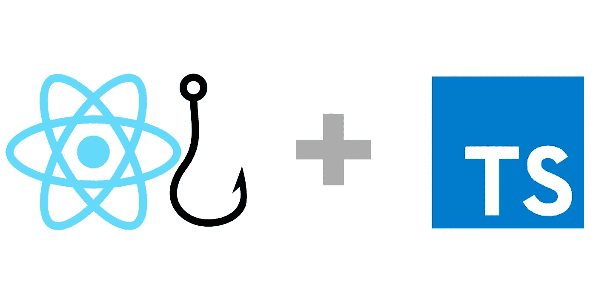
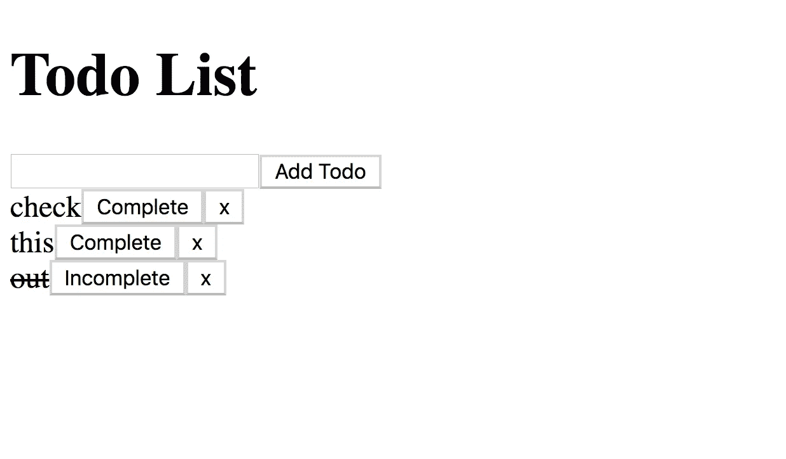
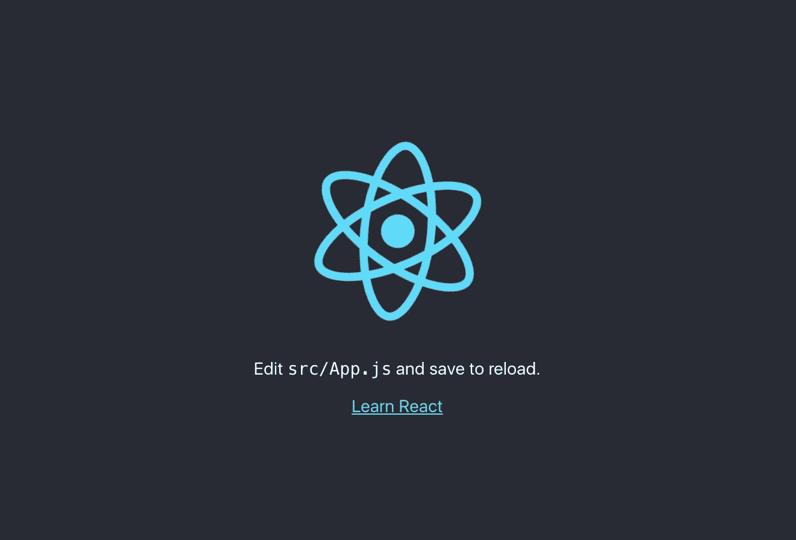
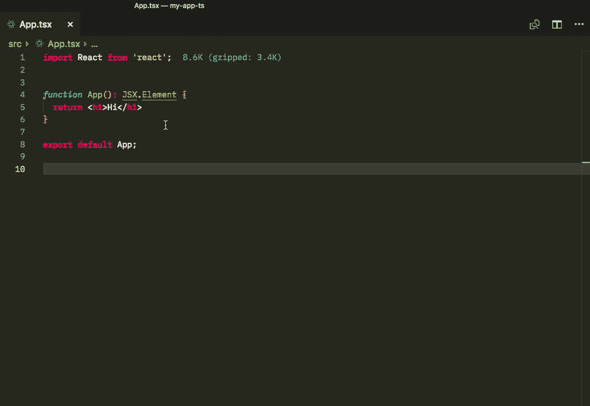
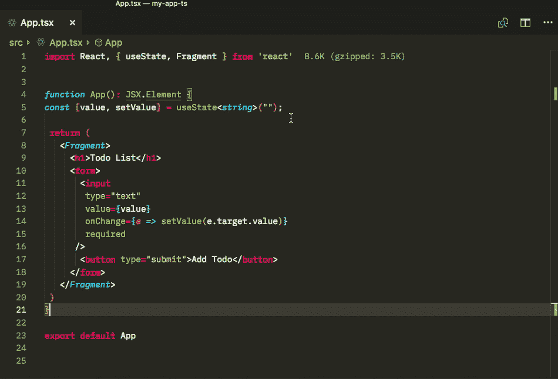
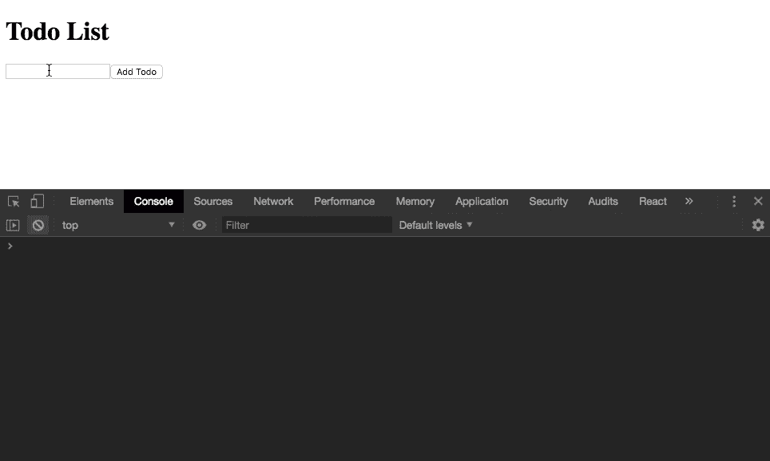

# 带有 React 挂钩的类型脚本

> 原文：<https://levelup.gitconnected.com/typescript-with-react-hooks-918060d098d2>



阿卜杜勒·瓦哈布从[名词项目](https://thenounproject.com/)勾手

[** *这是这里免费 Udemy 课程的一部分***](https://www.udemy.com/typescript-with-react-hooks-and-context/)

我制作了一个 [youtube 视频系列](https://www.youtube.com/watch?v=1ZJrd1nHbWc&list=PLiKs97d-BatHEeclprFtCaw8RcNOYXUqN)并写了几篇[帖子](/react-typescript-with-webpack-2fceebb8faf)关于如何用 webpack 建立一个 React 和 typescript 项目。当时无论是 [Babel](https://babeljs.io/) 还是 [create-react-app](https://github.com/facebook/create-react-app) 都不支持类型脚本。现在它们都有了，而且安装 JS 超集要容易得多，在 16.7.0 以上的 React 版本中有了一种新的编写组件的方式——React 钩子。这是更新教程的绝佳时机。

这篇文章将通过用`create-react-app`建立一个 TypeScript 项目，并使用 [**useState**](https://reactjs.org/docs/hooks-intro.html) 钩子来表示状态。本指南假设您对 [React](https://reactjs.org) 、Javascript 有所了解，并且在您的机器上安装了[节点](https://nodejs.org/en/)。我们将做一个简单的没有风格的待办事项列表网站(我知道这很老套)。



> 如果你想知道本教程的主要内容，跳过解释，你可以只看要点。

# 设置

*   打开终端，使用以下命令安装 create react 应用程序:

`$ npm i create-react-app`

*   完成后，使用以下命令创建一个项目:

`$ npx create-react-app todo-app-ts`

*   这需要一段时间，但一旦完成，应该有一个名为`todo-app-ts`的文件夹。将终端中的目录更改为该项目，并运行这些命令来安装 typescript。

`$ npm i typescript @types/node @types/react @types/react-dom`

首先我们安装 TypeScript，然后安装 Node、React 和 React-DOM 的类型声明。稍后我会解释它们的意思。

您会注意到一个' *tsconfig.json* '文件已经用 typescript 配置自动创建了。如果这个文件是用 webpack 创建的，则必须手动将它放在那里。

*   用您选择的文本编辑器/IDE 打开项目(我使用 [VSCode](https://code.visualstudio.com/) )。然后打开`package.json`文件。您的`react`和`react-dom`版本应该在 16.7.0 以上，如果没有，请运行安装新版本。

`$ npm i react@16.8.0-alpha.1 react-dom@16.8.0-alpha.1`

*   打开 src 文件夹，将 **index.js** 和 **App.js** 重命名为 **index.tsx** 和 **App.tsx**
*   要运行服务器，键入`npm start`或`yarn start`，您的浏览器将打开(如果已经打开，将显示一个新标签),屏幕如下:



# 创建待办事项列表

现在我不能把这个教程的所有功劳都揽下来，原文是由 [Sarah Jorgenson](https://scotch.io/@sarahjorgenson5) 在 Scotch.io [这里](https://scotch.io/tutorials/build-a-react-to-do-app-with-react-hooks-no-class-components)写的。我只是把它改得稍微简单一点，用打字稿写的。

*   导航到`App.tsx`，删除所有代码，替换为:

除了第四行之外，代码看起来像普通的 javascript，

`function App(): JSX.Element {`

冒号后的代码告诉 TypeScript 该函数将返回什么数据类型。`JSX.Element`不是本机 TypeScript 类型，它是从 React 类型声明文件导入的。如果你正在使用 VSCode，你可以在`JSX`或`Element`上`option + click`查看它来自哪里。



`index.d.ts`中有很多东西，你不需要知道里面的每样东西都是做什么的，我只是觉得看看它来自哪里会有帮助。

*   删除你的`App.tsx`文件中的第 5 行并用这个替换它。

*   同样在第 1 行导入片段:

```
import React, { Fragment, useState } from ‘react’
```

*   保存并返回您的浏览器，您应该会看到一个简单的表单和标题待办事项列表。

现在让我们添加第一个钩子。

*   在第 4 行`const [value, setValue] = useState("")`下面添加此行，并从`Fragment`旁边的第 1 行导入`useState`。

`useState()`钩子将默认状态作为一个参数，并返回一个包含两个内容的数组，即状态和用于更新状态的函数。常见的是用[数组解构](https://developer.mozilla.org/en-US/docs/Web/JavaScript/Reference/Operators/Destructuring_assignment)给每个数组项一个变量，但本质上上面那行和写的一样；

```
const valueState = useState("")
const value = valueState[0]
const setValue = valueState[1]
```

如果你熟悉状态在 React 中是如何工作的，`value`就像是类组件中的`this.state`，而`setValue`有点像`setState`

*   向 input 元素添加一些属性，如下所示

```
<input 
  type="text" 
  value={value} 
  onChange={*e* *=>* setValue(e.target.value)} 
  required 
/>
```

*   保存并刷新浏览器。如果一切顺利，应该没什么变化。

正如您所看到的，新的输入属性对应于您刚刚创建的钩子，`value`链接到值变量，`onChange`具有`setValue`函数，它传递输入到输入中的任何内容。如果您编写`console.log(value)`并在输入中键入一些内容，您将会更好地理解正在发生的事情。

## 泛型类型

*   因为这是一个 TypeScript 教程，所以让我们给钩子添加一个类型。

```
*const* [value, setValue] = useState<*string*>("");
```

要了解这是如何工作的以及为什么工作，让我们看看`useState`函数的类型定义。



```
*function* useState<S>(*initialState*: S | (() *=>* S)): [S, Dispatch<SetStateAction<S>>];
```

正如你所看到的,`useState`旁边有`<S>`,每当你在 typescript 中看到`<>`,这意味着函数(方法或接口)接受一种泛型。这意味着它接受任何类型。泛型通常有一个大写字母(在本例中是`S`，但它可以是任何东西)。这意味着无论用户用什么类型来代替`S`，那种类型都会使用它。`S`这有点像争论。

Us 键入`useState<string>`使其成为使用状态的类型

```
useState(*initialState*: string | (() *=>* string)): [string, Dispatch<SetStateAction<string>>];
```

这意味着`useState`函数接受一个字符串作为初始状态，或者`|`函数返回一个字符串。useState 函数返回一个包含字符串和这个`Dispatch<SetStateAction<string>>`的数组，对于本教程，你不需要知道它的作用，所以我不会太担心它。

*   您的代码现在应该如下所示。

现在让我们防止页面在提交时刷新，并显示我们的待办事项。

*   在第 9 行，让我们添加一个`onSubmit`属性，它调用一个即将被编写的`handleSubmit`函数`<form onSubmit={handleSubmit}>`
*   在 return 上面创建我们的`handleSubmit`作为常量函数，如下所示:

```
const handleSubmit = e => {
  e.preventDefault()
  setValue("")
}
```

你会立即注意到你得到一个类似于`Type error: Parameter 'e' implicitly has an 'any' type.`的错误，这是因为在默认的 TypeScript 中，你必须显式定义事件的类型。让我们暂时给`e`一个显式类型的 any `(e: any)`这样应该可以解决这个问题。

简单介绍一下您新编写的函数将要做的事情:`preventDefault`将在表单提交时停止刷新，而`setValue("")`将把输入中的值转换成一个空字符串。随意注释掉某些行，看看它们有什么效果。

让我们给新函数添加一些类型。

```
const handleSubmit = (e: React.FormEvent<HTMLFormElement>): void => {
  e.preventDefault()
  setValue("")
}
```

正如你所看到的,`React.FormEvent`是一个泛型，在这种情况下它接受`HTMLFormElement`,但是它看起来比我们孤独的`e`长了一点。

## Typescript 类型别名

我们可以在 TypeScript 中使用关键字`type`来移动`e`的类型，就像变量一样。

*   在`function App()`上方写下以下内容

```
type FormElem = React.FormEvent<HTMLFormElement>
```

*   现在重写 e，使这个`e: FormElem`看起来更好。

你可能还注意到了箭头函数前的单词`void`，这表示函数将返回 void 类型，这意味着它不会返回任何东西。

现在让我们为待办事项列表创建一个存储位置。

*   在我们的第一个钩子下面添加以下内容

```
*const* [todos, setTodos] = useState<ITodo[]>([]);
```

在保存此更改时，您应该会看到错误`Type error: Cannot find name 'ITodo'`，这是有意义的，因为我们还没有创建它，现在让我们来创建它。

## 类型脚本接口

就在我们的 type **FormElem** 下面，让我们写下:

```
*interface* ITodo {
  text: *string*;
  complete: *boolean*;
}
```

如你所见，`ITodo`接口是一个带有类型`string`的**文本**和类型`boolean`的**完成**的对象。在接口名前加上`I`是可选的，它通常用来表示一个变量是一个接口。

现在你可能在想，我们可以把它写成类型别名。

```
type Todo = {text: string; complete: boolean;}
```

那我们为什么没有呢？

## **接口和类型别名的区别**

类型别名有利于引用其他类型，它们不会创建全新的类型。一个接口就是这么做的，我们的`ITodo`是一个全新的类型，如果有错误，它将被引用。

别名不能被扩展，我们不会在这里讨论这个，但是我们想做这样的事情

```
// Works
*interface* ITodo2 extends *ITodo* {
  tag: *string* }
```

这在使用接口时有效，但不像这样；

```
// Does not work
type =  ITodo2 extends ITodo {
 tag: string
}
```

但是使用接口的一个缺点是它不能真正用于不是对象的变量。因此，我们仍将使用类型别名。

下面你还会注意到`ITodo`旁边有方括号`[]`，这意味着我们的`useState`正在等待 ITodo 的数组。这也可以写成一个通用的`Array<ITodo>`你也可以这么做。

*   到目前为止，我们的代码应该是这样的:

我们快到了。

*   在我们的 handle 下面创建一个新函数提交一个名为， **addTodo** 的函数

```
*const* addTodo = (*text*: *string*): *void* *=>* {
  *const* newTodos: ITodo[] = [...todos, { text, complete: false }];
  setTodos(newTodos);
};
```

它接受一个 string 类型的参数，并添加一个新的数组`newTodos`,包含我们现有的 todos 数组和一个新的对象。然后用`setTodos`函数将其传递给我们的 todo 状态。我希望这些都有意义。

*   在我们的`handleSubmit`函数中添加这一新行`addTodo(value)`，它将把我们的输入`value`添加到我们的`todos`状态。
*   在 return 上方添加一个`console.log(todos)`，查看控制台中发生了什么。



您的新 todo 应该包含在您的`todos`对象中。

现在让我们显示这些待办事项。

*   就在结束的`</Fragment>`标签之前，用下面的代码创建一个`<section>`；

```
<section>
  {todos.map((todo: ITodo, index: number) => (
    <div>{todo.text}</div>
  ))}
</section>
```

上面是我们的 todos 数组的 map 方法，有一个回调函数和两个参数。类型为 **ITodo、**的数组中的 todo 项和类型为 number 的**索引**。

现在，当您在待办事项列表中键入一些内容并按回车键时，您应该会看到它出现在屏幕上。尼斯（法国城市名）👍

*   到目前为止，您的代码应该如下所示。

> 您会注意到上面的代码没有任何分号。我摆弄了一下[更漂亮的](https://prettier.io/)设置，决定[不包括它们](https://standardjs.com/rules.html#semicolons)。不要担心代码仍然会工作。

## 额外功能

在这一点上，我想教的大部分主题已经基本涵盖。这里的其余步骤都是可选的，但是欢迎您跟着做。

我们将添加通过点击一个标记为 **x** 的按钮来删除我们的待办事项的功能，以及通过点击一个按钮来切换一个项目完成或未完成的功能，该按钮将在项目上放置一个线条样式。如果您对 Javascript 和 React 有一定的经验，我建议您在查看我的解决方案之前尝试自己实现这两个特性。

*   让我们在我们的 **addTodo** 下面创建一个 **completeTodo** 函数

```
*const* completeTodo = (*index*: *number*): *void* *=>* {
  *const* newTodos: ITodo[] = todos
  newTodos[index].complete = !newTodos[index].complete
  setTodos(newTodos)
}
```

这个函数接受一个 index 参数，并创建一个 Todos 数组的克隆，名为， **newTodos，**(这样我们就不会改变原来的 todos)。然后，我们使用 index 定位 todo 对象中的 **complete** 属性。然后我们用 setTodos 函数将其设置为新的 todo 数组。简单吧？

*   在我们的 **todo.map** 的 return 语句中，用下面的代码在我们的 div 下面创建一个按钮；

```
<button type='button' onClick={() *=>* completeTodo(index)}
  {todo.complete ? 'Incomplete' : 'Complete'}
</button>
```

这创建了一个带有三进制操作符[的按钮，根据 **todo.complete** 的内容决定显示什么文本。该按钮在被点击时运行 **completeTodo** 函数，将迭代索引作为属性。](https://developer.mozilla.org/en-US/docs/Web/JavaScript/Reference/Operators/Conditional_Operator)

*   现在将 div 和新按钮包装在一个`<div>`中，并将`key={index}`道具移动到父 div 中。
*   此外，出于样式原因，将该属性添加到我们的父 div `style={{ display: 'flex'}}`
*   然后在我们的 div 上用我们的`{todo.text}`添加一个样式属性，如下所示:

```
style={{ textDecoration: todo.complete ? 'line-through' : '' }}
```

如果 **todo.complete** 为真，这将为文本添加一个`line-through`样式。

*   要删除 todo 项目，请使用以下代码创建一个名为 **removeTodo** 的函数。

```
*const* removeTodo = (*index*: *number*): *void* *=>* {
  *const* newTodos: ITodo[] = todos
  newTodos.splice(index, 1)
  setTodos(newTodos)
}
```

这与我们的 completeTodo 函数非常相似，只有一点小小的不同。该函数不是切换 todo 对象的 complete 属性，而是使用 splice 方法从数组中完全删除该对象，然后使用 setTodos 函数将其替换为现有的 todos 数组。

*   在我们的完成/未完成按钮下面，让我们用下面的代码添加另一个按钮。

```
<button onClick={() *=>* removeTodo(index)}>x</button>
```

*   完成上述操作后，您的代码应该类似于:

*   你的应用程序应该是这样的:


# 👏 🎉 👍

我真的希望你已经发现这是有用的，并没有太难跟随。计划是再写几篇关于打字稿和 React 更多特性的文章，比如[使用效果](https://reactjs.org/docs/hooks-effect.html)、[备忘录](https://reactjs.org/blog/2018/10/23/react-v-16-6.html)、悬念和[背景](https://reactjs.org/docs/context.html)。

如果您有任何问题，请随时在本文中发表评论。如果不是快乐编码。

[](https://levelup.gitconnected.com)[](https://gitconnected.com/learn/react) [## 学习 React -最佳 React 教程(2019) | gitconnected

### 前 48 名 React 教程。课程由开发人员提交并投票，使您能够找到最佳反应…

gitconnected.com](https://gitconnected.com/learn/react) [](https://gitconnected.com/learn/typescript) [## 学习 TypeScript -最佳 TypeScript 教程(2019) | gitconnected

### 前 18 名打字稿教程。课程由开发者提交并投票，使您能够找到最好的…

gitconnected.com](https://gitconnected.com/learn/typescript)