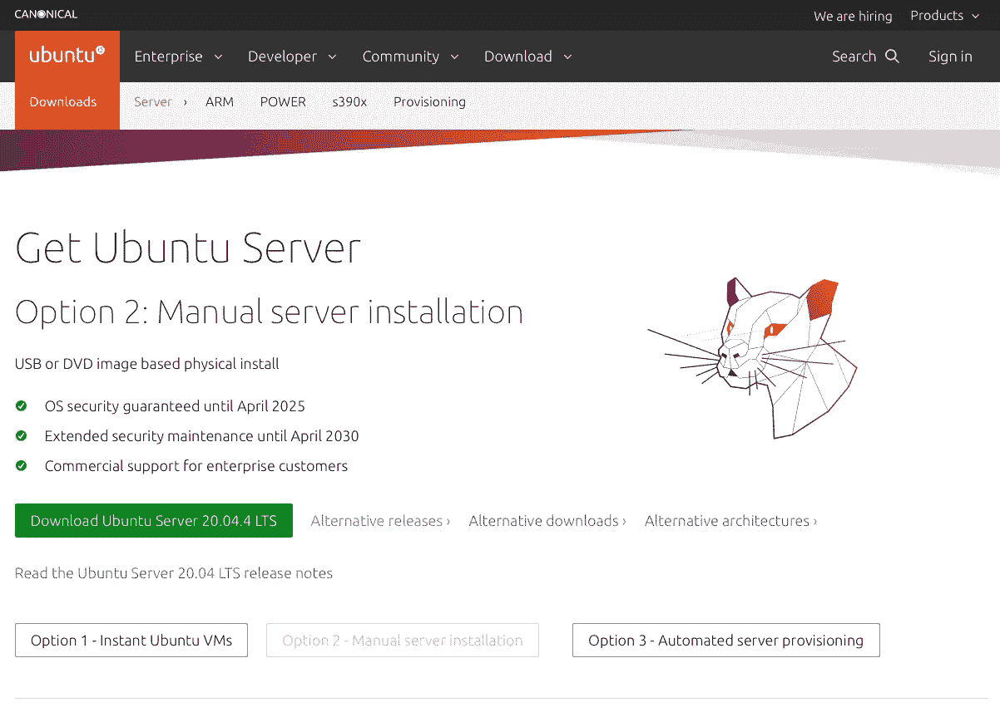

# Ubuntu 服务器构建系列 2022 |第 1 部分

> 原文：<https://levelup.gitconnected.com/ubuntu-server-build-series-2022-part-1-22c1dd35b8b4>

🚀*第 1 部分:设置 Ubuntu 服务器*

由 [Kvistholt 摄影](https://unsplash.com/@freeche?utm_source=unsplash&utm_medium=referral&utm_content=creditCopyText)在 [Unsplash](https://unsplash.com/s/photos/server?utm_source=unsplash&utm_medium=referral&utm_content=creditCopyText) 上拍摄

我最近把我的旧 Mac Mini 配置成了 Ubuntu 服务器。Mac Mini 是一台紧凑而强大的机器，硬件很好，运行 Ubuntu 相当流畅。将其配置为服务器的主要原因是为了完全控制数据并拥有一个集中的开发环境。

> Ubuntu Server 为您的公共或私有数据中心带来经济和技术上的可扩展性。无论您想要部署 OpenStack 云、Kubernetes 集群还是 50，000 节点渲染场，Ubuntu Server 都能提供最佳的横向扩展性能。

Raspberry Pi 4B 是一个具有成本效益的替代方案，但根据过去的经验，我强烈建议从外部 SSD 而不是 MicroSD 卡启动操作系统。Ubuntu server 可以在所有主流架构上运行——x86–64、ARM v7、ARM64、POWER8、POWER9、IBM s390x (LinuxONE)和 RISC-V。

配置一台服务器可能是棘手和耗时的。因此，如果你不了解硬件、网络和软件基础设施，最好使用云托管服务器。它也不运行 GUI。

话虽如此，专用服务器还是非常有用和方便的。您可以在服务器上托管无限酷的东西，例如:

*   网站
*   文件传送协议
*   电子邮件服务器
*   开发平台
*   集装箱部署
*   云服务
*   数据库服务器
*   自动化服务器

Ubuntu Server 是一个服务器操作系统，由 Canonical 和世界各地的开源程序员开发，几乎可以在任何硬件或虚拟化平台上工作。它可以提供网站、文件共享和[容器](https://www.techrepublic.com/article/containers-the-smart-persons-guide/)。

[艾德·奥罗兹科](https://unsplash.com/@edorozco?utm_source=unsplash&utm_medium=referral&utm_content=creditCopyText)在 [Unsplash](https://unsplash.com/s/photos/mac-mini?utm_source=unsplash&utm_medium=referral&utm_content=creditCopyText) 上拍摄的照片

## 本文是 4 部分系列的第 1 部分。

*   **第 1 部分**:设置 Ubuntu 服务器
*   **第二部分**:设置必备组件——Nginx、防火墙等。
*   第三部分:让服务器在没有静态 ip 地址的情况下上网
*   **第 4 部分**:监控服务器

# 我们开始吧！

*   步骤 0:备份现有驱动器
*   步骤 1:可启动的 Ubuntu 驱动器
*   步骤 2:准备安装[ Mac]
*   第三步:安装

> 注:您将需要一个拇指驱动器，路由器和一根局域网电缆。

## 步骤 0:备份现有驱动器

没有什么比在没有备份的情况下丢失有价值的数据更糟糕的了。

花一点时间检查您计划引导服务器的驱动器是一个不错的选择。创建旧照片、视频或文档的备份。

## 步骤 1:可启动的 Ubuntu 驱动器

一、[下载](https://ubuntu.com/download/server)Ubuntu server 的 LTS 版本(20.04.4)。

Ubuntu 服务器下载页面

二。使用 [Balena Etcher](https://www.balena.io/etcher/?) 创建一个可引导驱动器。

巴莱纳蚀刻机

## 步骤 2:准备安装

I .在恢复模式下启动 mac。这是通过在按住 Command (⌘)和 r 键的同时重启 Mac Mini，然后在出现 Apple 标志时松开这些键来实现的。

恢复模式屏幕

二。选择磁盘工具

三。格式化打算安装 Ubuntu 服务器的驱动器。

> 注意:如果您想要双引导，也可以创建一个分区。Ubuntu 驱动器的格式必须是 MS-DOS (FAT)

对驱动器进行分区

一旦驱动器被格式化为 MS-DOS 格式。我们准备在驱动器上安装 Ubuntu 服务器。

> 请注意，Ubuntu 不再*需要*一个单独的分区作为交换空间，自动安装也不会创建一个。

## 第三步:安装

I .将您的可启动 USB 磁盘插入 mac。

二。在启动磁盘选择模式下启动 mac。通过在启动过程中按住 option-alt 键来实现这一点。

引导驱动器选择屏幕

二。**选择 EFI 启动盘。**

几分钟后，您应该会在屏幕上看到如下所示的消息…

三。**在 Ubuntu 服务器菜单中选择您的语言和正确的键盘布局**

四。**在安装菜单中选择安装 Ubuntu**

动词 （verb 的缩写）**选择网络**

确保您的服务器通过以太网连接到路由器。

安装程序将自动检测并尝试通过 DHCP 配置任何网络连接。

不及物动词**配置存储器**

下一步是配置存储。建议安装时留出整个磁盘或分区来运行 Ubuntu。但是，如果您已经对驱动器进行了分区，请选择手动选项来选择分区存储。

选择驱动器并确认分区。

> 注意:对于手动安装，磁盘的挂载点应该是“/”。

七。**确认分区**

如果这不是您所期望看到的(例如，您选择了错误的驱动器)，您应该使用箭头键和 enter 从屏幕底部的选项中选择`Back`。这将带您回到上一个菜单，在那里您可以选择不同的驱动器。

一旦你确定选择了正确的分区并且一切正常，选择“完成”和“继续”开始安装。

八。**建立个人档案**

软件现在正在磁盘上安装，但是安装程序需要更多的信息。Ubuntu 服务器需要至少有一个系统的已知用户和一个主机名。用户还需要密码。

九。**安装开始**

一旦您完成了所需信息的输入，屏幕将显示安装程序的进度。Ubuntu Server 现在安装了服务器所需的一套简明实用的软件。这大大减少了安装和设置时间。安装操作系统后，重新启动系统。

x. **Fini**

一旦服务器重新启动，您将输入您的登录凭证，您应该会看到一个类似的屏幕。

服务器设置到此结束。接下来的步骤是分配一个静态 IP 地址，配置防火墙和设置 Nginx(第 2 部分)。

## 参考资料:

1.  [*Ubuntu 服务器安装指南*](https://ubuntu.com/tutorials/install-ubuntu-server#1-overview)
2.  [视频教程:Ubuntu Server 20.04 LTS 安装](https://www.youtube.com/watch?v=xUH256WAWt0&t=453s)【有用】

## 检查我以前的文章！

 [## 终极乐趣！

### 有趣的事情，你可能不知道你可以在终端上做。

levelup.gitconnected.com](/terminal-fun-482d3f7af99e)  [## 设置完美的 MacOS 菜单栏！

### 按照下面的步骤建立一个整洁而实用的菜单栏。

levelup.gitconnected.com](/setting-up-the-perfect-macos-menu-bar-ba495b8f2db)