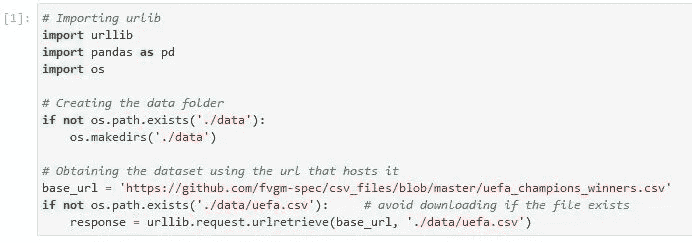
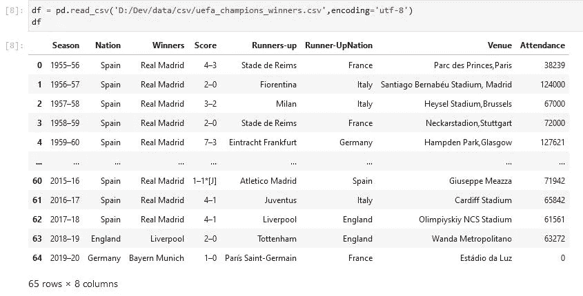
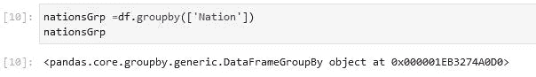
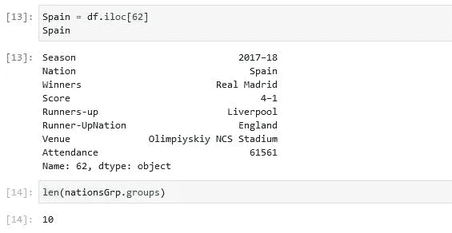
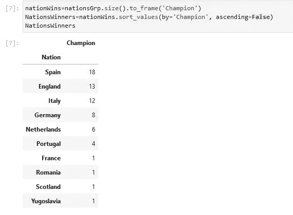
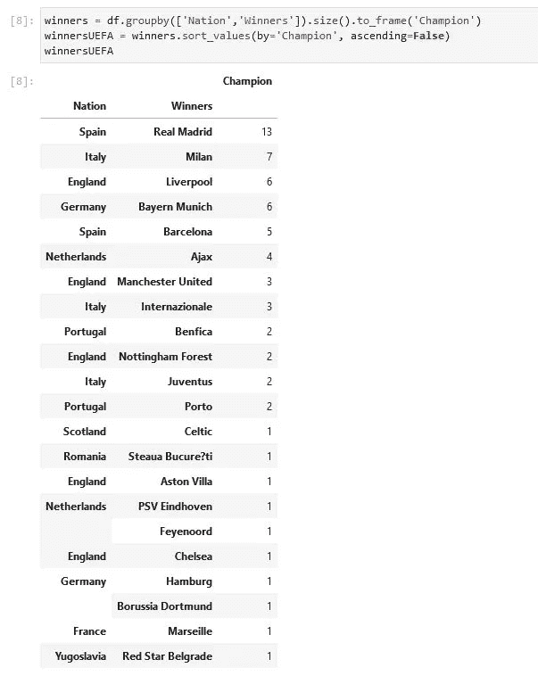

# UCL 获奖者探索性数据分析

> 原文：<https://levelup.gitconnected.com/ucl-winners-exploratory-data-analysis-7dcf5a44736e>

[https://es . uefa . com/uefachampionsleague/news/0258-0e 9533031260-37a 6195 F5 f8a-1000-don de-ver-la-final-de-la-champions/](https://es.uefa.com/uefachampionsleague/news/0258-0e9533031260-37a6195f5f8a-1000--donde-ver-la-final-de-la-champions/)

因为我们很快就能知道谁会是今年俱乐部级别的最负盛名的欧洲锦标赛——欧洲冠军联赛——的冠军，所以让我们来回顾一下历史上赢得最多冠军的球队。

我们将使用从[维基百科](http://en.wikipedia.org/wiki/UEFA_Champions_League)获得的数据进行分析，其中包含自 1955 年欧洲俱乐部锦标赛成立以来的决赛数据。我已经解析并处理了这些数据，也更新了当前记录，你可以在我的 GitHub repo 中找到[数据](https://github.com/fvgm-spec/csv_files/blob/master/uefa_champions_winners.csv)，以及这个分析的[笔记本](https://github.com/fvgm-spec/Data_Science_Projects/blob/master/UEFA_winners_Analysis.ipynb)。

## 数据采集

首先，我们将创建一个新的文件夹来存储我们的根设置中的数据集，如果路径不存在，我们将创建它，通过使用 *os* 包。然后我们将使用 *urllib* 包从 *base_url* 下载 csv 文件。然后，我们将它存储在我们先前创建的文件夹中，在此之前，我们将确保该文件不存在。

一旦获得数据集，我们将使用 *read_csv* 命令将其转换为数据帧

图片来自作者

在前面代码的输出中，我们得到了一个 64 行的 DataFrame，显示了从皇家马德里赢得比赛开始到拜仁慕尼黑赢得最后一场比赛为止的所有冠军联赛决赛的数据。

图片来自作者

# 用熊猫分组数据

group by 子句是对数据帧的操作。序列是一个 1D 对象，因此对其执行 group by 操作没有太大用处。但是，它可用于获取系列的不同行。group by 操作的结果不是数据帧，而是数据帧对象的字典。

因此，上面看到的输出显示了赛季、冠军和亚军俱乐部所属的国家、分数、场地和上座率数字，假设我们想根据这些国家赢得的欧洲俱乐部锦标赛的数量对它们进行排名。我们可以通过使用 group by 来做到这一点。首先，我们对数据帧应用 group by 函数，并查看结果的类型:

图片来自作者

我们注意到 **nationsGrp** 是一个名为*pandas . core . group by . data frame group by*的对象类型。我们使用 groupby 的列被称为键，对应于这些键的其余值是每个键内部的值，它只是一个名为 *dictionary* 的对象。我们可以通过在生成的 *DataFrameGroupBy* 对象上使用 groups 属性来查看这些组的样子:

正如我们之前所说的，这基本上是一个字典，显示了唯一的组和对应于每个组的轴标签——在本例中是行号。例如，我们可以获得 DataFrame 的第 62 个指数的完整信息，对应于 2017-18 赛季决赛，代表皇家马德里与利物浦有争议的第 13 个“奥雷乔纳”。

通过使用下面单元格中的 *len()* 函数获得组数:

图片来自作者

在这里，我们对之前由`DataFrameGroupBy object`确定的数据进行分组，用变量名 *nationsGrp* 标识，我们将使用它来显示一些表格，但首先我们需要将其转换为 DataFrame，这样我们就可以创建一个新的度量并对其进行升序排序。

在表格中，我们注意到赢得更多冠军的国家是西班牙，主要是因为皇家马德里和巴塞罗那的 13 a 5 Trophys。

图片来自作者

*size()* 函数返回一个以组名为索引的序列以及每个组的大小。 *size()* 函数也是一个聚合函数。

为了按国家和俱乐部进一步细分获胜，我们应用了一个**多列 groupby 函数**，然后是 size()和 sort():

图片来自作者

一个**多列 groupby** 通过将键列指定为一个列表来指定多个要用作键的列。因此，我们可以看到在这场比赛中最成功的俱乐部是西班牙的皇家马德里。

通过本教程，我们已经快速探索了使用数据分析技术的一些方法，特别是数据分析师之间众所周知的一种方法，即【T21 集团】。你还可以在官方文档中找到更多其他的熊猫技巧来分析。