# 邮递员的 Ufonaut

> 原文：<https://levelup.gitconnected.com/ufonaut-for-postman-aeacd87142be>

## 自动化并加速测试 REST 服务


本帖面向所有喜欢 [*邮差*](https://www.postman.com/) 测试 API 服务的人。它是一个非常棒的工具，有许多特性，并且允许一些脚本功能，这使得手工测试人员的生活更加容易。

然而，没有什么是完美的，也没有什么能够处理世界上人们提出的所有情况。对我来说，我发现 *Postman* 缺少一些使其更适用于自动化测试场景的特性。

以下是我的观点，可以改进的地方。

# #1 订单节约

这是其中的一件事，每次你想用 runner 处理一个集合时，你都必须拖放订单。 *Postman* 的更新版本(8.6.2)具有可以用作新运行的模板的历史，但是如果集合被更新或者如果我们想要测试稍微不同的场景，那么我们将需要每次调整顺序。

# #2 保存预先请求和测试

在一些情况下，这可能是有用的。第一个是当我们的脚本变得足够大时，在小窗口中工作开始变得令人讨厌，启用了一些 linters 或拼写检查器的文件会更有吸引力。
第二，当有一些新的变化时，可能需要集合导入，我们不想丢失这些宝贵的脚本或手动移动它们。

# #3 为跑步者保存预设

这与第一个问题半相关，可以通过历史得到部分解决。但是它面临与第一个相同的问题，因为当集合被更新时，新的端点不包括在历史中。在快节奏的工作场所，事情往往出现得非常快，因此变化开始妨碍我们的工作，让我们慢下来，或者让事情变得非常烦人。

# #4 发送前修改请求正文

实际上*是*的一个问题，在任务前脚本中无法修改请求体( [#4808](https://github.com/postmanlabs/postman-app-support/issues/4808) )。然而，当我决定写点什么的时候，它似乎已经解决了。

# #5 场景测试

为场景测试保存预设的能力。这是第一个和第三个问题的结合。缺少这种功能会导致我们不得不将所有场景编写到一个单独的“预请求”或“测试”选项卡中，或者拥有许多包含不同情况的不同集合，这从长远来看很难管理，例如，当每天都有新的端点被创建、删除或更改时。

所以，我创造了一个叫做 [*ufonaut*](https://github.com/b-pagis/ufonaut) 的工具来解决上面提到的问题。我知道这个工具并不适用于所有的情况，但是它确实有助于自动化和管理测试过程。

*Ufonaut* 是一个 CLI 实用程序，用于将开放 API 文档转换为带有自动测试附加选项的 *Postman* 集合。转换后的收藏可以用 [*纽曼*](https://github.com/postmanlabs/newman) 代替*邮差*中的转轮启动。

文章的剩余部分将简要描述用例，如何使用 *Postman* 解决它们，以及如何在 CI/CD 过程中重用这些用例以进行自动化测试。

# 准备

为了演示这些问题并提供解决方案，我将使用我的[其他文章](/go-swagger-and-open-api-e6b6ea4ce48f)中的 [*Go*](https://golang.org/) 中编写的简单服务。

首先，通过编译 *Go* 二进制文件并将其作为服务运行来启动服务，其中开放 API 文档可在`http://localhost:8080/swagger/doc.json`获得(在我的例子中)。

> *如果由于某种原因，你没有心情进行自编译，那么你可以从这里* [*下载二进制文件*](https://github.com/b-pagis/medium-go-swagger2openapi/releases/tag/1.0.0) *。*

服务正在运行，所以让我们使用 *Postman* 来准备我们的案例。只需打开应用程序，点击导入并选择链接(或使用其他选项)。更多信息可以查看[官方文档页面](https://learning.postman.com/docs/getting-started/importing-and-exporting-data/#importing-data-into-postman)。

导入完成后，我们应该看到以下集合

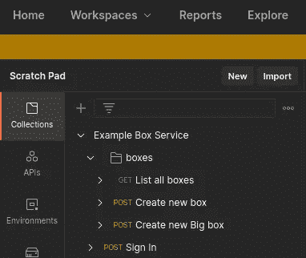

*已将 open API doc 文件转换为 Postman 集合*

下一步是为我们的服务设置`baseUrl`。创建新环境并定义`baseUrl`属性。

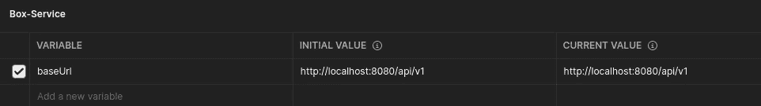

在 Postman 中设置环境

最后，我们需要通过运行以下命令来安装 *ufonaut* :

```
npm install -g @b-pagis/ufonaut
```

# 入门指南

初始设置已经完成，现在让我们运行服务二进制文件，并第一次调用`list all boxes`端点。我们应该得到以下响应:

```
[
  {
    "isFragile": true,
    "createdAt": "2021-06-05T11:13:33.387273692Z",
    "price": 5.77
  },
  {
    "isFragile": false,
    "createdAt": "2021-06-05T11:13:33.387273826Z",
    "price": 1.23
  }
]
```

这没什么特别的，因为它只是返回一些硬编码的值，但是它表明服务是活动的并且可访问的。现在，如果我们尝试调用另一个名为`Create new box`的端点，我们会看到这种情况发生。

```
{
  "code": "unauthorized"
}
```

它返回*未授权的*，这意味着我们需要首先调用`Sign In`端点，以便启动假会话。该服务使用以下硬编码凭据:

*   `demo` -用于登录
*   `12356` -为密码。

成功登录请求后，我们可以再次呼叫`Create new box`，如果一切如预期，我们应该得到以下响应:

```
{
  "status": "success"
}
```

我们需要为我们的端点编写一些测试。为了简单起见，检查正确的状态代码就可以了，邮递员*已经有了这个代码片段，所以只需点击几下。*

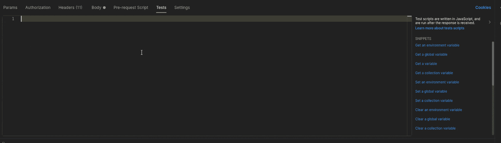

从可用片段添加简单的状态测试

# #1 订单节约—解决方案

我们已经完成了基础知识，所以，我们可以通过启动 runner 来处理第一个问题，看看会发生什么。在点击`Start Run`按钮之前，确保我们有以下设置:

🗹保持响应
☐保持变量值
🗹运行收集而不使用存储的 cookie
☐在收集运行后保存 cookie

不要改变集合的任何顺序，点击`Start Run`看看会发生什么(我猜你已经知道了😃).

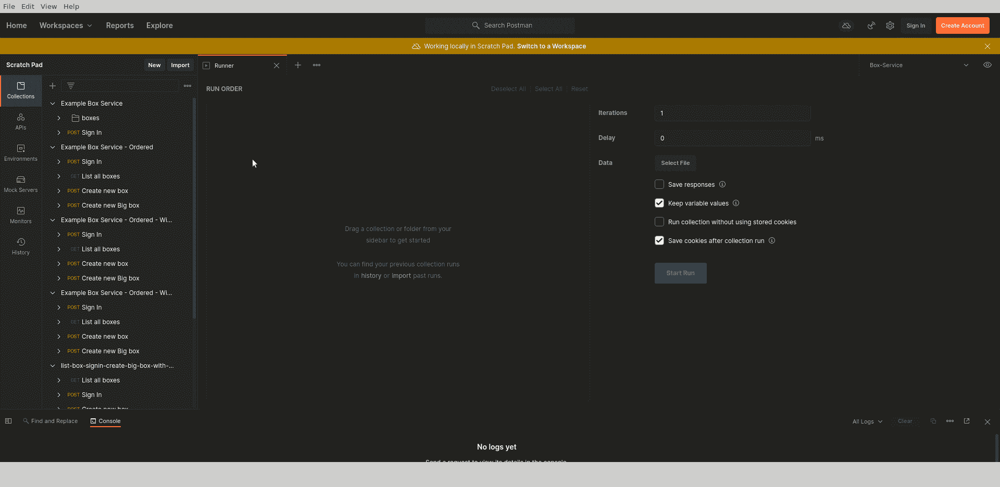

在“创建新盒子”请求时运行测试失败

正如您从上面的 GIF 中看到的，运行在`Create new box`步骤失败，如果我们调查响应，我们将看到 401 未授权，响应正文也包含`unauthorized`错误代码。

因此，为了解决这个问题，我们需要改变流道中端点的顺序。我们可以说这没什么大不了的，只要把列表中的条目拖拽到第一个位置就搞定了。
是的，对于下面的例子来说，这没什么大不了的，但是如果我们进入现实世界，想象我们自己在工作环境中，我们需要移动五个端点，而不是一个端点，只是为了进行授权。但是授权本身可能没有任何意义，因为我们通常倾向于测试业务案例，所以我们需要重新排序其他七个端点来创建必要的对象，如开户、进行交易、查看语句等等…

为了让事情变得更“有吸引力”,想象一下我们必须每 30 分钟运行一次，因为重大变更、快速发布或其他“有效”的原因，如下所示😂


突然事情变得很烦人。

在这种情况下，我们可以使用 [*ufonaut*](https://github.com/b-pagis/ufonaut) 来应用解决方案。它有一个选项来配置我们想要运行的端点的顺序。首先，我们需要创建配置文件，并指定运行程序的顺序。

要获得服务中可用端点的列表，我们可以手动完成，或者运行以下命令:

```
ufonaut endpoints -i [http://localhost:8080/swagger/doc.json](http://localhost:8080/swagger/doc.json)
```

它将输出以下结果

```
get boxes
post boxes
post boxes/big
post signin
```

我们可以很容易地将这个输出转换成配置文件，同时将我们的`signin`方法作为第一个条目。结果应该是这样的:

```
{
  "order": [
    {
      "method": "post",
      "path": "signin"
    },
    {
      "method": "get",
      "path": "boxes"
    },
    {
      "method": "post",
      "path": "boxes"
    },
    {
      "method": "post",
      "path": "boxes/big"
    }
  ]
}
```

将此保存到名为`box-order.json`的文件中。

现在，我们将需要使用 *ufonaut* 将开放 API 文档转换为应用了订单配置的 *Postman* 集合。此外，应用一个额外的选项，并重命名我们的集合。下面是这样做的命令:

```
ufonaut convert -i [http://localhost:8080/swagger/doc.json](http://localhost:8080/swagger/doc.json) -o postman-collection-ordered.json -cr "Example Box Service - Ordered" -d box-order.json
```

如果我们再次将我们的新集合导入到 *Postman* 中，我们会看到`Sign up`方法位于列表的顶部

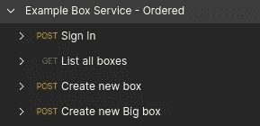

应用了“排序”选项的集合

如果我们用相同的配置启动 runner，我们将看到所有请求都返回成功结果。不幸的是，我们的测试也不见了，因为我们已经用有序的配置导入了这个集合。这导致了第二个问题——将`pre-request`和`test`信息保存到文件中，但是无法将其加载回集合中。

*注意:不幸的是，如果使用订单配置，集合将保存为平面结构。主要原因是为了避免复制文件夹或将端点添加到不属于它们的文件夹中。为了避免混淆和其他问题，选择了扁平结构，所以换句话说，这是在使用该选项时应该考虑的预期行为。*

# #2 保存预先请求和测试—解决方案

我们可以说这个问题是我们人为造成的，但是再一次，想象一下快节奏的环境，10 个开发人员正在构建新的服务，同时也在进行设计。在这样的环境中，我们必须预料到可能会有一些变化，比如请求或响应主体、请求参数甚至端点名称。

可能有两个选项来处理这些变化，或者在现有集合中手动进行所有调整，或者在发生这种变化时重新导入开放 API 文档。两者都有各自的弊端。

幸运的是， [*ufonaut*](https://github.com/b-pagis/ufonaut) 有一个从文件中加载`pre-request`和`test`脚本的选项。这是一个方便的特性，如果您经常需要重新导入 open API 文档，并且您不想丢失那些宝贵的脚本或者将它们从旧的集合复制并粘贴到新的集合，那么它可以节省大量时间。

为了使用这个特性，我们必须创建一个工作空间，其中有两个文件夹`pre-request`用于预请求文件，而`test`用于测试文件。它应该是这样的:

```
workspace/
├── pre-request
└── test
```

在我们之前的集合中，我们添加了一些状态代码测试，以确保一切正常工作。让我们将它们保存到文件中！这部分有点棘手，因为我们需要知道如何命名这些文件。 *Ufonaut* 使用规范化函数，该函数采用方法和端点的路径值，并将其连接成单个字符串。我们可以使用下面的命令找出 *box-service* 规范化的端点名称:

```
ufonaut endpoints -i [http://localhost:8080/swagger/doc.json](http://localhost:8080/swagger/doc.json) -n
```

它应该输出以下信息:

```
get boxes | get-boxes
post boxes | post-boxes
post boxes/big | post-boxesbig
post signin | post-signin
```

输出的结构很简单，由`<original HTTP method> <original URL> | <normalized name>`负责。我们可以转到`workspace`目录中的`test`文件夹并创建这些文件。您可以像`<normalized-name>.js`一样手动创建它们，或者如果您使用的是 Linux，可以运行以下命令:

```
touch $(ufonaut endpoints -i [http://localhost:8080/swagger/doc.json](http://localhost:8080/swagger/doc.json) -n | awk '{print $4".js"}')
```

现在，文件夹结构应该是这样的:

```
workspace/
├── pre-request
└── test
    ├── get-boxes.js
    ├── post-boxesbig.js
    ├── post-boxes.js
    └── post-signin.js
```

我们需要通过匹配相应的端点名称来将这些测试脚本复制到这些文件中。之后，我们需要用附加选项再次转换开放 API 文档。这是一个命令:

```
ufonaut convert -i [http://localhost:8080/swagger/doc.json](http://localhost:8080/swagger/doc.json) -o postman-collection-ordered-with-scripts.json -cr "Example Box Service - Ordered - With Scripts" -d box-order.json -s workspace/
```

工具自动在指定的`workspace`位置寻找`pre-request`和`test`目录。然后它获取端点列表，将其规范化，映射具有匹配名称的文件，并将脚本文件中的内容加载到 *Postman* 集合中。

在将这个新的`postman-collection-ordered-with-scripts.json`集合导入到 *Postman* 之后，我们会看到我们所有的请求都有来自文件的脚本。

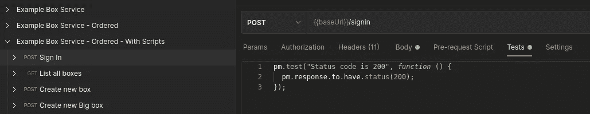

包含从文件加载的测试内容的集合

如果我们用之前的设置将这个文件放到 runner 中，我们将会看到所有的请求都被成功执行，并且有 4 个测试已经通过。

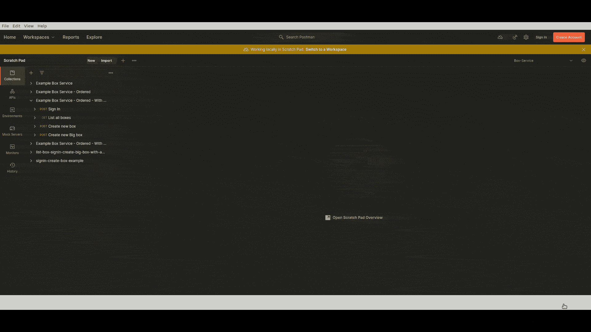

使用从文件加载的排序和测试在 runner 中运行集合

同样的逻辑也适用于`pre-request`脚本。它们必须以相同的方式命名，但是放置在`pre-request`目录中。这两种组合特别方便，节省了大量时间，因为我们只需要定义一次`*.js`文件，然后我们可以根据需要多次重新导入开放 API 文档，并且不会丢失那些宝贵的`test`和`pre-request`文件。

但是，如果我们想跳过运行程序中的一些端点，这种方法仍然不能解决问题，因为各种原因，比如知道它有问题，还没有对它们进行测试，或者只是不想为这个业务流调用它们。

# #4 发送前修改请求正文—解决方案

在进入下一个问题之前，我只想提到还有另一个问题，即[不可能在请求](https://github.com/postmanlabs/postman-app-support/issues/4808)之前修改请求前脚本中的请求内容，从今天起，我们似乎不再需要将请求体放入`pre-request`脚本并存储到变量中的解决方法。 [*邮差*团队实现了开箱即用的解决方案](https://github.com/postmanlabs/postman-app-support/issues/4808#issuecomment-826838064)。尽管事实上，我只是想展示这个特性，而我们仍然在预请求/测试主题。

该选项允许通过将请求体放入变量来模板化`pre-request`脚本，并使其在预请求脚本中可访问。为了看到这个特性的运行，我们必须创建一个模板文件。让我们在我们的工作区中这样做，将其命名为`template-example.js`(或者我们喜欢的任何其他名称，例如`my-template.template`)，并将以下内容放入其中:

```
var requestBody = <%%=requestBody=%%>;<%%=scriptContent=%%>pm.environment.set('requestBody', JSON.stringify(requestBody));
```

通过运行以下命令，为带注释的登录端点创建`pre-request`:

```
echo "// this is pre-request script file and it could contain any logic" > workspace/pre-request/post-signin.js
```

我们的工作区结构应该是这样的:

```
workspace/
├── pre-request
│   └── post-signin.js
├── template-example.js
└── test
    ├── get-boxes.js
    ├── post-boxesbig.js
    ├── post-boxes.js
    └── post-signin.js
```

使用模板选项为 *ufonaut* 运行之前的`convert`命令:

```
ufonaut convert -i [http://localhost:8080/swagger/doc.json](http://localhost:8080/swagger/doc.json) -o postman-collection-ordered-with-scripts-templated.json -cr "Example Box Service - Ordered - With Scripts - Templated" -d box-order.json -s workspace/ -t workspace/template-example.js
```

将`postman-collection-ordered-with-scripts-templated.json`集合导入到 Postman 中会得到以下结果:

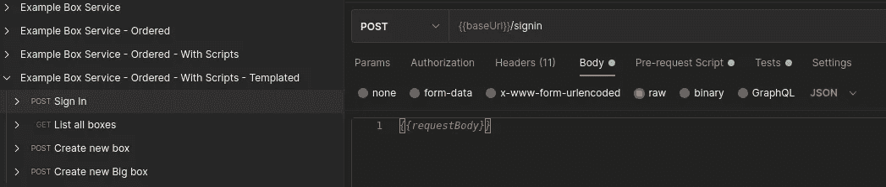

集合，其中请求体被替换为变量 I

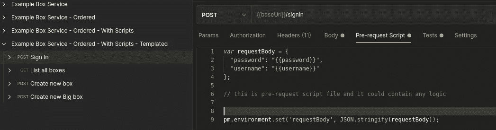

用变量 II 替换请求体的集合

模板选项是全局的，因此通过将请求正文放在请求前脚本中，它将应用于所有请求。正如我之前提到的，这是几年前的一个老问题的解决方案，当时缺少开箱即用的功能。但也许这在某些情况下还是有用的。

无论如何，让我们回到主题，转移到最后一个问题——检查和取消检查用于测试不同场景的复选框。

# #3 保存跑步者预设& #5 场景测试-解决方案

当涉及到持续测试时，排序和应用脚本确实很有帮助，但是当我们的端点列表变得非常大，而开发团队只对特定的端点子集进行更改时，会发生什么呢？或者，如果我们想测试特定的业务流，比如用户注册，而不是其他，该怎么办？

我们的开放 API 文档不适合展示这类情况的好例子，因为它只有 4 个端点。但是尽力想象有一个业务流，我们只想唱进去，创造一个盒子。每次我们启动运行程序时，我们总是需要取消选中`List all boxes`和`Create new Big box`端点，这样它们就不会包含在运行中。

当然，你可以说这可以通过创建许多不同的订单文件来解决，但是订单文件并不删除端点，并且 [*ufonaut*](https://github.com/b-pagis/ufonaut) 有另一个选项来处理这类问题— *集合*。

我们可以把集合想象成小的 *Postman* 集合，它可以应用所有以前的选项，但是另外从其中删除未使用的端点。为了看到这一点，我们需要通过运行`touch workspace/box-sets.json` 来创建 *set* 配置，并为我们的业务场景放置以下配置:

```
{
  "sets": [
    {
      "collectionName": "login-create-box-example",
      "scriptsPath": "workspace/",
      "template": {
        "preRequestTemplateFilePath": "workspace/template-example.template"
      },
      "order": [
        {
          "method": "post",
          "path": "signin"
        },
        {
          "method": "post",
          "path": "boxes"
        }
      ]
    }
  ]
}
```

这将添加先前关于模板、`pre-request`和`test`脚本的设置。

当配置文件准备好时，我们需要运行以下命令来创建 *Postman* 集合:

```
ufonaut create-sets -i [http://localhost:8080/swagger/doc.json](http://localhost:8080/swagger/doc.json) -c box-sets.json  -o workspace/sets
```

如果一切顺利，那么在我们的工作区目录中应该有新的目录`sets`，它应该包含我们的 set 文件，就像这样:

```
workspace/
├── pre-request
│   └── post-signin.js
├── sets
│   └── signin-create-box-example.json
├── template-example.template
└── test
    ├── get-boxes.js
    ├── post-boxesbig.js
    ├── post-boxes.js
    └── post-signin.js
```

如果我们将这个`signin-create-box-example.json`集合导入到 Postman 中，我们应该会看到以下结果:

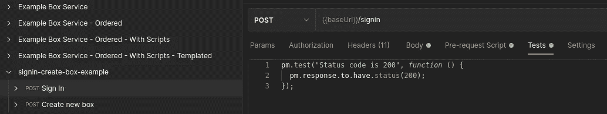

从集合配置创建的集合

如图所示，只有两个端点，这是我们的场景所需要的，并且它们具有加载了实际请求正文的测试和预请求文件内容，这些正文放在预请求文件中。就像我们在模板中指定的那样。

在另一种情况下，我们想得到所有的盒子，然后登录，然后创建一个大盒子，但没有模板。哦，应用附加的基本认证设置。听起来很复杂，但配置变化不大:

```
{
  "sets": [
    {
      "collectionName": "signin-create-box-example",
      "scriptsPath": "workspace/",
      "template": {
        "preRequestTemplateFilePath": "workspace/template-example.template"
      },
      "order": [
        {
          "method": "post",
          "path": "signin"
        },
        {
          "method": "post",
          "path": "boxes"
        }
      ]
    },
    {
      "sets": [
        {
          "collectionName": "list-box-signin-create-big-box-with-auth-example",
          "scriptsPath": "examples/scripts",
          "auth": {
            "type": "basic",
            "forced": true,
            "basic": {
              "username": "some-username",
              "password": "some-password"
            }
          },
          "order": [
            {
              "method": "get",
              "path": "boxes"
            },
            {
              "method": "post",
              "path": "signin"
            },
            {
              "method": "post",
              "path": "boxes"
            }
          ]
        }
      ]
    }
  ]
}
```

没有什么复杂的，只是列表中的另一个配置。是的，这确实意味着在一个文件中描述不同的集合是可能的。例如，当我们想要从有错误的场景中分离出成功的场景时，这就变得很方便，因为我们可以使用不同的`scripts`目录，这可能会导致不同的请求前检查测试用例。

运行相同的命令:

```
ufonaut create-sets -i [http://localhost:8080/swagger/doc.json](http://localhost:8080/swagger/doc.json) -c box-sets.json  -o workspace/sets
```

应该在我们的工作区目录中添加名为`list-box-signin-create-big-box-with-auth-example.json`的附加文件

```
workspace/
├── pre-request
│   └── post-signin.js
├── sets
│   ├── list-box-signin-create-big-box-with-auth-example.json
│   └── signin-create-box-example.json
├── template-example.template
└── test
    ├── get-boxes.js
    ├── post-boxesbig.js
    ├── post-boxes.js
    └── post-signin.js
```

现在，最后一次将这个导入到*邮递员*中，看看最后的结果:

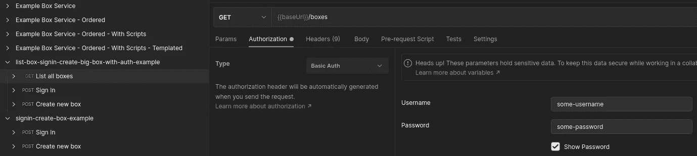

应用了基本授权的集合

这个新的集合包含三个端点，它们在集合配置中列出。最重要的是，这些端点被强制应用了基本身份验证选项。

> *边注:在* `*convert*` *命令中也可以使用强制认证设置。*

差不多就这些了。差不多吧，因为有些事我以前没提过，有些事我还想提。所以再忍耐一点点。

# 插入文字

在转换和创建器械包或将订单配置应用到器械包 [*时，ufonaut*](https://github.com/b-pagis/ufonaut) 还会做一件事。它用[插值](https://en.wikipedia.org/wiki/String_interpolation)值替换请求体值，这意味着它们可以在环境或全局变量中设置。这与前面描述的功能相结合，增加了额外的灵活性。例如，我们可以在预请求脚本文件中生成随机信息，加载它，每个请求将使用这些现成的生成值。当然如果名字正确的话。

# 和纽曼一起经营

这款工具的初衷并不是为了配合*邮递员*奔跑者使用，而是配合 [*纽曼*](https://www.npmjs.com/package/newman) 使用。想法是在 *Postman* 的帮助下编写一次这些测试/集合，然后将测试保存在文件中，并将其全部放入某个存储库中。然后在 CI/CD 步骤中，克隆这个存储库启动服务，使用 [*ufonaut*](https://github.com/b-pagis/ufonaut) 将开放 API 文档转换成多个集合，并使用 *newman* 并行运行它们以测试各种情况。然后检查业务流程中是否有任何问题。

当公司有更多/只有手动测试人员时，这种方法是有用的，因为它使他们永远不会一遍又一遍地测试相同的场景，而是通过各种示例编写几行代码，将信息推送到存储库，然后享受一些时间，而自动化方法覆盖了每次构建应用程序时的大多数事情。


# html-extra 的积分

还有一点我想提的是*纽曼*有一个插件，叫 [*纽曼-记者-htmlextra*](https://github.com/DannyDainton/newman-reporter-htmlextra) (无关系)，允许以漂亮易懂的格式导出测试结果。这对那些不太懂技术的人来说也是一件非常好的事情，因为他们可以清楚地看到提出了什么要求，得到了什么回应等等。

# 结尾注释

唉，结局。这似乎是一个相当长的帖子，描述了 [*ufonaut*](https://github.com/b-pagis/ufonaut) 的可能用途，以及它如何帮助解决一些角落的情况，这是*邮递员*没有涉及的。也许这个帖子之后，他们会添加这些功能(戳，戳)，也许不会。但在关键时刻，ufonaut 会帮助并加速事情的进展。


如果这有帮助的话，那么你可以请我喝一杯热的☕虚拟咖啡

[](https://ko-fi.com/W7W04WZNY)[](https://www.buymeacoffee.com/b.pagis)

# 链接

[](https://github.com/b-pagis/ufonaut) [## b-pagis/ufonaut

### 用于将 open api 文档转换为 postman 集合的 CLI，以及用于集成测试的附加选项，请使用…

github.com](https://github.com/b-pagis/ufonaut) [](https://www.postman.com/) [## postman | API 开发的协作平台

### 进行任何种类的 API 调用——REST、SOAP 或普通 HTTP——并轻松检查最大的响应。邮递员也有…

www.postman.com](https://www.postman.com/) [](https://github.com/DannyDainton/newman-reporter-htmlextra) [## 丹尼登顿/纽曼-记者-htmlextra

### 一个纽曼 HTML 报告器，已经扩展到包括迭代运行的分离，所以这些不再…

github.com](https://github.com/DannyDainton/newman-reporter-htmlextra) [](https://github.com/postmanlabs/newman) [## 邮政实验室/纽曼

### 利用业界最完整的 API 开发环境，在 Postman 中管理您组织的所有 API…

github.com](https://github.com/postmanlabs/newman) [](/go-swagger-and-open-api-e6b6ea4ce48f) [## Go，Swagger，并打开 API

### 用 S̶w̶a̶g̶g̶e̶r̶开放 API 记录 Go REST 服务

levelup.gitconnected.com](/go-swagger-and-open-api-e6b6ea4ce48f)  [## 字符串插值-维基百科

### 编辑描述

en.wikipedia.org](https://en.wikipedia.org/wiki/String_interpolation)