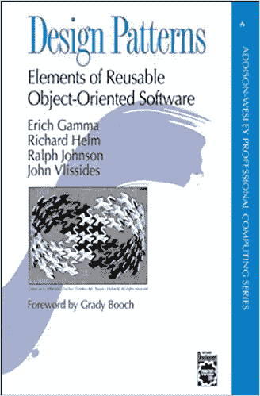
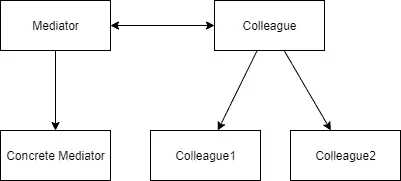
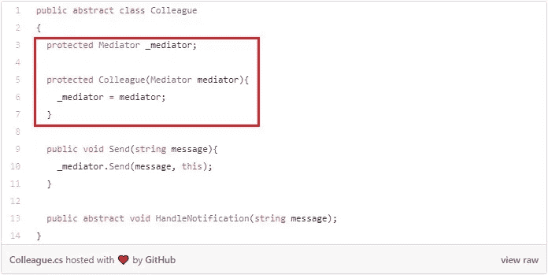
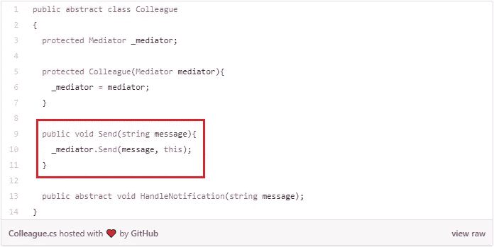
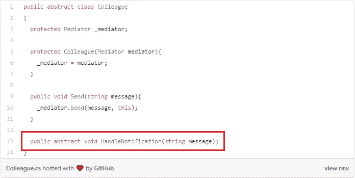
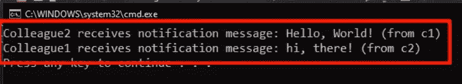

# 难看的依赖图？中介设计模式是您的解决方案。

> 原文：<https://levelup.gitconnected.com/ugly-dependency-graph-the-mediator-design-pattern-is-the-solution-for-you-8b35df60558b>

## 设计模式系列

## 使用中介设计模式增强和简化对象依赖图。

## 介绍

通过自我教育的旅程，我终于明白了一个调解人。当你成为一名开发人员时，中介设计模式可以成为你工具箱中一个有益的工具。

## 先决条件

本教程期望你了解 C#语言和面向对象编程的基础。

## 图书定义

中介设计模式(Mediator)在一本名为[Design Patterns:Elements of Reusable Object-Oriented Software](https://en.m.wikipedia.org/wiki/Design_Patterns)的书中首次被正式引入。

书籍封面设计图案

Mediator 封装了对象如何相互交互和通信。这种模式促进了对象的[松散耦合](https://en.wikipedia.org/wiki/Loose_coupling)，以避免难看的[依赖图](https://en.wikipedia.org/wiki/Dependency_graph)。

丑陋的依赖图，这正是你我应该尽量避免的。松散耦合是实现这一点的方法之一。而调解员是做这件事的具体实施者。

中介器通过将通信封装在中央中介器对象中，使对象能够避免直接相互引用。

想象一下你的代码库中有一堆对象。如果每个对象都必须与所有其他目的相关联和通信，这很快就会变得很糟糕。

图片来自 Pexels 的 Pixabay

## 开发者友好的解释

使用 Mediator，我们创建了一个中心 Mediator 对象。这个单独的对象唯一负责维护对我们的“对象束”中的对象的引用。

它还负责转发这些对象之间的任何消息或通信。你可以把仲裁者想象成一个**通信枢纽**。

调解人通常由以下四个部分组成:

1.  调解人—定义同事之间的沟通。
2.  具体调解人—实现同事之间的沟通。
3.  同事—仅与调解人沟通。
4.  具体的同事—接收来自调解人的消息。

关系图

## 组件之间的关系

Mediator 通常是一个基于抽象的类。具体中介从基本中介继承，并实现主要由中介中的契约或基本方法定义的通信。

collaborate 也是一个基于抽象的类，但是它代表了一个相关的对象集合。它只引用它的中介并与之通信。你可以把这想象成**调解人和同事之间的双向**。

具体的同事只是继承自抽象同事基类并定义特定行为的不同类型的子类。

## 履行

让我们深入代码，实现我们的第一个中介。首先，我们需要创建一个名为 Mediator 的抽象类及其抽象方法 Send。

然后创建一个抽象类同事。

如你所见，我添加了一点实现。

首先，我们为同事提供了一个构造函数，它接受一个中介并将其设置到一个受保护的字段中。

然后，我实现了 send 方法，该方法将通过 Send 方法向我们存储在受保护字段中的中介发送消息。

最后，我在底部有一个抽象的 HandleNotification 方法。想想看，我们需要一个接收信息的地方。

现在让我们添加继承自这个抽象同事类的具体同事。

当我从抽象类 collaborate 继承时，我必须实现 HandleNotification 方法。实现是将收到的消息的简单通知打印到控制台中。

最后一类需要定义，它是一个具体的中介。

看发送方法。如您所见，中介正在处理对象之间的通信。在这个具体的情况下，我在同事 1 和同事 2 之间传递信息，反之亦然。

现在让我们进入 Program.cs 来使用所有这些。

让我们实例化 ConcreteMediator。然后我需要两个同事的实例作为对象 c1 和 c2。请注意，我将中介传递给了两者。之后，我们还必须设置 Mediator 的两个属性，并由此定义已经提到的**双向**引用。现在我们不能开始发送消息。构建并运行代码。

我们可以看到，同事之间互相传递和接收信息。

## 结论

中介是对象之间的通信枢纽。它为您解析正确的消息方向。中介器的主要好处之一是能够封装对象间松散耦合的对象交互。

请记住，模式只是导轨，而不是一成不变的指令性实现规则。许多不同的实现是可接受的。

 [## 丹尼尔·鲁斯诺克的时事通讯

### 每个月我都会给你发一封电子邮件，列出我的最新文章。这当然是友好的联系…

www.danielrusnok.com](https://www.danielrusnok.com/daniel-rusnoks-newsletter) 