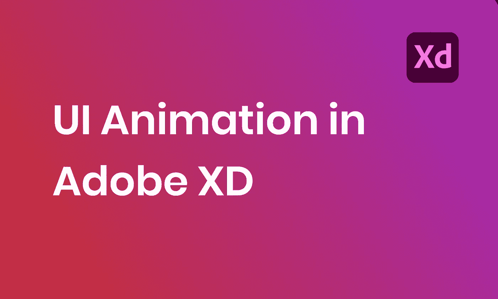

# Adobe XD 中的用户界面动画

> 原文：<https://levelup.gitconnected.com/ui-animation-in-adobe-xd-a654dbe3f5ff>

# 介绍

在现代网站中，动画变得越来越重要。它将专业网站与优秀网站区分开来，因为它使网站变得生动，并创造了良好的用户体验。在本教程中，我们将介绍在 Adobe XD 中制作以下 UI 动画所需的必要步骤。

Adobe XD 中的用户界面动画

# 背景

在我们开始实现我们的设计之前，让我们先试着理解动画背后的概念。任何复杂的动画都可以分解成一个**开始状态**和一个**结束状态**。在这两种状态下，一些属性(如位置、颜色、大小等)会有所不同，动画就是从一种状态转换到另一种状态的过程。要制作复杂的动画，我们只需要添加更多的状态。

动画概念

在本教程中，我们将制作以下名片动画。当用户点击名片时，我们希望将它从开始状态动画到结束状态。

名片开始状态

名片结束状态

# 动画分解

如果我们一步一步分解动画，我们需要实现以下内容:

1.  用户头像、名字和职位应该缩小，移到左上角
2.  短暂的延迟之后，详细的描述应该会从底部滑入

通过立即查看分解，我们了解到在开始和结束状态之间应该有一个中间状态。中间状态允许我们在第一个动画的结尾创建一个停止点。然后对于动画二，我们将从中间状态动画到结束状态。

# 国家准备工作

为了让动画工作，我们需要准备以下状态:

开始状态:

*   用户头像、姓名和职务的初始状态

中间状态:

*   用户头像、namd、职称尺寸缩小，移到左上角
*   应该在名片的底部准备详细的描述，但要看不见

结束状态:

*   详细描述变得可见，并向上移动到结束位置

既然我们已经有了开始状态和结束状态，我们只需要创建中间状态。

名片中间状态

请注意，我们是如何将详细描述放在名片之外一点，并通过将不透明度设置为零来使其不可见的。

# 动画状态

在 Adobe XD 上，切换到**原型**选项卡，选择**起始状态**画板。选择画板时，会出现一个箭头。拖动箭头连接**中间状态**画板。

Adobe XD 原型选项卡

链接开始状态和中间状态

在右侧面板中，配置以下设置:

*   触发器:点击
*   类型:自动动画
*   放松:无
*   持续时间:0.5 s

从开始状态到中间状态的交互设置

触发器定义动画将如何开始。当用户点击名片的开始状态时，动画就会开始，所以我们将触发器设置为“Tap”。持续时间定义了从起始状态变为中间状态需要多长时间。

起始状态到中间状态

接下来，我们要从中间状态到结束状态制作动画。我们可以选择中间状态画板，并将其与结束状态画板连接。

链接中间状态和结束状态

应用以下设置:

*   触发:时间，延迟:0.2s
*   类型:自动动画
*   放松:放松
*   持续时间:0.5 s

从中间状态到结束状态的交互设置

请注意，这次我们将触发器设置为**时间**，并添加了 0.2 秒的延迟。通过这种设置，当用户单击名片并将其从开始状态动画显示到中间状态时，它将在 0.2 秒的延迟后自动继续动画显示到结束状态。

开始状态到结束状态

# 反向动画

现在正常顺序(开始到结束状态)的动画已经完成，让我们创建相反顺序(结束到开始状态)的动画。类似于正常的订单动画，我们希望在用户点击结束状态时触发动画，当然我们希望在放大头像、姓名和职务之前，先将细节描述隐藏起来。因此，我们将为逆序动画添加第二个中间状态。

添加一个从结束状态到第二个中间状态的新箭头。

结束状态到第二中间状态

对于交互设置，我们可以从开始状态到结束状态应用相同的设置。

交互设置

*   触发器:点击
*   类型:自动动画
*   放松:无
*   持续时间:0.5 s

接下来，将第二个中间状态链接回起始状态。

从第二中间状态到开始状态

我们可以从第一中间状态到结束状态应用相同的交互设置。

*   触发:时间，延迟:0.2s
*   类型:自动动画
*   放松:放松
*   持续时间:0.5 s

决赛成绩

决赛成绩

# 结论

在本教程中，我们学习了动画背后的概念以及如何在 Adobe XD 中实现它们。在下一个教程中，我们将通过在 CSS 中实现动画来使它变得生动。

原帖:【https://simpleweblearning.com/ui-animation-in-adobe-xd】[T2](https://simpleweblearning.com/ui-animation-in-adobe-xd)