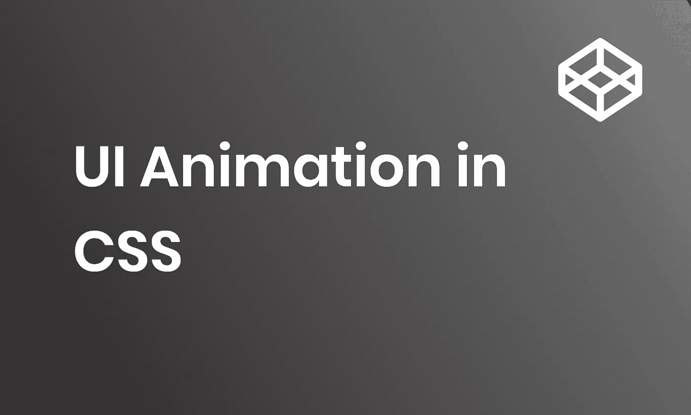
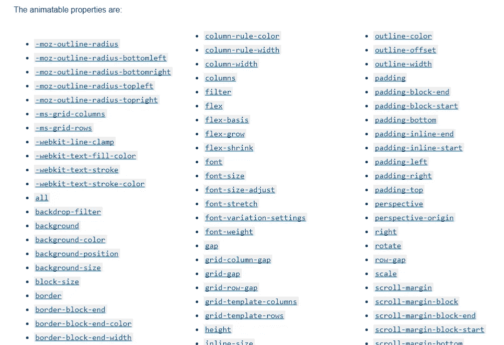
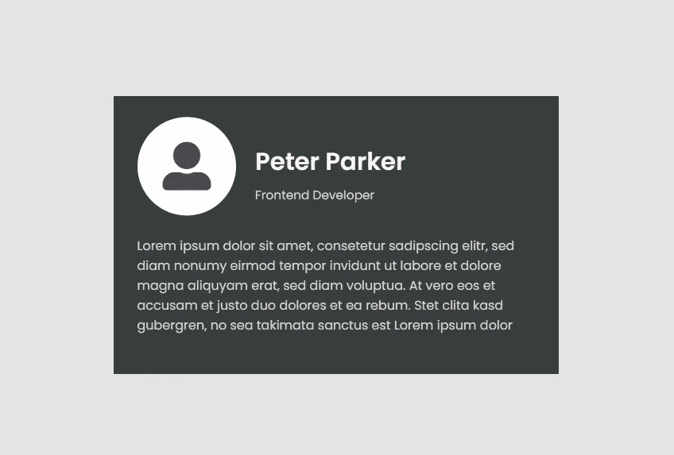
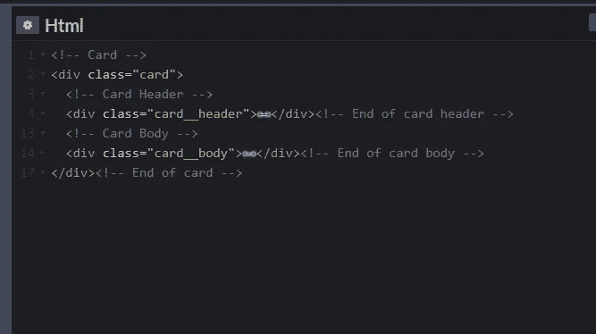

# CSS 中的用户界面动画

> 原文：<https://levelup.gitconnected.com/ui-animation-in-css-86f5ccbd91f5>



# 介绍

在上一个教程中，我们解释了动画背后的概念，并介绍了在 Adobe XD 中创建动画的必要步骤。在本教程中，我们将更进一步，将设计实现为真正的工作代码，可以在您的下一个项目中使用，以创建交互式用户体验。

来自 Adobe XD 的动画

# 开始前的背景知识

回忆动画由一个开始状态和一个结束状态组成，在 CSS 世界中这个想法是相同的。类似于在 Adobe XD 中更改属性，在 CSS 中，我们在每个状态中定义不同的 CSS 属性，然后通过将结束状态附加到 DOM 事件(如 onClick 或 onHover)来将它们链接在一起。在 CSS 中，实际上有两种制作动画的方法:

1.直接更改特定的 CSS 属性并附加过渡

2.定义一个动画函数，并将其附加到我们想要操作的元素上

对于大多数情况，第一种方法就足够了，但是对于改变多个属性的复杂动画或者可以重用的动画，最好定义一个动画函数，并在可能的情况下重用它。

# 可制作动画的 CSS 属性

在 CSS 中，有些属性是可动画化的，有些则不是。如果使用不可动画的属性，最终结果看起来会像是小故障，因为它不会响应您设置的过渡，而是直接从开始状态跳到结束状态。

你可以在 Mozilla 网站的[https://developer . Mozilla . org/en-US/docs/Web/CSS/CSS _ animated _ properties](https://developer.mozilla.org/en-US/docs/Web/CSS/CSS_animated_properties)找到所有可动画化的 CSS 属性的完整列表。这个列表可能很长，但是如果你记得经验法则，那么它应该不难理解:

只有包含数字的 CSS 属性才是可动画的，因为浏览器需要能够逐渐增加/减少数字来创建动画效果。



Mozilla 的动画 CSS 属性

# HTML 结构

与 Adobe XD 不同，大多数情况下开始状态和结束状态会共享相同的 HTML 结构，因此记住这一点并计划每个 DOM 元素的位置如何随着其他 DOM 元素在动画中出现或隐藏而变化总是一个好主意。

下面是我们的开始状态和结束状态


名片动画—开始状态



名片动画—结束状态

总结这两种状态，我们有以下四个主要的 HTML 元素需要制作动画:

1.  电影《阿凡达》
2.  名字
3.  职称
4.  描述

在动画制作过程中，**头像**、**名字**和**职位**将缩小尺寸并一起移动，所以我们将它们放在一个名为 **card__header** 的 DIV 元素中，以便一起移动它们。对于描述，它将单独存在于另一个名为 **card__body** 的 DIV 元素中。两个 DIV 元素都将驻留在一个名为 **card** 的父 DIV 元素中，因此我们的顶级 HTML 将如下所示。



顶级 HTML 结构

完整的 HTML 结构将是:

```
<!-- Card -->
<div class="card">
  <!-- Card Header -->
  <div class="card__header">
    <figure class="avatar">
      <i class="fas fa-user-alt"></i>
    </figure>
    <div class="user-info">
      <b class="name">Peter Parker</b>
      <span class="job-title">Frontend Developer</span>
    </div>
  </div><!-- End of card header -->
  <!-- Card Body -->
  <div class="card__body">
    <p class="intro">Lorem ipsum dolor sit amet, consetetur sadipscing elitr, sed diam nonumy eirmod tempor invidunt ut labore et dolore magna aliquyam erat, sed diam voluptua. At vero eos et accusam et justo duo dolores et ea rebum. Stet clita kasd gubergren, no sea takimata sanctus est Lorem ipsum dolor</p>
  </div><!-- End of card body -->
</div><!-- End of card -->
```

# 开始状态 CSS

首先，让我们用下面的 CSS 设置来布局开始状态:

因为我们是在 Codepen.io 上开发，所以我们对 body 元素应用了一些 CSS 属性，这样我们的卡片在页面上总是垂直和水平居中。

```
body {
  margin: 0;
  width: 100vw;
  height: 100vh;
  display: flex;
  justify-content: center;
  align-items: center;
  background-color: #E4E4E4;
  font-family: 'Poppins', sans-serif;
  font-size: 16px;
}
```

然后，我们在 card DIV 元素中定义一些 CSS 变量。

```
.card {
  --text-color--primary: #F5F5F5;
  --text-color--secondary: #D8D5D5;
  --avatar-color: #494B4D;
  --avatar-bg-color: #FFFFFF;
  font-size: 16px;
  --gap: 1.875rem;
  --intro-opacity: 0;
  width: 560px;
  height: 350px;
  background-color: #393D3D;
  padding: var(--gap);
  box-sizing: border-box;
  overflow: hidden;
}
```

对于其余的元素，我们定义 CSS 属性并使用在 card DIV 元素中声明的变量。这非常有帮助，因为稍后当我们定义动画状态时，我们可以简单地更新变量，所有相关的 DOM 元素都会直接受到影响。

```
.name {
  color: var(--text-color--primary);
}
.job-title,
.intro {
  color: var(--text-color--secondary);
}
/*** Card Header ***/
.card__header {
  display: flex;
  align-items: center;
  transform-origin: left;
  transform: scale(0.8);
  height: 40%;
  .avatar {
    margin: 0;
    margin-right: var(--gap);
  }
  .user-info {
    flex: 1;
    margin: auto 0;
  }
}
/*** Avatar ***/
.avatar {
  border-radius: 50%;
  width: 155px;
  height: 155px;
  background-color: var(--avatar-bg-color);
  display: flex;
  .fa-user-alt {
    color: var(--avatar-color);
    font-size: 95px;
    margin: auto;
    transform: scale(1);
    transition: transform .5s .7s;
  }
}
/*** User Info ***/
.user-info {
  display: flex;
  flex-direction: column;
  justify-content: space-between;
  transform-origin: left;
  transform: scale(0.8);
  font-size: 24px;
  .name {
    display: block;
    font-size: 2em;
    line-height: 2em;
  }
  .job-title {
    font-size: 1em;
  }
}
/*** Card Body ***/
.card__body {
  margin-top: 30px;
}
/*** Intro ***/
.intro {
  font-size: 1rem;
  opacity: var(--intro-opacity);
}
```

# 准备动画

我们将准备四个动画:**头出**、**头入**、**体出**和**体入**。

**header-out** :
卡片表头缩小移动到左上角时的动画过程。(缩小)

```
[@keyframes](http://twitter.com/keyframes) header-out {
  from {
    height: 100%;
    font-size: 20px;
    --gap: 1.875rem;
    transform: scale(1);
  }
  to {
    height: 40%;
    font-size: 18px;
    --gap: 1.875rem;
    transform: scale(0.8);
  }
}
```

对于收缩效果，我们使用了 **transform: scale** 属性，将整个卡片标题从 100%收缩到 80%。

对于移动效果，我们首先为 card 元素设置一个以像素为单位的 height，然后将整个 card header 的 **height** **以百分比**的形式更改。

您可以看到，我们还更改了**字体大小**并更新了 **—间隙**变量的值，因此当卡标题收缩时，间隙也会相应地收缩。

**header-in:** 卡片表头变大并移动到卡片中心时的动画过程。(放大)

```
[@keyframes](http://twitter.com/keyframes) header-in {
  from {
    --gap: 1.875rem;
    font-size: 16px;
    height: 40%;
    transform: scale(0.8);
  }
  to {
    --gap: 1.875rem;
    font-size: 20px;
    height: 100%;
    transform: scale(1);
  }
}
```

**割台进入**动画与**割台退出**动画正好相反。

**body-out:** 卡体从卡底消失并淡出时的动画过程。(淡出)

```
[@keyframes](http://twitter.com/keyframes) body-out {
  from {
    transform: translateY(0);
    --intro-opacity: 1;
  }
  to {
    transform: translateY(100%);
    --intro-opacity: 0;
  }
}
```

对于消失效果，我们将 **— intro-opacity** 变量从 1 更改为 0，这将最终影响**不透明度**属性。

对于下滑效果，我们使用了 **transform: translateY** 属性，并在父卡 DIV 元素上设置了 **overflow: hidden** ，这样当卡体在父元素之外时，它将被隐藏，不会与卡外的其他 DOM 元素重叠。

**body-in:** 卡体出现并从卡片底部滑入时的动画过程。(淡入)

```
[@keyframes](http://twitter.com/keyframes) body-in {
  from {
    transform: translateY(100%);
    --intro-opacity: 0;
  }
  to {
    transform: translateY(0);
    --intro-opacity: 1;
  }
}
```

同样，**身体向内**动画与**身体向外**动画正好相反。

# 附加动画

即使在我们的 Adobe XD 中，我们将动画触发器设置为 onClick，但在真实浏览器的世界中，将动画触发器设置为 onHover 实际上更有意义。

为了附加动画，我们将以下新属性添加到 **card_header** 元素中，作为开始状态动画:

```
animation: header-in .5s .7s forwards;
```

注意最后的**转发**选项！我们需要这样，当动画结束时，所有改变的属性将停留在它们的结束状态，而不是跳回到开始状态。

类似地，我们需要向 che **card__body** 元素添加以下开始状态动画:

```
animation: body-out .5s forwards;
```

设置好之后，我们可以开始添加动画触发器和结束状态动画。

```
.card:hover {
  .card__header {
    animation: header-out .5s forwards;
    .fa-user-alt {
      transform: scale(.8);
      transition: transform .5s;
    }
  }
  .card__body {
    animation: body-in .5s .7s forwards;
  }
}
```

一定要设置**过渡**属性，这样动画会更流畅。

```
* {
  transition: all .5s ease-in;
}
```

决赛成绩

决赛成绩

完整代码可在以下网址找到:

原帖:
[https://simpleweblearning.com/ui-animation-in-css](https://simpleweblearning.com/ui-animation-in-css)