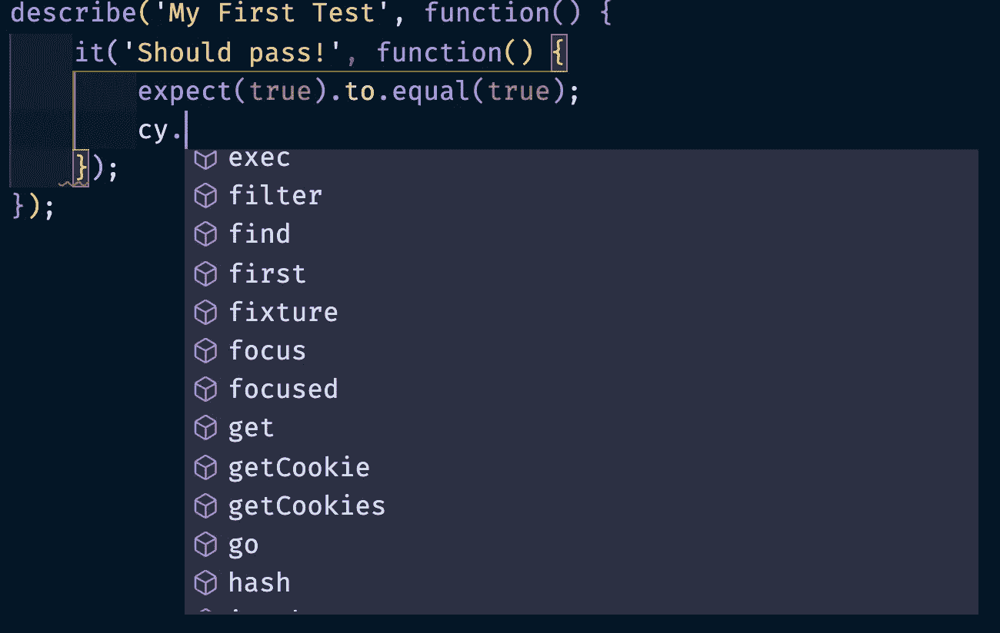

# 使用 Cypress 测试 React 应用程序的 UI

> 原文：<https://levelup.gitconnected.com/ui-testing-a-react-app-using-cypress-247c3bc4cd94>


Mick Haupt 在 [Unsplash](https://unsplash.com/s/photos/cypress?utm_source=unsplash&utm_medium=referral&utm_content=creditCopyText) 上拍摄的照片

[Cypress](https://www.cypress.io/) 是一款用于现代 web 应用的自动化 UI 和端到端测试的工具。我以前使用过其他测试工具，比如 Selenium，在我看来，Cypress 更快更容易安装。将它与现有的前端应用程序集成起来非常简单。本教程将着重于测试 React 应用程序，但是您也可以将 Cypress 用于用另一种技术编写的其他应用程序。它应该让您知道开始用 Cypress 编写测试是多么容易。

# React 应用程序示例

我将使用这个简单的 react 应用程序，所以如果您想按照教程学习，请随意克隆它。

[](https://github.com/randalvance/react-cypress-starter) [## Randal vance/react-cypress-starter

### 这个项目是用 Create React App 引导的。在项目目录中，您可以运行:在…中运行应用程序

github.com](https://github.com/randalvance/react-cypress-starter) 

用于 Cypress 测试的简单 React 应用程序

这是一个简单的 react 应用程序，只有一个表单，单击 submit 后可以导航到另一个页面。

如果您想在完成本教程后看到最终的代码，那么您可以检查这个 Git 存储库的`final`分支。

# 安装 Cypress

从 Github 克隆了示例 react 应用程序 repo 之后，在终端中导航到它的根文件夹，并安装 Cypress。

```
npm install cypress --save-dev
```

创建一个 npm 脚本来启动 cypress。我们这样做是为了不需要在全球范围内安装 cypress，可以简单地将它作为 npm 脚本运行。在您的`package.json`文件中，找到`scripts`部分并添加一个新条目。

```
"scripts": {
    "cypress:open": "cypress open",
    ...
},
```

这样，我们现在可以通过执行以下命令来打开 Cypress 测试运行程序:

```
npm run cypress:open
```

Cypress test runner 将会打开，它会建议创建一些示例测试来帮助您开始。点击“好的，知道了！”按钮。


Cypress 将创建必要的文件夹和示例文件。

一个`cypress`文件夹将被创建在你的项目的根目录下，还有一个`cypress.json`文件。


这是 Cypress 创建的文件夹和文件。

在`cypress/integration/examples`下，您将看到一些可作为有用参考的示例测试。我已经在本教程中删除了它们。

# 为 Cypress 启用类型脚本

在您的`cypress`文件夹中，创建一个`tsconfig.json`文件并使用以下配置:

```
{
    "compilerOptions": {
        "baseUrl": "../node_modules",
        "types": [
            "cypress"
        ]
    },
    "include": [
        "**/*.*"
    ]
}
```

# 创建一个简单的测试

在`cypress/integration`文件夹中，创建一个名为`sample_spec.ts`的新文件。使用以下内容。

```
describe('My First Test', function() {
    it('Should pass!', function() {
        expect(true).to.equal(true);
    });
});
```

Cypress 使用的是 [Mocha 测试框架](https://mochajs.org/)，所以测试的结构是相似的。我们首先通过调用`describe`函数来定义测试套件的名称。它接受测试套件的名称，后跟一个回调函数。这个回调函数将包含单独的测试以及设置和拆卸逻辑。

通过调用`it`函数来定义单个测试。第一个参数是测试的描述。第二个参数是一个包含测试将要执行的步骤的函数。

下面一行是断言。

```
expect(true).to.equal(true);
```

我们将在本文的后面讨论断言，但是现在，这个断言基本上检查`true`是否是`true`，这确保了测试将总是通过(只是为了给你一个通过的测试)。

返回赛普拉斯测试赛。请注意，您创建的文件现在出现了。


测试文件出现在 Cypress Test Runner 中。

请注意右上角(在“登录”按钮的正下方)所选的浏览器。您可以通过简单地点击文件来运行测试，它将使用您指定的浏览器来运行所选择的测试。


测试将在浏览器中运行。

你应该看到你的测试通过了。

要测试测试失败后会发生什么，请将代码更改为以下内容。

```
describe('My First Test', function() {
    it('Should pass!', function() {
        expect(false).to.equal(true);
    });
});
```

保存文件后，测试应该会自动重新运行，您将会看到失败的测试。


考试失败

您可以在 Cypress 测试运行器上点击“stop”来停止测试。


停止 Cypress 测试运行程序中的测试运行。

# 柏树指挥部

在创建第一个真正的测试之前，您需要熟悉 Cypress 的命令。有些命令可以选择 UI 中的元素并与之交互，访问网页，清除本地存储，等等。它们可以通过测试中的`cy`全局变量来访问。在 Typescript 的帮助下，VS 代码可以建议所有可用的命令。



建议所有可用 Cypress 命令的 Visual Studio 代码

您可以在 Cypress 的 API 文档中了解所有可用的命令:

[https://docs.cypress.io/api/api/table-of-contents.html](https://docs.cypress.io/api/api/table-of-contents.html)

## 访问要测试的页面

在我们测试一个网页之前，我们需要导航到那个页面。我们可以使用`visit`命令来这样做。

```
cy.visit('http://localhost:3000');
```

visit 命令接受一个 URL，这是我们希望浏览器导航的 URL。通常，这是你在测试中要做的第一件事。

## 查询 UI 元素

一旦网页被加载，我们需要找到需要测试的元素。我们使用`get`命令来完成这项工作。该命令接受选择器字符串。这个字符串类似于您在 CSS 和`getQuerySelector`函数中用来选择元素的字符串。例如，如果我们想选择一个类别为`.submit-button`的按钮，那么我们这样写:

```
cy.get('button.submit-button')
```

您还可以在刚刚选择的元素中查找子元素。为此，我们使用了`find`命令。

```
cy.get('.parent').find('.child')
```

## 别名元素

如果要重复使用刚刚选择的元素。我们可以使用`as`命令指定一个别名。

```
cy.get('button.submit-button').as('submitButton');
```

每当我们想要引用同一个元素时，我们可以简单地使用别名。您应该在别名前面加上`@`符号。

```
cy.get('@submitButton')
```

## 与 UI 元素交互

一旦您选择了一个 UI 元素，我们就可以使用许多命令中的一个来进行 UI 交互。例如，如果我们想要点击我们在上一节中选择的按钮，我们调用`click`命令。你可以用前面的`get`命令来链接它。

```
cy.get('button.submit-button').click();
```

要在输入文本框中输入一些文本，我们可以使用`type`命令:

```
cy.get('.my-text-box').type('Hello World!');
```

有更多的命令与所选的 UI 元素交互，比如`focus`聚焦一个元素，`check`选中一个复选框或单选按钮，`select`选择一个选项。同样，如果你想寻找一个特定的命令，你可以检查一下 [Cypress API 文档](https://docs.cypress.io/api/api/table-of-contents.html)的命令部分。

# 断言

断言检查被测试的对象是否处于预期状态。例如，我们可以使用断言来检查文本输入是否包含我们期望的某个文本。如果断言失败，将导致测试失败。

Cypress 已经对它的一些命令做了一些默认断言。例如，`get`命令断言被选择的元素存在，并且在 DOM 中可见。对于大多数测试，您可能仍然希望确保 UI 处于特定的状态。Cypress 允许我们使用`should`命令定义显式断言。下面是我们如何测试一个文本输入是否包含文本`"Hello World"`。

```
cy.get('.my-text-input').should('have.value', 'Hello World');
```

我们首先选择想要验证的元素，然后链接对`should`函数的调用。第一个参数称为链接器，第二个参数是要测试的值。

链接器基本上从源组件中提取一个值，我们可以用它来进行比较。Cypress 使用 [Chai 框架](https://github.com/chaijs/chai)来利用它的几十个链接器。

下面是一些检查所选元素各种属性的断言的例子。

```
// Checks that the div element
// is visible
cy.get('div').should('be.visible');// Checks that the div element
// is not visible
cy.get('div').should('not.be.visible');// Checks whether the button element
// has a class named "primary"
cy.get('button').should('have.class', 'primary');// Checks whether the button element
// does not have a class named "primary"
cy.get('button').should('not.have.class', 'primary');// Checks whether the h1 element
// has an inner text of "Foo"
cy.get('h1').should('have.text', 'Foo');// Checks whether the span element
// has a data attribute
cy.get('span').should('have.attr', 'data');
```

要获得可用链接器的列表，可以参考 Cypress 的断言文档页面。

[](https://docs.cypress.io/guides/references/assertions.html) [## 断言

### Cypress 捆绑了流行的 Chai 断言库，以及对 Sinon 和 jQuery 有用的扩展，为您带来…

docs.cypress.io](https://docs.cypress.io/guides/references/assertions.html) 

VS 代码还会建议你可以使用的链接器。


VS 代码可以给出一个你可以使用的链接列表

# 创建实际的测试

既然我们已经学习了测试示例 React 应用程序所需的基本命令，让我们继续编写它。我们可以在`cypress/integration`中创建一个新的测试文件。

我们测试的第一行是调用`visit`命令，将我们导航到我们正在测试的 react 应用程序。下一个代码块选择我们将与之交互的 UI 元素。注意，我使用了属性选择器来选择具有特定名称的输入元素。您还可以向 React 组件中的单个元素添加一个类，以便更容易地选择元素。我们使用`as`命令给每个元素分配一个别名，这样我们以后就可以引用它们了。

下面的代码块通过为每个 UI 元素使用相应的交互命令来为每个输入赋值。我们使用在前一个块中创建的别名来引用每个元素。

通过点击`@submitButton`，我们将被重定向到第二个页面，并显示一条成功消息。我们首先验证当前 URL 是否在第二个页面中，然后测试成功消息是否存在。

在运行这个测试之前，我们首先需要运行 React 应用程序。

```
npm start
```

一旦应用程序运行，我们就可以运行我们的测试。单击您在 Cypress 测试运行器中创建的文件来触发测试运行。


Cypress UI 测试正在进行

Cypress 现在应该执行所有的命令。一旦最后一个命令成功，测试就通过了。

# 结论

在本教程中，我们学习了如何通过将 Cypress 安装到现有的 React 应用程序中来执行 UI 测试。我们研究了 Cypress Test Runner，它是查看和运行项目所有可用测试的主要应用程序。我介绍了如何编写一个基本的 Cypress 测试。您已经熟悉了大量可以用来查询和交互元素的命令。向您介绍了在 Cypress 中定义断言。最后，我们运行了基本的 Cypress UI 测试，并看到了它的运行。感谢阅读。