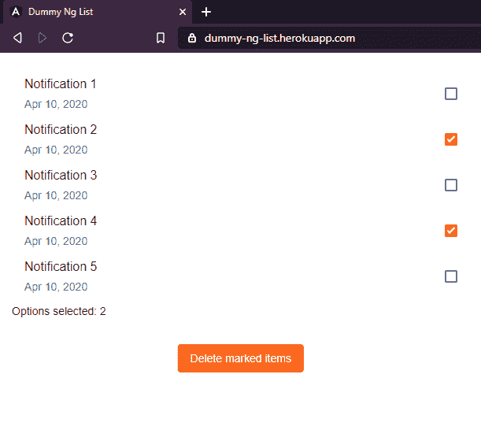
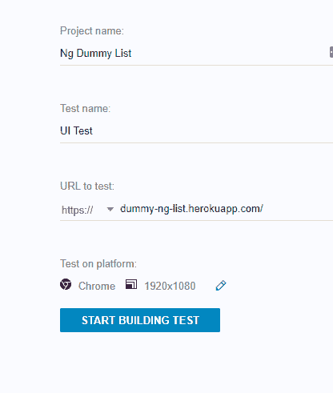
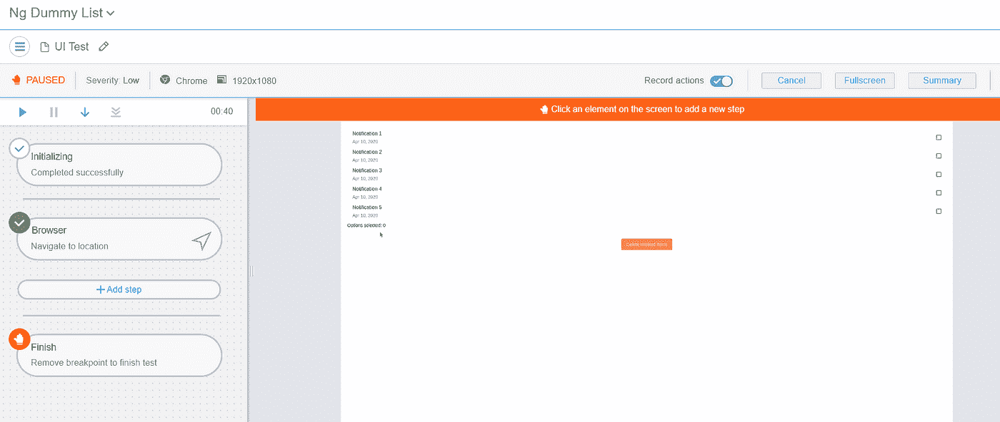
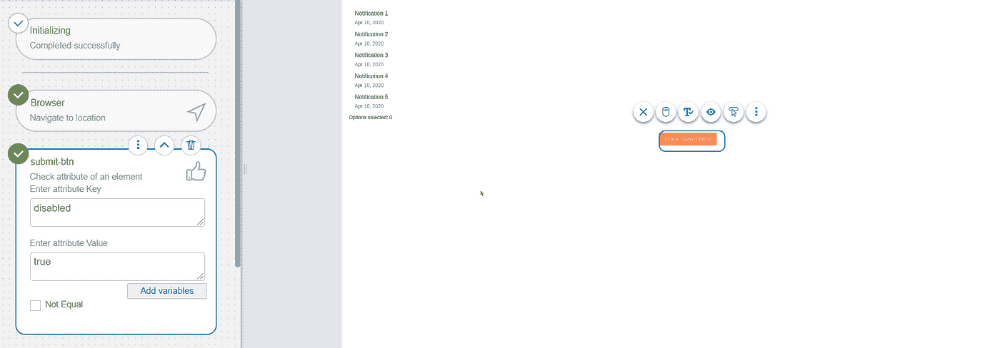
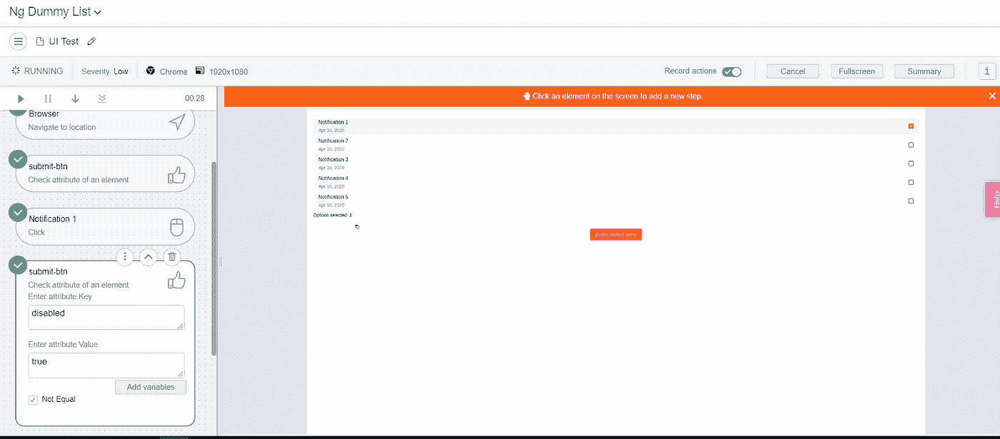
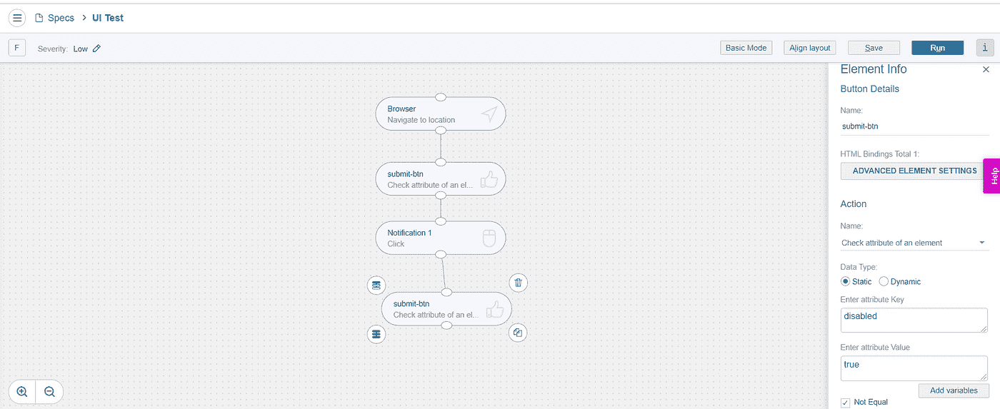

# 关于 UI 测试你需要知道的

> 原文：<https://levelup.gitconnected.com/ui-testing-edad91555577>


我们都很清楚软件测试的重要性。在我们的[开发周期](https://en.wikipedia.org/wiki/Systems_development_life_cycle)中，我们主要包括单元测试和集成测试，尤其是后端代码。

但是正如在开发人员中看到的，有时测试应用程序的前端代码被留下，特别是 [UI 测试](https://www.testcraft.io/ui-testing/)。

我并不是说这种测试比其他测试重要得多。UI 测试不会取代单元测试或集成测试，但实际上，它只是完成了它们。

毕竟，用户为了使用软件所看到和经历的是一个图形界面。

# 为什么我们没有看到更多的用户界面测试呢？

UI 测试不经常被开发人员使用，也不是很受欢迎。

**这里有一些常见的问题:**

*   UI 测试可能很难设置，而且要花很多时间
*   在界面上，事情可以很快改变，从而使测试套件的更新过程变得很痛苦
*   维护这些测试也是具有挑战性的，因为它们在多次迭代后变得难以理解。最重要的是，大多数时候你的 UI 工作得很好，但是你错误的测试会因为抛出错误的警报而失败

即便如此，有时只要用户界面上出现一个错误，比如注册按钮消失或者根本看不见，用户就会离开网站。


# 如何让 UI 测试不那么痛苦？

在我们开始写一些代码之前，我们应该澄清一个误解，UI 测试和前端应用程序上的 [E2E](https://itnext.io/end-to-end-testing-78033fb768a8) 之间的误解。

**在一个有待办事项列表的简单例子中:**

*   UI 测试应验证每个待办事项是否可见，包括**完成**或**删除**按钮(如果应用程序需要)
*   E2E 测试应该验证通过点击这些按钮，具体的行动发生

你可以在栈溢出的这篇[文章中读到更多。](https://stackoverflow.com/questions/57198214/whats-the-difference-between-a-ui-test-and-an-e2e-test-and-whats-the-benefits)

***作为个人注:***

*最后，编码* *既是客观的，也是主观的，如果对于你的情况，你认为在一个测试套件中结合这两种类型更好，因为它们之间有一定的重叠，那么就去做吧，e* 即使它不是强烈推荐的。

作为我们问题的解决方案，我们将会看到两种不同的工具:代码库工具和无代码库工具。

# 一.守则

演示应用程序:

我们的演示应用程序是一个由一个页面组成的类似 ToDo 的应用程序。操作非常简单，你点击一些复选框，然后你就可以删除选中的项目。



# 先决条件和常见问题及解决方案

对于 UI 测试，我们将使用在任何 Angular CLI 项目中默认配置的量角器。

如果你想要更实际的方法，你可以从这个库下载[代码。](https://github.com/GeoPablo/dummy-ng-list)

1.  安装模块

```
$ npm install
```

量角器是一个基于硒的解决方案，在设置运行测试时有一些常见的问题。

首先进入您的项目结构并运行以下命令

```
npm run e2e
```

如果这个命令没有抛出任何错误，这意味着一切都在幕后工作，不需要进一步的设置。

如果您收到类似这样的错误:


然后你能做什么来更新 web 驱动程序，如下所示:

1.  全局安装量角器

```
npm install protractor -g
```

2.在项目文件夹中运行以下命令:

```
webdriver-manager update
```

再次重新运行该命令

```
npm run e2e
```

如果这仍然不起作用，那么检查这个 GitHub 问题，并转到 2019 年 9 月 28 日发布的答案。本质上，你需要做的就是更新 chrome 驱动。

# 我们的第一个测试套件

我们将在测试应用程序中涵盖这些测试用例:

1.  该按钮最初是禁用的。
2.  如果选择了一个项目，则该按钮变为启用状态

**量角器**测试在被分组为套件的规范中描述。最常用的描述框架是 Jasmine。你可以在他们的网站上了解更多关于[茉莉的信息。](https://jasmine.github.io/)

如果您从存储库中下载了代码，测试应该已经在 **e2e** 文件夹中了。

如果你愿意，你可以删除这个文件，自己写代码。

*注意，文件名必须以****. e2e-spec . ts****结尾，如****protector . conf . ts .***中所指定

接下来，在新文件中添加以下代码:

```
describe("Notification List", () => {it("The button should be  initially disabled", () => {});it("If an item is selected then the button should become enabled", () => {});});
```

*形容(..)* block 用于将一组规格分组到套件中。我们将在这个函数中编写页面规范。为了描述规格，我们将使用 *it(…)* 块。

现在让我们试着运行我们的测试套件。

在项目文件夹中运行以下命令:

```
npm run e2e
```

这个命令翻译成 **ng e2e** ，它将构建应用程序的最新版本，在*本地主机*上服务应用程序，并针对它运行我们的测试套件。

输出应该如下所示:

```
Notification List√ The button should be  initially disabled√ If an item is selected then the button should become enabledExecuted 2 of 2 specs SUCCESS in 0.062 sec.[15:32:24] I/launcher - 0 instance(s) of WebDriver still running[15:32:24] I/launcher - chrome #01 passed
```

所有规范都通过了，因为我们还没有提供任何逻辑。让我们首先声明一个全局的 *beforeEach(…)* 钩子，并在我们的套件中的每个测试之前导航到/ URL。

```
import { browser } from "protractor";describe("Notification List", () => {beforeEach(() => {browser.get("/");});it("The button should be initially disabled", () => {});it("If an item is selected then the button should become enabled", () => {});});
```

为了编写我们的规范，我们首先需要定位页面上的元素。我们将在一个名为[页面对象](https://github.com/SeleniumHQ/selenium/wiki/PageObjects)的类中封装元素的定位器。

用下面的代码创建一个新的文件名 **notification.po.ts** :

```
import { element, by } from "protractor";export class NotificationPage {get submitBtn() {return element(by.className("delete-btn"));}get matListOptions() {return element.all(by.tagName("mat-list-option"));}}
```

我们将使用这个类来获取*提交按钮*和*我们拥有的所有列表选项*。对于提交按钮，我们可以使用它的**类**来选择它，对于列表选项，我们可以使用**标签**值。

接下来，让我们完成代码:

```
describe("Notification List", () => {let page: NotificationPage;beforeEach(() => {page = new NotificationPage();browser.get("/");});it("The button should be initially disabled", () => {expect(page.submitBtn.isEnabled()).toBeFalsy();});it("If an item is selected then the button should become enabled", () => {page.matListOptions.first().click();expect(page.submitBtn.isEnabled()).toBeTruthy();});});
```

再次运行该命令以运行测试。

```
npm run e2e
```

# 快速提示

如果您需要在 Docker 容器中运行您的测试，或者如果您想要运行 [headless](https://en.wikipedia.org/wiki/Headless_computer) ，那么您可以通过使用如下的 **chromeOptions** 对象更新**量角器. conf.js** 文件来扩展**量角器**的设置:

```
capabilities: {browserName: "chrome",chromeOptions: {binary: process.env.CHROME_BIN,args: ["--no-sandbox", "--headless"],},},
```

# 二。无代码解决方案

正如我们前面所说的，UI 测试可能是一件痛苦的事，这是有充分理由的，现在你已经在问自己是否有更好的解决方案。

答案是肯定的，有一些其他的工具可以改进测试过程。

其中之一是 TestCraft，这是一个构建在 Selenium 之上的无代码自动化测试工具，并在人工智能的帮助下得到增强。

出于演示的目的，我将使用应用程序的[托管版本，尽管我们可以通过创建一个简单的到本地主机的隧道或 VPN 隧道，将它配置为直接在我们的机器上运行测试。](https://dummy-ng-list.herokuapp.com/)



并运行由平台自动创建的测试。



TestCraft 是为技术人员和非技术人员设计的，测试过程就像拖放一样简单。

我们的第一个测试是查看当页面第一次加载时提交按钮是否被禁用。为此，我需要做的就是点击按钮，然后选择我想要的动作。



因为它被赋予了人工智能，所以它可以记录动作来判断哪个项目被选中了。

我所要做的就是点击我的通知列表中的 a 复选框，然后添加相同的验证以提交-btn，但这次要查看它是否已启用。



如果我想要更高级的方法，我可以通过点击**完成按钮**并转到画布来移除断点。



# 结论

UI 测试比其他类型的测试更具挑战性，但是你应该选择你喜欢的解决方案并开始测试。请记住，由于分辨率太小或您忘记将其设置为启用，按钮不会显示在您的视口中这一常见问题可能会导致严重的用户体验损失。