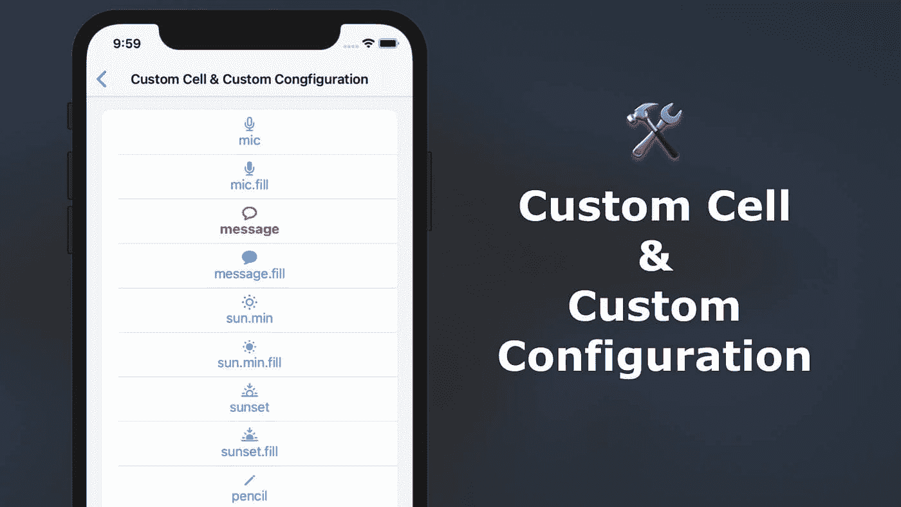
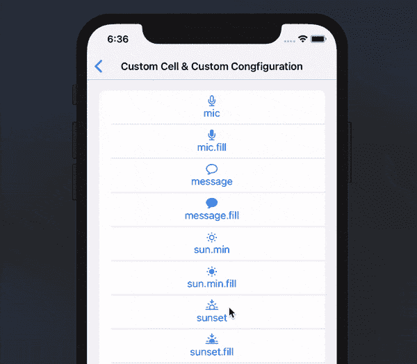
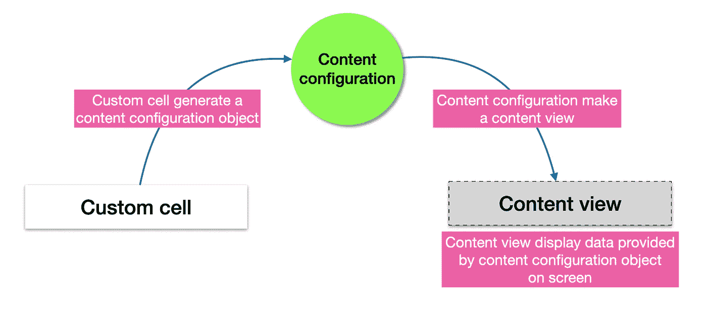
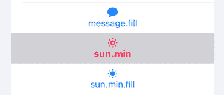

# 具有自定义单元格和自定义配置的 UICollectionView 列表

> 原文：<https://levelup.gitconnected.com/uicollectionview-list-with-custom-cell-and-custom-configuration-36e85fa43e64>

## 根据您的需要自定义 UICollectionViewListCell。

*本文原载于 2020 年 8 月 9 日*[*https://swiftsenpai.com*](https://swiftsenpai.com/development/uicollectionview-list-custom-cell/)*。*

在 iOS14 中，苹果在`UICollectionView`中引入了列表布局，允许开发人员使用`[UICollectionViewListCell](https://developer.apple.com/documentation/uikit/uicollectionviewlistcell)`轻松创建列表——这是 iOS14 附带的一个集合视图单元格，提供列表功能和默认样式。

尽管`UICollectionViewListCell`是高度可定制的，但仍有一些情况下我们可能需要创建自己的定制单元来满足我们应用程序的需求。

在本文中，让我们看看如何创建一个定制单元格，并使用它和定制内容配置一起在`UICollectionView`中构建一个列表。

这是我上一篇文章[在 Swift 中用 UICollectionView 构建列表](https://swiftsenpai.com/development/uicollectionview-list-basic/)的延续。因此，如果您不熟悉使用集合视图构建列表，我强烈建议您在继续之前查看一下。

# 示例应用程序

下面的动画 GIF 展示了我们在本文中试图构建的内容。

我们将要构建的示例应用程序

如您所见，列表中所有单元格的布局都不同于通常的图文并茂的布局。相反，它们都有自定义的自顶向下的图文布局。

此外，自定义单元格的外观将根据单元格的状态而变化。当单元格被选中时，其文本将变为红色，文本的粗细将变为`heavy`。符号也是如此。

# 这个概念

在我们开始实现自定义单元格之前，我们必须先了解什么是**内容配置**、**内容视图**，以及**自定义单元格**、**内容配置**和**内容视图**之间的关系。

一个**内容视图**是一个符合`[UIContentView](https://developer.apple.com/documentation/uikit/uicontentview?language=obj_7)`协议的`UIView`子类。它定义了**自定义单元格**的布局和外观。它还负责根据提供的**内容配置**显示正确的数据和外观。

一个**内容配置**将是**内容视图**的视图模型，它符合`[UIContentConfiguration](https://developer.apple.com/documentation/uikit/uicontentconfiguration)`协议。除此之外，它还负责为**自定义单元格**生成一个**内容视图**实例。因此，你可以把它当作一座桥梁，把**内容视图**和**自定义单元格**联系起来。

`UICollectionView`列表的**自定义单元格**是`[UICollectionViewListCell](https://developer.apple.com/documentation/uikit/uicollectionviewlistcell)`的子类。它只有一个任务——根据状态(选中、高亮、禁用等)生成一个正确配置的**内容配置**对象。)然后将该配置分配给它自己。

总而言之，**定制单元**将创建一个**内容配置**对象并将其分配给自己。**内容配置**对象随后将为**自定义单元格**生成一个**内容视图**,**内容视图**将显示**内容配置**对象提供的数据。

自定义单元格概念概述

如果所有这些对您来说听起来有点混乱，请不要担心，我相信一旦我们开始研究样本代码，事情就会变得清晰起来。

# 数据项类型

对于示例应用程序，我们将重用我的[上一篇文章](https://swiftsenpai.com/development/uicollectionview-list-basic/) — `SFSymbolItem`的数据项类型。简单回顾一下，`SFSymbolItem`的定义如下。

# 定义自定义内容配置和内容视图

让我们通过定义定制内容配置和内容视图来开始构建我们的列表。

我们将调用我们的定制内容配置`SFSymbolContentConfiguration`，并确保它符合`UIContentConfiguration`和`Hashable`协议。

接下来，创建一个名为`SFSymbolVerticalContentView`的`UIView`子类，并使其符合`UIContentView`协议。这将是我们的自定义单元格的内容视图。

# 自定义内容配置实现

有了`SFSymbolVerticalContentView`类定义，我们现在准备实现`SFSymbolContentConfiguration`。

正如我之前提到的，内容配置将充当内容视图的视图模型。因此，让我们从定义内容视图将使用的所有属性开始。

之后，我们将通过实现`UIContentConfiguration`协议的方法需求来遵循它:

由`makeContentView()`方法即时返回的内容视图将被用作自定义单元格的内容视图。因此，它的实现非常简单，我们只需要返回一个`SFSymbolVerticalContentView`的实例。

第二个方法需求— `updated(for:)`负责为所有与单元格数据项不相关的内容配置属性提供正确的值。

此外，该值将根据给定的状态进行分配。对于我们的例子，我们只关心`isSelected`状态和`isSelected`以外的状态。下面是该方法的实现。

至此，我们已经为自定义单元实现了自定义内容配置。

# 自定义内容视图实现

在本节中，让我们实现我们不久前定义的定制内容视图类`SFSymbolVerticalContentView`。

让我们从定义所需的 UI 元素开始实现。对于自定义单元格，我们需要一个`UILable`来显示`SFSymbol`名称，一个`UIImageView`来显示符号图像。

之后就是符合`UIContentView`协议的时候了。通过查看[文件](https://developer.apple.com/documentation/uikit/uicontentview)，只有一个财产要求需要满足:

下面是我们如何让`SFSymbolVerticalContentView`满足需求:

在上面的代码中，我们定义了一个类型为`SFSymbolContentConfiguration`的名为`currentConfiguration`的变量来存储分配给内容视图的内容配置。

之后，我们通过将`configuration`定义为计算属性来满足`UIContentView`协议的要求，并使用它来检索和设置`currentConfiguration`的值。

请注意，`apply(configuration:)`是一个私有函数，负责设置`currentConfiguration`的值，并将所有的`currentConfiguration`属性应用到内容视图。我们一会儿将实现这个函数。

接下来，我们将处理在定义`SFSymbolVerticalContentView`类时创建的自定义初始化器`init(configuration:)`。

我们将在初始化过程中执行 2 项任务—设置内容视图 UI，并将给定的内容配置应用到内容视图。

这里是`setupAllViews()`和`apply(configuration:)`的实现。

这两个函数的实现都是不言自明的。`setupAllViews()`功能使用自动布局将包含`UILabel`和`UIImageView`的`UIStackView`添加到内容视图中。另一方面，`apply(configuration:)`函数将所有给定的内容配置属性应用于内容视图的 UI 元素。

> ***注:***
> 
> 如果你想学习如何使用界面构建器设计一个定制的`UICollectionViewListCell`,看看这篇文章。

# 自定义单元格实现

难题的最后一部分是定义一个自定义单元格，它是`UICollectionViewListCell`的子类，这样我们就可以在`UICollectionView`中显示内容视图。

我们将使用自定义单元格来跟踪当前显示的数据项(`SFSymbolItem`)。因此，让我们创建一个名为`SFSymbolVerticalListCell`的定制单元格类，它的属性名为`item`，类型为`SFSymbolItem`。

在 iOS14 之前，`UICollectionView`自定义单元格将需要负责布局单元格 UI、定义单元格外观和显示单元格数据。在 iOS14 中，我们将所有这些任务都转移到了内容配置和内容视图中。

因此，只剩下一项任务需要由我们的定制单元来处理——根据单元的当前状态和数据项为自己分配一个内容配置对象。

这可以通过覆盖`UICollectionViewListCell`的`updateConfiguration(using:)`方法轻松实现。每当单元格的状态发生变化时，都会触发此方法。

上面的代码非常简单，我们基于单元格的当前状态生成一个新的内容配置对象，为该对象设置名称和图像，并将其分配给单元格。

就是这样！我们已经完成了自定义单元格的实现。

# 设置集合视图

所有 3 个主要组件(定制单元、内容视图和内容配置)就绪后，我们现在可以把所有组件放在一起看它们的运行了。

在集合视图中显示定制单元格的方式与我们在集合视图中显示标准`UICollectionViewListCell`的方式非常相似。我不会深入探讨这个问题，因为它已经在我的[上一篇文章](https://swiftsenpai.com/development/uicollectionview-list-basic/)中讨论过了。

但是，有一点要注意，我们必须将`SFSymbolVerticalListCell`注册到集合视图中。最重要的是，在单元格注册处理程序中，我们只需要为单元格设置数据项，并让单元格的`updateConfiguration(using:)`方法负责将内容配置对象分配给单元格。

这里是我们的视图控制器的完整的`viewDidLoad()`方法。

唷…我们写了相当多的代码！让我们构建并运行示例项目来看看实际情况。

# 更改单元格的背景颜色

当您使用示例应用程序时，您应该注意到当单元格被选中时，它的背景会变成灰色。

选定时自定义单元格的背景色

这当然不是我们想要的！当单元格被选中时，我们应该如何改变它的背景颜色？幸运的是，苹果引入了一个新的类`[UIBackgroundConfiguration](https://developer.apple.com/documentation/uikit/uibackgroundconfiguration)`，它的工作方式与`UIContentConfiguration`类似。

记住这一点，让我们回到`SFSymbolVerticalListCell`的`updateConfiguration(using:)`方法，并相应地设置单元格背景配置。

如果您想对`UIBackgroundConfiguration`的行为有更多的控制，您肯定可以创建一个自定义的后台配置类。然而，这将是另一个故事。

# 包扎

使用定制内容配置创建定制`UICollectionViewListCell`在 iOS 开发中是一个相当新的概念，一开始你可能会觉得有点困惑。

总结一下我们在这篇文章中学到的东西:

1.  内容配置将充当内容视图的视图模型。此外，它还负责定义细胞在各种状态下的外观。
2.  内容视图负责定制单元格的 UI。它使用所有的内容配置属性，并将它们设置为各自的 UI 元素。
3.  自定义单元格，负责将所有数据项属性设置为内容配置对象，并将其分配给单元格的`contentConfiguration`属性。

如果您需要任何参考资料，可以从 [Github](https://github.com/LeeKahSeng/SwiftSenpai-UICollectionView-List) 下载完整的示例项目。

在不久的将来，我将尝试介绍一些其他主题，如自定义后台配置、多节列表和可扩展单元格。

如果您想在我发布与这些主题相关的新文章时得到通知，请随时在 [Twitter](https://twitter.com/Lee_Kah_Seng) 或 Medium 上关注我。

感谢阅读。🧑🏻‍💻

# 进一步阅读

*   [在 Swift 中使用 UICollectionView 构建列表](https://swiftsenpai.com/development/uicollectionview-list-basic/)
*   [在界面构建器中设计自定义 UICollectionViewListCell](https://swiftsenpai.com/development/custom-uicollectionviewlistcell-in-ib/)
*   [使用 UICollectionView 构建可扩展列表:第 1 部分](https://swiftsenpai.com/development/collectionview-expandable-list-part1/)
*   [使用 UICollectionView 构建可扩展列表:第 2 部分](https://swiftsenpai.com/development/collectionview-expandable-list-part2/)
*   [重新加载表格和集合视图单元格的现代方法](https://swiftsenpai.com/development/modern-ways-reload-cells/)
*   [声明式 UICollectionView 列表页眉和页脚](https://swiftsenpai.com/development/declarative-list-header-footer/)
*   [带有交互式自定义标题的 UICollectionView 列表](https://swiftsenpai.com/development/list-interactive-custom-header/)

# 相关 WWDC 视频

*   [UICollectionView 中的列表](https://developer.apple.com/videos/play/wwdc2020/10026/)
*   [ui collection view 的进展](https://developer.apple.com/videos/play/wwdc2020/10097/)
*   [现代细胞配置](https://developer.apple.com/videos/play/wwdc2020/10027/)
*   [UI 数据源的进步](https://developer.apple.com/videos/play/wwdc2019/220)