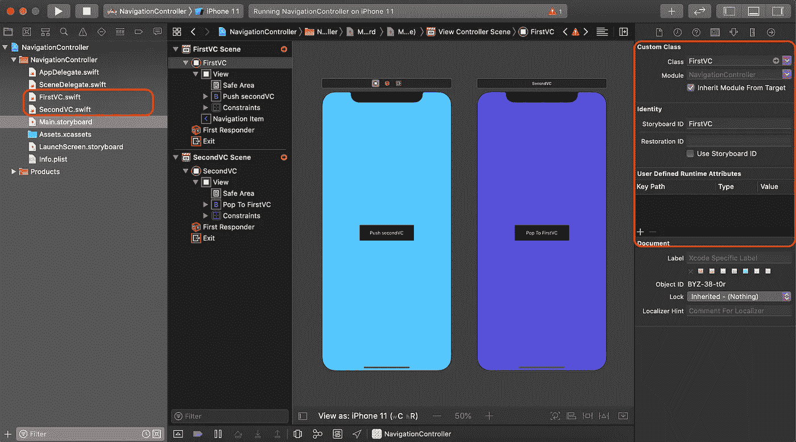
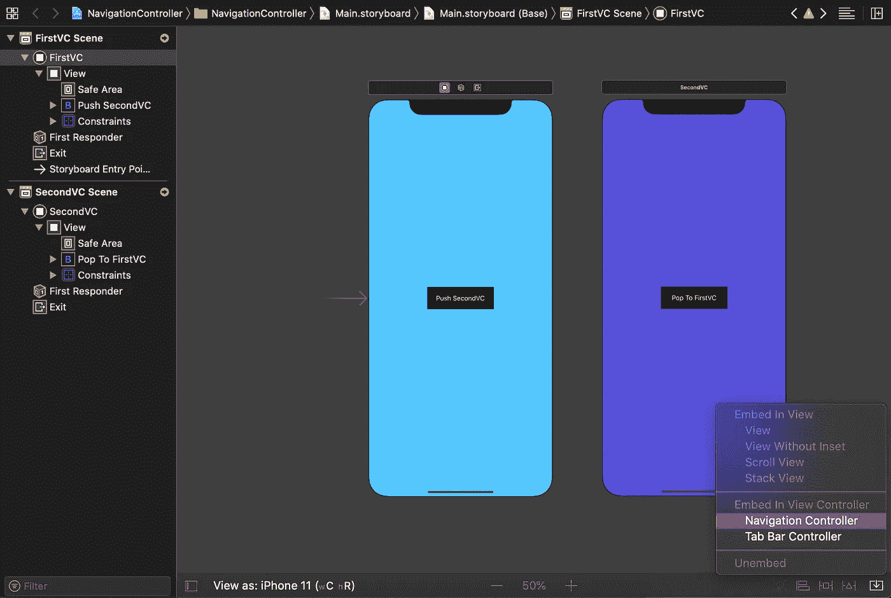
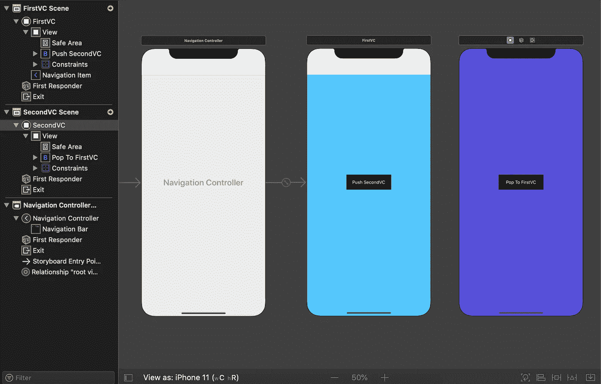

# Swift 中的 UINavigationController 和 UINavigationBar

> 原文：<https://levelup.gitconnected.com/uinavigation-controller-and-uinavigationbar-in-swift-ff3532fd58b6>


斯蒂芬·亨宁通过 [Unsplash](https://unsplash.com/) 拍摄的图片

# 概观

导航控制器是一个容器视图，可以管理分层内容的导航。导航控制器使用导航堆栈管理当前显示屏幕。导航栈可以有“n”个视图控制器。堆栈中最底层视图控制器是根视图控制器，其他是子视图控制器。一次只能看到一个子视图控制器，它是导航层次结构中最顶层的视图控制器。视图控制器可以使用 push 和 pop 操作在堆栈中添加或删除。

在本教程中，我们将学习

1.  如何将视图控制器嵌入到导航控制器中？
2.  推送方式，从导航栈弹出？
3.  如何使用导航栈作为数组？
4.  自定义导航栏？所以让我们开始吧

> 本教程使用 **Swift 5，Xcode 11.2，iOS 13 &故事板界面编写。**

# 1.从导航控制器开始

在 Xcode 中创建单视图应用程序。将两个视图控制器添加到故事板中。为这些视图控制器创建两个不同的 swift 文件，并为它们设置标识符。在每个视图控制器中选择一个按钮，为它们设置约束，并根据需要进行定制。将这些按钮的动作出口添加到相应的视图控制器中。在我的例子中，我将视图控制器命名为“FirstVC”和“SecondVC”，将按钮命名为“Push SecondVC”和“Pop To First”。



现在使用 storyboard 将您的“FirstVC”嵌入到导航控制器中



如果你的故事板文件看起来像这样，你就可以开始了



您还可以在 swift 中以编程方式将您的“FirstVC”嵌入导航控制器。但是在本教程中，我们通过使用故事板来保持简单明了。

## 推入并弹出导航堆栈

我们将看到如何将根视图控制器推入、弹出和弹出到导航栈中

*   ***推到顶端***

当你按下一个视图控制器时，它被放置在导航栈的顶部，并从你按下的位置向上到达视图控制器。也就是说，如果您从“FirstVC”按下*“*SecondVC”，则“second VC”将会放置到“FirstVC”上。如果你按回“第二个 VC”，它会将你重定向到“第一个 VC”。

在我们的例子中，这个推送操作是通过将“Push SecondVC”按钮按入“FirstVC”来完成的。

```
let storyboard = UIStoryboard(name: "Main", bundle: nil)let vc = storyboard.instantiateViewController(identifier: "SecondVC")self.navigationController?.pushViewController(vc, animated: true)
```

*   ***从顶部弹出***

现在，如果我们想从导航栈中移除最顶层的视图控制器，那么我们必须弹出那个视图控制器。在我们的例子中,“SecondVC”是最顶层的视图控制器，如果我们想把它从导航堆栈中移除，那么我们将在“popToFirstVC”按钮动作中编写这段代码

```
self.navigationController?.popViewController(animated: true)
```

*   ***弹出到根视图控制器***

我们可以将“n”个视图控制器放入导航栈。有时我们必须从任何一个视图控制器转到根视图控制器，然后我们可以使用这个代码块来执行它。

```
navigationController?.popToRootViewController(animated: true)
```

可以通过替换“SecondVC”中“popToFirstVC”按钮动作中的代码来检查。

## 作为数组的导航堆栈

在导航控制器中，子视图控制器存储为顺序数组。我们也可以从该阵列访问视图控制器。现在我们将看到这个数组的不同用途。

*   ***从数组中移除视图控制器***

我们可以从导航堆栈阵列的不同位置移除视图控制器。首先，我们将获得所有可用的视图控制器，然后我们将执行删除操作

```
var navVCArray = self.navigationController?.viewControllers
navVCArray?.removeLast() //Remove the last view controller
navVCArray?.removeFirst() // Remove the first view controller
navVCArray?.removeAll() //Remove all view controllers
navVCArray?.remove(at: 0) //Remove at specific position
```

*   ***推视图控制器***

像移除视图控制器一样，我们也可以使用 **append()** 将新的视图控制器推入导航堆栈。假设我们想删除最后一个视图控制器，并在堆栈中添加一个新的视图控制器，那么我们会这样做

```
var navVCArray = self.navigationController?.viewControllers
navVCArray?.removeLast()let storyboard = UIStoryboard(name: "Main", bundle: nil)
let vc = storyboard.instantiateViewController(identifier: "SecondVC")
navVCArray?.append(vc)
```

# 2.自定义导航栏

当我们将一个视图控制器从故事板嵌入到导航控制器中或者按下一个视图控制器时，一个白色区域会出现在视图控制器的顶部。那是导航栏。我们可以添加标题，工具栏按钮，并对其进行大量的定制。

*   更改“barTintColor”、“TintColor”

```
self.navigationController?.navigationBar.isTranslucent = falseself.navigationController?.navigationBar.barTintColor = .cyanself.navigationController?.navigationBar.tintColor = .brown
```

*   设置 setBackgroundImage，shadowImage

```
navigationController?.navigationBar.setBackgroundImage(UIImage(named: "Banner2"), for: .default)navigationController?.navigationBar.shadowImage = UIImage(named: "Banner")
```

*   设置标题和自定义标题颜色

```
self.navigationItem.title = "First VC"let textAttributes = [NSAttributedString.Key.foregroundColor:UIColor.red]navigationController?.navigationBar.titleTextAttributes = textAttributes
```

*   将图像设置为导航栏标题

```
**let** logo = UIImage(named: "edit")**let** imageView = UIImageView(image:logo)**self**.navigationItem.titleView = imageView
```

*   清除你的导航栏背景

```
self.navigationBar.setBackgroundImage(UIImage(), for: UIBarMetrics.default)self.navigationBar.shadowImage = UIImage()self.navigationBar.isTranslucent = trueself.view.backgroundColor = UIColor.clear
```

*   移除您的导航栏边框

```
self.navigationBar.setBackgroundImage(UIImage(), for:.default)self.navigationBar.shadowImage = UIImage()self.navigationBar.layoutIfNeeded()
```

*   自定义后退按钮。去掉后退按钮的标题，设置颜色。

```
navigationItem.backBarButtonItem = UIBarButtonItem(title: "", style: .plain, target: nil, action: nil)navigationItem.backBarButtonItem?.tintColor = UIColor.cgLightBlue
```

*   添加一个工具栏按钮项目:我们可以使用系统图标、文本或自定义图像添加 leftBarButtonItem & rightBarButtonItem。使用 barButtonSystemItem add 添加 leftBarButtonItem

```
navigationItem.leftBarButtonItem = UIBarButtonItem(barButtonSystemItem: .add, target: self, action: #selector(addTapped))
```

*   添加带有“添加”标题的 rightBarButtonItem

```
navigationItem.rightBarButtonItem = UIBarButtonItem(title: "Add", style: .plain, target: self, action: #selector(addTapped))
```

*   用自己的定制创建一个栏按钮

```
let playButton = UIButton(type: .custom)playButton.setImage(UIImage(named: "plus"), for: .normal)playButton.addTarget**(**self, action: #selector(playTapped), for: .touchUpInside)playButton.frame = CGRect(x: 0, y: 0, width: 10, height: 10)let barButton = UIBarButtonItem(customView: playButton)
```

*   添加多个 rightBarButtonItem

```
let add = UIBarButtonItem(barButtonSystemItem: .camera, target: self, action: #selector(addTapped))let playButton = UIButton(type: .custom)playButton.setImage(UIImage(named: "plus"), for: .normal)playButton.addTarget(self, action: #selector(playTapped), for: .touchUpInside)playButton.frame = CGRect(x: 0, y: 0, width: 10, height: 10)let barButton = UIBarButtonItem(customView: playButton)navigationItem.rightBarButtonItems = [add, barButton]
```

今天到此为止。请查看苹果文档中的 [UINavigationController](https://developer.apple.com/documentation/uikit/uinavigationcontroller) 和[导航条](https://developer.apple.com/documentation/uikit/uinavigationbar)来用它们做很多黑客攻击。

**如果你觉得这篇文章有用，请分享并鼓掌**👏👏👏
查看我在[媒体](https://medium.com/@arifulislam14)上的其他文章，并在 [LinkedIn](https://www.linkedin.com/in/arifparvez14/) 上联系我。

感谢您阅读&快乐编码🙂