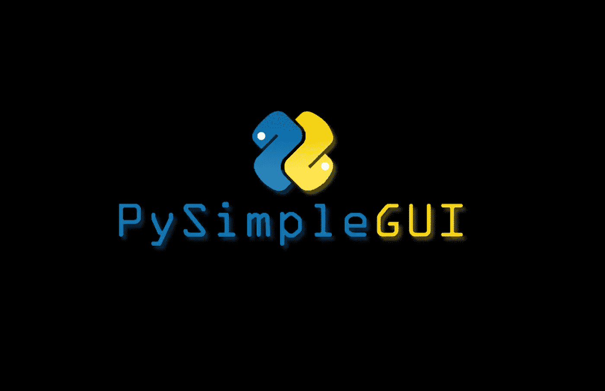
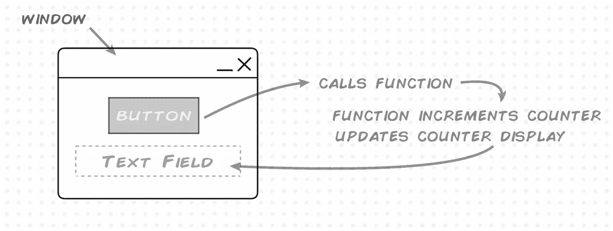
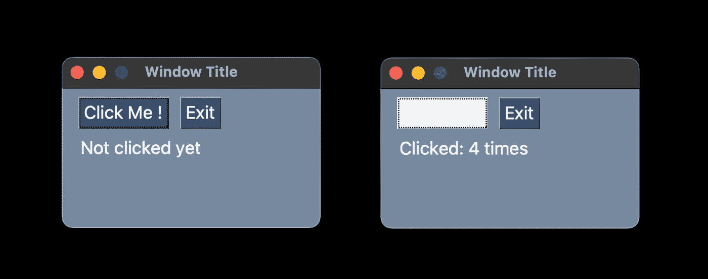
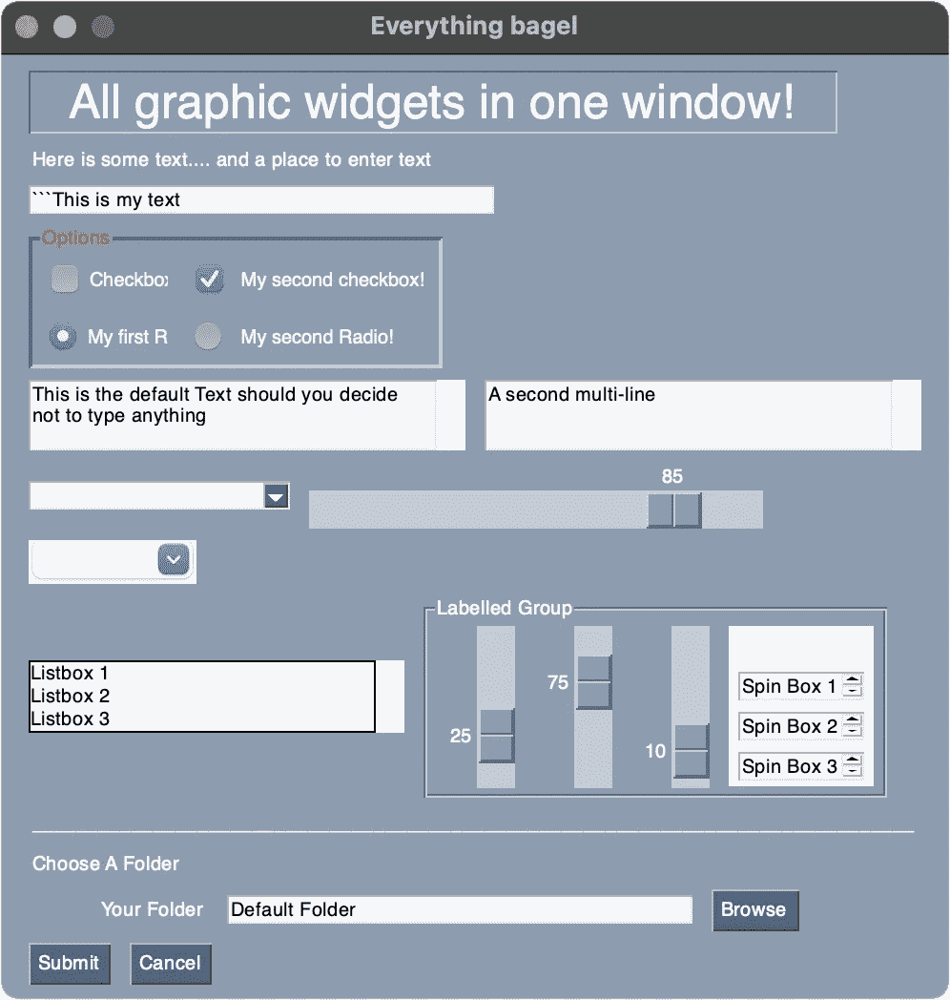
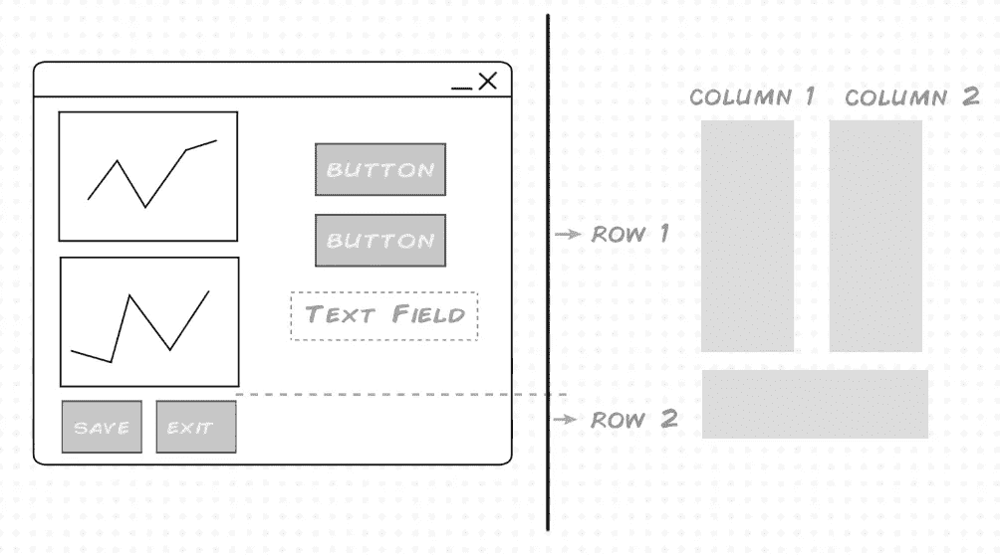
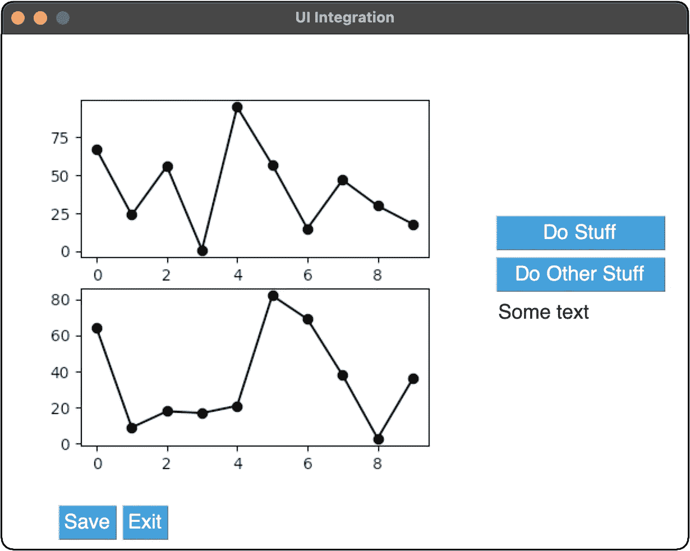
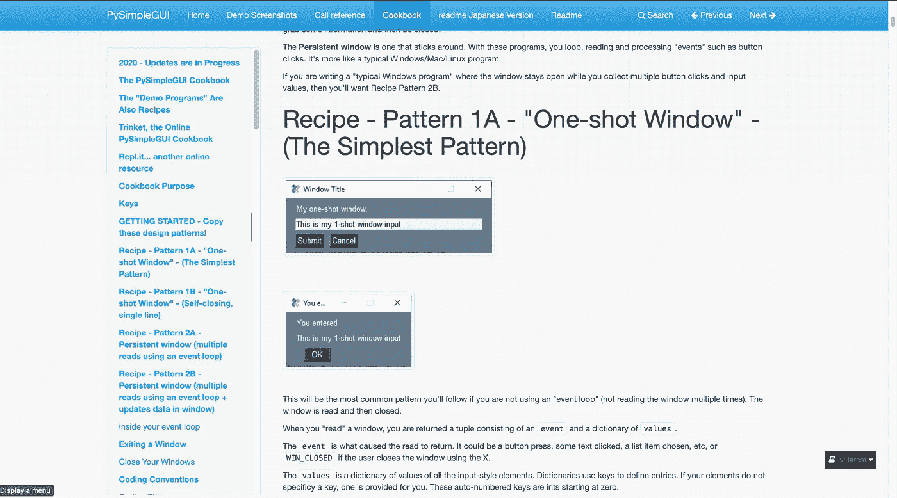

# Python 中的 UI 和 PySimpleGUI

> 原文：<https://levelup.gitconnected.com/uis-in-python-with-pysimplegui-e5cd8ea275e8>



## 是这个吗？

像许多其他开发人员一样，我一直在为我的项目寻找一个 Python UI 解决方案，但我还没有找到一个完美的。在这种情况下，我一直想尝试一下[**【PySimplegui】**](https://pysimplegui.readthedocs.io/en/latest/)，所以这将是一个简单的概述，包含一些初学者代码和一个更现实的项目。

## 高级 Hello world

这些年来我已经尝试了很多 UI 库，所以我通常从一个简单的程序开始来感受 API，这个脚本是一个简单的点击计数器，它是更高级程序的基础和框架。实际上，您希望创建一个窗口，添加一个按钮，并让该按钮调用一个函数来增加一个计数器，这个计数器在 UI 中显示并更新:



```
I cobbled the above from reading [**the documentation**](https://pysimplegui.readthedocs.io/en/latest/) and a couple of SO questions, more thoughts on the documentation later. Something very cool that PySimpleGUI does is provide pre-coded buttons for common tasks ( *in this case the exit button and event* ), read more here: [**Button Element shortcuts**](https://pysimplegui.readthedocs.io/en/latest/#button-element)**.**
```

您应该得到:



我的 mac 上的悬停状态有点不稳定，不知道是什么问题，但你可能会覆盖主题。

## 外观和感觉

开箱即用，PySimpleGUI 有一个块状的 90 年代的外观，你可能喜欢也可能不喜欢，但所有基本的小部件和控件都在那里。这是其中的一个例子，查看代码的链接:`[**Nearly All Elements with Color Theme, Menus, (The Everything Bagel)**](https://pysimplegui.readthedocs.io/en/latest/cookbook/#recipe-nearly-all-elements-with-color-theme-menus-the-everything-bagel)`



改变颜色主题以及字体和元素大小是非常简单的。我只是希望默认的元素/部件有一个更现代的外观(*像 JS land* 中的 Bootstrap 或 Material Design)。制作你自己的自定义元素，比如一个旋钮，也许是可能的，但是现在还不清楚怎么做，但是从好的方面来说，你可以添加你自己的按钮图形，制作你自己的主题。

```
To be fair GUI's in python suffer from not being able to separate presentation and logic/data due to the language nature, if you are coming from Javascript, Python would need a browser and CSS, KIVY ( *another python GUI* ) tries to do just this but at the cost of added complexity, and PyQt/PySide (the pro choice in GUIs) provides a more polished look and deeper control, but you guessed it it's more complex and has it's own set of quirks, PySimpleGUI seems like a good middle ground.
```

## 布局和集成

python 中 GUI 的一个非常常见的用途是来自外部库的图表和其他元素的有序平铺，这为测试 PySimpleGUI 的集成和布局能力提供了一个很好的机会。这里的规范是从 [*matplotlib*](https://matplotlib.org) *，*几个按钮和一个文本框得到几个堆叠的图…



```
PySimpleGUI docs mention this, but it bears repeating. When you are doing GUIs for python or other languages, you usually start with a sketch, and once you know your GUI's API, you can be more specific, in this case we can at least organize the UI spec (*left* ) into 2 columns and rows we will need to add to our window via the layout ( *right* )...
```

应该给你:



您仍然需要像第一个例子一样将按钮/文本连接到函数和事件。

像其他网格系统一样，您需要熟悉语法。PySimpleGui 混合使用行`[[row][row]]`和`column`来放置元素以及一些对齐选项。至于集成，我还没有全部尝试过，但似乎每个案例都有其特定之处。参考文档中大量的例子，看看你的例子是否已经存在，否则你就有一个通用的画布和事件循环。对于更复杂的集成，您可以使用线程和其他方法。

## 证明文件

按内容分类的文档是一流的。您可以浏览或深入任何一个主题，丰富的代码示例涵盖了许多情况。不幸的是，由于它是如何组织的(T2 可以使用分页，只要坚持下去，它会变得更好)，所以有点难读。



这里的问题是，每次你需要查阅文件时，你都需要加载一个大的页面，然后一卷一卷地滚动，这并不好玩。

## 最终想法和建议

我喜欢第一次使用 PySimpleGui，并打算用它来构建我下一个项目的原型。当我需要快速交付一些东西或进行实验，并且只需要一个功能性的 GUI 时，我也可以看到自己在使用它，这可能涵盖了我每天 80%的时间。我发现了你可能希望考虑的 3 个主要缺点:GUI 风格、文档和代码复杂性(*特别是对于复杂的集成*)，但这些对你来说可能不是问题。

```
**Couple of Alternatives:** 
[**KIVY:**](https://kivy.org/#home)If you need to target mobile, cross platform and want a modern looking GUI (*very opinionated*), docs are great but the learning curve is steep, very steep. Read my take here:[https://k3no.medium.com/kivy-menagerie-af6a53e74695](https://k3no.medium.com/kivy-menagerie-af6a53e74695)**PyQT/PySides:** Super polished look at the cost of a steep learning curve and complexity, some license issues, considered the Industry standard, not beginner friendly. Read my take here:[https://medium.com/swlh/python-gui-with-pyqt-pyside2-5cca38d739fa](https://medium.com/swlh/python-gui-with-pyqt-pyside2-5cca38d739fa)
```

就这样，继续用 Python 制作那个令人敬畏的 GUI。

感谢阅读