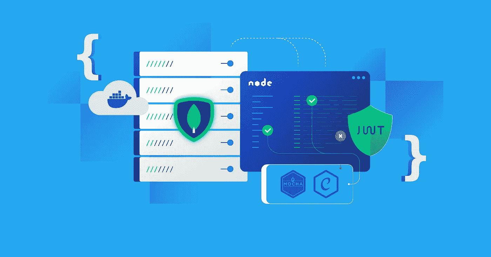
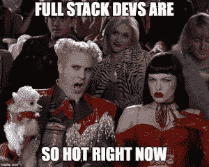

# 掌握后端开发的 10 个终极阶段

> 原文：<https://levelup.gitconnected.com/ultimate-10-stages-to-master-backend-development-f6f65f22a327>

## 完成后端 JS 开发

## 一步一步指导你如何找到一份好的后端开发人员的工作

全栈后端开发

# 背景:

后端开发是指服务器端编程，其中开发人员创建应用程序架构和业务逻辑来处理和存储数据并输出有用的信息。

有多种后端编程语言、框架和栈，如 JavaScript、Python、PHP、Java、Ruby 等，但在本文中，我将只讨论完整的后端 JS 栈。

因此，请按照以下步骤开始您的后端开发之旅:

# 阶段 1:网络基础

学习一些 web 基础知识是每个开发人员的初级阶段。掌握网络概念有助于你更好地理解互联网是如何工作的，使用什么协议，信息是如何传递的等等。

一些基本概念是:

[*什么是 HTTP，通信是怎么做的？*](https://developer.mozilla.org/en-US/docs/Web/HTTP/Overview)

[*HTTP 请求有几种类型，它们的作用是什么？*](https://developer.mozilla.org/en-US/docs/Web/HTTP/Methods)

[*什么是客户端/服务器模式？*](https://intellipaat.com/blog/what-is-client-server-architecture/#no1)

[*什么是 OSI 模型？*](https://www.imperva.com/learn/application-security/osi-model/#:~:text=The%20Open%20Systems%20Interconnection%20(OSI,companies%20in%20the%20early%201980s)

[*DNS 是如何工作的？*](https://www.fortinet.com/resources/cyberglossary/what-is-dns)

再补充一点，了解基本的 **HTML 标签**、 **CSS 样式**和 **DOM 操作:**

## **任务:**

*   使用 HTML 标签创建一个简单的网页
*   添加不同的样式，
*   使用 DOM 改变 HTML 元素的样式

# 第 2 阶段:操作系统知识

操作系统管理计算机上的所有软件和硬件。它执行内存和进程管理，处理输入和输出等。

操作系统运行服务器，服务器进一步运行完整的 web 应用程序。因此，有必要了解操作系统操作，以最大限度地提高性能和优化内存。

在这个阶段，你需要了解 **OS 架构**、**文件系统**、**基础**、 **CLI 命令**、**内存和进程管理**、 **OS 线程**等。

## 任务:

*   打开窗口/ Linux 终端
*   尝试文件/文件夹命令(rm、md、ren、del、copy、move)
*   尝试路径遍历命令(dir，ls，cd)
*   尝试一些网络命令(ipconfig、tracert、arp、netstat、ping)
*   也尝试一些系统和进程命令。

# 阶段 3:运行时

下一步是学习一个后端框架/语言。正如我之前提到的，我在这里讨论 JS stack，所以第一步是学习 **JavaScript** 。学习 JS 的基础知识，如数据类型、循环、选择、函数、对象、类、数组、字符串、正则表达式等。

JavaScript 由三部分组成:

*   ECMAScript —核心 javascript
*   DOM——使用 JS 与文档交互
*   BOM 使用 JS 与浏览器交互

[**ECMAScript**](https://tc39.es/ecma262/) 是 JavaScript 所基于的脚本语言规范。它引入了新的 javascript 特性，如箭头函数、异步等待、模板文字等。也叫**高级 javascript** 。了解一些重要的 JS 特性，这些特性有助于高效编码。

[**Node.js**](https://nodejs.org/en/docs/) 是一个开源、跨平台、后端的 JavaScript 运行时环境，运行在 JavaScript 引擎上，执行 JavaScript 代码。学习一些基本的节点 js 模块像 fs，path，os 等。

## 任务:

*   使用 fs 模块创建、删除和更新文件/文件夹
*   使用路径模块设置静态文件/文件夹的路径。
*   使用 OS 模块获取操作系统的统计信息。
*   尝试异步等待和箭头功能

# 阶段 4(a):服务器框架

后端开发的主要角色是服务器框架。它是前端和后端(节点应用程序)之间的通信网关，集成了数据库。

服务器框架为您提供对**传入和传出请求/响应**的完全控制，提供**端点**，执行**中间件功能**等。

一些著名的服务器框架有 [**Express JS(推荐)**](https://expressjs.com/en/api.html)**Nest JS****Koa JS**。

## 任务:

*   设置基本服务器
*   与**请求&结果**回调进行交互
*   创建中间件功能
*   使用不同的 HTTP 请求(获取、发布、删除、上传/修补)

# 第 4(b)阶段:API 开发

这是一种实践阶段，在这个阶段中，您将学习如何使用 Express JS 和 node JS 创建一个简单的 **REST API** ，并执行 **CRUD 操作**。使用 **express 中间件**验证传入的请求，使用**路由器**处理端点等。

下面是 API 开发的实际实现:

API 开发

Postman 有助于测试 API 端点。添加更多，了解 **swagger** 和 **Open API** 。

## 任务:

*   为 API 创建文件夹结构
*   在单独的文件夹中管理路线和数据。
*   使用中间件来过滤和验证输入数据。
*   对结果使用正确的状态代码和错误消息。

# 阶段 5:模板引擎

通常，**前端** (React app)和**后端** (express app)之间的通信是使用 **MERN** **栈**中的 **API 调用**来完成的。客户端向服务器请求数据，服务器将请求的数据发送回客户端。

但是如果您的项目很小，并且您对 React 或其他前端框架没有很好的了解，请使用模板引擎。

模板引擎帮助你创建**静态 HTML 模板文件**，并在运行时用实际值替换模板文件中的变量，使其成为一个动态网站。模板引擎与 Express JS 的集成一起工作。它从数据库中获取数据值，并在 HTML 模板文件中呈现这些数据值。

一些模板引擎有 [**hbs(推荐)**](https://handlebarsjs.com/)**ejs****pug**等。

## 任务:

*   集成模板引擎和节点 js。
*   在模板引擎中创建一个静态模板。
*   在模板引擎中输出表达式值。
*   在模板引擎中使用 **if/else 并循环**。
*   使用 partial 创建**可重用组件**，如导航栏、页眉、页脚等。

# 第 6 阶段:数据库

数据库在后端开发中的作用最大。它用于以结构化的方式存储数据，以及访问和维护数据。

要了解的一些著名数据库:

*   SQL 数据库: **MYSQL** ， **SQLSERVER** ， **POSTGRESQL**
*   NoSQL 数据库: **MongoDB** ， **Cassandra**
*   缓存的数据库: **Redis**
*   实时数据库: **Firebase**

后端应用程序通过使用第三方 npm 包(如 [MongoDB](https://www.npmjs.com/package/mongodb) 、 [MySQL](https://www.npmjs.com/package/mysql) 等)查询数据库来直接与数据库交互

如果你**不知道 SQL** 或者数据库语言，你需要学习任何 **ORM / ODM** 作为中间件，将对象方法翻译成复杂的数据库查询。它为您提供了一个名为**模型**的完整结构，用于在将数据输入数据库之前验证数据。此外，它在对象模型之上提供了一个额外的安全层。

[**Sequelize**](https://www.npmjs.com/package/sequelize) 是一个著名的 ORM，用于 MySQL、SQL Server、SQLite、PostgresSQL 等 SQL 数据库。

[**mongose**](https://www.npmjs.com/package/mongoose)也是一个很好的 ODM，用于像 MongoDB 等 NoSQL 数据库。

还有一些关于数据库的其他概念需要学习，如 **ACID** 属性、**备份/迁移**技术、应用**规范化**和**索引**、数据**复制**和**分片**等。

## 任务:

*   尝试一些基本的 SQL 查询
*   理解 SQL 和 NoSQL 数据库的区别
*   检查 ORM/ODM 如何使用数据库

# 第 7 阶段:安全

安全性是企业级 web 应用程序的一个大问题。一个漏洞就会导致数据泄漏或应用程序故障。web 应用程序中应该有适当的验证、认证和授权。

提高应用安全性的一些技巧:

*   [JWT](https://www.npmjs.com/package/jsonwebtoken) :使用令牌来防止对受保护资源的不必要的访问。
*   Cookie:用于存储访问网页的信息。
*   会话:用于维护与服务器的安全连接。
*   cors:使用 CORS 从一个网站向另一个网站发出请求
*   [散列](https://www.npmjs.com/package/bcryptjs):使用中间件，使用 salt 散列密码。
*   加密/解密:使用中间件对重要数据进行加密和解密。
*   SSL:使用 SSL 认证来保护交易。
*   [限制](https://www.npmjs.com/package/express-rate-limit):使用中间件应用请求限制，防止 DDOS 攻击。

## 任务:

*   尝试在输入标签中注入一些恶意的 js 脚本。
*   尝试一次发送多个请求。
*   检查 JWT 令牌、cookies、加密和散列是如何工作

# 阶段 8: **消息代理**

现代应用程序很复杂。由于时间复杂性大，CPU 密集型操作、大量数据处理和多个服务之间的 API 通信是一些耗时的问题，会给用户带来不好的体验。Message Broker 是有助于克服这些困难的解决方案之一。

**消息代理**是一种中间件软件，允许服务和应用程序通过使用消息相互通信。

**点对点消息**和**发布/订阅消息**是消息代理的著名模式。

消息代理由 3 个组件组成:

*   **生产者:**生产者就一个话题发送消息。一个或多个出版商可以发布相同的主题。
*   **消费者:**订阅者订阅主题，发布到主题的所有消息都被主题上的所有订阅者接收。
*   **队列/主题:**队列保存由生产者发布并由消费者访问的消息。

**RabbitMQ** 和 **Kafka** 提供了消息代理的实现。

## 任务:

*   使用 Kafka message broker 创建简讯订阅。

# 第 9 阶段:测试

在活动服务器上部署 web 应用程序之前，测试是非常重要的。一个错误的输入或丢失的数据都会导致正在运行的服务器出现故障。

测试可以基于多个标准在多个级别上进行。例如，您可以检查 web 应用程序是否返回正确的状态代码、错误消息、数据等。

[**Jest**](https://jestjs.io/docs/getting-started) 是一个著名的单元**测试框架**用于测试 web 应用和 API。它提供了多种方法来自动化测试过程，检查对错误或缺失数据的响应，等等。

[**Supertest**](https://www.npmjs.com/package/supertest) 用于**API 测试**，集成其他测试库，使用方便。

## 任务:

*   使用 jest 测试一个完整的 API

# 阶段 10:服务器/云部署

应用程序开发的最后阶段是在实时服务器/云上部署 web 应用程序。

在部署 web 应用程序之前，有必要学习版本控制，如 git、Github 和 Github 操作，以使您的部署灵活且可伸缩。

*   [**Git**](https://git-scm.com/)**用于版本控制，创建多个分支，**跟踪源代码的变化**，让多个开发人员协同工作**
*   **[**GitHub**](https://github.com/) 是一个代码**托管平台**用于版本控制和协作。它让你和其他人在任何地方一起工作。**
*   **[**GitHub Actions**](https://docs.github.com/en/actions) 帮助你**自动化你的软件开发工作流程**。单个动作是可重用的代码片段，允许您在 GitHub 上构建、测试、打包或部署项目。它还可以用于自动化工作流程的任何步骤。**

**部署一个完整的 web 应用程序更加复杂。您将需要一个专用服务器来响应它将接收到的 HTTP 请求，并使用一个在线数据库。**

**一些著名的 PaaS 有:**

*   **Heroku :如果你是一个初学者，你的项目很小，你想部署，Heroku 是一个不错的开始。**

**我个人**不推荐 Heroku** ，因为这个云平台有很多问题，比如环境变量、带宽慢等等。**

**相反，使用 **Vercel** 或 **netlify** 对部署的应用程序提供更多的控制和灵活性。**

*   ****AWS、Docker 和 Kubernetes** :如果你正在寻找全栈 web 开发或 DevOps 的职业生涯，现在是熟悉[亚马逊 Web 服务](https://aws.amazon.com/)和/或容器平台如 [Docker](https://www.docker.com/) 和 [Kubernetes](https://kubernetes.io/) 的好时机。**
*   **Azure:如果你是 C#或者。NET 开发者，Azure 似乎是一种无缝的方式来部署你的应用程序，而不必离开微软生态系统的安全。**

## **任务:**

*   **在 Vercel cloud 上部署完整的 API**

****

# **结论:**

**学习的过程永远不会结束。它会一直持续到你活着。这些阶段只是作为初级/中级****后端开发**开始的第一步，还有很多其他的东西要学，这取决于你的项目需求和解决问题的技巧。****

*******不断学习，永远保持激情，探索事物*******