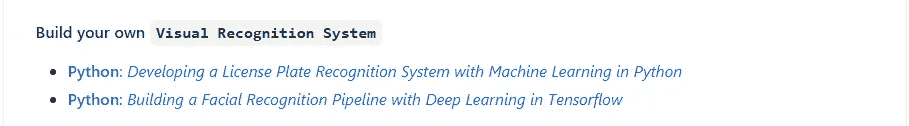

# 终极 GitHub 回购让你的周末精彩

> 原文：<https://levelup.gitconnected.com/ultimate-github-repo-to-make-your-weekend-amazing-a0fb4f4ff9a3>

## 使用 Go 的神经网络，用 Python 构建你的搜索引擎，等等

在 [Unsplash](https://unsplash.com?utm_source=medium&utm_medium=referral) 上由 [Leo Foureaux](https://unsplash.com/@leofoureaux?utm_source=medium&utm_medium=referral) 拍摄的照片

如果你是一个热爱数据科学、自动化、编程的技术发烧友，通常会在周末学习一些很酷的东西。在这种情况下，我有一个终极资源，可以让你的周末愉快。

我开始了解 GitHub repo——它可以成为你更长时间的好朋友。此外，在 GitHub repo 这个地方，你可以找到大量质量更好的项目，对你的职业生涯有所帮助。

这个 GitHub repo 的好处是——它有各种编程语言的可用内容。

而且，这个 GitHub repo 最好的一点是，它帮助我们构建东西。所以，你可以把它加入你的投资组合。而且，这些项目并不像构建乒乓球游戏、计算器或其他基本东西那样简单，但在这里你可以找到各种各样的项目，比如制作你的**搜索引擎**、 **BitTorrent 客户端**、 **Bot** 、**命令行工具、神经网络和其他更酷的东西。**

除了这些——你会发现区块链、人工智能、Docker、物体检测等方面的迷人项目。

[**打造自己的 X**](https://github.com/danistefanovic/build-your-own-x)——这是丹尼尔·斯蒂法诺维奇提供的 GitHub 回购。此外，GitHub repo 是一个教程。回购有 112k 星。

这个回购是开放的贡献。来自不同地方的贡献者在这里贡献他们的东西。所有的项目都是用编程语言隔离的。

如果您是 python 爱好者，您可以转到项目部分，选择带有 python 标题的实现。

假设我想建立一个物体检测系统。我可以转到这个 repo，然后向下滚动到对象检测部分。

作者截图

在这里，我可以根据对象检测来选择项目。只要我单击该链接，就会将我重定向到一个外部站点，其中介绍了对象检测过程。

假设你想从零开始建立一个神经网络。但是，你不了解 python——别担心，这个 GitHub repo 有一个项目涵盖了使用 C#、F#、Go、Java 和 python 从头实现神经网络。

好的一面是所有可用的项目都是可信的来源。因此，你可以找到最好的内容相比，其他网站在互联网上。

# 更好的学习机会

当我们在互联网上搜索任何项目时，我们通常很难找到能够提供项目详细信息的资源。在这种情况下，这个 GitHub repo 可能是一个更好的选择，因为这里所有的提交都经过了数据科学专家的验证。

[JESHOOTS.COM](https://unsplash.com/@jeshoots?utm_source=medium&utm_medium=referral)在 [Unsplash](https://unsplash.com?utm_source=medium&utm_medium=referral) 上拍照

得到质量更好的东西的机会可能很高。将来，如果你将一个项目添加到你的投资组合中，那么深入的项目知识可以在你的面试中帮助你。

# 所有技术爱好者的机会

照片由[丹尼尔·伊德里](https://unsplash.com/@ricaros?utm_source=medium&utm_medium=referral)在 [Unsplash](https://unsplash.com?utm_source=medium&utm_medium=referral) 拍摄

如果你是一个技术发烧友，并且已经做了一些好东西，那么这可能是你的黄金平台。这个 GitHub repo 已经有 112K 的启动——这意味着你可以找到更好的观众来展示你的项目。

以下是我的一些最佳选择:

[https://better programming . pub/10-python-tricks-that-wow-you-de 450921d 96 a](https://betterprogramming.pub/10-python-tricks-that-will-wow-you-de450921d96a)

[https://towards data science . com/7-amazing-python-one-liners-you-must-know-413 AE 021470 f](https://towardsdatascience.com/7-amazing-python-one-liners-you-must-know-413ae021470f)

[https://towards data science . com/5-data-science-projects-the-you-can-complete-over-the-weekend-34445 b 14707d](https://towardsdatascience.com/5-data-science-projects-that-you-can-complete-over-the-weekend-34445b14707d)

觉得这个故事有趣？如果你想问我私人问题，请在 Linkedin 上联系我。如果你想直接通过邮件获得更多关于数据科学和技术的令人兴奋的文章，那么这里有我的免费简讯: [Pranjal 的简讯](https://mailchi.mp/4d33914bb328/pranjals-newsletter)。

如果您正在寻找数据科学职业咨询，那么您可以在这里联系我[。](https://app.ddichat.com/experts/pranjal-saxena/data-science-ai-ml-dl)