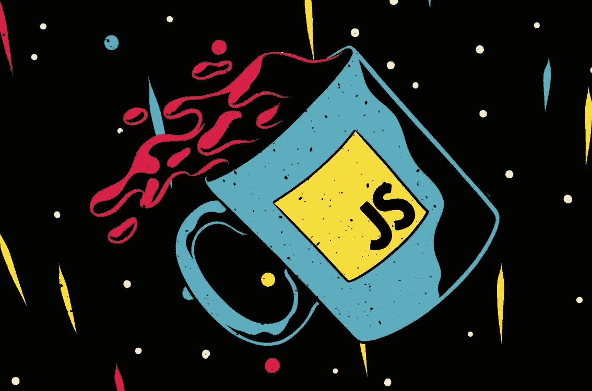
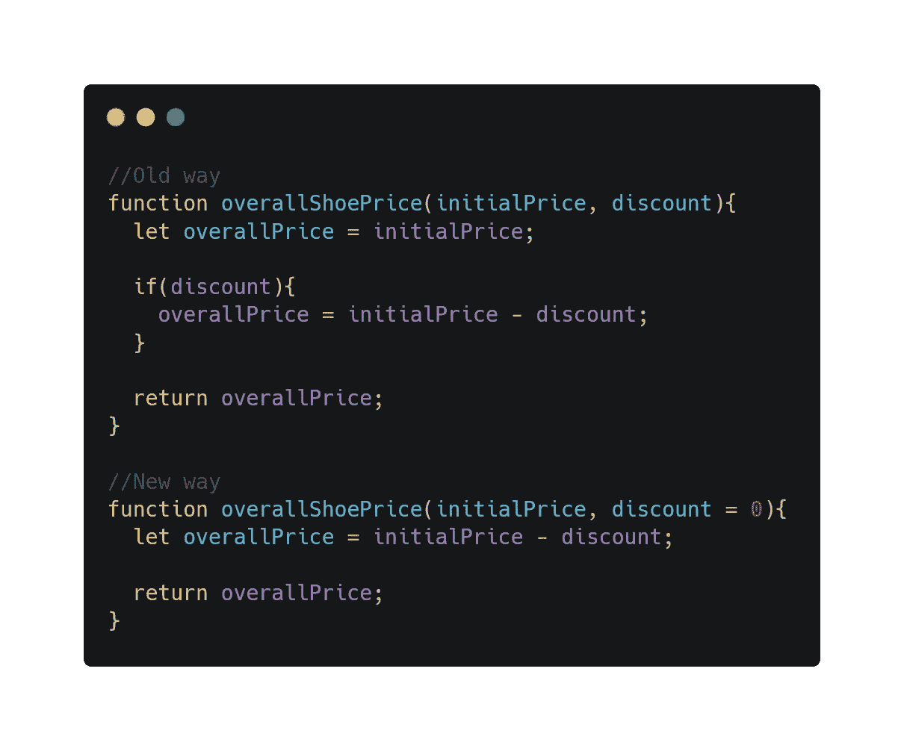
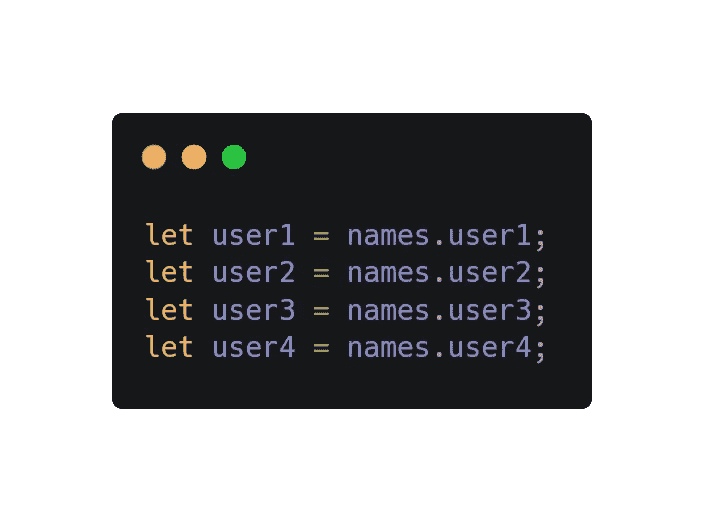

# 您应该知道的技巧、诀窍和 JavaScript 特性的终极指南！

> 原文：<https://levelup.gitconnected.com/ultimate-guide-to-tips-tricks-and-javascript-features-you-should-know-27e0a4a6ffdf>

我的主要编码语言是 JavaScript，我想谈谈 JavaScript 支持的一些非常酷的特性。

# 一点概述

**JavaScript** 通常缩写为 **JS** ，是一种符合 [ECMAScript](https://en.wikipedia.org/wiki/ECMAScript) (最新稳定版 ES2019，预览版 ES2020)规范的[编程语言](https://en.wikipedia.org/wiki/Programming_language)。JavaScript 是高级的，通常是即时编译的，并且是多范例的。它有花括号语法、动态类型、基于原型的面向对象和一流的功能。

与 HTML 和 CSS 一样，JavaScript 是万维网的核心技术之一。JavaScript 支持交互式网页，是 web 应用程序的重要组成部分。绝大多数[网站](https://en.wikipedia.org/wiki/Website)用它来进行[客户端](https://en.wikipedia.org/wiki/Client-side)页面行为，所有主流 web 浏览器都有专门的 [JavaScript 引擎](https://en.wikipedia.org/wiki/JavaScript_engine)来执行。

作为一种多范例语言，JavaScript 支持[事件驱动](https://en.wikipedia.org/wiki/Event-driven_programming)、[功能性](https://en.wikipedia.org/wiki/Functional_programming)和命令式编程风格。它有[应用编程接口](https://en.wikipedia.org/wiki/Application_programming_interface)(API)，用于处理文本、日期、正则表达式、标准[数据结构](https://en.wikipedia.org/wiki/Data_structure)和[文档对象模型](https://en.wikipedia.org/wiki/Document_Object_Model) (DOM)。然而，语言本身不包括任何输入/输出(I/O)，如网络、存储或图形设施。主机环境(通常是 web 浏览器或节点)提供了这些 API。

JavaScript 引擎最初只在 web 浏览器中使用，现在也嵌入到服务器端网站部署和非浏览器应用程序中。

尽管 JavaScript 和 [Java](https://en.wikipedia.org/wiki/Java_(programming_language)) 有相似之处，包括语言名称、语法和各自的标准库，但这两种语言是截然不同的，在设计上有很大的不同。

你可以在维基百科页面上阅读更多关于 [JavaScript](https://en.wikipedia.org/wiki/JavaScript) 的内容。

每年 JavaScript 都向我们展示新的特性和工具，以更轻松地解决不同的问题。所以让我来介绍其中的一些，它们可以帮助你以一种更清晰的方式编写更少的代码。

# 1.Let 和 Const 变量初始值设定项

在 ES6 标准之前，JavaScript 有两种类型的作用域:**函数**作用域和**全局**作用域以及一种称为`var`的变量初始化器。在函数外部声明的变量(全局)具有**全局**作用域，在函数中声明的变量具有**函数**作用域。

我们可以从代码中的任何地方访问全局范围变量，但是我们也可以在声明变量的函数内部访问函数范围变量。

似乎合乎逻辑，是吗？所以我们来看一些例子。

我给这些行标了号，这样更容易浏览

我们可以看到，在上面的例子中，我们从两个作用域开始讨论(第 1 行**全局**作用域和第 5 行**函数**作用域)。第 2 行的 **number** 变量是在全局范围内初始化的，所以我们可以从函数 **twoAdder** (第 7 行)和它的外部(第 10 行)访问它。

但是在第 6 行，我们还有一个变量叫做 **increasedNumber** ，它将一个**数字**值加 2，并保存在其中，而不修改**数字**。因此，我们可以很容易地从第 7 行的 **twoAdder** 函数中访问它，但不能从第 11 行的外部访问它。这是因为在函数(函数作用域)中声明的变量只能从函数内部访问。

这是全局和函数作用域的简单表示。

继续主题，在 ES6 之后还有另一个作用域叫做**块**作用域。

块作用域是在{花括号}中的作用域，在该作用域中初始化的变量只能从该作用域中访问。这个范围可以由函数、for 循环、if 语句或花括号创建。

> 嗯嗯，那个`let` 关键词是什么？

答案是在 ES6 之后，还有另外两个新的变量初始化器:`let` 和`const` (from constant)，只有使用它们才能创建支持块范围的变量。

在 if 语句中，newSalary 的作用域是块

`let`和`const`的区别在于用`const`初始化的变量不能变异。这就是为什么`const`关键字来源于 constant(表示固定)。

你不能给变量赋值

但是您可以改变分配给变量的数组或对象:

`let`和`const`也防止提升(JavaScript 将声明移动到顶部的默认行为)。

是的，这是很长的错误信息

关于提升的更多细节，你可以阅读[这里](https://developer.mozilla.org/en-US/docs/Glossary/Hoisting)。

好吧，为什么是“让”？

> Let 是一种数学表述，被 Scheme 和 Basic 等早期编程语言所采用。变量被认为是不适合更高级抽象的低级实体，因此许多语言设计者希望引入类似但更强大的概念，如 Clojure、F#、Scala，其中“let”可能意味着可以赋值但不能更改的值或变量，这反过来让编译器捕捉更多编程错误并更好地优化代码。完整答案就在这个[链接](https://stackoverflow.com/questions/37916940/why-was-the-name-let-chosen-for-block-scoped-variable-declarations-in-javascri)里。

我强烈建议您使用上面提到的具有这个优先级的初始化器:

**const > let > var**

# 2.默认函数参数

函数`overallShoePrice` 计算出打折后的鞋子整体价格(如果有)并返回给我们。

在老方法中(在 ES6 之前),你必须检查是否有折扣通过函数参数传递(未定义),然后继续计算并返回最终价格。但是使用新的方法，您可以为函数的参数分配一个默认值(在我们的例子中:discount = 0)。

在没有传递折扣参数的情况下运行此函数后，默认情况下它将被赋为零。这样更容易、更干净，出错的机会也更少。🙃

# 3.模板文字(嵌入式表达式和多行字符串)

嵌入式表达式的模板文字

模板文字是允许嵌入表达式的字符串文字。你可以更容易地在你的字符串中使用你的`**${variables}**`或者甚至调用`**${functions()}**`。您可以使用多行字符串和字符串插值功能。在 ES2015 规范的早期版本中，它们被称为“模板字符串”。

多行字符串的模板文字

使用模板文字，我们可以从新的一行开始写长文本，不会有错误。**`反斜线`**之间的文本将被编译成一个字符串。

# 4.解构

JavaScript 中增加了析构功能，用于编写更简洁的代码，并使从对象和数组中解包值变得更容易。所以我们可以对{objects}和[arrays]使用这个特性。

传统上，我们可以像这样访问特定的对象键:

有了新方法，就像这样:

我们可以看到，使用新方法，我们在一行中初始化所有需要的变量，然后将它们作为参数传递给函数`printMessage` 。

它可能看起来更长，但它会更干净，更容易浏览所需的按键。

仔细看看析构，这就是正在发生的事情。这个:

等于这个:

还可以深入到嵌套对象:

我们也可以使用昵称

我们也可以在函数的参数字段中析构，就像这样:

如果您喜欢编写干净易读的代码，这个特性是非常棒的

如果我们有一些无效的 JavaScript [标识符](https://developer.mozilla.org/en-US/docs/Glossary/Identifier)，那么我们可以给它们一个有效的名称，并正常使用它们。

在这个例子中， **big-boss-nickname** 是一个无效的标识符，但是您可以使用例如**badas nickname**并通过它访问 **NoobMaster69** 值。

现在我们来谈谈数组中的析构。

我们可以看到，几乎像对象一样，我们也可以用同样的方式来析构数组。

***y*** 是数组中的第一个元素，z 是第二个元素。我们可以再添加 3 个元素，它们将对应于 3、4 和 5，或者我们可以使用 rest 参数，将数组中的其余元素作为一个数组赋给一个变量。

名称“rest”可以是您想要的任何有效标识符

很简单，是吗？🙃

你可以在那里了解更多关于析构特性[的信息。](https://developer.mozilla.org/en-US/docs/Web/JavaScript/Reference/Operators/Destructuring_assignment)

# 5.数组辅助函数(forEach、map、filter、reduce、includes、flat、reverse)

有许多用于数组的帮助函数，它们使得使用数组变得非常容易。我们将讨论其中的 7 个。

比如任务是**反转**数组所以**【1，2，3，4，5】**为**【5，4，3，2，1】**。有许多方法可以做到这一点。比如用[栈](https://www.javascripttutorial.net/javascript-stack/)，用[递减循环，](https://stackoverflow.com/questions/28006064/recursively-reverse-the-elements-in-an-array)递归等等。

让我们用一个递减循环来实现。

在这个方法中，我们从后向上遍历 **arr** 的所有元素，并将它们推到 **reversedArray** 中，这将是我们新的反转数组。

这花费了我们大约 3-5 分钟和 7 行代码。所以 JavaScript 提供了同样的解决方案，只需一行代码，速度快如光速。🚀

想象一下，JavaScript 正在运行 **reverse** 方法下的“7 行”代码，并做了一些修改。

# forEach，映射，过滤，减少

上面列出的方法是循环方法。

**forEach** 方法为每个数组元素执行一次提供的(回调)函数。回调函数是我们作为参数传递给方法的函数。

不要退回任何东西，因为它会被简单地丢弃

在这个例子中，我们有工人的工资数组，我们将每个工人的工资记录到我们的控制台。我们的回调函数中有**工人**、**索引**和**数组**参数。 **Worker** 参数表示数组的每个元素({name: 'Sam '，salary: 700}，{name: 'Ani '，salary: 700}，…)。index 参数是特定元素(0，1，…)的位置，array 参数是调用该方法的数组。索引和数组也存在于 map、filter、reduce 回调函数中。

再举一个例子:

对于所提供的箭头函数中的多行代码，添加参数

在这个例子中，我们没有记录我们工人的工资，而是将它们乘以 2，并推送到 **newSalaries** 数组。

使用 map 方法，您可以创建一个新的数组，而无需修改运行您的方法的数组。我们可以在前面的例子中演示 map 方法:

不是将每个新元素都推送到我们的 **newSalaries** 数组中，而是使用 map 方法，我们只需给它赋值并返回新元素。新元素在返回后被自动推送到 **newSalary** 数组。

我认为与 forEach 方法相比，使用这种方法在旧数组或原数组上创建新数组更简单、更容易。

filter 方法接收带有过滤条件的回调函数，并用满足条件的元素创建一个新数组。

所以我们有更多不同薪水的工人，但是我们需要薪水超过 2000 点的工人。我们通过条件，得到工资超过 2000 点的**新闻工资**数组。

我们也可以创造多种条件。

这就是过滤方法。

现在让我们来看看**减少**的方法。这是我从这四种方法中学到的最难的一种。但是通过一些练习，这很容易，不要惊慌🤫

该方法的回调函数接受 4 个参数(累加器、当前值、索引、数组)。最后两个方法你已经知道了，那么我们来看看**累加器**(姑且称之为 **currentSum** )和 **currentValue** 。

currentWorker 比 currentValue 更适合

我们有相同的员工列表，现在我们想计算所有员工工资的总和。您可以注意到我们的 reduce 方法的第二个参数(0)。是我们计算的**初始值**。

**currentSum** 参数为我们提供了在**当前回路阶段的计算值汇总。例如，如果我们处于 Arthur 的工资阶段，我们已经有了 Sam 和 Susan 的工资之和(0 ( **初始值** )+ 700 + 700 = 1400)，因此 currentSum 将是 1400。**

**currentWorker** 参数与前面方法示例中的 **worker** 参数相同。

在循环的所有阶段之后，我们将获得 **sumOfSalaries** 变量下所有工人的工资总和。用这种方法我们可以做任何我们想做的计算。

# 包含

**includes** 方法确定数组的元素中是否包含某个值，根据情况返回`true`或`false`。

`!goalsOf2020.includes(newGoal)`检查 2020 年的**目标**是否有**新目标**，如果没有则增加**新目标**。

# 平的

**flat** 方法创建一个新数组，所有子数组元素递归连接到该数组中，直到指定深度。

深度参数是可选的，默认为 1

depth 参数用于告诉方法它可以到达多深，并将子数组连接成一个数组。

默认情况下，深度是 1，所以数组有子数组

如果我们不想让所有级别的深度数组都有子数组，我们可以通过传递 *Infinity* 作为深度参数来使用下面的技巧。

所以使用这个，你将总是有 0 深度数组😌

我想现在就这样吧。这有点长，但我希望你已经了解了许多你以前不知道的新特性。但是如果你知道所有这些特性，我会在这篇文章下面留下一些额外的东西👇🏻

> [如何成为编程高手？](/how-to-be-a-better-developer-717a2f9bd68e)
> 
> [对艾感兴趣？让我们看一看那是什么？](https://medium.com/@danielmovsesyan/what-is-ai-yay-or-nay-781a5713b9cc)
> 
> [JS 实际上是如何工作的？](https://blog.sessionstack.com/how-does-javascript-actually-work-part-1-b0bacc073cf)
> 
> [JavaScript 算法和数据结构](https://github.com/trekhleb/javascript-algorithms)
> 
> [清理代码 JavaScript](https://github.com/ryanmcdermott/clean-code-javascript)
> 
> JS 特写[萨曼莎明](https://medium.com/u/829a804ea5da?source=post_page-----27e0a4a6ffdf--------------------------------)
> 
> [非常受欢迎的 JS 在线指南书](https://javascript.info)
> 
> [器械包介绍](https://alligator.io/js/sets-introduction/)
> 
> [JavaScript 中的类](https://developer.mozilla.org/en-US/docs/Web/JavaScript/Reference/Classes)
> 
> JavaScript 中的模块
> 
> 想要在线测试你的新编程知识吗？

 [## 软件工程师简历生成器和示例| gitconnected

### 免费打造不到 5 分钟的高质量软件工程简历。同步您的个人资料，我们会处理…

gitconnected.com](https://gitconnected.com/resume-builder)