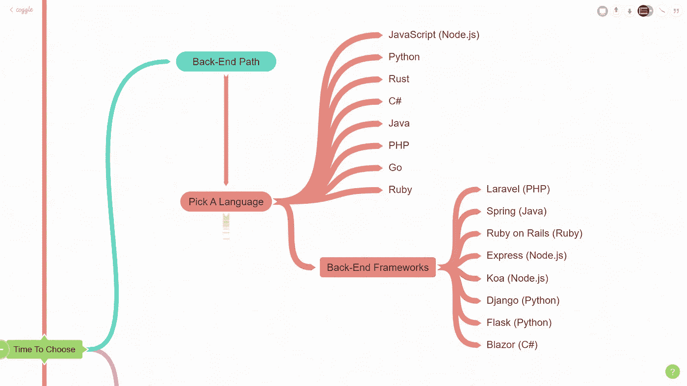

# 2021 年及以后的网络开发终极指南！| 2021 年路线图+

> 原文：<https://levelup.gitconnected.com/ultimate-guide-to-web-development-in-2021-beyond-roadmap-2021-6cabbf4edcc0>

2021 年网络开发路线图

> 在这篇文章中，我将引导你完成我的 2021 年及以后的最终 web 开发路线图。

在本文中，我们将涉及大量的技术。不要不知所措。你不需要学习这篇文章中的所有内容。

> 这里是你可以下载的整个[免费 PDF](https://courses.codestackr.com/ultimate-web-dev-roadmap-2021) 的链接。它有我将在本文中提到的所有资源的链接。所以一定要下载 [PDF](https://courses.codestackr.com/ultimate-web-dev-roadmap-2021) 供参考。

这是整个网络发展的地图。大多数 web 开发人员专门研究其中的一小部分。比如 UI/UX 设计、前端开发、后端开发、CI/CD、DevOps。

我希望这篇文章能让你对外面的一切有一个高层次的了解，然后你可以决定你想走哪条路。

我不仅会告诉你所有的技术，还会告诉你如何以及在哪里学习这些技术。

本文的视频版本:

# 互联网是如何工作的

首先，你需要了解互联网是如何工作的。您需要基本了解电脑如何使用浏览器、域名、托管服务、HTTP/HTTPS 和 DNS 进行通信。

资源:

*   [互联网在 5 分钟内是如何工作的(Aaron)](https://www.youtube.com/watch?v=7_LPdttKXPc) —这是一个旧视频，但仍然有意义。
*   [什么是互联网？(Code.org)](https://www.youtube.com/watch?v=Dxcc6ycZ73M)

# 基本工具

> 注意:任何带有💜代表我个人的最爱。

## 浏览器

浏览器对于 web 开发者来说是一个非常重要的工具。它们是最终用户查看我们的应用程序的方式。我更喜欢使用 Chrome 作为我的主浏览器进行测试，但是你需要安装所有的主流浏览器，以确保你的应用程序能够在所有的浏览器中正常运行。

## 文字编辑器

文本编辑器是 web 开发人员最好的朋友。您需要了解它能做什么来帮助您尽可能高效、准确、快速地编写代码。

我最喜欢的代码编辑器是 VS 代码！对于绝大多数开发者来说是最受欢迎的。

我有一个 [VS 代码播放列表](https://www.youtube.com/playlist?list=PLkwxH9e_vrAJshxiMo6gIavTr5kYsjPs7)，甚至有一整个课程可以帮助你[成为一个 VS 代码超级英雄](https://vscodehero.com)！

## 末端的

你需要习惯使用终端。有些人害怕它，但我保证，它没那么糟糕。

终端有多种选择。每个操作系统都有一个终端。Windows 有命令提示符和 Powershell。您也可以使用 Windows 子系统 for Linux (WSL ),它为您提供了一个 Linux shell，但这并不是最容易设置的，而且有一些限制。

如果你在 Windows 上，我会推荐使用 [Git Bash](https://git-scm.com/download/win) 。我用的就是这个。如果你在 macOS 或者 Linux/Unix 上，我会推荐 [Zsh](https://ohmyz.sh/) 。

## 设计

如果你想成为一名 UI/UX 设计师，你需要学习一种设计工具。我更喜欢 [Figma](https://www.figma.com/) ，但是 [Adobe XD](https://www.adobe.com/products/xd.html) 也很棒。其他选项有[素描](https://www.sketch.com/)、[插画](https://www.adobe.com/products/illustrator.html)和 [Photoshop](https://www.adobe.com/products/photoshop.html) 。

对于任何与设计相关的东西，我都会去以下两个 YouTube 频道:

*   [设计课程](https://www.youtube.com/channel/UCVyRiMvfUNMA1UPlDPzG5Ow)
*   阿德里安·特瓦罗格

# 超文本标记语言

每个网页都使用 HTML。它是网络的主要组成部分。HTML 提供了网站的结构。它实际上不是一种编程语言，而是一种标记语言。

您需要学习基本的语法、语义 HTML、表单和验证、可访问性、SEO 和最佳实践。

资源:

*   [30 分钟 HTML 速成班(codeSTACKr)](https://www.youtube.com/watch?v=XiQ9rjaa2Ow)

# 半铸钢ˌ钢性铸铁(Cast Semi-Steel)

CSS 是每个网站的另一个重要部分。它提供了自己的风格，使所有设备上的东西看起来都很好，并添加了过渡和动画。

我不打算粉饰这件事。CSS 有很多优点。如果你要成为一名前端开发人员，充分理解 CSS 是非常重要的！

在学习了基础知识之后，你会想要学习 Flexbox 和 CSS Grid 的布局特性。自定义属性相当于其他语言中的变量。当然，过渡和动画真的很酷。

动画可以用普通的 CSS 来完成。但是在你学会 JavaScript 之后，你可以去看看像 [GSAP (GreenSock 动画平台)](https://greensock.com/gsap/)和 [anime.js](https://animejs.com/) 这样的 JavaScript 库。这些使得构建复杂的动画变得超级简单。

之后，请务必熟悉响应式设计，包括移动优先的方法、rem 单元、视口设置、流体宽度和媒体查询。你可以从 CSS 之王[凯文·鲍威尔](https://www.youtube.com/channel/UCJZv4d5rbIKd4QHMPkcABCw)那里了解这一切。

接下来的三个项目你可以随时回来看。这些不是必须要学的，但是理解起来很棒。

一旦你掌握了所有这些，你就可以继续学习 CSS 预处理，比如 Sass 和 PostCSS。我真的很喜欢顶嘴。它给了你的 CSS 超能力！

如果你开始学习 React，你很可能想要学习[样式组件](https://styled-components.com/)或者 [CSS 模块](https://github.com/css-modules/css-modules)。

然后是 CSS 框架。有些人跳过 CSS 直接进入框架。我强烈反对这样做。在学习框架之前，你需要对 CSS *有一个坚实的理解。*

我认为值得学习的两个框架是 [Tailwind CSS](https://tailwindcss.com/) 和 [Bootstrap](https://getbootstrap.com/) 。他们在 web 开发中都有自己的位置。

资源:

*   [30 分钟 CSS 速成班(codeSTACKr)](https://www.youtube.com/watch?v=Tfjd5yzCaxk)
*   [20 分钟学会 CSS Flexbox(codeSTACKr)](https://www.youtube.com/watch?v=qqDH0T6K5gY)
*   [20 分钟学会 CSS 网格(codeSTACKr)](https://www.youtube.com/watch?v=0-DY8J_skZ0)
*   [30 分钟学会 Sass(codeSTACKr)](https://www.youtube.com/watch?v=BDOzg4lXcSg)
*   [GSAP 打字动画(codeSTACKr)](https://www.youtube.com/watch?v=ZT66N5hBiCE)
*   [CSS 国王，凯文·鲍威尔(YouTube)](https://www.youtube.com/channel/UCJZv4d5rbIKd4QHMPkcABCw)

# 该选择了

此时，是时候选择你的道路了。你想成为前端、后端、移动或桌面开发人员，还是从事机器学习和人工智能工作？

对我来说，重要的是要注意到，即使我把它分成了几个部分，前端、后端、开发运维等之间的界限也变得模糊了。

我的建议是挑选出你最感兴趣的技术，不管它们在什么样的道路上。有许多公司寻找专门从事每条道路的一小部分的人。

所以挑一件事并擅长它。擅长一件事比什么都不擅长要好！😉

# 前端路径

前端开发包括构建用户在浏览器中看到的界面。通常，这包括 HTML、CSS 和 JavaScript。你将主要与设计师和后端开发人员一起工作。

设计师会告诉你它应该是什么样子，应该如何流动。后端开发人员将提供对数据的访问，如产品，将在网站上显示。

# Java Script 语言

JavaScript 是作为前端开发人员学习的第一门编程语言。它让网站做“事情”。

您需要学习基本语法、DOM 操作、fetch API、JSON 和 ES6+特性。

你应该把大部分时间花在这部分上。在继续学习之前，完全理解 JavaScript 是非常重要的。

对于那些想学习 React 或 Vue 这样的 JavaScript 框架的人来说，在理解“普通”JavaScript 之前，不要开始学习框架。这些框架是基于 JavaScript 的。你首先需要这些知识。

资源:

*   [JavaScript 初学者教程(codeSTACKr)](https://www.youtube.com/watch?v=d5ob3WAGeZE)
*   [10 分钟学会 JSON(codeSTACKr)](https://www.youtube.com/watch?v=s6OIOL9OMYA)
*   [获取 API 解释(codeSTACKr)](https://www.youtube.com/watch?v=djCuFrLLjVk)
*   [JavaScript 播放列表(codeSTACKr)](https://www.youtube.com/playlist?list=PLkwxH9e_vrALRJKu7wfXby3MKeflhTu6B)
*   [JavaScript Shorts(codeSTACKr)](https://www.youtube.com/watch?v=bGDK1rpykOQ&list=PLkwxH9e_vrALlH7D0XLDn2td-uoHqHFxq)

# 以打字打的文件

TypeScript 是 JavaScript 的超集。它允许静态类型。这有助于您在运行代码之前捕捉错误并修复它们。

当您使用 TypeScript 时，它将在构建时编译成常规的 JavaScript。所以，这是一个你可以随时学习的工具，让你的代码变得更好。

TypeScript 也可以用于大多数框架。

资源:

*   [打字稿——基础(火船)](https://www.youtube.com/watch?v=ahCwqrYpIuM)

# 前端框架

> 注意:我不打算在这里讨论框架和库。从技术上来说，某个东西是框架还是库是一个有争议的问题。

前端框架有很多优点。您可以构建强大的单页应用程序(SPA)，保持组件的有序性，并轻松构建交互式 ui。

当您与团队一起工作时，将应用程序分解成供每个团队成员使用的组件变得非常容易。

有许多可用的框架，但我只打算介绍前 4 个。(我的看法)

1.  **React** 是目前为止我个人最喜欢的。这是相当容易学习，并有一个伟大的社区。
2.  **Vue** 可能是最容易学习的框架。
3.  **Angular** 是一个非常流行的框架，但是我个人并不喜欢使用它。我相信它更适合非常大的应用程序。
4.  我认为苗条被低估了。我不会在每个应用程序中都使用它，但它确实有它的位置。我计划在 2021 年了解更多。

资源:

*   [React 播放列表(codeSTACKr)](https://www.youtube.com/watch?v=UGcALH8kPC0&list=PLkwxH9e_vrAK4TdffpxKY3QGyHCpxFcQ0)
*   [Vue(埃里克的程序)](https://www.youtube.com/channel/UCshZ3rdoCLjDYuTR_RBubzw)
*   [Vue(法拉第学院)](https://www.youtube.com/channel/UCxA99Yr6P_tZF9_BgtMGAWA)
*   [角度碰撞课程(横向媒体)](https://www.youtube.com/watch?v=Fdf5aTYRW0E)
*   [苗条速成班(Traversy Media)](https://www.youtube.com/watch?v=uK2RnIzrQ0M)

# 状态管理

当您使用框架时，您很快就会意识到跟踪应用程序的状态是多么重要。

当您处理许多组件并试图在它们之间传递数据和状态时，您会希望研究状态管理。

*   上下文 API 和钩子(React)
*   Redux(反应)
*   Vuex
*   服务或 NGRX(角度)

资源:

*   [React 状态管理教程(开发版)](https://www.youtube.com/watch?v=35lXWvCuM8o)
*   [Redux For 初学者(开发版)](https://www.youtube.com/watch?v=CVpUuw9XSjY)
*   [在 15 分钟内学会 VUEX(与 Erik 一起编程)](https://www.youtube.com/watch?v=oxUyIzDbZts)

# 静态站点生成器(SSG)和服务器端呈现(SSR)

静态站点生成器在 2020 年变得非常流行，并将持续到 2021 年。这些使得构建像登录页面这样简单的东西变得如此容易。但他们并不仅限于此。SSG 的一个常见用途是博客网站。

使用静态站点生成器，您可以获得更好的 SEO、文件系统路由和来自社区的强大插件支持。有些使用 GraphQL 获取数据，比如 Gatsby。

在我看来，最流行的静态站点生成器是:

*   盖茨比(反应过来)
*   Next.js (React)
*   网格体
*   Nuxt.js (Vue)
*   11ty(我已经听到了很多关于这一点的信息，但我必须花时间来深入了解它。)

服务器端呈现(SSR)提供了许多与静态站点相同的好处，但是将所有的呈现都移到了服务器上。

这个领域目前的王者在我看来是 Next.js 和 Nuxt.js。

你会注意到 Next.js 和 Nuxt.js 都可以做，静态站点生成和 SSR。如果你需要灵活性，这些都是很好的选择。我将在 2021 年更深入地研究 Next.js。

资源:

*   [盖茨比(Weibenfalk)](https://www.youtube.com/user/Weibenfalk)
*   [Next.js(科尔比·法约克)](https://www.youtube.com/channel/UC7Wpv0Aft4NPNhHWW_JC4GQ)
*   [grid some(Traversy Media——格温·法拉第)](https://www.youtube.com/watch?v=vB6rmWCmANA)
*   [Nuxt.js (Traversy Media)](https://www.youtube.com/watch?v=ltzlhAxJr74)

# 更多工具

你需要学习更多的工具。以下是主要的。

## 包管理器

包管理器允许您轻松地将预构建的包添加到您的应用程序中。这些包帮助您完成应用程序中的某些功能。我用 [npm](https://nodejs.org/en/) 。别人用[纱](https://classic.yarnpkg.com/en/docs/install)。

## 构建工具

*   *任务运行者*通过启动并运行您的环境来帮助您进行开发。它们还在构建阶段用于执行诸如树抖动、缩小代码、优化图像等任务。
    ▹ npm 脚本
    ▹ [大口(编码器编码器)](https://www.youtube.com/watch?v=-lG0kDeuSJk)
*   *Linters & Formatters* 帮助你识别代码中的编码错误和格式问题。
    ▹ [更漂亮](https://prettier.io/)更漂亮
    ▹ [诚信通](https://eslint.org/)
*   前端框架使用*模块捆绑器*将你写下的代码编译成常规的 HTML、CSS 和 JavaScript。其中许多都是内置的，只需要很少的配置。但是理解这些是如何工作的是有好处的。
    ▹[web pack(freecodecamp)](https://www.youtube.com/watch?v=MpGLUVbqoYQ)
    ▹[包裹(James q quick)](https://www.youtube.com/watch?v=ONwotPEpinI)
    ▹[roll up(网站)](https://rollupjs.org/guide/en/)

## 版本控制

版本控制非常重要。你必须学习 [Git](https://git-scm.com/) 和 [GitHub](https://github.com/) ，尤其是当你和一个团队一起工作的时候。这些允许您跟踪变更，在项目上协作，并且是 CI/CD(持续集成/持续部署)的一个组成部分

> 对于所有开源和 GitHub 相关的东西，我都依赖于 Eddie Jaoude！

*   [30 分钟学会 Git(codeSTACKr)](https://www.youtube.com/watch?v=N_bMCff8q6A)
*   [下一级 GitHub 简介 Readme.md (codeSTACKr)](https://www.youtube.com/watch?v=ECuqb5Tv9qI)

## 浏览器开发工具

你将会经常使用浏览器的开发工具。一定要熟悉他们的能力。还有一些特定的浏览器扩展可以帮助解决 React 等前端框架的故障。

## VS 代码扩展

VS 代码扩展是必须的。有许多扩展可以帮助您使用各种技术。这是我的[顶级延伸](https://www.youtube.com/watch?v=c5GAS_PMXDs)的视频。

## 蚂蚁

如果你在写大量的 HTML 和 CSS，你*有*学 Emmet！它将大大加快你的编码时间！就像编码速记一样。

*   Emmet =更快的 HTML & CSS 工作流！

## Axios

如果您正在处理大量的数据获取，您可能想要查看 Axios。这是一个很好的 JavaScript 库，很容易使用，而不是 JavaScript 中的标准 Fetch API。

*   [Axios 速成班(Traversy Media)](https://www.youtube.com/watch?v=6LyagkoRWYA)

# 其他技术

## GraphQL

GraphQL 是一种用于 API 的查询语言。这使得在客户端使用 API 中的数据变得更加美好！这是盖茨比的一部分。

*   [GraphQL 全程(freeCodeCamp)](https://www.youtube.com/watch?v=ed8SzALpx1Q)

## 渐进式网络应用(PWA)

pwa 是可靠且快速的应用程序。它们最出名的是能够像普通应用程序一样“安装”在设备上。但它们只是网络应用，给用户一种本地应用体验，而不占用他们设备上的空间。它们的一个主要特点是能够使用服务人员离线工作。

*   [PWA 初学者教程(网络忍者)](https://www.youtube.com/playlist?list=PL4cUxeGkcC9gTxqJBcDmoi5Q2pzDusSL7)

## web 程序集(Wasm)

WebAssembly 允许您在浏览器中使用其他编程语言。还有比 JavaScript 快得多的其他语言。但是请记住，这不是 JavaScript 的替代品。

因此，如果你正试图构建一个需要处理大量数据的下一级游戏或真正复杂的工具，你会想要看看 WebAssembly。

可以用于 WebAssembly 的几种语言是 C、C++、C#和 Rust。

*   [web assembly(Wasm)in 100 Seconds(Fireship)](https://www.youtube.com/watch?v=cbB3QEwWMlA)

## JAMstack

JAMstack 中的 JAM 代表 JavaScript、API 和标记。

JAMstack 的一个例子是 Gatsby 和 [Sanity.io](http://Sanity.io) 的组合。遵循 JAMstack 准则的站点是高性能、廉价且易于扩展的。使用 [Netlify](https://www.netlify.com/) 或 [Vercel](https://vercel.com/) 它们也非常容易托管。

欲了解更多关于 JAMstack 的信息，请访问 jamstack.org。

资源:

*   [什么是 Jamstack？(Traversy Media —詹姆斯·奎克)](https://www.youtube.com/watch?v=ySJGjo3_EX4)
*   [JAMstack 速成班(詹姆斯 Q Quick)](https://www.youtube.com/watch?v=73b1ZbmB96I)

## 语音识别

随着时间的推移，语音识别只会越来越受欢迎。所以现在很多人都习惯和 Alexa、Google、或者 Siri 对话。

事实是，人们喜欢花更少的时间打字。这就是为什么语音搜索和导航将在 2021 年变得更加流行。

您可以使用几种技术在应用程序中实现语音识别:

*   [HTML5 网络语音 API](https://developer.mozilla.org/en-US/docs/Web/API/Web_Speech_API)
*   [谷歌语音转文本](https://cloud.google.com/speech-to-text)

资源:

*   [艾伦艾](https://alan.app/)
*   [用 Alan AI 构建一个语音识别电子商务应用(网络开发简化版)](https://www.youtube.com/watch?v=4xwruFAvEHA)

# 后端路径

后端开发人员的工作主要包括管理服务器、部署、API 和数据库。

# 选择一种语言

*   JavaScript (Node.js & Deno)
*   计算机编程语言
*   锈
*   C#
*   Java 语言(一种计算机语言，尤用于创建网站)
*   服务器端编程语言（Professional Hypertext Preprocessor 的缩写）
*   去
*   红宝石

选择哪种语言取决于所构建的应用程序的目的。如果您正在处理大型数据集，您可能希望使用 Python。如果你只需要一个简单的 web 服务器，并且你已经知道了 JavaScript，那就使用 Node.js 吧。

如果你心中已经有一家你想为之工作的公司，找出他们在后台使用什么，并了解这一点。

最后，一旦你学会了一种编程语言，学习另一种就容易多了。所以不要太担心。

资源:

*   [Node.js 速成班(Traversy Media)](https://www.youtube.com/watch?v=fBNz5xF-Kx4)
*   [Deno Intro &教程(codeSTACKr)](https://www.youtube.com/watch?v=3Vt_cjgojDI)
*   [凯勒·库里(YouTube)](https://www.youtube.com/user/CalebTheVideoMaker2)
*   [Rust 速成班(Traversy 媒体)](https://www.youtube.com/watch?v=zF34dRivLOw)
*   [C#初学者完全教程(freeCodeCamp)](https://www.youtube.com/watch?v=GhQdlIFylQ8)
*   [Java 简介(freeCodeCamp)](https://www.youtube.com/watch?v=GoXwIVyNvX0)
*   [PHP 教程(freeCodeCamp)](https://www.youtube.com/watch?v=OK_JCtrrv-c)
*   [围棋教程(freeCodeCamp)](https://www.youtube.com/watch?v=YS4e4q9oBaU)
*   [Ruby 全教程(freeCodeCamp)](https://www.youtube.com/watch?v=t_ispmWmdjY)

# 后端框架

后端也有框架。学习后端框架时，同样的规则也适用。在跳入框架之前先学习基础语言*。*

*   Larvel (PHP)
*   Spring (Java)
*   Ruby on Rails (Ruby)
*   Express (Node.js)
*   Koa (Node.js)
*   Django (Python)
*   烧瓶(蟒蛇皮)
*   Blazor (C#)

资源:

*   [拉勒韦尔速成班 2020 (Traversy 媒体)](https://www.youtube.com/watch?v=MFh0Fd7BsjE)
*   [Spring Boot 教程(freeCodeCamp)](https://www.youtube.com/watch?v=vtPkZShrvXQ)
*   [Ruby on Rails 2020 速成班(Traversy Media)](https://www.youtube.com/watch?v=B3Fbujmgo60)
*   [JS 速成班(Traversy Media)](https://www.youtube.com/watch?v=L72fhGm1tfE)
*   姜戈(丹尼斯·艾维)
*   [学习 Flask for Python(freeCodeCamp)](https://www.youtube.com/watch?v=Z1RJmh_OqeA)
*   [布拉佐(克劳迪奥·贝纳斯科尼)](https://www.youtube.com/channel/UCTbHPk0bIOQwTXuGgD195bw)

# 数据库

几乎每个网站都有一些需要保留的数据。数据的例子可以是待售产品或博客文章。

数据库主要分为两类:关系型和 NoSQL /云。

# 关系数据库

关系数据库很像带有表格的电子表格。这些表可以使用唯一标识符相互链接。关系数据库更加严格，要求您提前定义每个表的列和类型。

关系数据库的例子:

*   一种数据库系统
*   关系型数据库
*   Azure 云 SQL
*   MS SQL

资源:

*   [学习 PostgreSQL 教程(freeCodeCamp)](https://www.youtube.com/watch?v=qw--VYLpxG4)
*   [MySQL 速成班(Traversy Media)](https://www.youtube.com/watch?v=9ylj9NR0Lcg)

# NoSQL /云数据库

NoSQL 和云数据库不像关系数据库那样严格。您可以动态定义它们的数据和类型。理解这些差异并选择适合您的应用程序需求的正确数据库类型非常重要。

虽然 NoSQL 和云数据库一开始可能更容易建立和运行，但是随着数据库的增长，您可能会遇到问题。

NoSQL 和云数据库示例:

*   [MongoDB](https://www.mongodb.com/)
*   [FaunaDB](https://fauna.com/)
*   [燃烧基地](https://firebase.google.com/)
*   [气动工作台](https://airtable.com)
*   [AWS](https://aws.amazon.com/products/databases/)

资源:

*   [MongoDB 速成班(Traversy Media)](https://www.youtube.com/watch?v=-56x56UppqQ)
*   [FaunaDB 基础(火船)](https://www.youtube.com/watch?v=2CipVwISumA)
*   [Firebase 初学者指南(Fireship)](https://www.youtube.com/watch?v=9kRgVxULbag)
*   [用 Airtable (codeSTACKr)搭建一个 React App](https://www.youtube.com/watch?v=FEoEvSmtmPQ)

# 蜜蜂

现在您已经有了数据库，您需要能够通过 API(应用程序编程接口)访问前端的数据。它是前端消费后端数据的一种方式。

下面是一个关于如何构建自己的 API 的有趣教程:[制作自己的 API (Ania Kubow)](https://www.youtube.com/watch?v=FLnxgSZ0DG4) 。

# 证明

如果你的站点需要跟踪用户，你需要实现认证。最常见的方法是使用 OAuth 或 JavaScript Web 令牌(JWT)。

为了使事情变得简单，您可以使用认证提供者，如 [Auth0](https://auth0.com/) 或 [Firebase](https://firebase.google.com/products/auth) 。

资源:

*   [使用 Auth0 (codeSTACKr)进行简单的 React 用户登录验证](https://www.youtube.com/watch?v=MqczHS3Z2bc)
*   [React 认证速成班与 Firebase (Web 开发简化版)](https://www.youtube.com/watch?v=PKwu15ldZ7k)

# 区块链和加密货币

区块链是一种数据库。但是它不像一个典型的数据库。它将数据存储在块中，然后按时间顺序将它们链接在一起。

您可以在块中存储任何类型的数据，但它通常用作交易的分类帐。

比特币以一种分散的方式使用区块链，因此没有一个人拥有控制权。

分散的区块链是不可改变的。这意味着数据不能被改变。一旦交易被记录下来，它就是永久的，每个人都可以看到。

这使得区块链非常安全。

你将看到区块链和加密货币在 2021 年继续变得更加流行。

要了解有关这些技术的更多信息，请访问:

*   [thenewboston (YouTube)](https://www.youtube.com/user/thenewboston)
*   [凯勒·库里(YouTube)](https://www.youtube.com/user/CalebTheVideoMaker2)

# 内容管理系统

内容管理系统允许你轻松地管理你的网站内容。如果你是一个自由职业者，你肯定会想要一个好的 CMS 供你的客户使用，这样他们就可以很容易地更新自己网站上的内容。

传统的 CMS 有 [Wordpress](https://wordpress.org/) 和 [Drupal](https://www.drupal.org/) 。

2020 年，无头 CMS 变得非常流行，并将在 2021 年继续流行。

无头 CMS 允许你在前端使用任何你想要的东西。你没有被束缚在他们的平台上。这给了你更多的自由来构建你的应用程序。

无头 CMS 的示例:

*   [Sanity.io](https://www.sanity.io/)
*   [Netlify CMS](https://www.netlifycms.org/)
*   [斯特拉皮](https://strapi.io/)
*   [棱镜](https://prismic.io/)
*   [童话世界](https://www.storyblok.com/)
*   [知足的](https://www.contentful.com/)

资源:

*   [如何从零开始制作一个 WordPress 网站(Adrian Twarog)](https://www.youtube.com/watch?v=KRIBx-BGRJk)
*   [sanity . io 入门(James Q Quick)](https://www.youtube.com/watch?v=RrcQfAZDq7Q)
*   [用 Sanity.io 和 Gatsby (Jason Lengstorf)建立一个作品集网站](https://www.youtube.com/watch?v=SLGkyodumKI)
*   [Strapi.js 速成班(Traversy Media)](https://www.youtube.com/watch?v=6FnwAbd2SDY)

# 部署和开发运维

部署和开发运维包括了解如何创建和管理环境，以及如何将应用程序部署到 web 上。

您需要理解 SSH 如何连接到远程环境。

您还需要了解负载平衡、监控和安全性。通过安装 SSL 证书来确保您的站点是安全的。

GitHub 动作也可以帮助 CI/CD(持续集成/持续部署)

资源:

*   [DevOps 指令(YouTube)](https://www.youtube.com/c/DevOpsDirective/)
*   [什么是 GitHub 动作？(埃迪·贾韦德)](https://www.youtube.com/watch?v=5ncuRFwnrdc)
*   [使用 GitHub 动作自动部署(Traversy Media-Anson The Developer)](https://www.youtube.com/watch?v=X3F3El_yvFg)

# 主办；主持

你需要建立一个托管服务。根据你的需要，你可以使用静态主机，比如 [Netlify](https://www.netlify.com/) 或者 [GitHub Pages](https://pages.github.com/) 。这些使得部署变得容易，可以与 GitHub 集成。这样，每次你更新你的 GitHub repo，你的站点都会自动重建和部署。

如果您的应用程序需要一个真正的后端环境，您将需要一个更传统的托管服务，例如:

*   [Heroku](https://www.heroku.com/)
*   [Linode](https://www.linode.com/)
*   [韦尔塞尔](https://vercel.com/)
*   [AWS](https://aws.amazon.com/)
*   [蔚蓝色](https://azure.microsoft.com/en-us/)

# Web 服务器

然后，了解 web 服务器。以下是受欢迎的:

*   NGINX
*   街头流氓
*   MS IIS

# 测试

在部署应用程序之前，测试是必要的。所需测试的类型和数量取决于应用程序的复杂程度。

这些是你想了解的一些测试类型:

*   单位
*   综合
*   功能的

# 无服务器架构(FaaS)

FaaS 代表“功能即服务”。无服务器实际上并不意味着没有服务器。这仅仅意味着你不能管理服务器。您只需要一台服务器来执行次要功能。

这意味着您需要管理的基础架构减少了。在我看来，顶级的无服务器提供商是 AWS Lambda 和 Netlify。

资源:

*   [创建一个无服务器快速应用程序(与 Erik 一起编程)](https://www.youtube.com/watch?v=aJlvJsdVTLU)
*   [无服务器 Lambda 功能(Traversy 媒体)](https://www.youtube.com/watch?v=drJwMlD9Mjo)

# 虚拟化

虚拟化允许您轻松地创建和部署环境的容器或“映像”,这些容器或“映像”已经设置好，随时可以使用。这里面的领头人是[码头工人](https://www.docker.com/)。

Kubernetes 允许你自动化容器的部署、扩展和管理。

资源:

*   [Dockerize VS Code(codeSTACKr)](https://www.youtube.com/watch?v=KFyRLxiRKAc)

# 移动开发

构建移动应用程序的传统方式是使用 Swift 等语言进行 iOS 开发，使用 Java 或 Katlin 进行 Android 开发。但是如果你已经学习了 HTML、CSS 和 JavaScript，你可以用它们来构建本地移动应用。

有几种技术在移动应用程序开发中很流行。

*   React Native :利用你的 React 技能，你可以通过 React Native 轻松构建原生移动应用。
*   [Flutter](https://flutter.dev/) :使用编程语言 Dart 构建原生移动应用。你甚至可以把你现有的用 Dart 编写的 Flutter 代码编译成一个网站！
*   [NativeScript](https://nativescript.org/) : JavaScript、TypeScript、Angular 或者 Vue 都可以用这个来创建原生的移动应用。
*   Ionic :你可以使用 React、Vue 或 Angular，用 Ionic 构建本地和混合移动应用。

资源:

*   反应本土(威廉·坎迪隆)
*   [颤振(颤振解释)](https://www.youtube.com/user/Lionranger)
*   [扑扑(塔达斯佩特拉)](https://www.youtube.com/c/TadasPetra)
*   [颤振(罗伯特·布伦哈格)](https://www.youtube.com/c/RobertBrunhage/)

# 桌面开发

您还可以使用您的 web 开发技能，通过 Electron 构建跨平台的桌面应用程序。Electron 使用 JavaScript、HTML 和 CSS。

它在后端使用 Chromium 和 Node.js，兼容 Mac、Windows 和 Linux。

用 Electron 构建的一些流行应用程序有 Visual Studio Code、Twitch、Slack、Figma 和 Discord。

# 机器学习和人工智能

人工智能(AI)和机器学习被广泛用于模仿人类智能，并执行简单和复杂的功能，如学习和分析信息、收集数据、理解人类情绪或解决复杂的商业挑战和问题的能力。

人工智能无处不在，习惯它吧，它不会消失。

当谈到 AI 和 ML 时，Python 是我考虑的主要语言。但是也有很棒的 JavaScript 库，比如 [Tensorflow.js](https://www.tensorflow.org/js) 和 [Brain.js](https://brain.js.org/) 。

资源:

*   [机器学习(Patrick Loeber 又名 Python 工程师)](https://www.youtube.com/c/PythonEngineer)

# 软技能和个人发展

一些经常被忽视的东西是软技能，或者更好的称呼是人际技能，以及个人发展。

这些是你应该努力培养的顶级技能:

*   沟通
*   协力
*   注意细节
*   问题解决
*   职业道德
*   时间管理
*   适应性
*   人际关系技巧
*   创造力
*   领导力

你会遇到的另一个大问题是失去动力和冒名顶替综合症。你需要和支持你的人在一起，让他们明白你并不孤单。

丹尼·汤普森是激励和处理冒名顶替综合症的绝佳资源！！在 [YouTube](https://www.youtube.com/c/DThompsonDev) 和 [Twitter](https://twitter.com/DThompsonDev) 上查看他。

# 荣誉奖

有一些技术没有包括在路线图中，但仍然应该提到。

## 低代码/无代码

有几个平台提供了创建网站和应用程序的能力，只需要很少甚至没有 web 开发知识。

这些平台吓到了很多开发者，因为他们相信他们的工作会被这些技术抢走。

我的建议是不要担心这些。平台本身依赖于 web 开发人员来创建和维护它们。

这些平台针对的是需要非常基本的网站或应用程序的受众。这些不需要高级定制，也没有复杂的编程要求。

此外，这些应用程序不能很好地扩展。一旦一家公司不再使用这款基础应用，他们就会寻找真正的开发者来帮助他们。

## 虚拟现实/增强现实

虚拟现实和增强现实越来越受欢迎。它仍处于起步阶段，但将在 2021 年继续受欢迎。

# 结论

我们在本文中讨论了很多技术。如果你坚持到了最后，你的大脑一定被烧焦了。😱感谢您的阅读！

请记住，您不必学习我们介绍的所有内容。把重点放在你目前的工作或渴望的工作中使用的技术上。所以，如果你现在的雇主用 Angular，重点是 Angular。如果你面试的公司使用 React，那么在你面试之前关注 React。

然后你可以在业余时间学习其他技术。(如果你有的话😂)如果你已经熟悉了 JavaScript，并且想在业余时间学习一些 Python，那就去学吧。

很难跟上当前的趋势和技术。但是要知道大多数公司都没有使用最新的技术。

学习新事物需要时间。做好一件事需要时间。所以要有耐心，慢慢来，永远不要停止学习，永远不要放弃！

本文的视频版本: