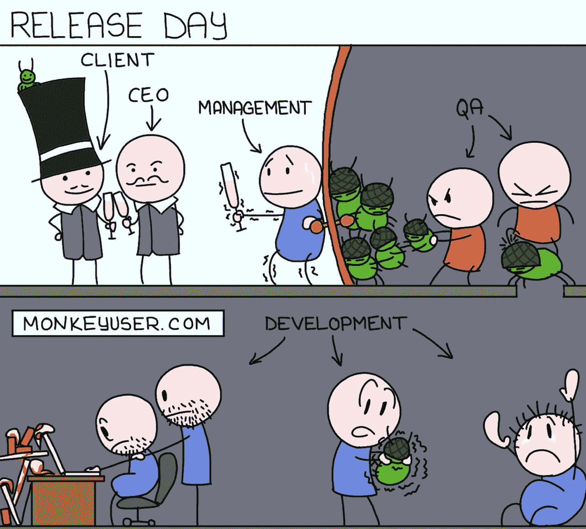

# 让你捧腹大笑的终极编程笑话

> 原文：<https://levelup.gitconnected.com/ultimate-programming-jokes-that-will-make-you-lol-ef791b59d207>

## 你能理解的日常生活笑话

奥斯汀·洛曼在 [Unsplash](https://unsplash.com?utm_source=medium&utm_medium=referral) 上的照片

程序员的日常生活充满了刺激。我们整天编码，整夜调试，处理成千上万行代码。

但是，编程并不是程序员唯一擅长的事情。他们也很有幽默感。

我收集了一些令人捧腹的编程笑话，你可以把它们和你的工作联系起来。笑一笑，让你的一天快乐起来😃

# 0.完美约会的想法

她为什么生气，我说错什么了吗？

# 1.这个网站不使用 cookies

# 2.在幕后

资料来源:monkeyuser.com

# 3.我不知道该怎么办

哈哈，当你作为一个初级开发者陪着高级开发者修复 bug。你贡献不多却学到很多。

# 4.在解决小问题的同时发现大问题

# 5.也许它不想听我的

# 6.严重的罪行

资料来源:techindustan

# 7.哎呀！出事了

你永远不可能得到一个没有错误的代码。

# 8.当你和一个程序员约会时

# 9.指责游戏

当你把这个问题告诉你的经理时，他们不会听你的。然后责怪你没有早点告知这个问题。

# 10.每一次。Ctrl S Ctrl S

哈哈，我们都这样。多次按下 save 按钮，以确保在构建代码之前保存代码中所做的更改。

# 11.当你在通知期内

# 12.你以后会后悔的

# 13.每次都管用的终极借口

资料来源:workchronicles.com

# 14.强有力的安全政策，真的吗？

如果你把它写下来，它怎么会安全呢？

# 15.开发商的地狱

# 16.哦不。

当你解决了某个其他项目的问题，现在他们希望你解决那个项目未来的所有问题。

# 17.什么！？

当你写了 20 行代码，但是你的终端显示你在第 235 行有一个错误。

作为初级开发人员，你像什么？这怎么可能呢？

哈哈，那是某个导入库的一些错误。

# 18.发送邮件

# 19.诚实的采访

嗯，你以前的经验会在我们的有毒文化中派上用场😐

# 额外笑话:

# 简而言之，开发者的生活

当你试图找到一个导致代码失败的 bug，并且最终你找到了这个 bug 的解决方案。

哈哈，很神奇的感觉吧？

**感谢阅读！我希望你喜欢这篇文章，它让你开怀大笑。**

您可能还想阅读:

 [## 9 个终极编程笑话

### 程序员生活中的笑话，你可以与之相关

levelup.gitconnected.com](/9-ultimate-programming-jokes-aa4970492af4) 

你可以在这里免费订阅我的时事通讯: [Pralabh 的时事通讯](https://pralabhsaxena.medium.com/subscribe)