# 你能理解的终极编程笑话

> 原文：<https://levelup.gitconnected.com/ultimate-programming-jokes-that-you-can-relate-with-fe3db95ba45b>

## 会让你 LOL 的日常生活笑话

米克·豪普特在 [Unsplash](https://unsplash.com?utm_source=medium&utm_medium=referral) 上的照片

在作为程序员的日常生活中，我们会经历很多情况。我们面对很多事情，享受很多事情。

编程不是程序员唯一擅长的事情，他们也有很强的幽默感。

我们都喜欢笑话，尤其是当我们把笑话和日常生活联系起来的时候。

今天，我想出了一些令人捧腹的编程笑话，每个程序员都可以将其与日常工作生活联系起来。我希望这篇文章能让你开心，让你微笑😃

# 0.结对编程的力量

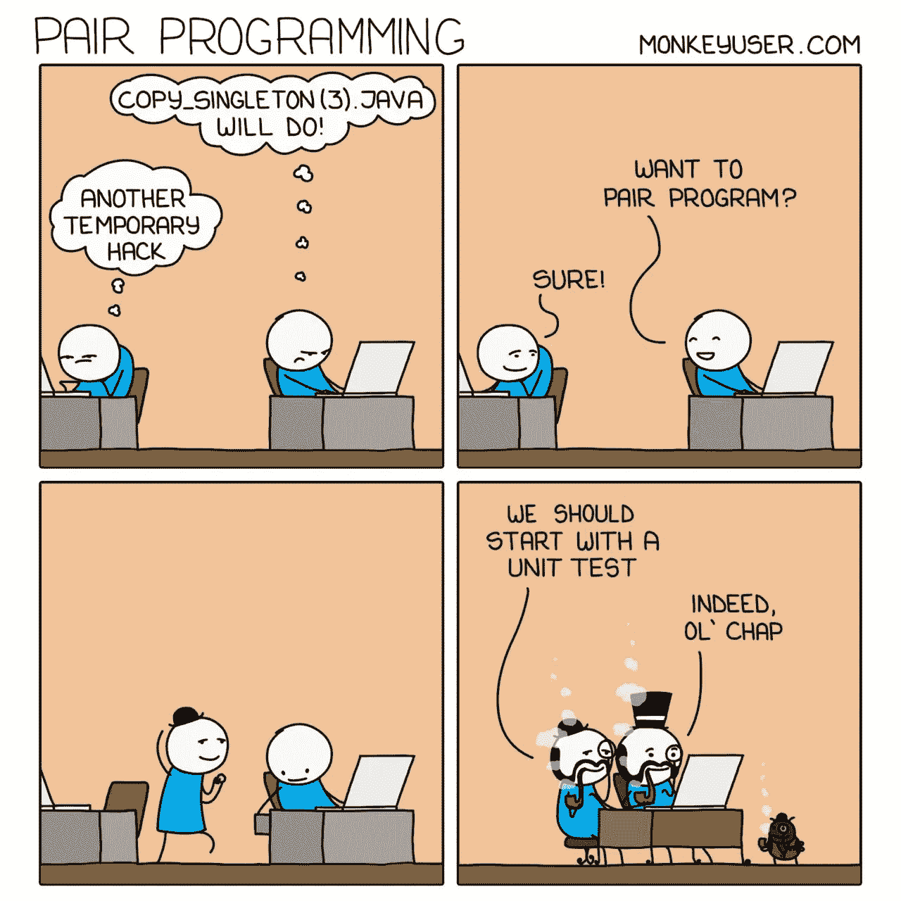

信用:[猴子用户](https://www.monkeyuser.com/)

# 1.不知不觉地修改生产数据

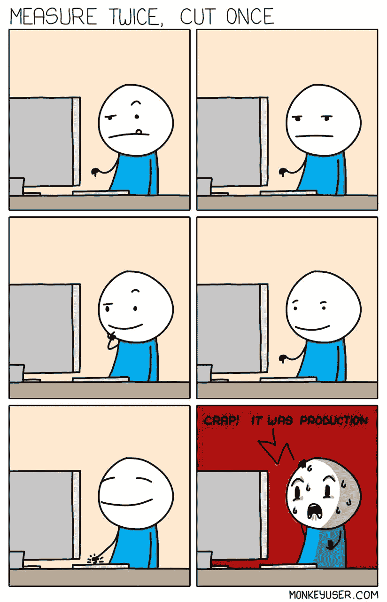

信用:[猴子用户](https://www.monkeyuser.com/)

在处理代码时，当您意识到您只是修改了生产数据而不是本地。

# 2.将 bug 提升为特性

信用: [monkeyuser](https://www.monkeyuser.com/)

当您将一个 bug 提升为一个特性并发布代码时。只要 bug 没有在您的代码中引起错误，您就可以这样做。

# 3.WFH！！期望与现实

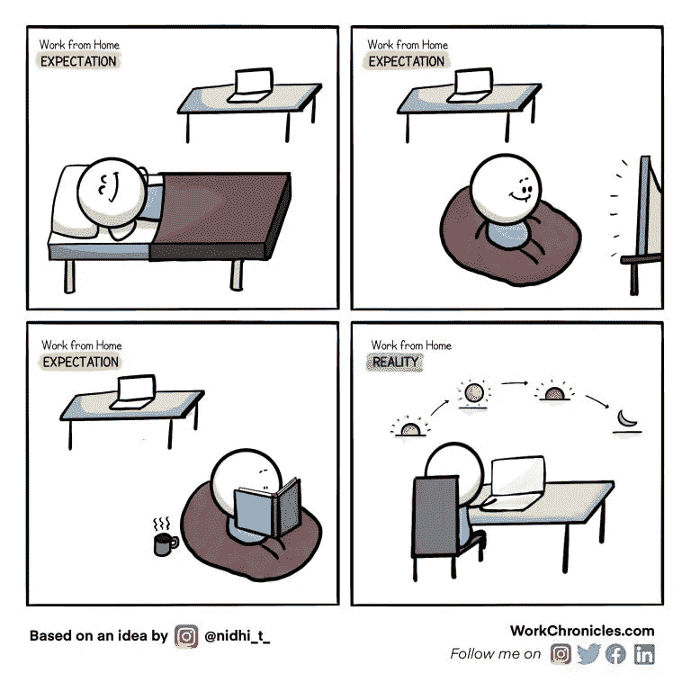

信用:[工作时间](https://workchronicles.com/)

当你认为你会喜欢在家工作的时候，你所做的就是坐在椅子上从白天工作到深夜。

# 4.完成一个特征

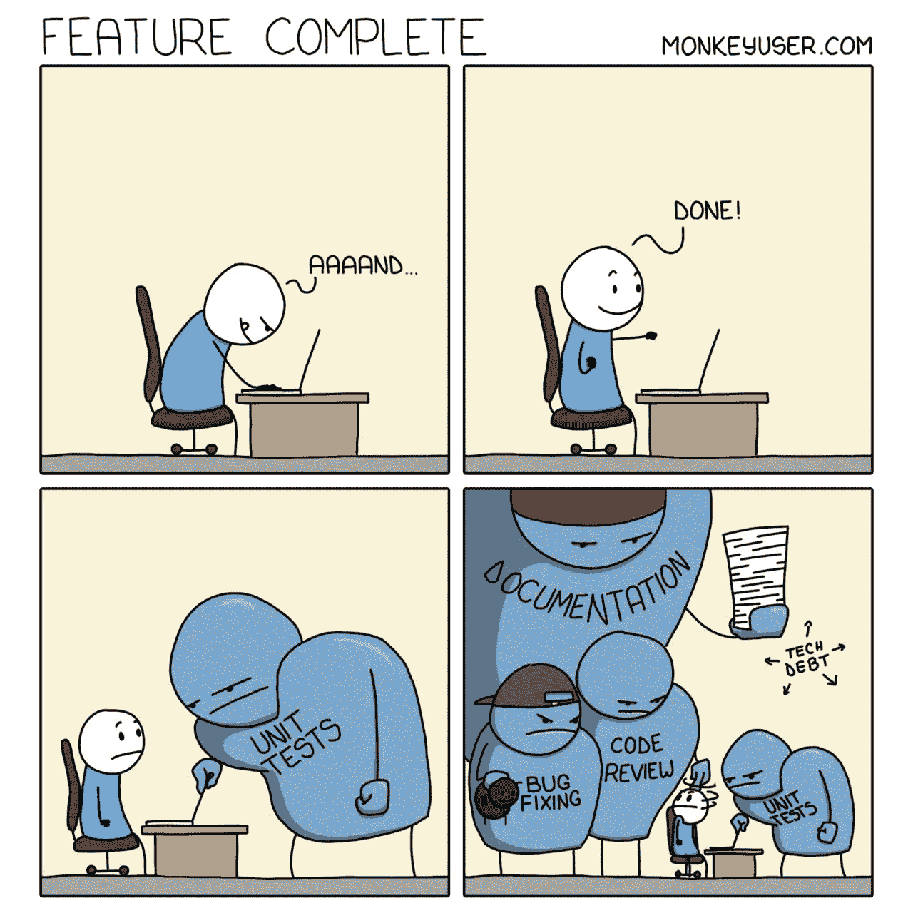

信用:[猴子用户](https://www.monkeyuser.com/)

当你认为你已经通过编写代码逻辑完成了你的工作，但它还没有结束，你必须编写单元测试，文档和执行代码审查。

# 5.提交调查

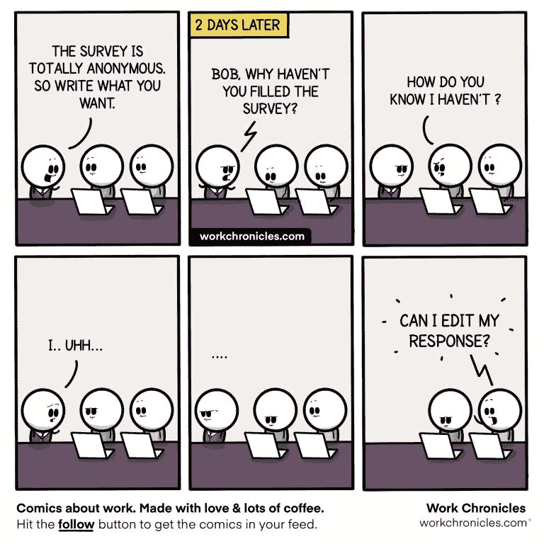

信用:[工作时间](https://workchronicles.com/)

# 6.重新编译代码

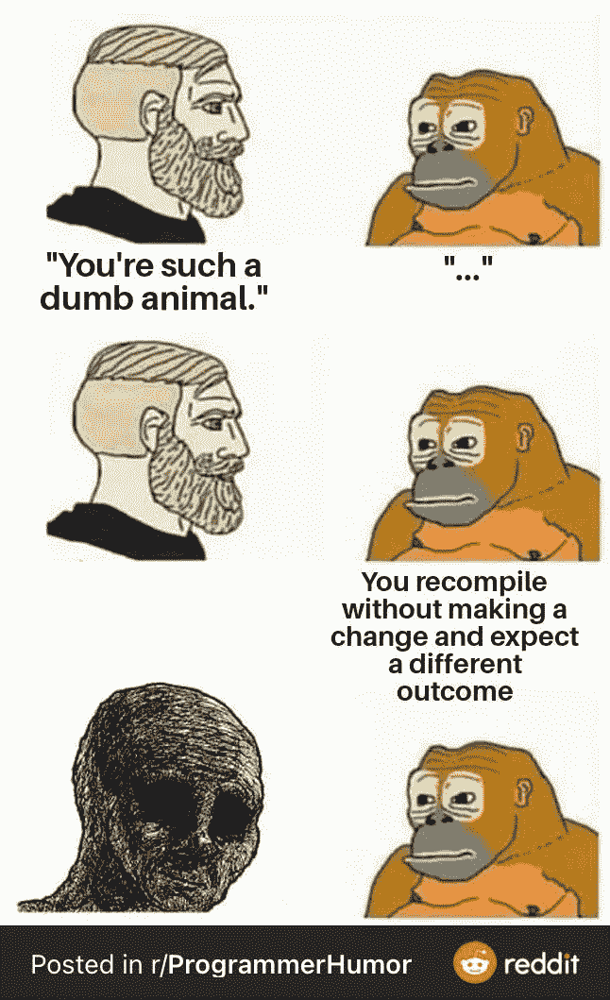

最糟糕的是，不加修改地重新编译有时确实有效。

# 7.啊，现在我得再重复一遍

信用:[工作时间](https://workchronicles.com/)

当你在一次 zoom 视频通话中没有意识到就断线了，然后你的队友告诉你你断线了一段时间，现在你不得不重新解释一切。

# 8.最终验收

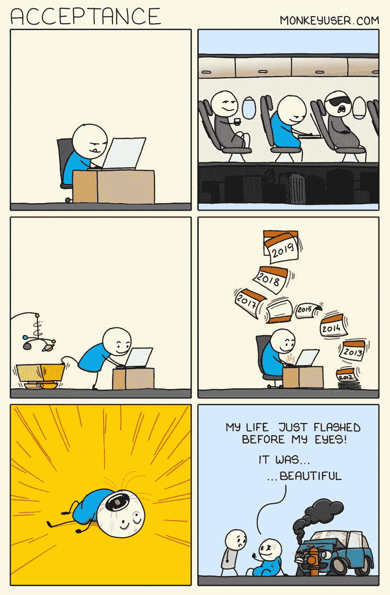

信用:[猴子用户](https://www.monkeyuser.com/)

# 9.更有效率

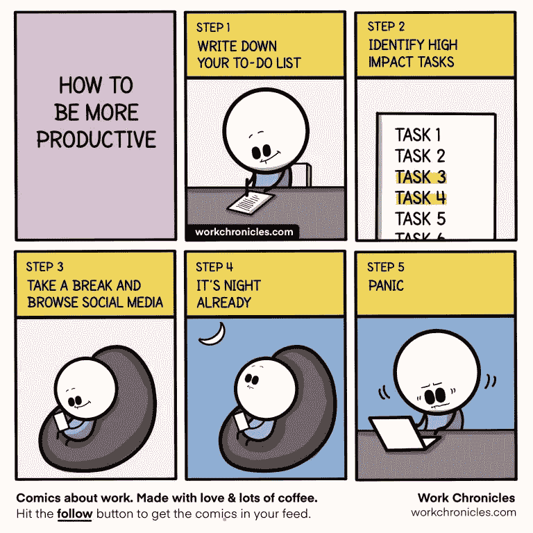

信用:[工作时间](https://workchronicles.com/)

当你计划在工作中变得更有效率，但在一天结束时，你意识到你花了一整天什么也没做。

# 10.不要问它为什么有效

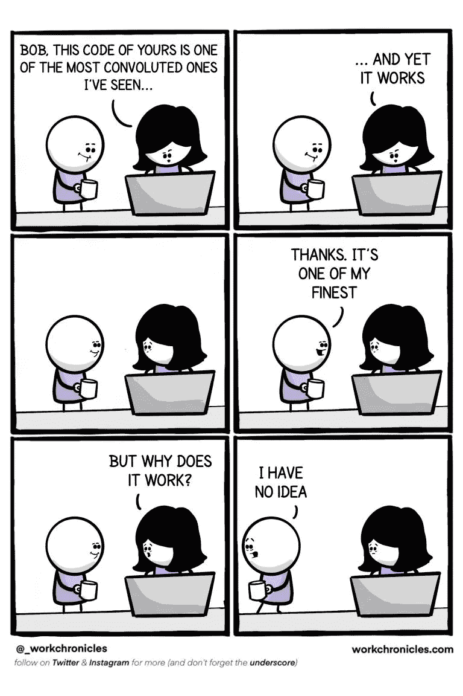

信用:[工作时间](https://workchronicles.com/)

# 11.你在开玩笑吗？

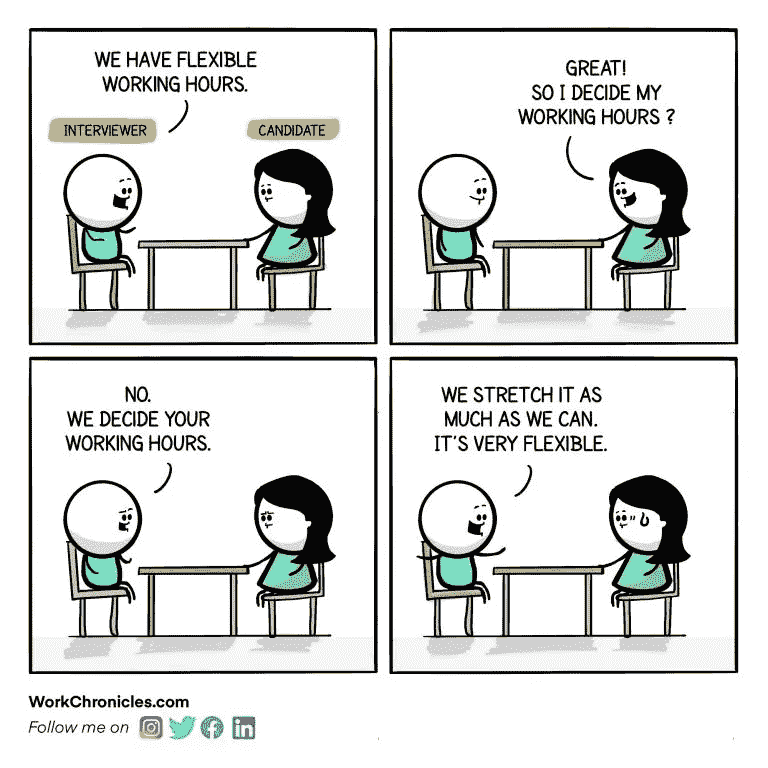

信用:[工作时间](https://workchronicles.com/)

当我不能自己决定的时候，怎么会有弹性工作时间呢？嗯，我们都面临这样的情况。

# 12.使用正则表达式

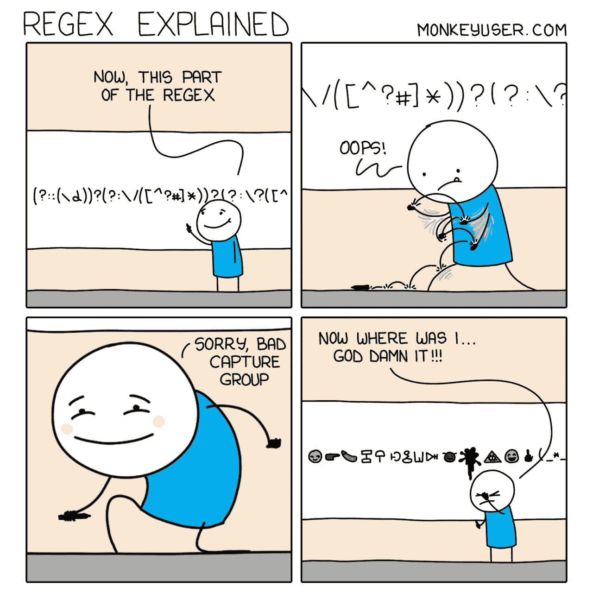

信用:[猴子用户](https://www.monkeyuser.com/)

哈哈，在写复杂的正则表达式的时候，当你走神到现在都不知道这段代码是做什么的时候。

# 13.项目的开始与结束

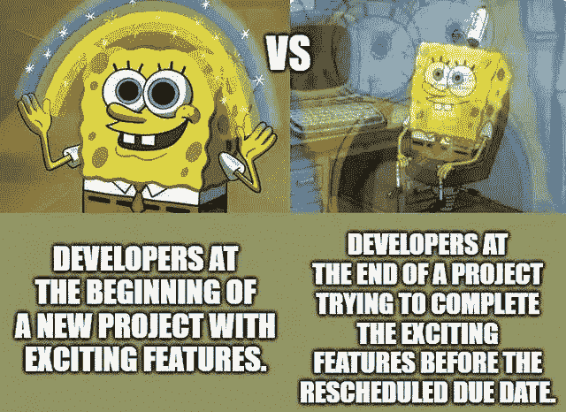

# 14.程序员爸爸

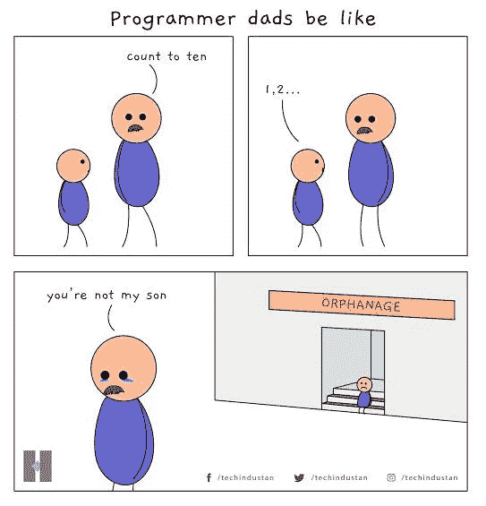

信用:[科技产业](https://twitter.com/techindustan?lang=en)

规则 1:对于程序员来说，计数从 0 开始。

# 15.这完全是耐心的问题

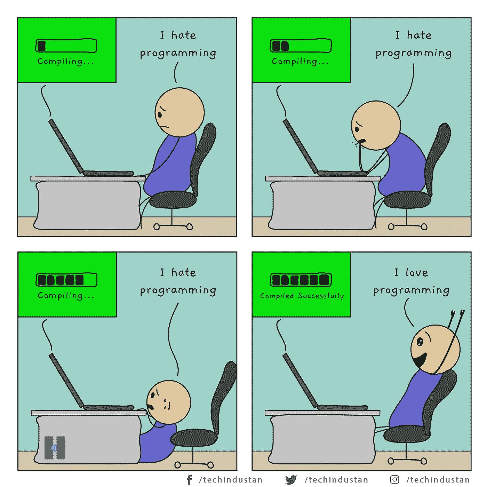

信用:[技术产业](https://twitter.com/techindustan?lang=en)

# 额外笑话:

# Git 提交时添加有意义的消息

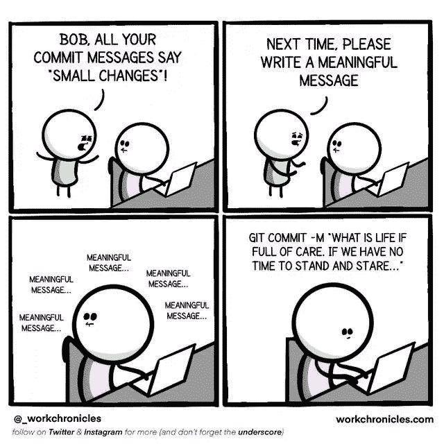

信用:[工作时间](https://workchronicles.com/)

**感谢阅读。我希望你喜欢这篇文章，它让你开怀大笑😀**

您可能还想阅读:

 [## 9 个终极编程笑话

### 程序员生活中的笑话，你可以与之相关

levelup.gitconnected.com](/9-ultimate-programming-jokes-aa4970492af4)  [## 让你捧腹大笑的终极编程笑话

### 你能理解的日常生活笑话

levelup.gitconnected.com](/ultimate-programming-jokes-that-will-make-you-lol-ef791b59d207) 

> *在你走之前……*

如果你喜欢这篇文章，并想继续关注更多**精彩的**文章，请考虑使用我的推荐链接[https://pralabhsaxena.medium.com/membership](https://pralabhsaxena.medium.com/membership)成为一名中级会员。

另外，你可以在这里免费订阅我的时事通讯: [Pralabh 的时事通讯](https://pralabhsaxena.medium.com/subscribe)。