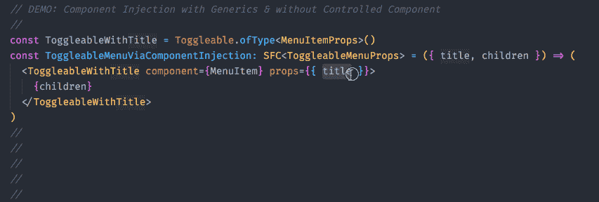

# 使用 Typescript 2.8 最终反应组件模式

> 原文：<https://levelup.gitconnected.com/ultimate-react-component-patterns-with-typescript-2-8-82990c516935>

## 有状态、无状态、默认属性、渲染回调、组件注入、通用组件、高阶组件、受控组件


> *这篇博文的灵感来自* [*React 组件模式帖子*](/react-component-patterns-ab1f09be2c82)
> 
> [现场演示](https://codesandbox.io/s/7k236m64w6)

如果你了解我，你已经知道我不写没有类型的 javascript，所以是的，我真的很喜欢 Typescript，从版本 0.9 开始。除了类型化的 JS 之外，我真的很喜欢 React，当 React + Typescript 结合在一起时，我感觉就像在天堂一样:d .整个应用程序和 VDOM 模板中的完整类型安全，使用它真是太棒了，太令人高兴了。

那么这篇文章是关于什么的呢？嗯，互联网上有各种关于 React 组件模式的文章，但是没有一篇描述如何用 Typescript 应用这些模式。即将到来的 TS 2.8 版本也带来了令人兴奋的新特性，如条件类型、标准库中新的预定义条件类型、同态映射类型修饰符等等，这使我们能够以类型安全的方式轻松创建常见的反应模式

这篇文章会很长，所以当你用 Typescript 掌握终极 React 组件模式的时候，请放松一下。

> 所有模式/示例都使用 typescript 2.8 和严格模式

# 开始

首先，我们需要安装 typescript 和 tslib 助手，这样我们发出的代码就更小了

```
yarn add -D typescript@next
# tslib will be leveraged only for features that are not natively supported by your compile target
yarn add tslib
```

这样我们就可以初始化我们的 typescript 配置:

```
# this will create tsconfig.json within our project with sane compiler defaults
yarn tsc --init
```

现在让我们安装 react、react-dom 和它们的类型定义。

```
yarn add react react-dom
yarn add -D @types/{react,react-dom}
```

太好了！现在让我们进入这些组件模式，好吗？

# 无状态组件

你猜对了，那些都是没有状态的组件(也叫表象)。大多数时候它们只是纯粹的函数。让我们用 Typescript 创建人造按钮无状态组件。

就像在普通 JS 中一样，我们需要导入 React 来允许我们使用 JSX

```
import React from 'react'const Button = ({ onClick: handleClick, children }) => (
  <button onClick={handleClick}>{children}</button>
)
```

虽然 tsc 编译器现在会发出错误！我们需要明确地告诉组件/功能我们的道具是什么类型。让我们定义一下我们的道具:

```
import React, { MouseEvent, ReactNode } from 'react'
type Props = { 
 onClick(e: MouseEvent<HTMLElement>): void
 children?: ReactNode 
}const Button = ({ onClick: handleClick, children }: Props) => (
  <button onClick={handleClick}>{children}</button>
)
```

我们消除所有错误！太好了！但是我们可以做得更好！

在`@types/react` = > `type SFC<P>`中有一个预定义的类型，它只是`interface StatelessComponent<P>`的别名，它有预定义的`children`和其他东西( *defaultProps* ， *displayName* ...)，这样我们就不用每次都自己写了！

因此，最终的无状态组件如下所示:


无状态组件

# 有状态组件

让我们创建有状态计数器组件，它将利用我们的`Button`

首先我们需要定义`initialState`

```
const initialState = { clicksCount: 0 }
```

现在我们将使用 Typescript 从我们的实现中推断状态类型。

> *通过这样做，我们不必分别维护类型和实现，我们只有真实的来源，也就是实现。不错！*

```
type State = Readonly<typeof initialState>
```

> *还要注意，type 被显式映射为所有属性都是只读的。我们需要再次明确定义，使用我们的状态类型来定义类的状态属性。*

```
readonly state: State = initialState
```

> *为什么这有用/需要？*
> 
> *我们知道我们不能直接在 React 内更新* `*state*` *如下:*

```
*this.state.clicksCount = 2 
this.state = { clicksCount: 2 }*
```

> 这将抛出一个运行时错误，但不是在编译时。通过 `*Readonly*` *将我们的* `*type State*` *显式映射到****readonly，并在我们的类组件内设置 readonly 状态，TS 会让我们立刻知道我们做错了什么。***

****例如:****

****

**编译时状态类型安全**

****整体容器/有状态组件实现:****

**我们的容器没有任何 Props API，所以我们需要将`Component`的第一个泛型参数键入为`object`(因为`props`在 React 中始终是一个对象`{}`)并将`State`类型用作第二个泛型参数。**

****

**有状态组件**

> **您可能已经注意到，我们已经将状态更新函数提取到类外的纯函数中。这是一种常见的模式，因为我们可以轻松地测试这些模式，而无需任何渲染器层的知识。还因为我们使用了 typescript，并且我们将状态映射为显式只读，这也将阻止我们在那些函数中做任何改变**

```
const decrementClicksCount = (prevState: State) 
                      => ({ clicksCount: prevState.clicksCount-- })

// Will throw following complile error:
//
// [ts]
// Cannot assign to 'clicksCount' because it is a constant or a read-only property.
```

**酷吧？；)**

# **默认道具**

**让我们用 string 类型的颜色属性来扩展我们的按钮组件。**

```
type Props = { 
  onClick(e: MouseEvent<HTMLElement>): void
  color: string 
}
```

**如果我们想定义 defaultProps，我们可以通过组件上的`Button.defaultProps = {...}`来实现。**

**通过这样做，我们需要改变我们的道具类型定义，将默认的道具标记为可选的。**

**大概是这样的(注意`?`操作符)**

```
type Props = { 
  onClick(e: MouseEvent<HTMLElement>): void
  color?: string 
}
```

**我们的组件看起来像这样:**

```
const Button: SFC<Props> = ({ onClick: handleClick, color, children }) => (
  <button style={{ color }} onClick={handleClick}>
    {children}
  </button>
)
```

**虽然这对于这个简单的例子是可行的，但是有一个问题。因为我们处于严格模式，可选的属性是我们的`color`的`undefined | string`类型的联合。**

**假设我们想对这个特殊的属性做些什么，TS 会抛出一个错误，因为它不知道它是由`Component.defaultProps` React 构造定义的。**

****

**默认道具问题**

**为了满足 TS 编译器的要求，我们可以使用 3 种技术:**

*   **使用 **Bang 操作符**显式地告诉编译器这不会是我们渲染中的`undefined`，尽管它是可选的，就像这样:`<button onClick={handleClick!}>{children}</button>`**
*   **使用**条件语句/三元运算符**让编译器理解某些特殊属性不是未定义的:`<button onClick={handleClick ? handleClick: undefined}>{children}</button>`**
*   **创建可重用的`**withDefaultProps**`高阶函数，它将更新我们的道具类型定义，并将设置我们的默认道具。这是最干净的解决方案，我的天**

**我们可以非常容易地实现我们的高阶函数(由于新的 TS 2.8 条件预定义映射类型):**

****

**withDefaultProps 高阶函数通用助手**

**现在我们可以用我们的`withDefaultProps`高阶函数来定义我们的默认道具，这也将解决我们之前的问题:**

****

**定义按钮组件的默认属性**

**或者直接内联(注意，我们需要显式地提供原始按钮属性类型，因为 TS 不能从函数中推断参数类型):**

****

**定义与组件实现内联的默认属性**

> **现在，按钮属性被正确地定义为消费，默认属性在我们的类型定义中被反映并标记为可选的，但在实现中仍然是必需的！**

```
{
  onClick(e: MouseEvent<HTMLElement>): void
  color?: string
}
```

****

**并且用法保持不变:**

```
render(){
  return (
    <ButtonWithDefaultProps 
      onClick={this.handleIncrement}
    >
      Increment
    </ButtonWithDefaultProps>
  )
}
```

**是的，这也适用于通过`class`定义的组件(还要注意，由于 ts 中类的结构起源，我们不必明确指定我们的`Prop`泛型类型)。**

**看起来是这样的:**

****

**用组件实现定义内联类的默认属性**

**用法也保持不变:**

```
render(){
  return (
    <ButtonViaClass
      onClick={this.handleIncrement}
    >
      Increment
    </ButtonViaClass>
  )
}
```

**假设您需要构建一个可扩展的菜单组件，当用户单击它时，它会显示一些子内容。我们将通过各种 React 组件模式实现这种行为。**

# **渲染回调/渲染道具模式**

**使组件逻辑可重用的最好方法是将你的子组件变成一个函数或者利用`render`prop API——这就是为什么渲染回调也被称为子组件函数。**

**让我们实现一个具有渲染道具功能的`Toggleable`组件:**

****

**将 RenderProps/Children 作为函数模式的可切换组件**

> **那里发生了很多抢劫，对吧？**
> 
> **让我们更深入地了解一下实施的每个重要部分:**

```
const initialState = { show: false }
type State = Readonly<typeof initialState>
```

*   **在这里，我们像前面的例子一样声明我们的状态，没有什么新的**

**现在我们需要定义我们的组件属性(注意，我们使用的是部分映射类型，因为我们知道所有属性都是可选的，而不是由`?`操作者手工注释每个属性):**

```
type Props = Partial<{
  children: RenderCallback
  render: RenderCallback
}>type RenderCallback = (args: ToggleableComponentProps) => JSX.Elementtype ToggleableComponentProps = { 
  show: State['show']
  toggle: Toggleable['toggle'] 
}
```

**我们希望支持两个函数，一个是子函数，另一个是渲染函数，所以这两个函数都是可选的。为了使事情 ***变干*** ，我们正在创建`RenderCallback`类型的我们的渲染函数定义:**

**`type RenderCallback = (args: ToggleableComponentProps) => JSX.Element`**

> **对于我们的读者来说，可能看起来很奇怪的是我们的最后一个类型别名`type ToggleableComponentProps`！**

```
type ToggleableComponentProps = { 
  show: State['show']
  toggle: Toggleable['toggle'] 
}
```

**我们再次使用了 typescript 和 ***查找类型*** 的强大功能，因此我们在定义类型时不必重复:**

*   **`show: State['show']`我们正在通过利用州内现有的类型定义来创建我们的`show` prop 类型**
*   **通过从我们的方法实现中获取类型，我们利用了 TS 中类的类型推断和结构特性！不错，确实强大！**

**剩下的实现很简单，标准的*渲染道具/孩子作为功能*模式:**

```
export class Toggleable extends Component<Props, State> {
  // ...
  render() {
    const { children, render } = this.props
    const renderProps = { show: this.state.show, toggle: this.toggle } if (render) {
      return render(renderProps)
    } return isFunction(children) ? children(renderProps) : null
  }
  // ...
}
```

**现在，我们可以将一个函数作为子级传递给可切换组件:**

****

**将子组件作为功能的可切换组件**

**或者我们可以传递一个函数来渲染 prop:**

****

**具有渲染属性的可切换组件**

**多亏了 Typescript，我们还可以随意使用 intellisense，并对我们的 render prop 参数进行适当的类型检查:**

****

**我们可更换组件的完全可靠性。谢谢打字稿！**

**如果我们想重用它(对于多个菜单之类的)，我们可以简单地创建一个使用可切换逻辑的新组件:**

****

**用 Toggleable 创建的 ToogleableMenu 组件**

**我们全新的 ***可切换菜单*** 组件已经可以在菜单组件中使用了:**

****

**菜单组件**

**它如预期的那样工作:**

****

**带有 ToggleableMenu 组件的演示**

> **当我们想要改变呈现的内容本身而不考虑状态操作时，这种方法非常有用:正如您所看到的，我们已经将呈现逻辑移到了 ToggleableMenu 子函数中，但是将状态逻辑保留在了 Toggleable 组件中！**

# **成分注入**

**为了使我们的组件更加灵活，我们可以引入组件注入模式。**

**什么是组件注入模式？如果您熟悉 React-Router，那么您在通过以下方式定义路由定义时会使用这种模式:**

```
<Route path="/foo" component={MyView} />
```

**因此，我们不是通过渲染/子道具传递函数，而是通过`component`道具“注入”组件。为此，我们可以将内联呈现属性函数重构为一个可重用无状态组件:**

```
import { ToggleableComponentProps } from './toggleable'type MenuItemProps = { title: string }
const MenuItem: SFC<MenuItemProps & ToggleableComponentProps> = ({
  title,
  toggle,
  show,
  children,
}) => (
  <>
    <div onClick={toggle}>
      <h1>{title}</h1>
    </div>
    {show ? children : null}
  </>
)
```

**这样，我们可以用 render prop 重构我们的`ToggleableMenu`,以:**

```
type Props = { title: string }
const ToggleableMenu: SFC<Props> = ({ title, children }) => (
  <Toggleable
    render={({ show, toggle }) => (
      <MenuItem show={show} toggle={toggle} title={title}>
        {children}
      </MenuItem>
    )}
  />
)
```

**至此，让我们定义我们的新 API — `component` prop。**

**我们需要更新我们的道具 API。**

*   **`children`现在可以是 function 或 ReactNode(当使用组件 prop 时)**
*   **`component`是我们的新 API，它接受需要在其 props 上实现`ToggleableComponentProps`的组件，它需要是通用的，并设置为`any`，因此如果任意组件实现了除`ToggleableComponentProps`之外的其他属性，将通过 ts 验证**
*   **我们引入了道具属性来传递任意的道具，这是一种常见的模式。它被定义为任何类型的索引类型，所以我们在这里失去了严格的类型安全...**

```
// We need create defaultProps with our arbitrary prop type -> props which is gonna be empty object by default
const defaultProps = { props: {} as { [name: string]: any } }
type Props = Partial<
  {
    children: RenderCallback | ReactNode
    render: RenderCallback
    component: ComponentType<ToggleableComponentProps<any>>
  } & DefaultProps
>
type DefaultProps = typeof defaultProps
```

**接下来我们需要给我们的`ToggleableComponentProps`添加新的道具 API，这样消费者将被允许在`<Toggleable props={...}/>`上使用`props`道具:**

```
export type ToggleableComponentProps<P extends object = object> = {
  show: State['show']
  toggle: Toggleable['toggle']
} & P
```

**现在我们需要更新我们的`render`方法**

```
render() {
    const { 
     component: InjectedComponent, 
     children, 
     render, 
     props 
    } = this.props
    const renderProps = { 
     show: this.state.show, toggle: this.toggle 
    } // when component prop api is used children is ReactNode not a function
    if (InjectedComponent) {
      return (
        <InjectedComponent {...props} {...renderProps}>
          {children}
        </InjectedComponent>
      )
    } if (render) {
      return render(renderProps)
    } // children as a function comes last
    return isFunction(children) ? children(renderProps) : null
  }
```

****整体实现带渲染道具的 Toogleable 组件，子组件作为功能，组件注入带任意道具支持:****

****

**整体实现带渲染道具的 Toogleable 组件，子组件作为一个功能，组件注入支持任意道具**

**我们最后的利用`component`道具的`ToggleableMenuViaComponentInjection`组件看起来像这样:**

****

**具有组件注入模式的可切换菜单**

****但是请注意**,我们在任意自定义的`props`属性中没有类型安全，因为它被定义为索引对象映射`{ [name: string]: any }`**

****

**我们可以传递任何东西给我们的道具 prop:(**

**我们现在可以像以前一样使用我们的`ToggleableMenuViaComponentInjection`进行菜单渲染**

```
export class Menu extends Component {
  render() {
    return (
      <>
        <ToggleableMenuViaComponentInjection title="First Menu">
          Some content
        </ToggleableMenuViaComponentInjection>
        <ToggleableMenuViaComponentInjection title="Second Menu">
          Another content
        </ToggleableMenuViaComponentInjection>
        <ToggleableMenuViaComponentInjection title="Third Menu">
          More content
        </ToggleableMenuViaComponentInjection>
      </>
    )
  }
}
```

# **通用组件**

**当我们实现“组件注入模式”时，我们在通过`props`处理的任意属性上失去了严格的类型安全。我们如何解决这个问题？你猜对了！我们可以把我们的`Toggleable`组件写成一个通用组件！**

**首先，我们需要使我们的道具通用。我们使用默认的通用参数，所以当我们不想提供它的时候，我们不需要显式地提供它(作为一个函数渲染道具/孩子)。**

```
type Props<P extends object = object> = Partial<
  {
    children: RenderCallback | ReactNode
    render: RenderCallback
    component: ComponentType<ToggleableComponentProps<P>>
  } & DefaultProps<P>
>
```

**我们还需要更新我们的`ToggleableComponentProps`,使其通用化。哦，等等，已经是了；).所以这方面没有变化。**

**但是需要改变的是`type DefaultProps`的定义，因为不可能从实现中获得泛型类型定义，我们需要将其重构为老式的类型定义- >实现**

```
type DefaultProps<P extends object = object> = { props: P }
const defaultProps: DefaultProps = { props: {} }
```

> **快好了！**

**现在让我们使组件类通用化。同样，我们使用默认属性，所以当不使用组件注入时，我们不必指定泛型参数！**

```
export class Toggleable<T = {}> extends Component<Props<T>, State> {}
```

**就是这样！就这样？？？嗯，我们如何在我们的 JSX 中利用这个通用类型呢？**

**坏消息是，我们不能…**

**我们需要引入`ofType`通用组件工厂模式**

```
export class Toggleable<T extends object = object> extends Component<Props<T>, State> {
  static ofType<T extends object>() {
    return Toggleable as Constructor<Toggleable<T>>
  }
}
```

****整体实现带渲染道具的 Toogleable 组件，子组件作为功能，组件注入带通用道具支持:****

****

**具有渲染道具的可缩放组件的整体实现、作为功能的子组件、具有通用道具支持的组件注入:**

**现在有了`static ofType`工厂方法，我们可以创建我们的正确类型的通用组件**

****

**带有组件注入模式和泛型的可切换菜单**

**一切都会像以前一样工作，这一次我们的`props={}`道具有了适当的类型安全。击掌！**

****

**类型安全任意道具道具感谢泛型！**

# **高阶组件**

**因为我们已经创建了具有渲染回调功能的`Toggleable`组件，所以实现 HOC 将会很容易。(这也是渲染回调模式的一大优势，我们可以利用它来实现特定的功能)**

> **让我们实现我们的特设:**

**我们需要创造:**

*   **displayName(这样我们可以在 devtools 中很好地调试)**
*   **WrappedComponent(这样我们就可以访问原始组件——这对测试很有用)**
*   **利用`hoist-non-react-statics` npm 包中的`hoistNonReactStatics`**

****

**具有通过 Togglable 实现的 Togglable**

**现在我们也可以通过 HOC 来创建我们的 Toogleable 菜单项了，并且有正确的道具类型安全！**

****

**通过 HoC 实现的 ToggleableMenu**

> **所有的东西都可以工作，并且都被类型所覆盖！耶！**

****

**用 HoC 创建的 ToggleableMenu 的正确类型注释**

# **受控组件**

**我们进入决赛了！假设我们想通过从父节点控制来使我们的`Toggleable`高度可配置。这确实是非常强大的模式。我们开始吧。**

**我说的受控组件是什么意思？我想控制是否从`Menu`组件中直接为我的所有`ToggleableMenu`组件显示内容。**

****

**我们的菜单组件可以通过 props 控制可切换菜单组件**

**我们需要更新 ToggleableMenu 组件的实现，如下所示:**

****

**通过各种模式实现我们的 ToggleableMenu**

**现在有了这些更新，我们可以将状态添加到我们的 ***菜单*** 中，并将其向下传播到 ***可切换菜单*****

****

**有状态菜单组件**

**L 让我们最后一次更新我们的`Toggleable`,以获得终极动力和灵活性**

**要制作可切换的受控组件，我们需要做以下工作:**

1.  **将`show`添加到我们的`Props` API 中**
2.  **更新默认道具(因为表演是可选的)**
3.  **更新要从 Props.show 设置的初始 Component.state，因为现在设置我们的状态的真实来源可能来自父级的 Props。**
4.  **componentWillReceiveProps 生命周期挂钩正确更新公共属性的状态**

****1 & 2:****

```
const initialState = { show: false }
const defaultProps: DefaultProps = { ...initialState, props: {} }type State = Readonly<typeof initialState>
type DefaultProps<P extends object = object> = { props: P } & Pick<State, 'show'>
```

****3 & 4:****

```
export class Toggleable<T = {}> extends Component<Props<T>, State> {
  static readonly defaultProps: Props = defaultProps
  // Bang operator used, I know I know ...
  state: State = { show: this.props.show! } componentWillReceiveProps(nextProps: Props<T>) {
    const currentProps = this.props if (nextProps.show !== currentProps.show) {
      this.setState({ show: Boolean(nextProps.show) })
    }
  }
}
```

## **支持所有模式的最终可切换组件(将道具/子组件渲染为功能/组件注入/通用类型/可控)**

****

## **最终通过可切换的方式**

**只是轻微更新->我们需要在我们的 HoC 中传播`show`属性值，并更新我们的`OwnProps` API**

****

**具有可控功能的可切换特设**

# **摘要**

**用 React 和 Typescript 实现正确的类型安全组件可能很棘手。随着 Typescript 2.8 中新功能的加入，我们几乎可以通过遵循通用的 React 组件模式来编写类型安全的组件。**

**在这篇超长的帖子里(抱歉！)多亏了 Typescript，我们学会了如何以严格的类型安全方式实现具有各种模式的组件。**

**大多数 powerfull 模式实际上是 Render Props，它允许我们实现其他常见的模式，如组件注入或 HOC，而无需太多额外的改动。**

**这篇文章的所有演示都可以在 [my Github repo](https://github.com/Hotell/blogposts/tree/master/2018-02/ultimate-react-component-patterns/src) 找到。**

**同样重要的是要意识到，模板中的类型安全，就像本文中演示的，只有在使用 VDOM/JSX 的库中才有可能**

*   **带语言服务的角模板提供了类型安全，但是在简单的构造上，如在 ngFor 中检查等，稳定性是失败的**
*   **Vue 还没有为模板实现类似 Angular 的东西，所以他们的模板和数据绑定只是神奇的字符串(但这在未来可能会改变。虽然你可以使用 VDOM 作为模板，但是使用起来很麻烦，因为各种类型的道具定义(“snabdom 承担责任……”)**

**像往常一样，如果你有任何问题，请在这里或在 twitter 上 ping 我(我的用户名[@马丁 _ 酒店](https://twitter.com/martin_hotell)),除此之外，欢迎打字检查人员！干杯！**

**[](https://gitconnected.com/learn/typescript) [## 学习 TypeScript -最佳 TypeScript 教程(2019) | gitconnected

### 前 18 名打字稿教程。课程由开发者提交并投票，使您能够找到最好的…

gitconnected.com](https://gitconnected.com/learn/typescript) [](https://gitconnected.com/learn/react) [## 学习 React -最佳 React 教程(2019) | gitconnected

### 前 45 名 React 教程。课程由开发人员提交并投票，使您能够找到最佳反应…

gitconnected.com](https://gitconnected.com/learn/react)**