# C 语言中的 UML 类图

> 原文：<https://levelup.gitconnected.com/uml-in-c-language-class-diagrams-6ed11aa34d9b>

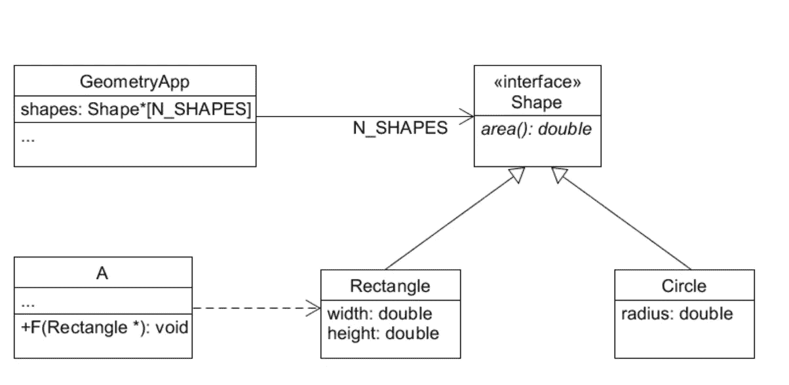

## 将类图翻译成 C 源代码。

写软件需要创造力和方法。虽然确实应该避免过度工程化，但另一方面，在没有任何路线图的情况下乱搞代码很可能会使我们的项目走上危险的道路。
这就是为什么每个程序员都应该在他们的工具箱中包含一些通用的(然而强大的)软件工程技术，其中最著名的可能是面向对象编程。

许多天生支持 OOP 的语言确实存在。然而，在一些现实世界的场景中，我们没有为给定的软件系统选择编程语言的特权:遗留的嵌入式系统就是这种情况，它们通常是用普通的 C 语言编写的，这是一种所谓的“过程化”或“结构化”语言。

## *今天讨论的目的是提供关于如何根据 C 程序中的类进行推理的基本概念，以及如何使用标准 UML(统一建模语言)类图静态地表示您的软件。*

# 什么是类图？

一个类图是一个系统的静态*表示。因此，它侧重于一个软件模块的形状，但它并没有告诉一个系统的逻辑。换句话说，我们通常在类图中发现的是一个系统所做的事情的综合。它不包含(或包含很少)关于*如何实现*功能的信息。*

# 我们为什么要关心这个？

作为软件工程师，我们迟早会意识到 OOP 并不真的是关于*“通过软件表示真实世界的对象”。相反，面向对象设计是一种使软件尽可能灵活和可维护的方法，通过将系统分割成具有明确职责的子模块，并让它们相互作用来实现所需的功能。*

类图帮助我们在深入实现的本质(即编写代码)之前对我们的软件架构进行推理。这种表示清楚地显示了子模块是什么，简要地陈述了它们的职责，并且还提供了关于与其他模块的关系的信息。

# 它们与 C 代码有什么关系？

好吧，但是……我们是 C 语言开发人员！没有人给我们提供花哨的关键字来显式声明一个*抽象类*或者一个*接口*。什么是*方法*？

虽然 C 没有包含任何实现 OOP 的习语，但是这些概念在这里仍然有效。我们*可以*实现封装和多态:我们只需要更加清楚我们在做什么。

在接下来的部分中，我们将看到如何有效地使用结构和函数来代替类。此外，我们将展示纯虚拟类(即。*接口*)可以通过函数指针实现，写一个普通的 C 函数如何转化为实现一个接口。
最后，我们将看到对象如何通过使用组合和依赖机制来相互交互。

好吧，我们继续！

# 1.大盒子又名混凝土类

在 UML 中，一个盒子被用来表示一个类。这可以是一个*具体*类，一个*抽象*类，或者一个*接口*。这里我们将介绍具体的类和接口。

在纯面向对象语言中，类是组成程序的原子。高级功能是通过允许一组函数对一组数据进行操作来实现的。话虽如此，具体的类不过是相关函数和数据的容器。

UML 具体类的基本演示如图 1.1 所示。`Rectangle`类公开了函数`area()`和两个属性，即`width`和`height`。

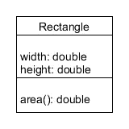

图 1.1:UML 中的矩形类

在 C 语言中，这可以用图 1.2 中的清单来表示。你可能已经知道，C 语言没有提供习语来声明一个类。因此，`Rectangle_Area()`没有明确地绑定到`Rectangle`数据结构。

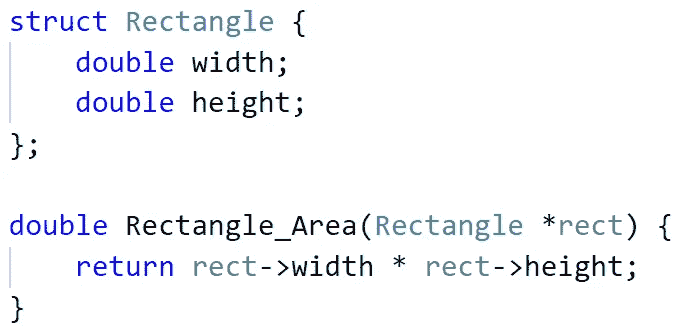

图 1.2:矩形类列表

我认为展示如何在`Rectangle`实例上调用方法也是有用的。清单示例如图 1.3 所示。值得一提的是，如果我们选择 Java 或 C++作为语言，最后一行应该等于`r.area()`。

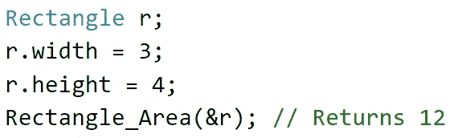

图 1.3:矩形类的用法

# 2.进入界面

有时候以统一的方式操作不同的对象是很有用的。作为一个著名的例子，考虑不同几何形状的面积计算:每个形状都应该提供一个`area()`方法，尽管使用不同的数据集。我们的用户代码可以合理地期望从形状列表中检索区域，而不管它们的具体细节。这种情况如图 2.1 所示。

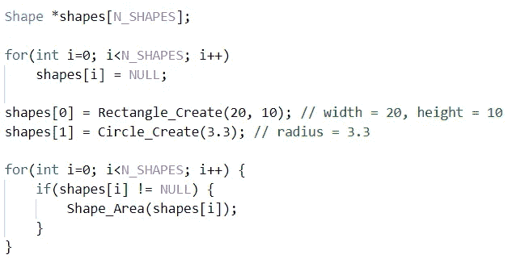

图 2.1:操作形状的用户代码

我建议关注第一行和最后一个`for`循环:声明一个`Shape`指针数组，在代码的后面，对每个对象调用`area()`方法(通过`Shape_Area()`函数调用)，不管它是`Rectangle`还是`Circle`。

情况可能是我们的`Shape`类提供了一组函数(即方法)但不实现它们中的任何一个:在这种情况下，我们说`Shape`是一个*接口*。用于接口的 UML 符号类似于用于具体类的符号，除了我们必须使用所谓的*原型*(除了用引号括起来的单词之外什么都没有)来表示我们的类是一个接口，并且每个未实现的方法都必须用斜体书写。

看一下图 2.2。“interface”原型放在类名的上方，而`area()`方法用斜体书写。

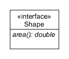

图 2.2:UML 中的形状界面

为了在 C 语言中实现这一点，我们使用了一个保存函数指针的结构(见图 2.3)。`AreaFn`只是类型`double(void *)`的函数指针的语法糖，而`ShapeInterface`为`Shape`公开的每个方法保存一个函数指针。

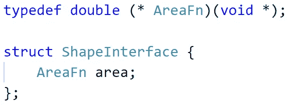

图 2.3: ShapeInterface 结构定义

这听起来不错，但是我们仍然缺少一些东西，使我们能够调用`Shape_Area()`，正如我们在图 2.1 中看到的。我们需要的是一个既存储接口函数又存储相关数据的结构(即一个`struct Rectangle`实例和矩形相关的方法)。我们正在寻找的解决方案如图 2.4 所示。这里，instance 将保存一个`Rectangle`或`Circle`数据结构(这是使用`void *`数据类型的一个优点)。

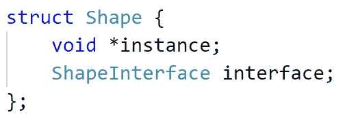

图 2.4:形状结构定义

现在是时候解释如何使用一种*类型的*构造函数来构造一个`Shape`。图 2.5 指向了一个`Rectangle`的创建:注意在最后四行中，`Rectangle`数据及其相关方法是如何放入`Shape`包装器中的。

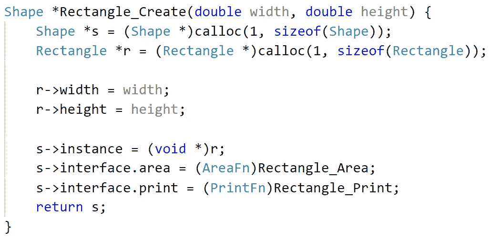

图 2.5:矩形构造器

以这一节结束，这里是`Shape_Area()`的非常简单的代码。

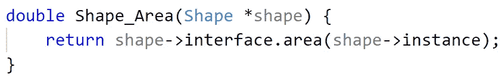

图 2.6:形状面积函数

# 3.钻石箭又名继承

箭头用于表示类之间的关系。主要有三种关系:*继承*、*组成*、*依赖*。尽管存在差异，但每种关系都强调了一个类了解另一个类的事实。

在 UML 中，菱形箭头用于表示类之间的继承。回想我们之前的例子，我们说`Rectangle` *继承* `Shape`:其实实现一个接口和继承它*是完全一样的事情*。类图如图 3.1 所示。

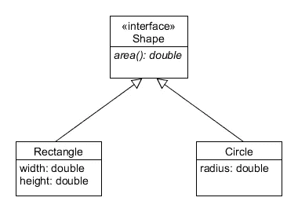

图 3.1:使用继承关系的形状层次结构

# 4.组成和依赖关系

在 OOP 中，对象需要相互交互。在典型的客户机/服务器应用程序中，客户机需要有一种与服务器交互的方式，反之亦然。然而，这种关系并不局限于网络应用程序:如果 A 类的对象使用了属于 B 类的对象，那么 A 就是 B 的客户端(或*用户*)。

回想一下图 2.1 所示的清单。现在假设代码在一个`GeometryApp`类中，它通过`Shape`接口使用矩形和圆形。在这种情况下，我们说`GeometryApp`和`Shape`之间有一个*成分*关系。值得一提的是，连接不是双向的:换句话说，`GeometryApp`知道`Shape`类的存在，但是`Shape`完全独立于`GeometryApp`。

UML 组合通过直箭头表示，如图 4.1 所示。您可能已经注意到,`GeometryApp`的属性正在对组合做出“反应”: shapes 数组可以被视为关系的副产品。此外，靠近箭头的`N_SHAPES`标签用于传达所谓的*多重性*，其简单地阐明了每个用户对象知道多少服务器对象(在这种情况下，每个`GeometryApp`对象存储指向`Shape`对象的`N_SHAPES`指针)。

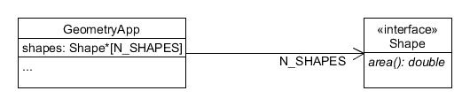

图 4.1:合成示例

最后，我想提一下一个对象开始了解另一个对象，但不把它作为属性的情况。例如，考虑一个作为参数传递给函数`F`的`Rectangle`对象。在这些情况下，我们说`F`对`Rectangle`类有一个*依赖关系*。看一下图 4.2，其中`F`被放到了`A`类中。

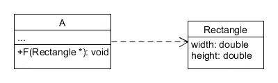

图 4.2:依赖示例

# 包扎

今天到此为止。我希望这篇阅读有助于阐明 UML 类图背后的主要概念，以及如何使用 C 语言应用它们。然而，统一建模语言有更多的功能，特别是对于动态建模。我希望能够很快带给你一个关于将序列图和交互图应用到 C 编程中的讨论，这是我在所有项目中经常做的事情！

非常感谢你的关注。对于任何问题，只要你觉得更合适，随时联系我。下次见！😊