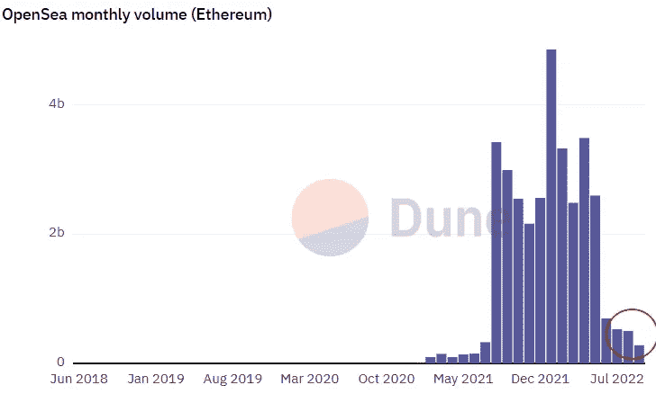

# NFT 收藏家不想听到的令人不安的真相。

> 原文：<https://levelup.gitconnected.com/uncomfortable-truths-nft-collectors-dont-want-to-hear-ca5e9d70d88>

但是他们必须这么做。

赫尔墨斯·里维拉在 [Unsplash](https://unsplash.com/s/photos/uncomfortable?utm_source=unsplash&utm_medium=referral&utm_content=creditCopyText) 上拍摄的照片

关于人们为什么会产生收藏行为，有各种各样的理论。

它在我们心中根深蒂固。

收集的心理在作为一种爱好有益和精神错乱[之间变化。](https://en.wikipedia.org/wiki/Compulsive_hoarding)

购买价值超过家庭住宅的卡通 NFT 的成年人可能更接近于填充电池，而不是业余爱好者。

收集是我们所有人的预期行为。

研究理论表明，积累你的收藏是对其他东西的追求。

不太有形的东西，如经历、想法或感觉。

这些感觉不是金钱驱动的。

促使我们继续收藏的是它带给我们的感觉良好的因素和内在的快乐。比如拥有你热爱的东西，你与收藏社区的团结，以及收藏品带给你的怀旧之情。

我们收集东西的动机并不局限于人生的某个特定阶段。

我们从来不觉得它已经完成了。

# 非传染性疾病是类固醇的收藏品，我们看起来都被骗了。

现在没那么多了。

2021 年，在 NFT 赚钱不费吹灰之力。

如果你的投资不到最初投资的 10 倍，你会非常不方便。

类似于 2000 年的互联网泡沫，NFTs 开始流行起来。但这一次，比赛场地完全不同。

这一次，NFT 收藏家追逐的是影响力。

我也是，这很危险。你在获得最重要的收藏品的竞争中迷失了。

冲动购买，追逐社会地位，不值得倾家荡产。

当我停下来想想，这是完全疯狂的。在这些不和谐的 NFT 社区中，你接触的人中有一半你从未见过面。

每个人都有这种竞争欲望，想在一场数字竞赛中击败互联网上的陌生人。

太可笑了。

与 1999/2000 年不同，当时只有很少一部分人投资于公开市场，储蓄被放在一个巨大的基座上，我们现在生活的世界中，每个青少年的 Instagram 简历要么是首席执行官，要么是联合创始人，要么是投资者。

投资唾手可得，而且很新潮。

根据 Dune Analytics 的数据，受欢迎的 NFT 市场 [Opensea](https://opensea.io/) 的家禽交易量为之前市场高点的 5.7%。

恐惧的区域用红色圈出。这就是我们现在的处境。

那些高高的摩天大楼？我们就在那里。

来源— [沙丘分析](https://dune.com/rchen8/opensea)

# NFTs 暴露了我们的贪婪。

快速获利和登月心态见证了自互联网以来发展最快的技术，随后是最大的崩溃之一。

刚刚获得 100 倍收益的年轻加密货币大腕现在有猴子图片可以买了。

他们可以安全地向世界展示他们的财富，而不用截图他们的比特币基地余额，或者如果你拥有 5 个比特币，你只需要告诉你的朋友，并希望他们相信你。

NFTs 改变了这一点。我们现在正在疯狂地伸缩。

当你买了 NFTs，换了个人资料图片，就表明了你的社会地位。

成熟的互联网和社交媒体加速了 NFTs 的普及。

对于千禧一代来说，另类投资市场也出现了爆炸式增长，他们怀念看到自己十几岁的孩子收集和自己一样的东西。

瞧，就像那样，采用的爆炸来了，堕落的赌徒赚了改变生活的钱，而其他人买错了项目招致了不可挽回的损失。

急功近利的欲望让部分收藏群体一夜之间变成了攫取金钱的雇佣兵。

# 我们应该把数字收藏品看得更像怀旧，而不是加密。

如果一切都是为了钱，NFTs 将继续像狂野的西部一样。

相反，让我们回到我们的根本。

回到建立求知欲、激发创造力、促进放松和降低压力水平的收藏上来。

当这么多钱处于危险之中时，就没那么有趣了。

如果你想无限制地访问 Medium 上的所有故事，点击订阅按钮，每日文章将直接进入你的收件箱— [**订阅**](https://medium.com/@jayden_levitt/membership) **。**

成为会员后，你将支持我的咖啡瘾，并收到独立作家每日撰写的内容丰富的故事— [**点击此处**](https://medium.com/@jayden_levitt/membership) **。**

*本文仅供参考；不应将其视为财务、税务或法律建议。在做出任何重大财务决定之前，请咨询财务专家。*