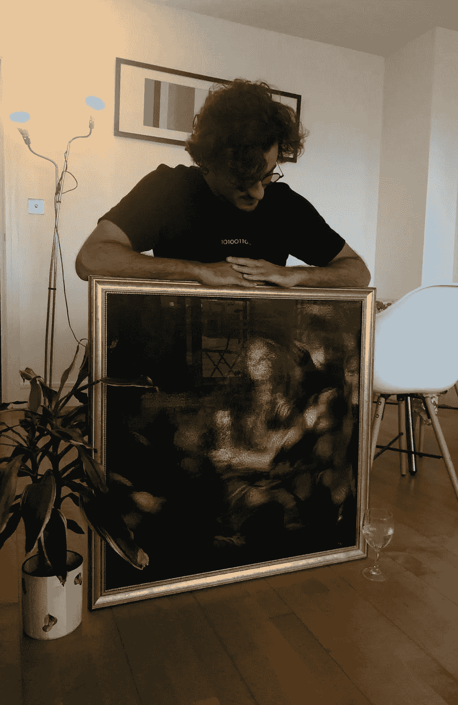
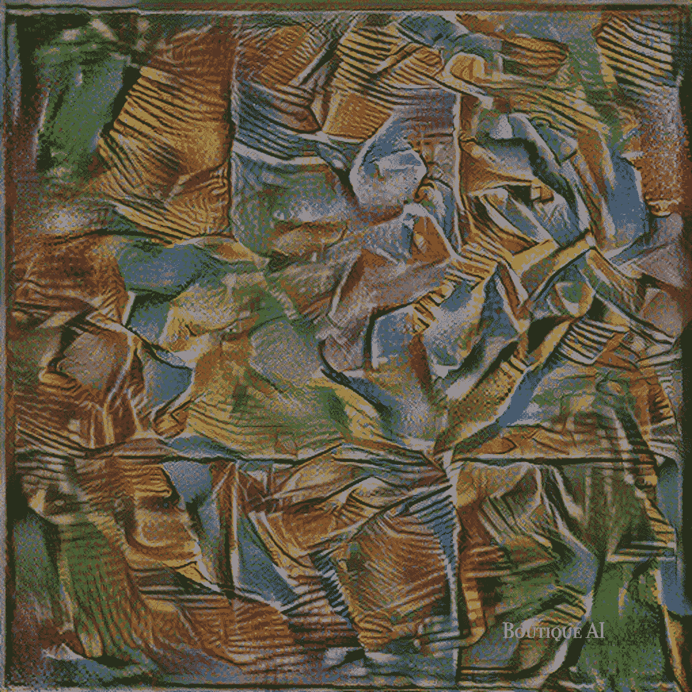
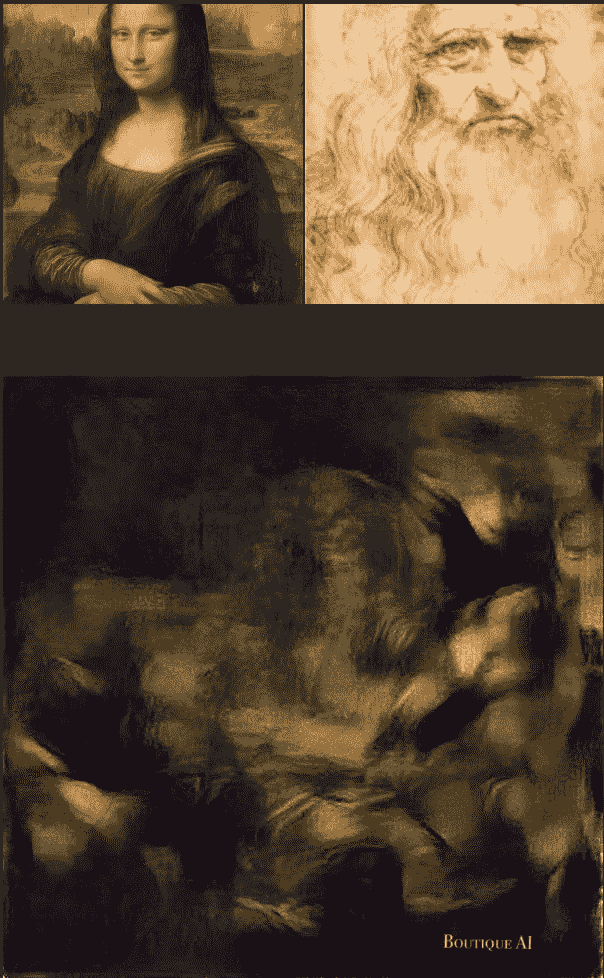
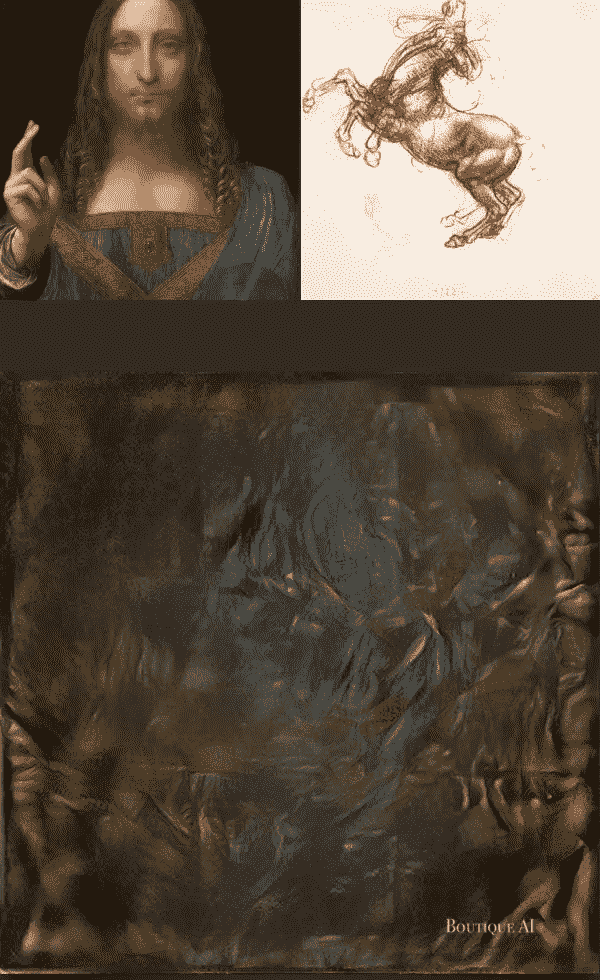
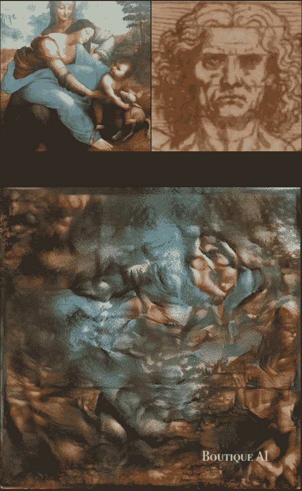

# 用深度神经网络揭开达芬奇的秘密信息

> 原文：<https://levelup.gitconnected.com/uncovering-da-vincis-secrets-with-deep-learning-28ad141c2b1d>

# 达芬奇的画背后有隐藏的信息吗？

阅读这篇文章，了解更多关于我如何使用深度神经网络来揭示达芬奇画作中隐藏的信息的旅程。

由 BoutiqueAI 人工智能系统设计的达芬奇作品《乔康达》

我将带您完成这次探索之旅，您将有机会参观以下目的地:

*   **达芬奇**
*   **隐写术**
*   **神经风格转移**
*   **BoutiqueAI**
*   **达芬奇的秘密**
*   **精华收藏**

> “艺术永远不会结束，只会被抛弃。”——达芬奇。

# 莱昂纳多·达芬奇

莱昂纳多·达·芬奇是有史以来最神秘的画家之一。他是一个公认的博学者，因为他的知识涵盖了各种不同的学科:生物学、数学、音乐、医学、建筑、工程、艺术等等。

像所有典型的文艺复兴时期的天才一样，达芬奇受到了古希腊哲学家和艺术家的启发。所以，我从一个问题开始:

> 达芬奇会在谷歌上搜索什么？

因为他对数学非常感兴趣，所以他的一些搜索可能会包含类似于*艺术、数学、古典希腊、古希腊这样的关键词。*

因此，在使用这些关键词的组合进行一些研究时，我遇到了一种古代数学技术，这种技术也被古希腊人用于艺术:**隐写术**。

# 密写

隐写术(steganography)一词来源于希腊语 steganos(意为隐藏或覆盖)和希腊语词根 graph(意为书写)。

隐写术是一种将秘密消息隐藏在普通的非秘密消息中以避免被发现的技术。隐写术的使用可以与加密相结合，作为隐藏或保护数据的额外步骤。

> [**古希腊人甚至保持着首次使用隐写术的吉尼斯世界纪录！**](https://www.guinnessworldrecords.com/world-records/first-use-of-steganography)

隐写术可用于隐藏几乎任何类型的数字或非数字内容，包括文本、图像、视频或音频内容。

通过隐写术隐藏的内容通常在被合并到看似无害的封面图像、文本、音频或任何其他类型的数据之前被加密。

然而，**如果不加密**，隐藏的图像通常会以某种方式进行处理，以增加检测秘密内容的难度。

> 列奥纳多·达·芬奇会不会用隐写术在他的画中隐藏秘密信息？

我们用深度学习来尝试回答这个问题。

# 神经类型转移

神经风格转移是一种优化技术，自 2015 年首次出现以来就颠覆了行业，研究论文:[“艺术风格的神经算法”](https://arxiv.org/abs/1508.06576)。

该算法采用两幅图像:

*   一张 ***内容*** 图片
*   ***一种样式*** ***参考*** 图片

然后，该算法将两个图像混合在一起，因此输出图像看起来像内容图像，但“绘制”为样式参考图像的样式。

这是通过优化输出图像以匹配内容图像的内容统计和样式参考图像的样式统计来实现的。这些统计数据是使用卷积神经网络从图像中提取的。

> …那又怎样？

**这个算法的威力停留在风格统计上。**事实上，风格网络提取了我们肉眼看不到的模式，这可能包括隐藏在风格来源的基本图像中的图像。这使得神经类型转移能够用作隐写内容的检测器。

> 深度神经网络利用了许多自然信号是组合层次结构的性质，其中通过组合较低级别的特征来获得较高级别的特征。在图像中，边缘的局部组合形成图案，图案组装成部件，部件形成物体。

如果你拍摄名画的高分辨率照片，并使用人工智能将它们分解为较低层次的特征，以生成新的艺术品，会怎么样？这正是 BoutiqueAI 所做的。

# 精品艾

从这种直觉出发，我开发了一个利用神经风格转移算法提取名画精髓的系统。

因此，我决定开始 [**我的当代艺术精品店**](https://boutiqueai.com) ，在这里我生成、存储并框出使用人工智能提取的名画的精髓。如果你想看更多我们的作品，你可以登陆我们的 instagram 页面。

从一幅画中提取精品香精的例子

# 达芬奇的秘密

所以，我们到达了旅程的终点。BoutiqueAI 工程团队在研究了乔康达的高分辨率照片多年后，意识到在达芬奇原画的色彩和阴影下隐藏着一个秘密信息。他们使用一种被称为风格转移的人工智能技术来解码乔康达，并向世界展示达芬奇隐藏了几个世纪的东西…

> 莱昂纳多·达·芬奇的自画像隐藏在乔康达的背后，人工智能已经首次能够揭开这一点。

列奥纳多的侧影在图像中间形成，自命不凡地成为支持《蒙娜丽莎》是达芬奇自画像的理论的第一个切实证据。提取的信息现在是一件精品艺术品，你现在可以通过购买它的像素来拥有一幅达芬奇自画像。

> 我们提取了三幅达芬奇经典画作的精髓

我们使用了其他高分辨率的达芬奇经典画作:

*   萨尔瓦多·芒迪
*   怀了孩子的处女和圣安妮

将这些结合在一起，我们创造了一个系列:*达芬奇的精华。*

## 达芬奇自画像

人工智能如何解读《乔康达》这样的杰作？我们研究了《乔康达》的高分辨率数字复制品，以了解这位艺术家的审美特征。受达芬奇《乔康达》风格的启发，达芬奇自画像是这个系列的第一个作品。

> 达芬奇的自画像藏在乔康达的后面。

列奥纳多的侧影在图像中间成形，自命不凡地成为支持[理论的第一个有形证据，该理论宣称蒙娜丽莎是达芬奇的自画像](https://en.wikipedia.org/wiki/Speculations_about_Mona_Lisa#:~:text=Lillian%20Schwartz%20of%20Bell%20Labs,a%20Man%20in%20Red%20Chalk.)。

莱昂纳多·达·芬奇自画像

## 达芬奇的马

萨尔瓦多·芒迪呢？设计的算法:

> 萨尔瓦多·芒迪的风格中隐藏着一匹蓝色的疯马。

萨尔瓦多·芒迪是否完全归功于达芬奇？这匹疯马能想起达芬奇画的一匹马。事实上，在米兰与 Ludovico il Moro 公爵相处期间，达芬奇受托为公爵的父亲设计了世界上最大的马术雕像。列奥纳多为这项工作做了很多准备，这就是为什么达芬奇留下了许多马的画。

> 莱昂纳多受委托为公爵的父亲设计了世界上最大的马术雕像。

达芬奇的马

## 维特鲁威人的脸

最后，我们系列的最后一件作品体现了圣母子与圣安妮的精髓。与我们之前的两个创作不同，这个创作的结果没有显示出任何可能与隐写术的使用有某种联系的结果。然而，图像的颜色和形状是完全和谐的。此外，换个角度看，你会发现一张男性的脸，让人想起达芬奇的《维特鲁威人》。

> 维特鲁威人的脸被编码成圣母子和圣安妮的风格。

维特鲁威人的脸

# 结束了

达芬奇精华液系列是精品艾创作的第一个系列。为什么我们称之为本质？

因为我们相信，我们的技术通过分解艺术品的定义视觉和主题特征，能够提取绘画的本质，同时可能发现隐写内容的存在。

达芬奇的精华系列包括三幅装裱的画作，灵感来自达芬奇的经典作品:《乔康达》、《萨尔瓦多·芒迪》和《圣母子与圣安妮》。每幅图像都印在一块 370gsm、尺寸为 59.4 x 84.1 cm 的画布上，并使用意大利制造的高端相框手工装裱。

> 每幅画都是独特的。我们用拉丁文在每一帧的后面从左到右手工编写算法。

你现在可以在 opensea 上购买精品人工智能数字艺术品的 NFT！

感谢阅读这篇文章，我希望你喜欢它，我希望这启发了你！