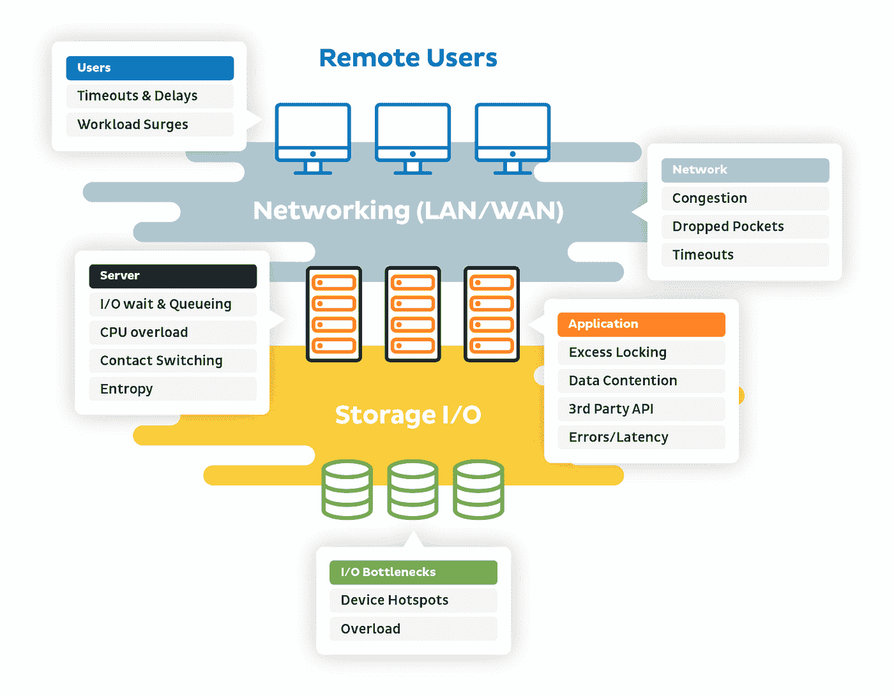
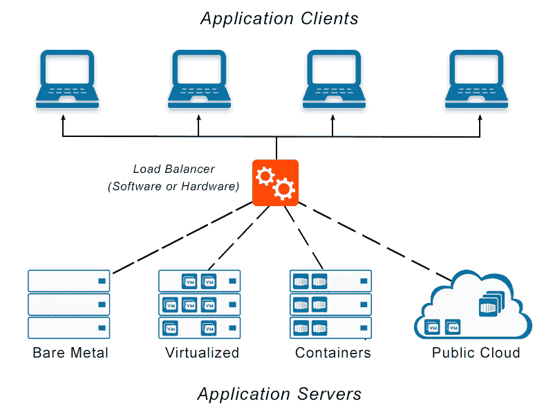

# 发现性能瓶颈以及如何补救它们

> 原文：<https://levelup.gitconnected.com/uncovering-performance-bottlenecks-and-how-to-remedy-them-668b992f514f>

Alex Kotliarskyi 在 [Unsplash](https://unsplash.com/s/photos/programming-performance?utm_source=unsplash&utm_medium=referral&utm_content=creditCopyText) 上的照片

当网站无法正常加载或下载资源需要很长时间时，用户通常会感到沮丧。这可能是网站有太多沉重的图形或大量文本的结果。

简而言之，性能瓶颈是指网站上任何减缓其加载时间并阻止其高效运行的东西。当应用程序使用文件非常大的照片或其他内容时，通常会出现这种情况。

在开发网站时，最重要的是强调用户体验(UX)，这意味着确保所有用户都能以简单的方式访问网站，并且网站加载速度快。我们都以自己独特的方式浏览互联网，为了自己独特的目的，使用各种各样的小工具，甚至通过各种方法连接到互联网。我们所有人都希望的一件事就是速度，这意味着我们希望页面尽可能快地加载，以便我们可以完成我们的任务。

降低速度的瓶颈会对网站的使用体验产生不利影响，并会降低网站的整体性能。最终，这会对你网站的 SEO(搜索引擎优化)产生影响，让人们更难在搜索引擎结果页面(SERPs)上找到你。据谷歌称，它使用的排名算法至少有时会考虑网站速度。通过在 web 应用程序或软件上执行[性能测试](http://www.blazemeter.com/blog/performance-testing-vs-load-testing-vs-stress-testing)，可以很容易地识别这些瓶颈。

# 为什么检测瓶颈很重要？

[来源](https://dzone.com/articles/scaling-microservices-identifying-performance-bott)

在大多数情况下，瓶颈可以在应用程序或软件的大部分中找到；尽管如此，还是来说说一些特别关键的。

每当我们讨论发现软件或应用程序瓶颈的过程时，为用户提供更好的整体体验是至关重要的。在时间方面存在许多潜在的瓶颈。加载时间就是一个例子，它指的是所需的总时间，应该尽可能短，以便用户获得最佳体验。如果加载时间较长，互联网连接非常有限的用户将无法访问网站，因为加载时间太长。

还有另一个与响应时间相关的测试。响应时间是指响应用户的查询或请求所需的时间。由于延迟的响应时间，用户将会有不愉快的体验，并且用户将不得不等待一段时间来发送任何相关的请求。

如果应用程序的适应性有问题，如果它无法适应不同数量的用户，这表明[的可伸缩性](https://en.wikipedia.org/wiki/Scalability)是有限的。这意味着如果大量用户试图连接到应用程序，应用程序可能无法为他们提供适当的资源或响应时间。因此，用户可能得不到供电，这将对系统的整体性能产生负面影响。

# 我们如何补救瓶颈？

[来源](https://avinetworks.com/glossary/load-balancer/)

当讨论消除已识别的[瓶颈](https://webwriterspotlight.com/performance-bottlenecks-stopping-your-website-from-making-you-money)时，有时很容易发现问题的根本原因，一旦这些原因被识别出来，问题就很容易解决。当我们谈到减少网站加载时间时，最简单的方法之一就是使用低内存的图片。这些图像将在很短的时间内加载，并可以在互联网连接速度较慢的设备上查看。

除了使用几个负载平衡器之外，还可以通过在许多不同的地理区域部署各种服务器和内容交付网络(cdn)来缩短响应时间，因为许多种类的[cdn](https://en.wikipedia.org/wiki/Content_delivery_network)和服务通常会提供这些功能。因此，网站能够提供可伸缩性，并且可以同时容纳大量不同的用户。

这可以通过部署负载平衡器来实现，它可以平衡发送到不同服务器的请求数量。因此，我们能够向用户交付改进的 UX，同时还能维护组织的良好声誉。

# 结论

当开发他们的应用程序或软件时，团队可能会遇到各种各样的瓶颈，团队可以识别其中的任何一个。这些瓶颈通常会导致客户的用户体验不佳，还可能导致公司的财务损失。

如果用户对某个网站有负面体验，他们就不太可能使用同一家公司拥有的类似网站。要拥有一个能够真正鼓励用户甚至提高组织收入的优秀应用程序，在应用程序启动之前检测这些瓶颈并消除它们是非常重要的。拥有优秀的应用程序至关重要。