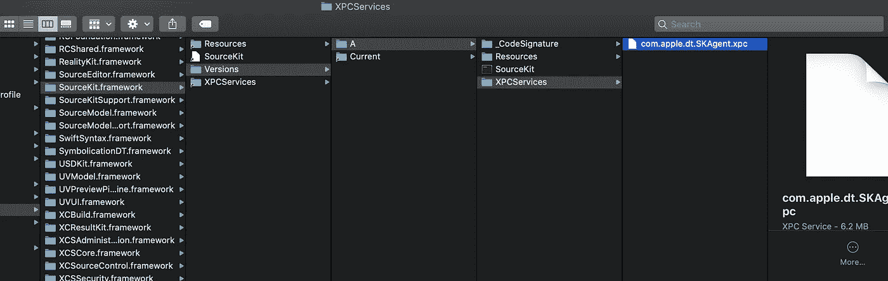
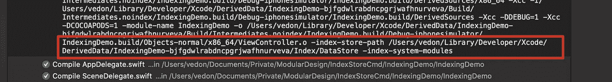

# 揭示 Xcode 索引

> 原文：<https://levelup.gitconnected.com/uncovering-xcode-indexing-8b3f3ff82551>

# TL；速度三角形定位法(dead reckoning)

我每天都在用 Xcode，但是对 Xcode 一无所知。在本文中，我将探讨什么是索引以及它是如何工作的。在本文的最后，我编写了一个简单的命令行工具来查询存储在索引数据存储中的信息。


# 摘要

```
**1\. Xcode Indexing
**  1.1\. What indexing is**2\. How indexing work**
  2.1\. Unit file and record file
  2.2\. Using IndexStore to query DataStore
  2.3\. Xcode Indexing Log**3\. Extend Reading**
```

# Xcode 索引

## 什么是索引

索引支持一系列 IDE 功能，如代码导航、语法突出显示、代码自动完成、跳转到定义、查找用法、重构。作为 iOS 开发人员，您每天都在使用这些功能。


## 索引的工作原理

当 Xcode 加载一个尚未构建的项目时，它会开始索引该项目。


Activity monitor 是一个方便的工具，可以帮助你找出正在运行的进程，我打开项目后，Xcode 和 SKAgent 会从列表中弹出。


所以，问题是什么是 SKAgent？sk agent 是 SourceKit 框架的组件，运行编译命令以生成索引信息。SKAgent 可执行二进制文件位于/Applications/xcode . app/Contents/shared frameworks/source kit . framework/Versions/A/xpc services/com . apple . dt . sk agent . xpc/Contents/MAC OS/com . apple . dt . sk agent



SKAgent 是一个由 SourceKit 运营的 [XPC 服务](https://developer.apple.com/library/archive/documentation/MacOSX/Conceptual/BPSystemStartup/Chapters/CreatingXPCServices.html)，使用 [XPC](https://developer.apple.com/documentation/xpc) 机制与 Xcode 通信。


我修改了环境变量 SOURCEKIT_LOGGING，以启用 SOURCEKIT 的日志记录。然后打开终端，输入 source kit _ LOGGING = 3/Applications/Xcode . app/Contents/MAC OS/Xcode & > ~/Desktop/indexing . log，文件 [indexing.log](https://gist.github.com/vedon/06c62df3faebcbb055b33356e5918585) 有很多信息，为了更好的演示，我把内容突出出来。SourceKit-Client，也称为 Xcode，需要 indexer 使用以下参数来打开或创建索引。


图 1

客户端需要索引器来注册由源文件组成的对象。


图 2

SourceKit 向客户端发布通知，告知编译器将开始编译源文件 ViewController.swfit。


图 3

SourceKit 向客户端发布通知，告知编译器已完成 ViewController.swift 的编译。


图 4

索引数据存储在由参数 pass by command-index-store-path 指定的路径中，在图 3 中用蓝色突出显示。


在 SourceKit 完成索引后，我尝试跳转到定义，添加新文件，添加新函数并重命名函数，以验证索引是如何工作的。

*   跳到定义

只需右键单击 hello 函数，然后单击跳转到定义


*   添加新文件

向项目添加新文件 Modal。


*   添加新功能


*   重新命名

重命名 Modal.swift 中声明的函数


你做的上述动作，Xcode 会转换成一个请求。该请求将发送到 SourceKit。有几种类型的请求

*   代码完成
*   光标信息
*   德曼灵
*   矫直
*   证明文件
*   模块接口生成
*   索引
*   协议版本
*   编译器版本

您可以前往 [SourceKit 协议文档](https://github.com/apple/swift/blob/master/tools/SourceKit/docs/Protocol.md#compiler-version)了解更多详细信息。SourceKit 收到请求后，将查询索引数据(数据存储)来完成请求，并生成对 Xcode 的相应响应。SourceKit 和 Xcode 作为 CS 架构工作。SourceKit 是服务器，Xcode 是 SourceKit-client。


## 单元文件和记录文件

clang 和 swift 编译器都支持命令行选项-索引-存储-路径

<dir>，它告诉编译器在给定的目录中以**单元文件**和**记录文件**的形式产生索引信息。当-index-store-path 选项存在时，clang 将添加前端动作 [IndexRecordAction](https://github.com/apple/swift-clang/blob/swift-DEVELOPMENT-SNAPSHOT-2017-08-21-a/lib/Index/IndexingAction.cpp#L455) 。它使用一个 [IndexASTConsumer](https://github.com/apple/swift-clang/blob/swift-DEVELOPMENT-SNAPSHOT-2017-08-21-a/lib/Index/IndexingAction.cpp#L51) 从类型检查的 AST 中收集符号出现。除此之外，它还使用一个[IndexDependencyProvider](https://github.com/apple/swift-clang/blob/swift-DEVELOPMENT-SNAPSHOT-2017-08-21-a/lib/Index/IndexingAction.cpp#L331)来收集编译中涉及的源文件和模块，以及任何相关的文件包含和模块导入关系。当前端操作完成时(即调用 IndexRecordAction 的 finished()方法)，收集的索引数据被写出到索引数据存储中。</dir>

将索引数据写入存储由 [IndexRecordWriter](https://github.com/apple/swift-clang/blob/swift-DEVELOPMENT-SNAPSHOT-2017-08-21-a/include/clang/Index/IndexRecordWriter.h#L56) 和 [IndexUnitWriter](https://github.com/apple/swift-clang/blob/swift-DEVELOPMENT-SNAPSHOT-2017-08-21-a/include/clang/Index/IndexUnitWriter.h#L47) 类处理。


仅供参考，你可以在这里下载[演示](https://github.com/vedon/IndexStoreCmd/tree/master/IndexingDemo)。

## **单位档案**

**单元文件**是记录关于编译器调用的翻译单元的信息的文件，跟踪源文件路径集并匹配组成它们的记录文件，以及它们所依赖的任何其他编译单元的单元文件。它们遵循命名约定" *basename-hash"* ，其中 *basename* 是输出文件的 basename(在-o 选项中传递给编译器的文件)，而 *hash* 是输出文件绝对路径的[LLVM Hash](https://github.com/apple/swift-llvm/blob/stable/include/llvm/ADT/Hashing.h)——如果在-o 选项中给编译器的路径是相对路径，则在散列之前会将其转换为绝对路径。

ViewController 单元文件的内容如下所示

## **记录文件**

**记录文件**记录编译过程中使用的不同文件中遇到的符号信息。它们遵循命名约定" *basename-hash"* ，其中 *basename* 是编译器读取的文件的 basename(例如 stdio.h)，而 *hash* 是文件内容经过预处理后的 hash。

ViewController 记录文件的内容如下所示

要获得 c-index-test 工具，你可以克隆 [llvm](https://github.com/apple/llvm-project.git) ，并遵循官方[指令](http://clang.llvm.org/get_started.html)。构建 llvm 后，可执行文件位于 llvm-project/build/bin。


## 使用 IndexStore 查询数据存储

此外，您可以使用 [IndexStore-db](https://github.com/apple/indexstore-db) 来查询存储在由 *-index-store-path 指定的目录中的索引数据。* **我写了一个**[**命令行工具**](https://github.com/vedon/IndexStoreCmd) **使用 IndexStore 查找输入值指定的所有符号的引用。**

[](https://github.com/vedon/IndexStoreCmd) [## vedon/IndexStoreCmd

### 在 GitHub 上创建一个帐户，为 vedon/IndexStoreCmd 的开发做出贡献。

github.com](https://github.com/vedon/IndexStoreCmd) 

首先，下载[演示](https://github.com/vedon/IndexStoreCmd)。其次，打开 IndexingDemo.xcodeproj 并构建。构建完成后，进入报告导航器，找到每个编译单元指定的存储路径。



打开 IndexStoreCmd.xcodeproj，添加存储路径和要搜索的符号。


运行 IndexStoreCmd 后，结果如图 5 所示，模型被 ViewController 和 ModalManager 引用。


图 5


图 6

比较图 5 和图 6，结果与源文件中声明的引用相匹配。下图描绘了 Xcode，SourceKit，编译器，和 IndexStore_db 的架构，非官方，如有不妥请告知。


## Xcode 索引日志

您可以覆盖 Xcode 设置 IDEIndexShowLog，以立即查找索引日志。打开终端，输入默认值写 com . apple . dt . xcode IDEIndexShowLog-bool YES。因为索引是在后台进行的，所以它使您能够在编码后立即执行一些索引操作，比如跳转到定义。


# 延伸阅读

[揭开资料包](https://www.jpsim.com/uncovering-sourcekit/)

[工具包](https://github.com/apple/swift/tree/master/tools/SourceKit)

[XPC 服务](https://developer.apple.com/library/archive/documentation/MacOSX/Conceptual/BPSystemStartup/Chapters/CreatingXPCServices.html)

[为 Clang 添加索引构建支持](https://docs.google.com/document/d/1cH2sTpgSnJZCkZtJl1aY-rzy4uGPcrI-6RrUpdATO2Q/edit#)

[**LLVM**编译器基础设施](http://www.llvm.org/devmtg/)

[苹果索引商店数据库](https://github.com/apple/indexstore-db)

视频:[边建边索引](https://www.youtube.com/watch?v=jGJhnIT-D2M)，pdf: [边建边索引](http://llvm.org/devmtg/2017-10/slides/Lorenz-Hawes-Index%20while%20building%20and%20refactoring%20in%20Clang.pdf)

[铿锵声索引标题](https://github.com/apple/swift-clang/tree/swift-DEVELOPMENT-SNAPSHOT-2017-08-21-a/include/clang/Index)

IndexSymbol.h 。

[演示](https://github.com/vedon/IndexStoreCmd)

[Xcode 设置](https://gist.github.com/vedon/fa0f1f69543789a0752593dcc9190b29)