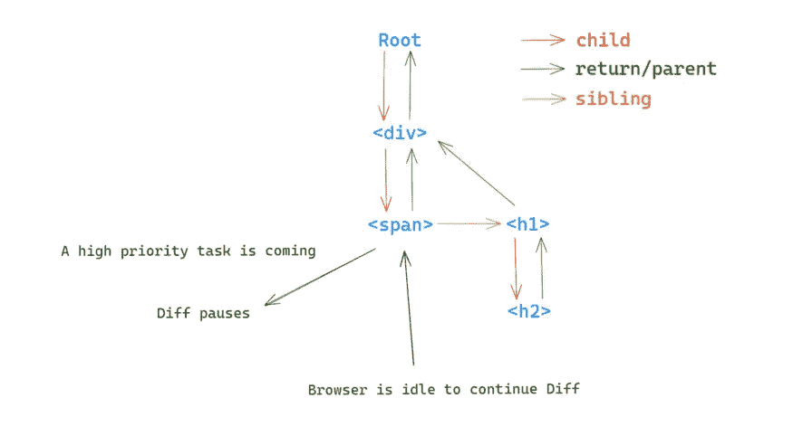

# 引擎盖下:反应 vs. Vue vs .苗条

> 原文：<https://levelup.gitconnected.com/under-the-hood-react-vs-vue-vs-svelte-cef44d26c0bc>

## 前端框架的权衡

艾莉森·伊万塞克在 [Unsplash](https://unsplash.com?utm_source=medium&utm_medium=referral) 上拍摄的照片

前端开发中的框架是不断更新变化的。从早年的 jQuery 到近几年的 React、Vue、Svelte。很多开发人员厌倦了不断变化的框架，但事实上，这些框架之间的许多设计理念是相同的。

本文将从引擎盖下揭示它们之间的异同，希望对你有所帮助。

# 语法差异:

在 jQuery 时代，它的大部分框架都是基于字符串模板进行渲染的。例如下划线、baiduTemplate 等。

它的本质原理很简单，就是用数据填充我们写的模板，最后转换成 DOM。但这有一个缺点，就是每次数据更改都需要重新生成，无法重用。

在现代前端框架中，Vue 和 Svelte 延续了这种模板思想。如果你用过他们，你肯定能说一两种他们提供的 [DSL](https://en.wikipedia.org/wiki/Domain-specific_language) 。例如 Vue 中的“v-for”、“v-if”指令等。

对于框架开发人员来说，这些模板的 DSL 允许他们在编译时做尽可能多的事情。例如，Vue 可以标记在编译时从不改变的静态虚拟 DOM。所以在做虚拟 DOM 的 Diff 算法时，Vue 可以跳过这些静态标签。从而减少 CPU 计算量，提高性能。

像 Svelte 这样更“激进”的框架严重依赖模板。只要开发者按照其指定的语法编写，就会在编译时将所有模板语法转换成原生 DOM 操作。因此，它抛弃了庞大的虚拟 DOM Diff 算法，将所有内容都恢复到原始状态，从而提高了性能。

照片由[劳塔罗·安德烈亚尼](https://unsplash.com/@lautaroandreani?utm_source=medium&utm_medium=referral)在 [Unsplash](https://unsplash.com?utm_source=medium&utm_medium=referral) 上拍摄

React 一直很欣赏 JSX。它使用 JavaScript 来描述 DOM，这给我们的开发带来了很大的自由度。但是，对于框架开发人员来说，在编译时可以完成的优化更少。

一般来说，DSL 用得越多，它提供的 API 就越多越复杂。比如写子组件的时候，React 没有对应的 API，而 Vue 提供了 slot 特性，Svelte 提供了 4 个 API，分别是`<slot>`、`$$slots`、`<slot name="name" >`、`<slot key={value}>`。可以看出，那些 DSL 较多的框架，编写复杂组件的成本更高，也容易出错。

DSL 无疑引入了新概念和新语法。这都给开发者带来了一定的学习成本。但同时，其限制性的语法也给框架带来了更多的可能性。

# 运行时间差异:

相比 React 或 Vue 提供的虚拟 DOM，Svelte 将模板转换为原生 JavaScript 操作，因此几乎没有额外的运行时逻辑。所以主要说说 React 和 Vue。

Vue 一直倡导数据可变的理念。早期的 Vue@1.x 没有使用虚拟 DOM 而是使用`[Object.defineProperty()](https://developer.mozilla.org/en-US/docs/Web/JavaScript/Reference/Global_Objects/Object/defineProperty)`对所有数据进行反应式数据绑定。当数据发生变化时，可以通知相应的侦听器，并更改相应的 DOM。但是如果数据量非常大，监听器会很多，会极大的消耗 CPU 操作，占用更多内存。那么就会极大的影响性能。

所以在 Vue@2.x 甚至 Vue@3.x 中加入了虚拟 DOM 的 diff 算法，他们把监控的粒度提升到组件级别，把虚拟 DOM 的 Diff 限制在组件级别。当组件中的数据改变时，组件的虚拟 DOM 的 Diff 任务被添加到任务队列中。并在 Vue 提供的 [nextTick](https://vuejs.org/api/general.html#nexttick) 中执行 Diff 算法。

该解决方案在组件级别控制反应式监听器。它极大地减少了侦听器的数量(从而减少了内存消耗和 CPU 操作)。而且还能准确定位哪个或哪些组件受到当前数据变化的影响，从而有效降低虚拟 DOM 的比较量级(减少 CPU 计算)。

照片由[丹尼·米勒](https://unsplash.com/@redaquamedia?utm_source=medium&utm_medium=referral)在 [Unsplash](https://unsplash.com?utm_source=medium&utm_medium=referral) 上拍摄

React 一直倡导不可变数据的理念。每一个数据变化都会触发整个应用级虚拟 DOM 的差异。如果当前应用程序的虚拟 DOM 树非常大，那么递归计算整个树的 Diff 将需要很长时间。所以最近更新的 18 版本正式采用了纤程架构。这种架构将 Diff 计算小型化，通过“链表”将计算量分配到浏览器每一帧的空闲时间。

React 的解决方案没有减少 CPU 的计算量，但它很聪明地做到了这一点，而没有牺牲渲染性能。要了解更多细节，你也可以看看我的另一篇文章:

 [## React 的可中断更新是如何工作的？

### Vue 为什么不用光纤架构？

better 编程. pub](https://betterprogramming.pub/how-does-reacts-interruptible-updates-work-5340bcaadb1a) 

当我们需要跟踪状态变化时，React 的数据不变性给我们带来了极大的便利。这也使得我们的代码更容易理解和维护。在我看来，Vue 的可变性只是为了方便书写。

相对于一类强调编译的 web 框架，比如 Svelte，React 和 Vue 都是在运行时加入虚拟 DOM。这无疑会增加额外的处理逻辑。但在我看来，虚拟 DOM 更大的潜力在跨端。就像 React-Native 一样，它的真实渲染层可以调用相应平台的 API 进行绘制。

你觉得这些框架怎么样？你喜欢哪一个？

*感谢阅读。如果你喜欢这样的故事，想支持我，请考虑成为* [*中等会员*](https://medium.com/@islizeqiang/membership) *。每月 5 美元，你可以无限制地访问媒体内容。如果你通过* [*我的链接*](https://medium.com/@islizeqiang/membership) *报名，我会得到一点佣金。*

你的支持对我来说非常重要——谢谢。