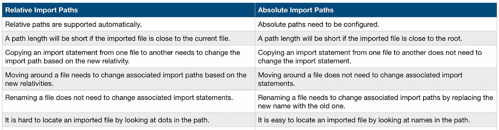

# 理解和配置 JavaScript 中的绝对导入路径

> 原文：<https://levelup.gitconnected.com/understand-and-configure-absolute-import-paths-in-javascript-5cde3be2630d>

自动支持相对导入路径。绝对导入路径是如何配置的？


ES6 模块是一个 JavaScript 文件，在它自己的范围内执行。模块中声明的变量、函数和类需要显式导出。所有要在其他文件中使用的模块必须由接收文件导入。

正如我在另一篇文章中所描述的，导入路径可以写成:

```
import * as myImportModule from './myExports';
```

这里。/myExports '是一个模块名，它是用相对路径写的。模块名也可以用绝对路径来写，但是我们必须配置我们的项目来识别它。无论哪种方式，路径都指向一个. js。jsx，. d.ts，.ts，或者。包含要导入的模块的 tsx 文件。

模块名也可以指向 node_modules 下的库，在这种情况下不需要路径(node_modules 是根)。

```
import React from 'react';
import { Provider } from 'react-redux';
```

# 什么是相对和绝对导入路径？

让我们来看看下面的目录结构:

```
src
 └─┬── folder1
   |      └───── file1.js
   |
   ├── folder2
   |      └───── folder5
   |                └───── file3.js
   |
   ├── folder3
   |      └───── file2.js
   |
   └── folder4
          └───── folder6
                    └───── folder7
                              ├───── file4.js
                              └───── file5.js
```

相对导入路径是相对于当前位置的路径。

对于 file1.js，它可以通过这些相对路径导入其他模块:

```
import * as file2 from '../folder3/file2';
import * as file3 from '../folder2/folder5/file3';
import * as file4 from '../folder4/folder6/folder7/file4';
import * as file5 from '../folder4/folder6/folder7/file5';
```

对于 file5.js，它可以通过这些相对路径导入其他模块:

```
import * as file1 from '../../../folder1/file1';
import * as file2 from '../../../folder3/file2';
import * as file3 from '../../../folder2/folder5/file3';
import * as file4 from './file4';
```

绝对导入路径是从根目录开始的路径，您需要首先定义一个根目录。在典型的 JavaScript/TypeScript 项目中，一个常见的根目录是`src`目录。

对于 file1.js，它可以通过以下绝对路径从其他文件导入:

```
import * as file2 from 'folder3/file2';
import * as file3 from 'folder2/folder5/file3';
import * as file4 from 'folder4/folder6/folder7/file4';
import * as file5 from 'folder4/folder6/folder7/file5';
```

对于 file5.js，它可以通过以下绝对路径从其他文件导入:

```
import * as file1 from 'folder1/file1';
import * as file2 from 'folder3/file2';
import * as file3 from 'folder2/folder5/file3';
import * as file4 from 'folder4/folder6/folder7/file4';
```

下表比较了相对导入路径和绝对导入路径。



相对和绝对导入路径各有利弊。一般来说，建议使用绝对导入路径来避免相对路径地狱，尽管这两种方式[可以共存，并且可以根据具体情况有选择地使用](https://forums.meteor.com/t/import-absolute-or-relative-path/20595)。

对于 file5.js，以下混合方式会产生最短的导入路径:

```
import * as file1 from 'folder1/file1';
import * as file2 from 'folder3/file2';
import * as file3 from 'folder2/folder5/file3';
import * as file4 from './file4';
```

# 如何用绝对路径配置导入？

默认情况下不支持绝对路径。这些是我们用于由 [Create React App](https://medium.com/better-programming/10-fun-facts-about-create-react-app-eb7124aa3785) 生成的项目的配置。`src`是我们的根目录。

## `jsconfig.json/tsconfig.json`

对于 JavaScript 项目，`jsconfig.json`的设置如下:

```
{
  "compilerOptions": {
    "baseUrl": "src" // "./src" works too
  "include": ["src"]
}
```

对于 TypeScript 项目，`tsconfig.json`的设置可以完全一样。

随着配置文件的建立，构建过程将接受绝对路径。然后，应用程序正常运行。

## . eslintrc.js

linter 是一个静态代码分析工具，用于识别 JavaScript 代码中的问题模式。ESLint 是最受欢迎的棉绒。您可以设置以下 NPM 脚本来运行 lint。

```
"scripts": {
  "lint": "npx eslint --max-warnings=0 --ext .tsx,.ts,.js,.jsx src/ --fix"
}
```

lint 脚本可以单独执行，也可以作为构建过程的一部分进行配置。

为了让 lint 脚本接受绝对路径，也为了让 IDE(如 [VSCode](https://medium.com/better-programming/10-useful-plugins-for-visual-studio-code-6ab62c0b14ee) )不在绝对路径上抛出 lint 错误，我们为 JavaScript 和 TypeScript 项目设置了如下的`.eslintrc.js`:

```
module.exports = {
  settings: {
    'import/resolver': {
      node: {
        extensions: ['.js', '.jsx', '.d.ts', '.ts', '.tsx'],
        moduleDirectory: ['node_modules', 'src'],
      },
    },
  },
  ...
}
```

JavaScript 项目不需要有`‘.d.ts’, ‘.ts’, ‘.tsx’`,但是把它们留在那里没有坏处。

## jest.config.js

我们使用 Jest 为 JavaScript 和 TypeScript 项目运行单元测试用例。为了让单元测试用例定位代码中的绝对路径，我们需要设置`jest.config.js`以将`src`作为根:

```
module.exports = {
  moduleDirectories: ['node_modules', 'src'],
  ...
};
```

我们在项目中使用了绝对导入路径，并且效果很好。你想试一试吗？

感谢阅读。我希望这有所帮助。如果你有任何问题，请随时回复。你可以在这里看到我的其他媒体出版物。