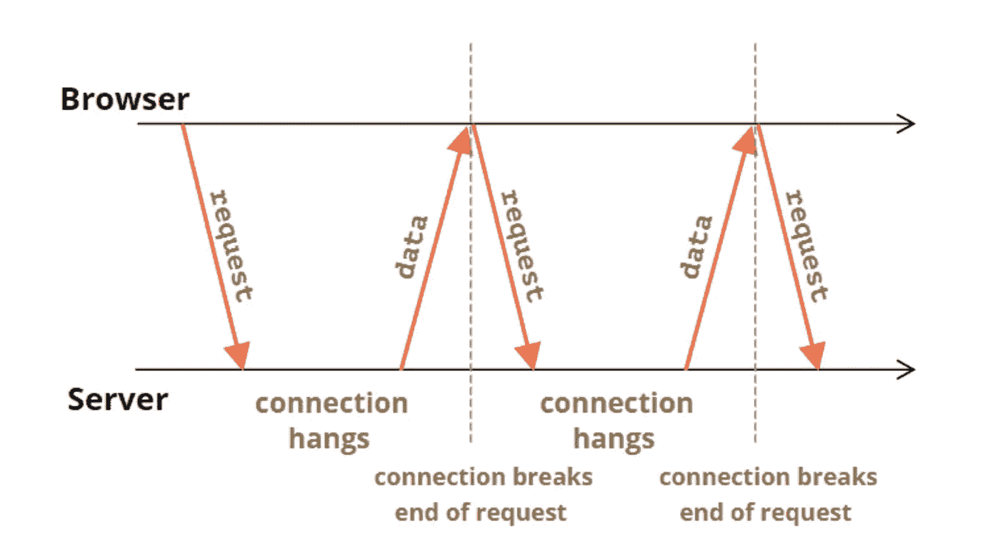

# 理解并实现 Node.js 中的长轮询和短轮询

> 原文：<https://levelup.gitconnected.com/understand-and-implement-long-polling-and-short-polling-in-node-js-94334d2233f3>

HTTP 轮询是一种我们可以用来构建实时应用程序的技术。在本文中，您将了解什么是短轮询和长轮询。我们还想用 Node.js 实现一些例子。

# 什么是短轮询？

在短轮询中，客户端*向服务器发送常规请求*。如果服务器有新的信息，它会将它发送回客户端，否则它会发送一个空响应。

客户端发送请求的时间取决于业务类型。

这段时间越短，服务器上的压力就越大。

# 短轮询的用例有哪些？

如果您需要的更新频率不短(超过几秒和几分钟)，您可以使用短轮询来更新您的客户端(目前没有这方面的标准)。一个很好的例子是发送关于客户端环境温度的更新。温度不是我们每秒更新的东西，也许我们可以从服务器每 1 或 2 分钟更新一次。


短轮询图

让我们用短轮询实现一个短天气 API。

# 短轮询示例

这是一个简单的快速应用程序，用于实时获取天气数据。

我们需要两条路线来实现最新的天气状态:

*   */weather/* :第一次获取天气数据
*   */weather/update* :用于获取天气数据的更新。

在第一个路径中，我们返回一个数组:

第一时间获取天气数据

为了获得天气变化，我们将生成这些随机数中的一个:-1，0，1，表示城市温度的变化:

```
Math.ceil(Math.random()*3 - 2) // A random number: -1, 0, +1
```

为了模拟温度的变化，我们可以使用这样一个函数:

天气变化发生器

如果温度变化不为 0，我们只给对象添加一个键值。(不向客户端发送不需要的数据)

此外，我们必须定期调用这个函数，以每分钟改变它。(想象一下，在真实情况下，我们向第三方发送请求，第三方从世界各地获取传感器数据，并每分钟更新数据)

在这个函数中我们应该做的是

*   如果一个城市的温度没有变化，我们需要从`changes`对象中删除这个城市
*   如果有变化，我们需要将它添加到`changes`对象中，并更新保存所有数据的原始对象`weathers`。

获取天气更新

让我们一起检查我通过向这些路由发送请求获得的数据:

*   第一次获取天气数据:我们可以看到所有的城市都在这个响应中。
*   获得更新:没有变化，所以我们收到:`{"changes": {}}`
*   得到最新消息:只有巴黎的天气变了。
*   更新:仍然只有巴黎变了(你可能会问为什么我们又有了同样的变化？因为我们发送请求太快，如果数据每分钟都在更新，我们每秒发送一个请求，那么我们会得到 59 次相同的更改，直到更改被更新)
*   更新一下:只有柏林变了。
*   获得最新消息:所有四个城市的温度都有变化。


获取天气数据的示例

这是一个超级简单的短轮询应用程序的实现。

## 短轮询有什么问题？

通常，当 ***可接受的延迟较低*** 时，轮询频率会对服务器、网络或两者造成不可接受的负担。例如，在线游戏和资本市场中的高频交易是我们需要在短时间内更新状态的两个很好的例子(对于一些在线游戏，甚至 100 毫秒的延迟也被认为是不可接受的)。此外，短轮询和长轮询之间还有一些共同的问题，您可以在本文的最后一部分查看:

*   **割台开销**
*   **连接建立**
*   **缓存**

整个短轮询示例

简短轮询示例(完整)

现在让我们进入长期投票。问题是:我们想要同样的天气应用程序，而用户想要每 100 毫秒更新一次。我们没有足够的资源来处理大量的请求。例如，如果我们有 1000 个活跃用户查看我们的天气页面，那么我们需要每秒处理 10，000 个请求。因此，在增加资源之前，我们想尝试的第一件事是使用 **HTTP 长轮询**，看看它是否能减少负载。

# 什么是长轮询？

在 HTTP 长轮询中，服务器让您保持一个开放的 TCP 连接，然后您可能会收到来自已更改内容的响应，或者您的请求可能会在一段时间后超时，在这两种情况下，您都必须**重新建立**另一个连接。换句话说，客户端总是与服务器保持实时连接。



长轮询图

## 这样设计的原因是什么？

*   **最小化服务器-客户端消息的延迟**:您有一个到数据库的开放连接，这样您就可以在它改变后立即获得新的状态。
*   **最小化使用处理/网络资源**:当没有变化时，我们不发送检查状态的请求。

# 长轮询示例

我们想把我们的短轮询实现变成长轮询实现。

唯一的区别是，当没有变化时，我们不需要在`update`路由中发送响应。我们需要倾听变化，当天气温度发生变化时，我们应该将更新的数据发送给用户。为了实现这一点，我们使用了事件发射器:

实现长轮询的简单事件发射器

现在，每当我们发出一个事件`new_change`时，我们的端点就会发送所有的响应。如果你想了解更多关于事件发射器的信息，你可以查看[这篇文章](https://javascript.plainenglish.io/how-we-can-use-node-js-event-emitter-5c9e39c38749)。

让我们将它集成到我们的应用程序中:

第一步，我们需要创建我们的事件发射器:

```
const weatherChange = new Event()
```

在第二步中，我们需要在函数检测到变化时发出一个事件，因此我们需要检查`changes`对象是否为空。

当 changes 对象不为空时发出事件

让我们将更新路线改为:

通过添加一个侦听器，我们只在发生变化时发送响应。还要小心监听器，因为如果不删除它，会导致内存泄漏(监听器函数仍然希望返回对前一个请求的响应)。

获取天气变化的长轮询路线

让我们看看轮询工作了多长时间。每当我们得到响应时，我将发送另一个请求:


运行中的长轮询示例

## 长轮询设计有哪些问题？

*   **报头开销**:每个轮询响应都是一个完整的 HTTP 消息，因此
    在消息帧中包含了完整的 HTTP 报头集。*(短轮询设计也存在这个问题)*
*   **最大延迟**:在收到每个响应后，
    服务器需要等待下一个长轮询请求，然后才能向客户端发送另一个
    消息
*   **连接建立**:在 Http 轮询中，你需要频繁打开 TCP/IP 连接，这是有代价的。
    连接，然后关闭它们。*(短轮询设计也存在这个问题)*
*   **超时**:Firefox 的默认超时值是 [90 秒](https://digitash.com/learntips/topic/how-to-change-firefox-network-connection-timeout-settings/)，chrome 是 [300 秒](https://source.chromium.org/chromium/chromium/src/+/main:net/socket/client_socket_pool.cc;l=25)，但是大多数网络基础设施包括
    代理和服务器，它们的超时时间并不长，所以你的请求可能会比这个时间更早超时。
*   **缓存**:由中间实体实现的缓存机制会干扰长轮询请求。终端客户端或主机无法向 HTTP 中介发出信号通知长轮询正在使用中；作为一个最佳实践，在一个长轮询请求或响应中总是有意禁用缓存。例如，这可以通过将“高速缓存控制”报头设置为“无高速缓存”来实现。*(短轮询设计也存在问题)*

# 结论

在我看来，人们可以实现的最简单的实时实现是使用短轮询设计。在下一步中，根据业务情况，您可以尝试长时间轮询来减轻压力。最终，从长远来看，使用 Web Sockets 等其他解决方案来扩展您的实时应用程序更有意义。

 [## RFC 6202:使用长轮询和流式传输的已知问题和最佳实践…

### 信息互联网工程任务组(IETF) S. Loreto 征求意见:6202 爱立信类别…

www.rfc-editor.org](https://www.rfc-editor.org/rfc/rfc6202) [](https://www.informatica.com/services-and-training/glossary-of-terms/low-latency-definition.html) [## 低延迟:它是什么，意义和定义

### 了解有关低延迟的更多信息，包括哪里需要低延迟，以及如何在金融交易等行业中使用低延迟。

www.informatica.com](https://www.informatica.com/services-and-training/glossary-of-terms/low-latency-definition.html) [](https://www.esparkinfo.com/blog/node-js-long-polling.html) [## Node.js 框架中长轮询的综合指南

### 根据最新的网络技术，有一个稳定的信息传输从一端到另一端，没有任何…

www.esparkinfo.com](https://www.esparkinfo.com/blog/node-js-long-polling.html)