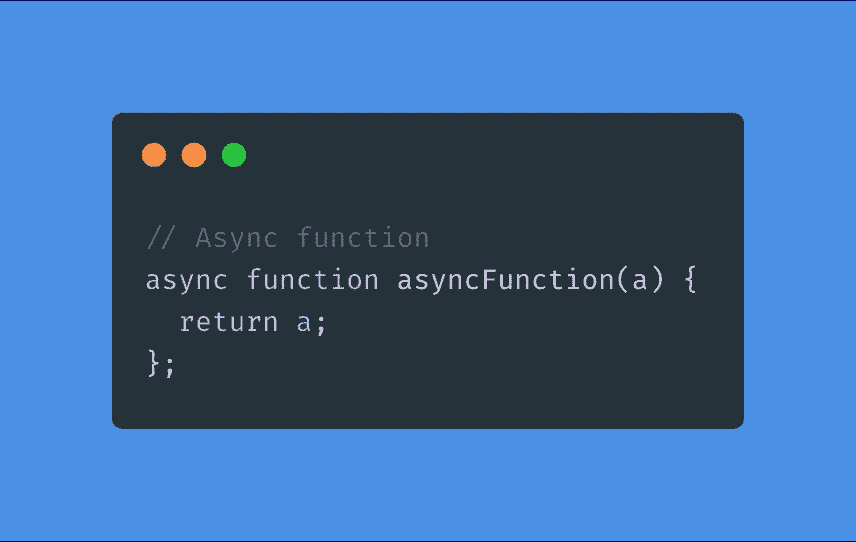
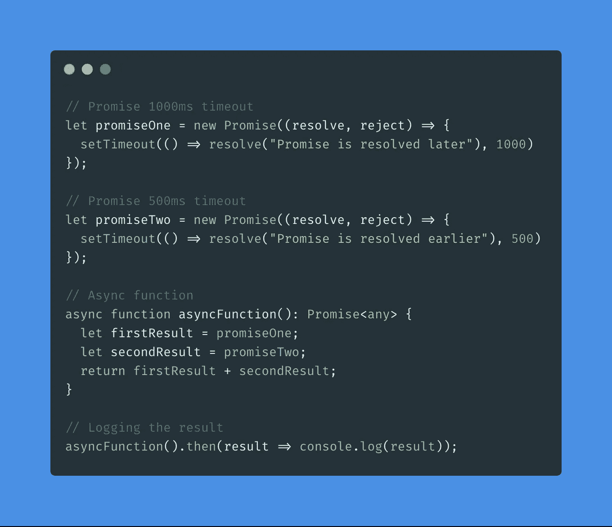
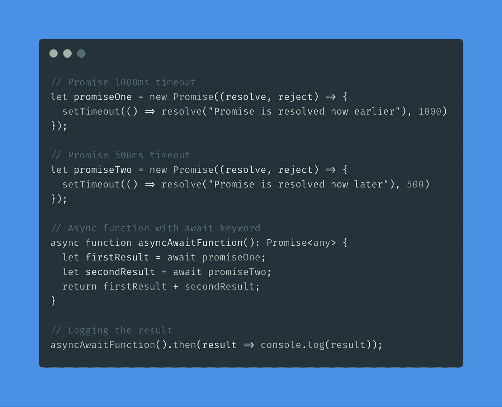

# 理解 TypeScript 中的 Async/Await—只需 2 分钟

> 原文：<https://levelup.gitconnected.com/understand-async-await-in-typescript-in-only-a-few-minutes-dedb5a18a2c>

## 让我们不要浪费你的时间。快速理解 TypeScript 中的 async/await。

[菠萝供应公司](https://unsplash.com/@pineapple?utm_source=medium&utm_medium=referral)在 [Unsplash](https://unsplash.com?utm_source=medium&utm_medium=referral) 上拍摄的照片

# 我们今天的话题:

*   异步关键字
*   Await 关键字

# 让我们从 Async 关键字开始

使用 TypeScript 应用程序中的`async`关键字，我们可以像这样创建**异步函数**，方法是将它添加到`function`关键字之前:

代码显示由[碳](https://carbon.now.sh/?bg=rgba(74%2C144%2C226%2C1)&t=material&wt=none&l=application%2Ftypescript&ds=false&dsyoff=20px&dsblur=68px&wc=true&wa=true&pv=56px&ph=56px&ln=false&fm=Fira%20Code&fs=14px&lh=152%25&si=false&es=2x&wm=false)

在下一个例子中，我们有两个承诺返回一个字符串。一个在 500 毫秒后，另一个在 1000 毫秒后。在`asyncFunction`里面，我们先叫`promiseOne`，再叫`promiseTwo`。最后一个承诺有 500ms 的优势。因此，如果我们记录这个`asyncFunction`，那么第二个承诺会比第一个稍微早一点记录。很简单。

# Await 关键字

用下一种方法，我们可以写出比[链式承诺](https://javascript.info/promise-chaining)更干净、更容易理解的代码。我们将在示例中添加关键字`await`。关键字`await`所做的唯一一件事就是在继续下一个承诺之前等待承诺解决。就是这样。让我们看看我们的例子:

在`asyncAwaitFunction`内部，我们再次首先调用`promiseOne`，然后调用`promiseTwo`。最后一个承诺也有 500 毫秒的优势。但是现在，如果我们记录这个`asyncAwaitFunction`，那么`promiseOne`会比`promiseTwo`记录得更早，因为它需要在继续下一个承诺之前得到解决。

感谢您的阅读！我的 [Github](https://github.com/jeroenouw/) 。如果你觉得这篇文章有用，请点击 50 次👏按钮并关注我了解更多内容。

 [## 软件工程师专注力

### 如何在更短的时间内更有效

jeroenouw.medium.com](https://jeroenouw.medium.com/concentration-for-software-engineers-8ecafa72be3a)  [## 角度(angular )-与其他元件共享元件数据

### 使用 Angular 的输入、输出、EventEmitter 和 ViewChild 共享组件数据。

medium.com](https://medium.com/datadriveninvestor/angular-7-share-component-data-with-other-components-1b91d6f0b93f)  [## 如何使用 Node.js 创建自己的 TypeScript CLI

### 根据这个指南，准备好学习制作一个简单的“披萨”CLI 吧

medium.com](https://medium.com/@jeroenouw/how-to-create-your-own-typescript-cli-with-node-js-1faf7095ef89)