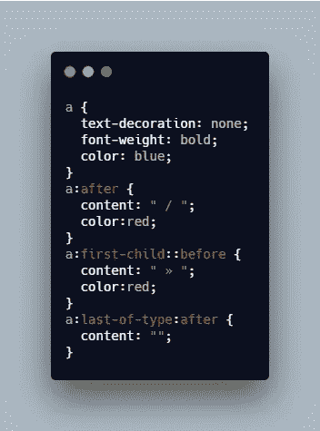
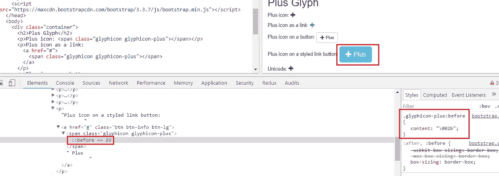
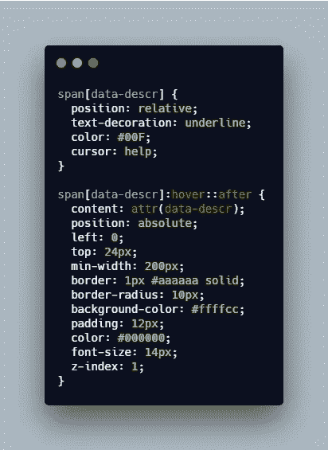

# 理解::before 和::after 伪元素

> 原文：<https://levelup.gitconnected.com/understand-before-and-after-pseudo-elements-98eae657ae10>


照片由[内森·杜姆劳](https://unsplash.com/@nate_dumlao?utm_source=unsplash&utm_medium=referral&utm_content=creditCopyText)在 [Unsplash](https://unsplash.com/?utm_source=unsplash&utm_medium=referral&utm_content=creditCopyText) 上拍摄

在本文中，我将讨论`::before`和`::after`伪元素以及我们需要使用它们的真实案例。

本文分为四个部分:

1.  什么是伪元素？
2.  `::after`
3.  `::before`
4.  常见使用案例

*更多类似的内容，请查看*[https://betterfullstack.com](https://betterfullstack.com/stories/)

# 什么是伪元素？

一个**伪元素**是一个添加到选择器中的关键字，它允许您对所选元素的特定部分进行样式化。

我们现在有 13 个伪元素:

*   `[::after (:after)](https://developer.mozilla.org/en-US/docs/Web/CSS/::after)`
*   `[::backdrop](https://developer.mozilla.org/en-US/docs/Web/CSS/::backdrop)`
*   `[::before (:before)](https://developer.mozilla.org/en-US/docs/Web/CSS/::before)`
*   `[::cue (:cue)](https://developer.mozilla.org/en-US/docs/Web/CSS/::cue)`
*   `[::first-letter (:first-letter)](https://developer.mozilla.org/en-US/docs/Web/CSS/::first-letter)`
*   `[::first-line (:first-line)](https://developer.mozilla.org/en-US/docs/Web/CSS/::first-line)`
*   `[::grammar-error](https://developer.mozilla.org/en-US/docs/Web/CSS/::grammar-error)`
*   `[::marker](https://developer.mozilla.org/en-US/docs/Web/CSS/::marker)`
*   `[::part()](https://developer.mozilla.org/en-US/docs/Web/CSS/::part)`
*   `[::placeholder](https://developer.mozilla.org/en-US/docs/Web/CSS/::placeholder)`
*   `[::selection](https://developer.mozilla.org/en-US/docs/Web/CSS/::selection)`
*   `[::slotted()](https://developer.mozilla.org/en-US/docs/Web/CSS/::slotted)`
*   `[::spelling-error](https://developer.mozilla.org/en-US/docs/Web/CSS/::spelling-error)`

本文将只关注两个元素`::after`和`::before`。

# *之后

`::after`是一个伪元素，允许你从 CSS 中插入内容到页面上(不需要在 HTML 中)。

关于 [Mozilla](https://developer.mozilla.org/en-US/docs/Web/CSS/::after) 的定义

> `**::after**`创建一个[伪元素](https://developer.mozilla.org/en-US/docs/Web/CSS/Pseudo-elements)，它是所选元素的最后一个子元素

语法:

```
/* CSS3 syntax */
::after

/* CSS2 syntax */
:after
```

示例:

```
a::after {
  content: "→";
}
```

# *以前

`::before`是一个伪元素，允许你从 CSS 中插入内容到页面上(不需要在 HTML 中)。

Mozilla 上的定义

> `**::before**`创建一个[伪元素](https://developer.mozilla.org/en-US/docs/Web/CSS/Pseudo-elements)，它是所选元素的第一个子元素

所以`::before`和`::after`差不多，只是插入内容的位置不同。`::before`将作为所选元素的第一个子元素前置，`::after`将作为该元素的最后一个子元素追加。

语法:

```
/* CSS3 syntax */
::before

/* CSS2 syntax */
:before
```

示例:

```
a::before {
  content: "♥";
}
```

# 常见使用案例

下面是我们应用`::before`和`::after`向元素中插入内容时的一些常见情况。

## 三角形

我们可以使用伪元素来创建一个三角形，用于构建工具提示或一些特殊的 UI 设计。

演示:


三角形的演示

CSS 代码:


三角形的 CSS 示例

在这个例子中，我通过使用`::before`伪元素在左边创建了一个三角形。你可以从 Chris Coyier 那里得到 CSS 样本，在其他边创建一个三角形。

## 面包屑

我认为这个术语出现在每个系统中，比如管理站点、CMS、任何用于管理数据的 web 应用程序。

演示:


面包屑演示

CSS 代码:



面包屑的 CSS 示例

在上面的代码示例中，我在每个锚标记后添加了`/`。对于第一个锚，我会加上`>>`符号。然后，最后一个去掉`/`。

## 引用

我们使用`::before`和`::after`来插入引用字符。这一点将在内容管理系统或内容网站中大量应用。

演示:


报价演示

CSS 代码:


用于报价的 CSS 示例

## 核标准情报中心

使用`::before`伪元素添加图标非常流行。

来自[Bootstrap 3 glyphicon](https://www.w3schools.com/icons/bootstrap_icons_glyphicons.asp)的演示:



[引导 3 个雕刻图案](https://www.w3schools.com/icons/bootstrap_icons_glyphicons.asp)

如果你使用 [fontawesome](https://fontawesome.com/) 或任何其他字体包，那么你会看到类似的代码，它们应用`:before`来添加一个图标到一个元素。

如何能自定义来自你自己的矢量 SVG(可缩放矢量图形)或图像文件？

使用这个基本模板，然后添加您自己的代码。


创建图标的基本模板

我认为有一些方法可以定制你自己的图标。但是，这是一个基本的方法，自从我开始使用 Zeplin 以来，我已经使用了很多次，它允许我通过 SVG 或其他格式下载图标。

## 工具提示

这个例子使用`::after`来创建工具提示。**不需要 JavaScript！**

演示:


工具提示演示

CSS 代码:



工具提示的 CSS 示例

这段代码使用了两种技术，分别是 [*数据-**](https://developer.mozilla.org/en-US/docs/Web/HTML/Global_attributes/data-*) 和 [*属性*](https://developer.mozilla.org/en-US/docs/Web/CSS/attr) *()。*

## 是/否复选框

这个样本是我从 [w3school](https://www.w3schools.com/howto/howto_css_switch.asp) 得到的代码。然后我使用`::after`将内容添加到复选框中，以显示“是”或“否”。

演示:


切换按钮演示

CSS 代码:


切换的 CSS 示例

## 清除浮动

有时候，我们需要让内容向左或向右浮动。然后，我们需要另一个元素来清除浮动。

在这种情况下，我们将使用`::before`。

演示:


透明 foat 样本

CSS 代码:


clear float 的 CSS 示例

# 摘要

`::before`和`::after`给我们带来了很多好处，不用任何新的 DOM 节点就能给 HTML 添加内容。如果你会适当地使用它，你的生活会容易得多。

我知道有很多使用这两个伟大的伪元素的案例，欢迎任何反馈。

我希望这篇文章对你有用！可以跟着我上[中](https://medium.com/@transonhoang?source=post_page---------------------------)。我也在[推特](https://twitter.com/transonhoang)上。欢迎在下面的评论中留下任何问题。我很乐意帮忙！

在此检查源代码:

[](https://stackblitz.com/edit/angular-76bqce?embed=1&file=src/app/app.component.html) [## 角度-76bqce - StackBlitz

### 导出到 Angular CLI 的 Angular 应用程序的启动项目

stackblitz.com](https://stackblitz.com/edit/angular-76bqce?embed=1&file=src/app/app.component.html) 

# 资源/参考资料

[1]:伪元素[https://developer . Mozilla . org/en-US/docs/Web/CSS/伪元素](https://developer.mozilla.org/en-US/docs/Web/CSS/Pseudo-elements)

[2]:在伪元素[https://developer.mozilla.org/en-US/docs/Web/CSS/::after](https://developer.mozilla.org/en-US/docs/Web/CSS/::after)之后

[3]:在伪元素[https://developer.mozilla.org/en-US/docs/Web/CSS/::before](https://developer.mozilla.org/en-US/docs/Web/CSS/::before)之前

[4]: CSS 三角[https://css-tricks.com/snippets/css/css-triangle/](https://css-tricks.com/snippets/css/css-triangle/)

[](https://gitconnected.com/learn/css) [## 学习 CSS -最佳 CSS 教程(2019) | gitconnected

### 43 个顶级 CSS 教程-免费学习 CSS。课程由开发者提交并投票，使您能够找到…

gitconnected.com](https://gitconnected.com/learn/css) [](https://betterfullstack.com/stories/) [## 故事-更好的全栈

### 所有的故事故事为我们写指南提交故事到更好的编程博客 1。故事指南避免什么…

betterfullstack.com](https://betterfullstack.com/stories/)