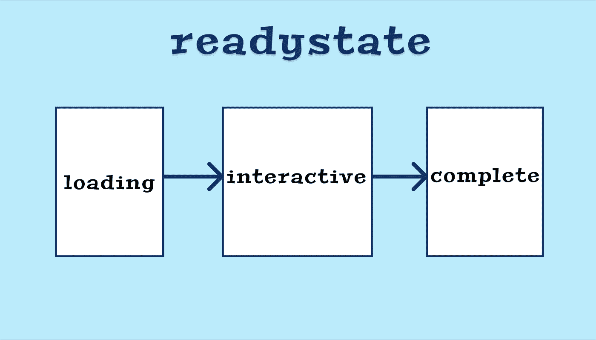
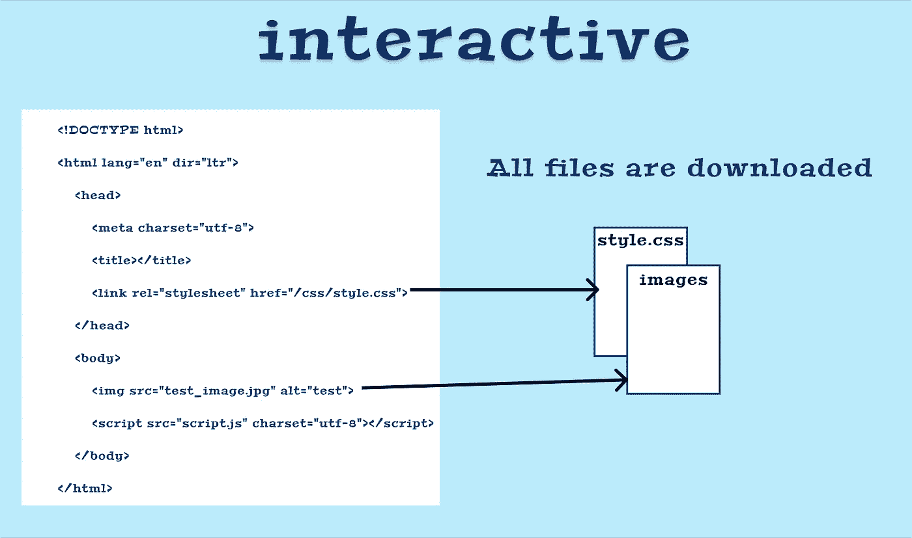

# 了解浏览器就绪状态以及如何跟踪网页内容的交互性

> 原文：<https://levelup.gitconnected.com/understand-browser-readystate-and-how-to-track-the-interactivity-of-the-content-on-your-web-page-8d2802f29aa>

## 了解如何处理浏览器事件和文档的状态，以便进行加载、交互和完成



文档的不同就绪状态

可以使用`document`对象的`readyState`属性来访问文档的当前状态。`document.readyState`告诉我们页面加载的状态。

有 3 种不同的可能状态:

*   `**loading**` —正在加载文档(正在下载/解析`.html`文件)
*   `**interactive**` —在这种状态下，DOM 被加载并可访问。然而，像图像、样式表和 JavaScript 文件这样的资源还没有完成下载/加载/解析。
*   `**complete**` —文档和图像/样式表等所有资源已加载完毕。

让我们看一个例子。我们有一个网站`gitconnected.com`，让我们比较一下在浏览器中输入 URL 并按回车键时的`readyState`。

# 1.装货

从服务器下载`index.html`文件(如果没有指定，这是默认值)并解析它。如果您包含了任何`script`标签，那么这些标签也会被下载、解析和执行。


一旦加载了 HTML 文件，`readyState`就变成了`interactive`，我们可以使用`readystatechange`事件来检测这一点。

# 2.相互作用的

在`interactive`状态下，下载 css/image 文件等附加文件。一旦`readyState`状态为`interactive`，这意味着 DOM 已经加载，但是资源正在下载。当`readyState`从`loading`变为`interactive`时，也触发`DOMContentLoaded`事件。



交互状态

一旦下载并解析完所有文件，文档`readystate`将变成`complete`。在这种状态下，页面的所有资源都是可用的。

# 3.完成

当`readyState`更改为`complete`时，意味着文档现在被解析和加载**和**所有已知的附加资源，如 CSS、images 和 JS 也已经被解析和加载。

# `readyStateChange`事件

为了检测状态变化，我们可以在文档中添加`readyStateChange`事件监听器。

```
document.addEventListener('readystatechange', function(ev) {
    console.log(**document.readyState**)
});
```

上述状态的完整示例:

参考: [MDN](https://developer.mozilla.org/en-US/docs/Web/API/Document/readyState)

跟随 [Javascript 吉普🚙💨](https://medium.com/u/f9ffc26e7e69?source=post_page-----8d2802f29aa--------------------------------)。