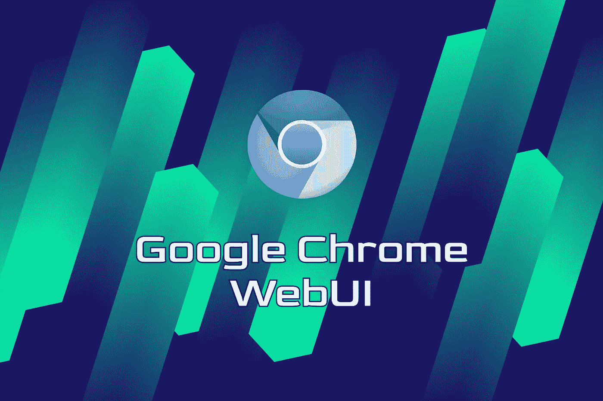
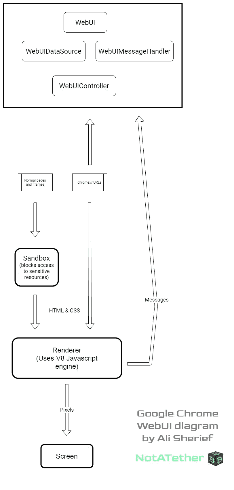

# 理解 Google Chrome 的代码:WebUI 的 4 个部分

> 原文：<https://levelup.gitconnected.com/understand-google-chromes-code-the-4-parts-of-webui-11bb8f995be5>

这是一系列帖子中的第一篇，这些帖子将深入谷歌 Chrome 的代码库，尽可能地了解它是如何工作的。

图片由 NotATether.com 拍摄

我认为了解你运行的软件中到底发生了什么是一个好主意，首先也是最重要的是你的浏览器，特别是最近在 Chrome 内部发现了一系列普遍的安全漏洞。

谷歌 Chrome 是开源浏览器 [Chromium](https://chromium.org) 的一个略微修改和重新皮肤化的副本。这意味着源代码是可用的，这使得这项调查成为可能。

目标不是理解每一个功能和每一行代码——而是获得组成软件的高级组件的概述。

# 什么是 WebUI？

这是一个特殊的网页，可以访问谷歌 Chrome 的内部机制。例如，新标签页、设置页、扩展页等。

使用 chrome://前缀的 URL(它本身就是一个协议)都是 WebUIs。他们使用普通网页中使用的相同 web 技术(如 HTML、CSS 和 Javascript)编写脚本，但他们拥有访问浏览器内部的权限。

当我说“内部”时，我指的是渲染器，我将在后面谈到它。现在，只要说它是从 HTML 和 CSS 生成位图并将其绘制在屏幕上的组件就足够了。

渲染器通常以某种形式的 Javascript 编写。你可能听说过 **V8 发动机**(不要和同名汽车发动机混淆)。这个渲染器不仅支持 Chrome，也支持 NodeJS。它有一些方法允许你在上面运行任意的 Javascript[[WebUIMessageHandler::call Javascript function()](https://chromium.googlesource.com/chromium/src.git/+/refs/heads/main/docs/webui_explainer.md#webuimessagehandler_calljavascriptfunction)]并使用 [chrome.send()](https://chromium.googlesource.com/chromium/src.git/+/refs/heads/main/docs/webui_explainer.md#chrome_send) 向窗口对象发送消息。这是用来实现服务工作者之类的东西。

# 谷歌 Chrome 页面是沙箱化的

绝大多数页面无法访问文件系统或浏览器之外的任何地方。因为在每个选项卡上实现访问控制会非常慢，所以这个沙箱是在渲染器上执行的。

因此，渲染器(及其下的所有页面)只能将内容绘制到屏幕上，而不能与操作系统交互。他们无法使用摄像头或麦克风。他们不能向您显示弹出窗口或使用您的设备上的定位服务。Chrome 甚至支持 USB 和串行端口接口——当你考虑到这是 ChromeOS 的基础时，这并不奇怪——显然，页面也无法访问这些接口。

我可以列出一个很长的禁止页面访问的资源列表，但是您可以通过访问特定页面的网站权限区域来找到其中的许多资源。

# 作为攻击媒介的 WebUI

大多数安全漏洞，比如你在上面看到的，依赖于使用恶意制作的 Javascript 在绕过渲染器的网页中突破沙箱。

WebUI 页面很特别，因为它们不像这样被沙箱化。这使得它们成为一个有吸引力的攻击媒介，尤其是当你考虑到 Chrome 支持扩展的时候。例如，看到结果中新选项卡页面扩展了吗？它可以在技术上用自己的页面取代 chrome://newtab WebUI。

此外，由于 WebUIs 接收所有服务人员的消息，因此恶意服务人员可能会发送一些旨在获取 Chrome 内部功能的信息。

这些问题可以通过禁止 WebUIs 加载随机 HTTP(S)获取和数据 URL 来缓解。如果他们出于某种原因需要嵌入来自外部页面的内容，比如 Google Doodles，他们可以使用 iframess 来实现，iframe 就像标准网页一样被沙箱保护。

# WebUI 的组成部分

Chrome 通过创建一个同名的 C++类，以及一个 WebUIDataSource、一个 WebUIMessageHandler 和一个 WebUIController 来制作 WebUI，WebUI controller 负责拉动使木偶移动的线(形象地说)。所有这些都整齐有序地记录在本页的[中。](https://chromium.googlesource.com/chromium/src.git/+/refs/heads/main/docs/webui_explainer.md#c_classes)

WebUI 代表了真正的超级特权 Chrome 页面。WebUIDataSource 将资源添加到 WebUI，供以后访问，例如，图像或翻译字符串。WebUIMessageHandler 代表 WebUI 接收 Javascript 事件。

为了总结我们所学到的，我做了这个简单的相关概念的图表。谁知道学习程序的一部分会如此简单？

图片由 NotATether.com 拍摄。无归属不分享。