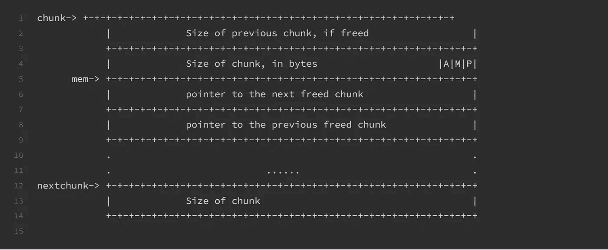
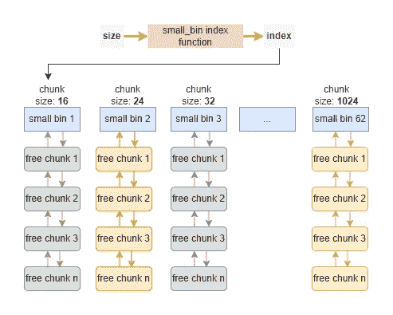

# 理解堆内存分配:实践方法

> 原文：<https://levelup.gitconnected.com/understand-heap-memory-allocation-a-hands-on-approach-775151caf2ea>

# 介绍

在我看来，与使用高级编程语言开发应用程序相比，使用 C 和 C++等低级语言进行系统编程的最大区别之一是，你必须自己管理内存。因此，您调用类似于`malloc`和`free`的 API 来根据您的需要分配内存，并在不再需要资源时释放内存。它不仅是系统编程中[bug](https://developers.redhat.com/articles/2021/11/01/debug-memory-errors-valgrind-and-gdb)最常见的原因之一；而且还会导致许多[安全问题](https://en.wikipedia.org/wiki/Memory_safety)。

不难理解像`malloc`、`free`这样的 API 的正确用法。但是你有没有想过它们是如何工作的，例如:

*   当你调用`malloc`时，它会触发系统调用并将任务委托给内核还是有其他机制？
*   当你调用`malloc(10)`并试图分配 10 字节堆内存时，你得到多少字节的内存？10 字节或更多？
*   分配内存时，堆对象的确切位置在哪里？
*   当你调用`free`时，内存是直接返回内核吗？

本文将尝试回答这些问题。

注意，内存是一个超级复杂的话题，所以我不可能在一篇文章中涵盖关于它的所有内容(其实这篇文章涵盖的内容非常有限)。本文将重点介绍`userland memory(heap) allocation`。

# 进程内存管理概述

## 进程虚拟内存

每次我们启动一个程序，都会为该程序保留一个内存区域，这就是`process virtual memory`，如下图所示:

您可以注意到，每个进程都有一个**不可见的**内存段，其中包含内核代码和数据结构。这个看不见的记忆片段很重要；因为它与内核用于内存管理的`virtual memory`直接相关。在我们深入其他不同的部分之前，让我们先了解一下虚拟内存。

## 虚拟存储技术

为什么我们需要虚拟内存？虚拟内存是内核以抽象的形式提供的服务。如果没有虚拟内存，应用程序将需要管理它们的物理内存空间，与计算机上运行的所有其他进程进行协调。虚拟内存通过创建允许在虚拟内存和物理内存之间转换的映射，将管理工作留给了内核。内核制造了一个假象，每个进程都占据了整个物理内存空间。我们还可以基于虚拟内存实现[进程隔离](https://en.wikipedia.org/wiki/Process_isolation)来增强安全性。

虚拟内存超出了本文的范围，如果您感兴趣，请看看核心技术:[分页](https://en.wikipedia.org/wiki/Memory_paging)和[交换](https://linuxhint.com/linux-memory-management-swap-space/)。

## 静态与动态内存分配

接下来，我们仔细看看上面的进程内存布局，了解它们来自哪里。一般来说，有两种方法可以分配内存来存储数据:`static`和`dynamic`。静态内存分配发生在`compile time`，而动态内存分配发生在`runtime`。

当一个程序启动时，可执行文件(在 Linux 系统上，它被称为一个`ELF`文件)将作为一个`Process Image`被加载到内存中。该`ELF`文件包含以下片段:

*   。文本:包含程序的可执行部分以及所有机器代码。
*   。数据:包含`initialized`静态和全局变量。
*   。BSS:是`block started by symbol`的简称，包含`uninitialized`静态和全局变量。

内核将加载`ELF`文件，并创建一个进程映像。并且这些静态数据将被映射到虚拟存储器的相应段中。精灵加载器也是一个有趣的话题，我会在以后写另一篇关于它的文章。请继续关注我的博客！

`memory-mapped region`段用于存储[共享库](https://organicprogrammer.com/2019/08/25/how-to-write-linux-c-program-with-external-library/)。

最后，`stack`和`heap`段在运行时动态产生，用于存储和操作程序执行过程中使用的临时变量。之前曾经写过一篇关于[栈](https://organicprogrammer.com/2020/08/19/stack-frame/)的文章，想了解详情可以参考一下。

唯一剩下的我们没有提到的部分是`heap`，这是本文的重点！

您可以通过检查文件`/proc/{pid}/maps`来检查一个进程的内存布局，如下所示:

注意，上面的调查没有考虑多线程。多线程的进程内存布局会更复杂，请参考其他在线[文档](https://azeria-labs.com/heap-exploitation-part-2-glibc-heap-free-bins/)。

在这一节中，我们从上到下大致了解了内存管理。希望你能看到大局，知道我们在哪里。接下来，让我们深入研究一下`heap`部分，看看它是如何工作的。

# 存储分配器

我们需要首先理解内存管理领域的一些术语:

*   **mutator** :修改堆中对象的程序，简单来说就是用户应用。但在本文中我将使用术语`mutator`。
*   **分配器**:`mutator`不会自己分配内存，它会将这个普通任务委托给`allocator`。在代码层面上，`allocator`通常被实现为一个库。详细的分配行为完全由实现决定，在本文中，我将重点关注`glibc`库中的内存分配器。

`mutator`和`allocator`的关系如下图所示:

内存管理领域还有第三个组件:`garbage collector(GC)`。`GC`自动回收记忆。由于本文讨论的是系统编程中的手动堆内存分配，我们暂时忽略`GC`。`GC`是一个很有意思的技术挑战，我以后会考察。请继续关注我的博客！

# 动手演示

我们将使用`gdb`和`pwndbg`(这是一个 gdb [插件](https://github.com/pwndbg/pwndbg))并闯入堆内存，看看它是如何工作的。`gdb`提供了通过`Python`插件来扩展它的功能。`pwndbg`是应用最广泛的。

演示代码如下:

上面的演示代码只是分配一些内存，设置内存的内容，稍后再释放。然后再次分配其他内存块。很简单，好吗？

## 分配区块

首先，在第 7 行设置一个`breakpoint`(第一个`malloc`调用)并运行`gdb`中的程序。然后从`pwndbg`运行`vmmap`命令，可以得到如下的进程内存布局:

注意，在发出第一个`malloc`调用之前，还没有`heap`段。在`gdb`中跳过一行后，再次检查布局:

现在`heap`段被创建，大小为`132KB`(十六进制为 21000)。如上所述，内核将 132KB 的物理内存映射到这个进程的虚拟内存，并将这个 132KB 的物理内存块标记为用于隔离其他进程。这个映射程序是通过系统调用如`brk`、`sbrk`和`mmap`完成的。请自行调查这些系统调用。

132KB 比 100B 大很多(传递给`malloc`的大小)。这个行为可以回答本文开头的一个问题。不需要每次调用`malloc`时都触发系统调用。这种设计旨在降低性能开销。现在 132KB 堆内存由`allocator`维护。下次应用程序再次调用`malloc`时，`allocator`会为它分配内存。

接下来，在`gdb`中再执行一行，将值(“AAAABBBBCCCCDDDD”)分配给分配的块。让我们用`heap`命令检查这个 132KB 堆段的内容，如下所示:

有三大块。让我们一个一个地检查这些组块。

`top`块包含所有尚未分配的剩余内存。在我们的例子中，内核将 132KB 的物理内存映射到这个进程。而 100B 内存是通过调用`malloc(100)`来分配的，所以剩下的内存在`top`块中。`top`块停留在堆段的边界上，它可以随着进程分配更多内存或释放未使用的内存而增长和收缩。

然后我们来看大小为 0x291 的组块。`allocator`使用这个块来存储堆管理结构。对我们的分析不重要，跳过就好。

我们关心的是中间那块大小为`0x71`的。它应该是我们请求的块，包含字符串“AAAABBBBCCCCDDDD”。我们可以通过检查其内容来验证这一点:

gdb 的`[x](https://visualgdb.com/gdbreference/commands/x)`命令可以使用指定的格式显示给定地址的内存内容。`x/40wx 0x555555559290`以十六进制格式从 0x555555559290 开始打印 40 个字(每个字 32 位)的内存。

我们可以看到字符串“AAAABBBBCCCCDDDD”在那里。所以我们的猜测是正确的。但问题是为什么这一大块的大小是`0x71`。为了理解这一点，我们需要首先分析一下`allocator`是如何存储`chunk`的。内存块由以下结构表示:

*   `prev_size`:仅当前一个块空闲时，当前一个块的大小，否则当前一个块正在使用时，存储前一个块的用户数据。
*   `size`:当前块的大小。
*   `fd`:仅当当前块空闲时，指向下一个空闲块的指针，否则当当前块在使用中时，它存储用户数据。
*   `bk`:指向前一个空闲块的指针。行为方式与指针`fd`相同。

基于以上描述，下图说明了分配的`chunk`的确切结构:

*   chunk:表示对象在堆内存中的实际起始地址。
*   mem:通过`malloc`指示返回的地址。

中间的内存是为上面提到的元数据预留的:`prev_size`和`size`。在 64 位系统中，它们的长度是 8 字节。

对于`size`字段，值得注意的是:

*   它包括元数据的大小和实际用户数据的大小。
*   它通常与 16 字节的倍数对齐。你可以自己调查一下[内存对齐](https://stackoverflow.com/questions/381244/purpose-of-memory-alignment)的目的。
*   它在三个最低有效位包含三个特殊标志(`A|M|P`)。我们现在可以忽略其他两位，但最后一位表示前一个块是否在使用中(设置为 1)或不在使用中(设置为 0)。

据此，我们再来回顾一下这一大块的内容:

我在图像上加了标记来帮助你理解。让我们做一些简单的计算。`100 + 8 = 108`，100 是我们请求的内存大小，8 是元数据的大小(对于`size`字段)。然后`108`作为 16 字节的倍数与`112`对齐。最后，由于特殊标志 P 设置为 1，那么我们得到`112 + 1 = 113(0x71)`(这就是为什么大小是`0x71`而不是`0x70`的原因)。

在这一节中，我们将进入堆段，看看分配的块是如何工作的。接下来，我们将检查如何释放一个块。

## **空闲块**

以前，我们分配一块内存，并将数据放入其中。下一行将释放这个块。在运行指令和展示演示结果之前，让我们先讨论一下理论。

在调用`free`之后，释放的块不会立即返回给内核。相反，堆`allocator`在`[linked list](https://en.wikipedia.org/wiki/Linked_list)`数据结构中跟踪释放的块。因此，当应用程序再次请求新的分配时，可以重用链表中被释放的块。这可以通过避免过多的系统调用来降低性能开销。

`allocator`可以将所有释放的块存储在一个长链表中，这是可行的，但是性能会很慢。相反，`glibc`维护一系列被称为`bins`的自由链表，这可以加速分配和释放。我们稍后将研究`bins`是如何工作的。

值得注意的是，每个空闲组块都需要将`pointers`存储到其他组块中，形成链表。这就是我们上一节讨论的，在`malloc_chunk`结构中有两点:`fd`和`bk`，对吗？因为被释放块的`user data`区域可供`allocator`使用，所以它将`user data`区域重新用作存储指针的地方。

根据以上描述，下图说明了已释放区块的确切结构:

现在遍历`gdb`中的一行，检查堆中的块，如下所示:

您可以看到变化:分配的块被标记为`Free chunk (tcache)`并且设置了指针`fd`(这表明这个被释放的块被插入到一个链表中)。

`tcache`是`glibc`提供的`bins`的一种。gdb `pwndbg`插件允许您通过运行命令`bins`来检查`bins`的内容，如下所示:

注意，被释放的块(在 0x5555555592a0 处)被插入到`tcache bins`中作为喜欢列表头。

注意有 5 种类型的箱子:`small bins`、`large bins`、`unsorted bins`、`fast bins`和`tcache bins`。如果您不知道，不要担心，我将在接下来的部分中研究它们。

根据定义，第二个`malloc(100)`被调用后，`allocator`要重用`bins`中被释放的 chunk。下图可以证明这一点:

0x555555559290 处被释放的块再次被使用，并且在从链表中移除该块之后，所有的`bins`都是空的。好吧！

# 用垃圾箱回收内存

接下来，我想花一点时间来研究我们为什么需要`bins`以及`bins`如何优化块分配和释放。

如果`allocator`在一个长链表中跟踪所有被释放的块。对于分配器来说，通过从头到尾遍历来找到合适大小的空闲块的时间复杂度是`O(N)`。如果`allocator`想要保持块有序，那么至少需要`O(NlogN)`时间来按大小排序列表。这个缓慢的过程会对程序的整体性能产生不良影响。这就是为什么我们需要箱子来优化这个过程。综上所述，优化从以下两个方面进行:

*   高性能数据结构
*   无锁争用的每线程缓存

## 高性能数据结构

以`small bins`和`[large bins](https://sourceware.org/git/gitweb.cgi?p=glibc.git;a=blob;f=malloc/malloc.c;h=6e766d11bc85b6480fa5c9f2a76559f8acf9deb5;hb=HEAD#l1686)`为参考，定义如下:

它们被一起定义在一个链表数组中，每个链表(或 bin)存储的块都是`the same fixed size`。从`bins[2] to bins[63]`开始是`small bins`，它跟踪小于 1024 字节的释放块，而`large bins`用于更大的块。`small bins`和`large bins`可以表示为下图所示的`[double-linked list](https://en.wikipedia.org/wiki/Doubly_linked_list)`:

`glibc`提供了一个[函数](https://sourceware.org/git/gitweb.cgi?p=glibc.git;a=blob;f=malloc/malloc.c;h=6e766d11bc85b6480fa5c9f2a76559f8acf9deb5;hb=HEAD#l1686)，根据请求的`size`计算数组中相应小(或大)仓的`index`。由于[阵列](https://en.wikipedia.org/wiki/Array_(data_structure))的`index`操作在`O(1)`时间内。此外，每个 bin 包含相同大小的块，因此向列表中插入或从列表中删除一个块也需要花费`O(1)`时间。因此，整个分配时间被优化为`O(1)`。

`bins`是`LIFO(Last In First Out)`的数据结构。插入和移除操作如下所示:

此外，对于`small bins`和`large bins`，如果当前块的邻居是空闲的，则它们被`merged`成更大的块。这就是为什么我们需要一个`double-linked list`来允许向前和向后快速移动。

与`small bins`和`large bins`不同，`fast bins`和`tcache bins`组块是与它们的邻居`never merged`在一起的。实际上，glibc `allocator`不会在下一个块开始时设置`P`特殊标志。这可以避免合并块的开销，以便在请求相同大小的块时，可以立即重用释放的块。此外，由于`fast bins`和`tcache bins`从不合并，它们被实现为`[single-linked list](https://sourceware.org/git/gitweb.cgi?p=glibc.git;a=blob;f=malloc/malloc.c;h=6e766d11bc85b6480fa5c9f2a76559f8acf9deb5;hb=HEAD#l1678)`。

这可以通过运行演示代码中的第二个`free`方法来证明，并检查堆中的块，如下所示:

首先，`top`块的大小仍然是`0x20d01`而不是`0x20d00`，这表明`P`位等于 1。第二，`Free chunk`只有一个指针:`fd`。如果它在一个双向链表中，那么`fd`和`bk`都应该指向一个有效的地址。

## 无锁争用的每线程缓存

`tcache bins`中的字母`t`代表`thread`，用于优化多线程程序的性能。在多线程编程中，防止`[race condition](https://en.wikipedia.org/wiki/Race_condition)`问题的最常见方法是使用`[lock or mutex](https://en.wikipedia.org/wiki/Lock_(computer_science))`。类似地，`glibc`在每个堆的数据结构中维护一个`lock`。但是这种设计有一个性能代价:`[lock contention](https://en.wikipedia.org/wiki/Lock_(computer_science)#:~:text=lock%20contention%3A%20this%20occurs%20whenever,lock%20held%20by%20the%20other.)`，当一个线程试图获取另一个线程持有的锁时就会发生这种情况。这意味着线程不能执行任何任务。

`tcache bins`是每个线程的 bin。这意味着如果线程在它的`tcache bins`上有一个块，它可以服务于分配而不需要等待堆锁！

# 摘要

在本文中，我们通过使用 gdb 调试堆内存，研究了 userland 堆分配器是如何工作的。讨论完全基于`glibc`实现。`glibc`堆分配器的设计和行为很复杂，但是很有趣，我们在这里讨论的只是冰山一角。可以自己多探索。

此外，我计划为学习和教学目的编写一个简单版本的堆分配器。请继续关注我的博客！