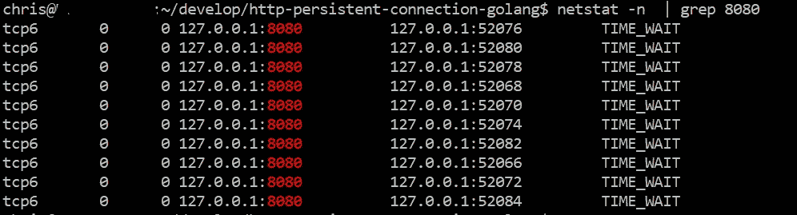

# 理解 HTTP/1.1 持久连接:实践方法

> 原文：<https://levelup.gitconnected.com/understand-http-1-1-persistent-connection-a-hands-on-approach-b030f44228b>

## 基于 Golang 应用程序

# 背景

最初，`HTTP`是一个单一的请求-响应模型。一个`HTTP`客户端打开`TCP`连接，请求一个资源，得到响应，然后连接关闭。而建立和终止每一个`TCP`连接都是一个消耗资源的操作(详细可以参考我之前的[文章](https://baoqger.github.io/2019/07/14/why-tcp-four-way-handshake/))。随着 web 应用变得越来越复杂，显示一个页面可能需要多个 HTTP 请求，过多的 TCP 连接操作会对性能产生不良影响。


因此在`HTTP/1.1`协议中创建了`persistent-connection`(也称为`keep-alive`)模型。在这个模型中，TCP 连接在几个连续的请求之间保持打开，这样，打开新连接所需的时间就会减少。


在本文中，我将向您展示`persistent connection`如何基于 Golang 应用程序工作。我们将基于 demo app 做一些实验，用一些流行的网络包分析工具验证 TCP 连接行为。简而言之，读完这篇文章，你会学到:

*   Golang `http.Client`用法(还有一点源代码分析)
*   用`netstat`和`tcpdump`进行网络分析

你可以在这个 Github [repo](https://github.com/baoqger/http-persistent-connection-golang) 中找到 Golang 应用的演示。

[](https://github.com/baoqger/http-persistent-connection-golang) [## GitHub-baoqger/http-persistent-connection-golang:研究持久连接行为基于…

### 此时您不能执行该操作。您已使用另一个标签页或窗口登录。您已在另一个选项卡中注销，或者…

github.com](https://github.com/baoqger/http-persistent-connection-golang) 

# 顺序请求

让我们从客户端不断向服务器发送`sequential`请求的简单情况开始。[代码](https://github.com/baoqger/http-persistent-connection-golang/blob/master/sequence/non-persistent-connection/non-persistent-connection.go)如下所示:

我们在一个 Goroutine 中启动一个 HTTP 服务器，并不断向它发送十个连续的请求。对吗？让我们运行应用程序并检查 TCP 连接的数量和状态。

运行上述代码后，您可以看到以下输出:


当应用程序停止运行时，我们可以运行下面的`netstat`命令:

```
netstat -n  | grep 8080
```

TCP 连接如下所示:



显然，这 10 个 HTTP 请求不是持久的，因为 10 个 TCP 连接是打开的。

**注**:`netstat`的最后一列显示了 TCP 连接的状态。TCP 连接终止过程的状态可以用下图来解释:


我不会在这篇文章中涉及细节。但是我们需要理解`TIME-WAIT`的含义。

在`four-way handshake`过程中，客户端会发送`ACK`数据包终止连接，但是 TCP 的状态并不能马上转到`CLOSED`。客户端需要等待一段时间，这个等待过程中的状态称为`TIME-WAIT`。TCP 连接需要这个`TIME-WAIT`状态有两个主要原因。

*   第一是提供足够的时间让对方接收到`ACK`。
*   第二是在当前连接结束和任何后续连接结束之间提供一个缓冲期。如果不是这段时间，来自不同连接的数据包可能会混合在一起。详细可以参考这本[书](http://www.tcpipguide.com/free/t_TCPConnectionTermination-3.htm)。

在我们的演示应用程序中，如果您在程序停止后等待一段时间，然后再次运行`netstat`命令，那么输出中将不会列出任何 TCP 连接，因为它们都是关闭的。

另一个验证 TCP 连接的工具是`tcpdump`，它可以捕获发送到你机器的每个网络数据包。在我们的例子中，您可以运行下面的`tcpdump`命令:

```
sudo tcpdump -i any -n host localhost
```

它将捕获从本地主机发送或发送到本地主机的所有网络数据包(我们在本地主机中运行服务器，对吗？).`tcpdump`是帮助你了解网络的一个很棒的工具，你可以参考它的[文档](https://www.tcpdump.org/)获得更多帮助。

**注意**:在我们上面的演示代码中，我们按顺序发送了 10 个 HTTP 请求，这会使`tcpdump`的捕获结果太长。所以我修改了 for 循环，只发送 2 个顺序请求，这足以验证`persistent connection`的行为。结果如下所示:


在`tcpdump`输出中，`Flag [S]`代表`SYN`标志，用于建立 TCP 连接。上面的快照包含两个`Flag [S]`包。第一个`Flag [S]`是由第一个 HTTP 调用触发的，后面的包是 HTTP 请求和响应。然后你可以看到第二个`Flag [S]`包打开一个新的 TCP 连接，这意味着第二个 HTTP 请求并不是我们希望的`persistent connection`。

下一步，让我们看看如何在 Golang 中让 HTTP 作为一个持久连接工作。

事实上，这是 Golang 生态系统中众所周知的问题，您可以在[官方文件](https://pkg.go.dev/net/http#Client)中找到相关信息:

*   如果返回的错误是 nil，那么响应将包含一个非 nil 的主体，用户需要关闭这个主体。如果主体没有同时读取到 EOF 和 closed，客户端的底层往返(通常是传输)可能无法为后续的“保持活动”请求重用到服务器的持久 TCP 连接。

修复很简单，只需添加两行代码，如下所示:

让我们通过运行`netstat`命令进行验证，结果如下:


这一次，10 个连续的 HTTP 请求只建立了一个 TCP 连接。这种行为正是我们所希望的:`persistent connection`。

我们可以通过与上面相同的实验进行双重验证:依次运行两个 HTTP 请求，并用`tcpdump`捕获数据包:


这次只有一个`Flag [S]`包在那里！这两个连续的 HTTP 请求重用相同的底层 TCP 连接。

在下一节中，我将修改演示应用程序，让它发送并发请求。这样，我们可以对 HTTP/1.1 的持久连接有更多的了解。

# 并发请求

[演示代码](https://github.com/baoqger/http-persistent-connection-golang/blob/master/concurrent/non-persistent-connection/non-persistent-connection-concurrent.go)如下所示:

**注意**:在 HTTP/1.1 协议中，并发请求会建立多个 TCP 连接。这是 HTTP/1.1 的限制，增强它的方法是使用`HTTP/2`，它可以为多个并行 HTTP 连接复用一个 TCP 连接。`HTTP/2`不在本帖讨论范围内。我会在另一篇文章中谈到它。

请注意，在上面的演示中，我们已经完整地阅读了响应体并关闭了它，根据[上一篇文章](https://baoqger.github.io/2021/10/25/understand-http1-1-persistent-connection-golang/)中的讨论，HTTP 请求应该在持久连接模型中工作。

在使用网络工具分析行为之前，让我们想象一下将会建立多少个 TCP 连接。因为有 10 个并发的 goroutines，所以应该建立 10 个 TCP 连接，所有的 HTTP 请求都应该重用这 10 个 TCP 连接，对吗？这是我们的期望。

接下来，让我们用`netstat`验证我们的期望，如下所示:


它显示 TCP 连接的数量远远超过 10。持续连接没有像我们预期的那样工作。

看完`net/http`包的源代码，我发现以下提示:

`Client`在 [client.go](https://golang.org/src/net/http/client.go) 中定义，是 HTTP 客户端的类型，`Transport`是属性之一:

`Transport`在 [transport.go](https://golang.org/src/net/http/transport.go) 中是这样定义的:

注意`Transport`有两个参数:

*   **MaxIdleConns** :控制所有主机上空闲(保持活动)连接的最大数量。
*   **maxidleconsperhost**:控制每个主机保持的最大空闲(保持活动)连接数。如果为零，则使用 DefaultMaxIdleConnsPerHost。

默认情况下，MaxIdleConns 为 **100** ，MaxIdleConnsPerHost 为 **2** 。

在我们的演示案例中，十个 goroutines 向同一个主机(localhost:8080)发送请求。虽然 MaxIdleConns 是 100，但是对于这个主机来说，**只能缓存 2 个空闲连接**，因为 MaxIdleConnsPerHost 是 2。这就是为什么你看到更多的 TCP 连接被建立。

基于这一分析，让我们按如下方式重构代码:

这一次我们不使用默认的 httpClient，而是创建一个定制的客户机，将 MaxIdleConnsPerHost 设置为 **10** 。这意味着连接池的大小更改为 10，这可以为每个主机缓存 10 个空闲 TCP 连接。

再次用`netstat`验证行为:


现在的结果是我们所期待的。

# 摘要

在本文中，我们讨论了如何通过调整连接池的参数，使 HTTP/1.1 持久连接在顺序和并发情况下都能工作。在下一篇文章中，我们来回顾一下源代码，研究一下如何实现 HTTP 客户端。