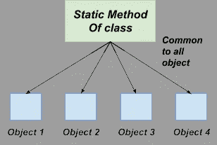
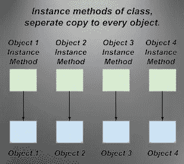

# 通过例子理解 Java 方法

> 原文：<https://levelup.gitconnected.com/understand-java-methods-with-examples-84886dba2e17>

我们知道 Java 编程的基础及其语法。在本文中，我们将讨论一些与 Java 中的方法相关的重要概念。方法是类或对象可以执行的操作。它们帮助您将大量代码分解成更小、更易管理的块。方法的主要目的是为对象或子例程提供一种向其他代码公开其功能，同时隐藏实现细节的方式。方法是一段代码，每当需要该行为时，可以从另一段代码(另一个方法或函数)中调用。

Java 编程语言中有不同类型的方法，在本文中，我们将逐一介绍它们。此外，我们将看到一些与 java 中的方法相关的重要概念。这也有助于你回答 java 面试中的方法问题。但是在跳到所有这些之前，让我们深入理解 java 中的方法。

# 方法介绍

方法是执行特定操作的代码块。它有一个名字，当被执行时，它执行一个动作。

使用方法，您可以定义代码的执行顺序。一个方法可以有允许用户输入的参数和可以赋给变量的返回值。该方法还可以包括修改变量(如局部或全局变量)状态的语句。

每种方法都有自己的类型，可以由程序员定义。这意味着所有的方法都必须遵循相同的规则并实现相同的逻辑。

编程中最重要的概念之一是状态和行为的分离。换句话说，应用程序中任何随时间变化的元素都应该封装在自己的类或方法中。这使得应用程序的其他部分不受这些更改的影响。

# 用 Java 定义一个方法

1.  ***修饰符:*** 它指定了方法的访问类型或应用程序中可以访问它的点。Java 中四种不同形式的访问说明符。

*   ***Public:*** 这使得该方法在应用程序的所有类中都可用。
*   ***Private:*** 这使得方法在声明它的类中可用。
*   ***Protected:*** 该类型使方法在定义它的类和任何子类中都可以访问。
*   ***默认:*** 声明或定义时不使用修饰符。可以从指定其类的类和包中访问它。

2. ***返回类型:*** 方法返回的值的数据类型，如果返回 nothing 则为 void。

***3。方法名:*** 虽然方法名的协议与字段名的协议略有不同，但是对字段名的要求仍然适用。

***4。参数列表:*** 在括号内，定义了一个输入参数列表，用逗号分隔，以及每个参数的数据类型。如果没有参数，请使用空括号()。

***5。异常列表:*** 您可以提供您预期程序要抛出的异常。

***6。方法体:*** 方法体用括号括起来。为了实现你的目标而必须运行的程序。

调用方法时，执行方法体，方法的返回值是方法体中最后一个表达式的值。方法还可以包含 return 语句，该语句可用于向调用方法返回值。下面是一个简单的方法定义的例子。

```
public int addMethod(int x, int y) { 
 int z = x + y; 
 return z; 
}
```

在上面的方法中， ***public*** 是访问说明符， ***int*** 是返回类型， ***addMethod*** 是方法名， ***(int x，int y)*** 是它所带的参数。

**Java 中关于其功能的方法类型。**

一般来说，我们可以说这些方法有四种不同的类型。那些是-

1.  没有返回类型也没有参数。
2.  不带返回类型，带参数。
3.  有返回类型但没有参数。
4.  带有返回类型和参数。

*   在无返回类型和无参数类型方法中，该方法没有任何返回类型，也没有参数。
*   ***语法-***

```
public void method(){
//body
}
```

*   在无返回类型和有参数类型方法中，该方法没有任何返回类型。它是空的。但是该方法接受参数。

***举例-***

```
public void method(int a){
 //body
}
```

*   在有返回类型和无参数类型的方法中，我们有返回类型但它不接受参数。

***举例-***

```
public int method(){
 //body
}
```

*   在 With Return types 和 with parameters 类型的方法中，我们有一个返回类型，它也接受参数。

***举例-***

```
public int method(int x){
//body
}
```

**Java 中的方法类型**

就面向对象编程而言，java 中有两种类型的方法。

***静态方法—*** 静态方法是一组固定的函数，无需实例化对象即可使用。静态方法是在类定义内部定义的，不能在类定义外部访问。静态方法的主要目的是为类的所有实例提供一个公共接口。静态方法还允许您定义可以跨多个实例重用的行为。当您想要对特定类型的所有对象强制执行某些行为时，静态方法尤其有用。

***例如*** ，如果你希望你系统中的每一个对象都有一个唯一的 ID，你可以在运行时使用静态的方法来分配一个 ID。

静态方法还使得编写同时验证多个对象行为的测试变得更加容易。

此外，还有其他因素，如卫生和封装。通常，静态方法更简洁，也更容易使用，因为它们保护程序员免受动态调用或实例化可能产生的意外副作用的影响。



***实例方法*** —实例方法本质上与静态方法相同，除了它们是在单个对象而不是类上定义的。

通常，实例方法用于访问和操作特定对象的值。

***例如*** ，你可能使用一个实例方法来更新一个实例变量的值或者创建一个新的对象。当您创建自己的类和定义自己的实例方法时，记住每个方法必须有唯一的名称和签名是很重要的。

类的实例也可以包含静态方法；这些由方法名开头的关键字 static 标识。静态方法不共享它们所属对象的实例变量，因此它们不能用于值更改的目的。

请注意，一个类的每个名称只能有一个实例方法，并且它们的签名必须相同(如果不相同，将会给出一个编译错误)。除了实例和静态方法，Java 还支持 final 字段，这些字段一旦初始化就不能更改。这些值在一个类的所有实例中都存在。



**为什么方法很重要？**

java 方法在 Java 中很重要，因为它们允许您将代码组织成定义良好的部分。这使得阅读和理解代码变得更容易，也更容易在其他程序中重用它。

此外，方法通过提供输入和输出，为您的代码提供了一种与外界交互的方式。 ***例如*** ，当你想在屏幕上显示文本时，你可以创建一个方法来做到这一点。

方法最重要的是要把一件事做好。它们应该易于阅读和理解，并且应该完全按照你的期望去做。如果一个方法做的事情太多或者太少，它将变得难以维护。

当编写方法时，记住它们应该完成的任务是很重要的。同样重要的是，不要创建太多工作太少的方法。

# Java 中的重载方法

重载方法是拥有两个或更多同名但参数不同的方法的过程。在这种情况下，一个名称可以用来引用一个类中的多个方法。方法可以重载，以减少程序中相似方法名的数量。这一点很重要，因为如果两个方法同名，编译器会报告错误，并且不会编译程序。可以用具有相同名称和不同类型或数量的参数的方法来创建重载方法。但是，具有不同返回类型的重载方法不能相互调用。需要注意的是，重载方法不会同时执行。相反，方法名是在调用方法时解析的。

如果方法被重载，那么编译器如何决定调用哪个方法？

这可能是面试官在你的 java 面试中可能会问你的最重要的[面试问题](https://www.interviewbit.com/java-interview-questions/)。

如果我找到了答案，那么答案就是它调用了基于签名和返回类型的重载方法。

一个 ***签名*** 是方法名及其参数类型。签名可用于确定两个方法是否具有相同的功能。当未指定返回类型时，签名还确定方法的返回类型。这意味着该方法在调用时将返回与声明时相同的数据类型。

# 结论

方法是类或对象可以执行的操作。它们帮助您将大量代码分解成更小、更易管理的块。方法的主要目的是为对象或子例程提供一种向其他代码公开其功能，同时隐藏实现细节的方式。除了对方法的基本解释之外，本文还讨论了 Java 编程语言中不同类型的方法，并对每种类型的方法进行了深入的解释。我们还讨论了方法如何被调用，如何被重载，默认方法和静态方法与常规方法有何不同，以及返回类型和签名如何决定这两种方法是否相同。我们希望您在阅读本文后对这些方法有了更好的理解。

# 分级编码

感谢您成为我们社区的一员！在你离开之前:

*   👏为故事鼓掌，跟着作者走👉
*   📰查看[级编码出版物](https://levelup.gitconnected.com/?utm_source=pub&utm_medium=post)中的更多内容
*   🔔关注我们:[推特](https://twitter.com/gitconnected) | [LinkedIn](https://www.linkedin.com/company/gitconnected) | [时事通讯](https://newsletter.levelup.dev)

🚀👉 [**加入升级人才集体，找到一份惊艳的工作**](https://jobs.levelup.dev/talent/welcome?referral=true)