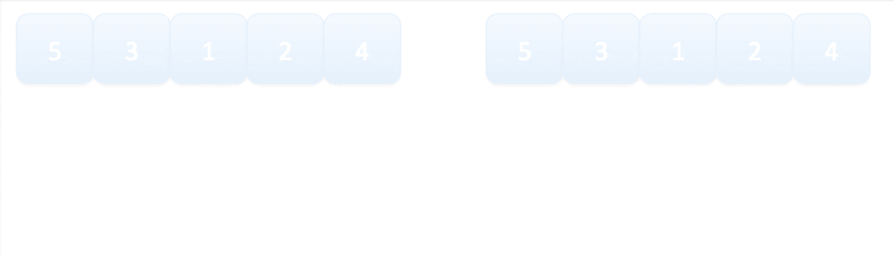

# 理解 Kotlin 过去分词命名集合函数

> 原文：<https://levelup.gitconnected.com/understand-kotlin-collection-function-past-tense-59f592af9436>

## 学习 Kotlin 编程

## 通过名称更快地学习 Kotlin 收集功能


由[瓦尔德马尔·布兰德](https://unsplash.com/@waldemarbrandt67w?utm_source=medium&utm_medium=referral)在 [Unsplash](https://unsplash.com?utm_source=medium&utm_medium=referral) 上拍摄的照片

W 在浏览 [Kotlin 集合函数](https://kotlinlang.org/api/latest/jvm/stdlib/kotlin.collections/)时，我发现几个函数的名字很有趣。它们是原词和它的过去分词。即

> 排序 vs 已排序；
> 
> 反向 vs 反向；
> 
> 洗牌 vs 洗牌

从名字上，我们大概知道它们是做什么用的。

但是什么是原词 vs 过去分词呢？

通过了解这种命名约定的目的，您将会更快地了解这种命名的所有功能。

# 首先了解每个功能

我们先来了解一下各个功能。

## 分类

这个函数将把一个未排序的列表变成排序的列表。


## 反面的

该函数将颠倒原始列表的顺序。


## 洗牌

这个函数将对列表进行随机排序。


# 那么原分词和过去分词有什么区别呢？

在只读和可变集合列表中使用的默认函数是过去分词函数，即`sorted()`、`reversed()`和`shuffled()`。

他们将产生一个新的预期结果列表。

```
val list = *listOf*(2, 3, 1, 4, 5, 6)
val sorted = list.***sorted***()
val reversed = list.***reversed***()
val shuffled = list.***shuffled***()
*println*(sorted)    // [1, 2, 3, 4, 5, 6]
*println*(reversed)  // [6, 5, 4, 1, 3, 2]
*println*(shuffled)  // [3, 4, 5, 1, 6, 2]
*println*(list)      // [2, 3, 1, 4, 5, 6]
```

你会注意到原来的单词功能，即`sort()`、`reverse()`和`shuffle()`在`list`中不可用。

## 原词功能

为了使用原来的 word 函数，你必须把它转换成一个`mutableList`。原因很简单。原始 word 函数将改变原始列表，而不是从中创建一个新列表。它不会输出新的列表。

```
// SORT
val list = *mutableListOf*(2, 3, 1, 4, 5, 6)
list.***sort***()
*println*(list)      // [1, 2, 3, 4, 5, 6]// REVERSE
val list = *mutableListOf*(2, 3, 1, 4, 5, 6)
list.***reverse***()
*println*(list)      // [6, 5, 4, 1, 3, 2]// SHUFFLE
val list = *mutableListOf*(2, 3, 1, 4, 5, 6)
list.***shuffle***()
*println*(list)      // [3, 4, 5, 1, 6, 2]
```

下面的 gif 解释了这一切。


排序与已排序



反向 vs 反向


洗牌 vs 洗牌

# TL；DR；

对于这三个函数，过去分词命名的函数是会生成新列表的函数。但是最初命名的函数是会改变原始列表内容的函数。

> 如果 Kotlin 将来引入一个既有原始名称又有过去分词名称的函数，我相信这将是惯例。

就我个人而言，我会这样做，因为

1.  我相信过去分词代表改变一个内容。(免责声明，我的英语有限)
2.  对于所有其他函数，例如`filter`、`map`等，它们产生一个新的列表，但不是以过去分词的形式。

感谢阅读。你可以在这里查看我的其他话题。

您可以在此订阅或关注我的 [*Medium*](https://medium.com/@elye.project) *，*[*Twitter*](https://twitter.com/elye_project)*，* [*脸书*](https://www.facebook.com/elye.project/) *，* [*Reddit*](https://www.reddit.com/user/elyeproj/) 获取关于移动开发、Medium 写作等相关话题的小技巧和学习。~Elye~