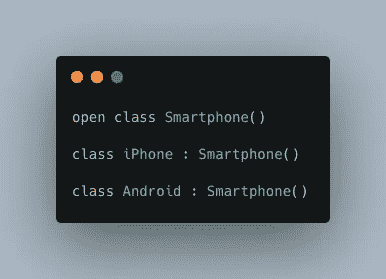
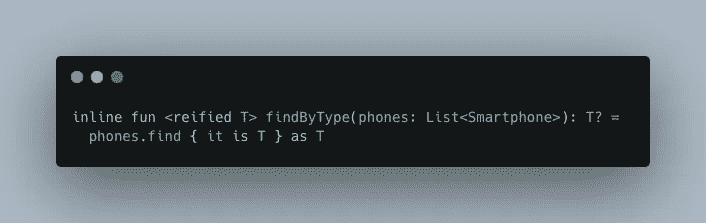
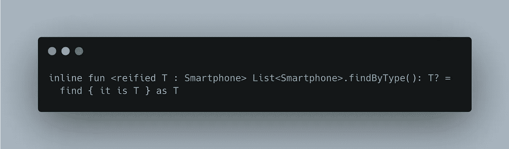
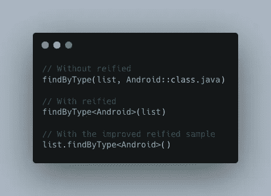
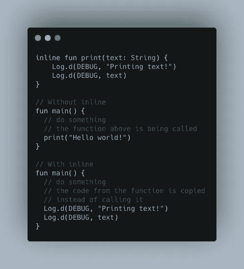

# 理解科特林具体化和类型擦除

> 原文：<https://levelup.gitconnected.com/understand-kotlin-reified-and-type-erasure-8b3ee30932d0>

## 这是一个关于它如何提高可读性以及如何在幕后工作的例子


由[absolute vision](https://unsplash.com/@freegraphictoday?utm_source=medium&utm_medium=referral)在 [Unsplash](https://unsplash.com?utm_source=medium&utm_medium=referral) 上拍摄的照片

根据我的经验，如果你以前已经使用过面向对象的范例，Kotlin 通常是一种容易学习的语言。尽管如此，一旦基础清楚了，它也可以提供更高复杂性的概念，像协方差，函数式编程…

其中一个概念是`reified`关键字，我花了一些时间去真正理解它，看看我如何从中受益。

> 我还有一篇关于 Kotlin 代表的文章，如果你对这个话题感兴趣的话。

[](/understanding-the-delegation-pattern-with-kotlin-on-android-8d7698524939) [## 使用 Android 上的 Kotlin 了解委托模式

### 这是一个如何帮助你编写更简洁的代码的例子

levelup.gitconnected.com](/understanding-the-delegation-pattern-with-kotlin-on-android-8d7698524939) 

# 什么是物化？

这个关键字改变了以类型作为参数的函数的调用方式，并允许在处理泛型时使用关键字`is`和`as` 。例如，假设我们有下面的类层次结构。



类层次结构示例

如果我们有一个`Smartphones` *、*的列表，我们想找到元素或者按类型过滤它们，`Android`或者`iPhone` *、*可以实现下面的功能。



具体化样本

现在，我们可以使用类型过滤智能手机列表，并返回调用函数时指定类型的元素。也可以约束 T 类型只允许使用`Smartphone` ，或者甚至将函数扩展为`List<Smartphone>`来删除所有的参数*。*



如果没有`reified`关键字，编译器会抛出一个错误。

```
*Cannot check for instance of erased type: T*
```

> 你可能也注意到了`inline`关键字，我会在文章结尾解释。

当调用我们的函数时，差别不是很大，但它使代码看起来更干净，并且删除了一个函数参数。



调用函数

# 为什么内联是必要的？

在 Java 和其他编程语言中，有一个被称为**类型擦除的概念。**这意味着当代码被编译时，类型丢失了，代码不再知道你是在寻找一个`Android` 还是一个`iPhone` *。StackOverflow 中的这篇[帖子](https://stackoverflow.com/questions/339699/java-generics-type-erasure-when-and-what-happens)很好地解释了这一点。*

`inline` 关键字用来避免这种行为，这样类型就不会丢失，我们也避免了前面提到的错误。

> 如果你对字节码很好奇，想自己查看这些信息，可以在 Android Studio 中启用 Java 字节码反编译器插件，然后进入工具-> Kotlin ->显示 Kotlin 字节码

`inline`获取组成函数的代码，并将其复制到调用函数的地方，避免调用函数。

例如，想象一下下面这段代码，我们看到的是 Java 字节码，而不是 Kotlin 代码。



内联字节码示例，但带有 Kotlin 代码

这种概念有时很难理解，所以我建议在阅读完这篇或其他关于这个主题的文章后，立即将它付诸实践，并尝试一下。

如果你想阅读更多这样的内容，并支持我，不要忘记检查我的个人资料，或给媒体一个机会，成为会员，以获得我和其他作家的无限故事。这只是 5 美元一个月，如果你使用这个链接，我会得到一小笔佣金。

[](https://medium.com/@molidev8/membership) [## 通过我的推荐链接加入 Medium—Miguel

### 阅读米格尔的每一个故事(以及媒体上成千上万的其他作家)。你的会员费直接支持米盖尔…

medium.com](https://medium.com/@molidev8/membership) 

# 分级编码

感谢您成为我们社区的一员！在你离开之前:

*   👏为故事鼓掌，跟着作者走👉
*   📰查看[升级编码出版物](https://levelup.gitconnected.com/?utm_source=pub&utm_medium=post)中的更多内容
*   🔔关注我们:[Twitter](https://twitter.com/gitconnected)|[LinkedIn](https://www.linkedin.com/company/gitconnected)|[时事通讯](https://newsletter.levelup.dev)

🚀👉 [**将像你这样的开发人员安置在顶级创业公司和科技公司**](https://jobs.levelup.dev/talent/welcome?referral=true)