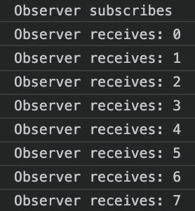
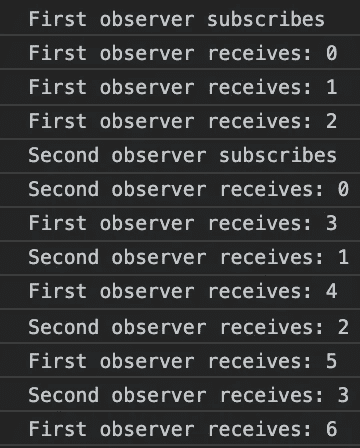
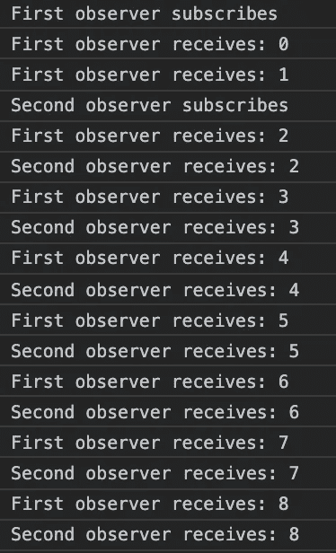
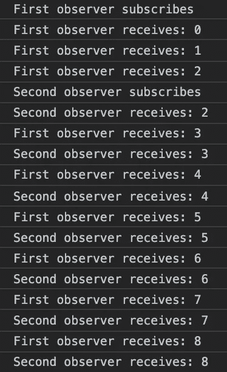
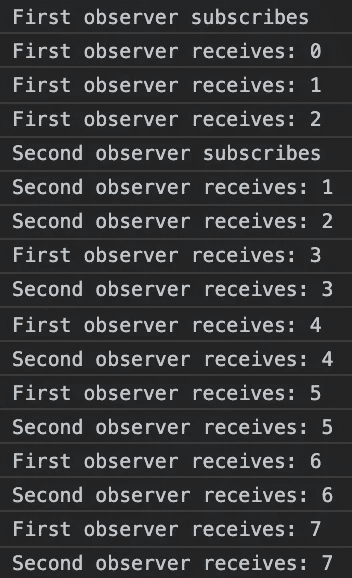
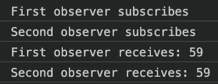
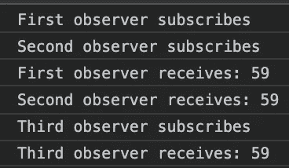

# 了解 RxJS 主题

> 原文：<https://levelup.gitconnected.com/understand-rxjs-subjects-97b43f9d32ba>

凭借每周 1700 万 npm 的下载量，RxJS 在 JavaScript 世界相当受欢迎。如果你是一个角度开发者，你不可能错过 RxJS 可观的东西，但是你可能不太熟悉这些主题。尽管它们没有简单的可观察到的频率高，但是它们非常有用。理解它们将有助于您编写更好、更清晰的反应式代码。

# 看得见的

直观地说，您可以将可观测量视为发出价值流的对象，或者如 RxJS 文档所述:

> 可观察值是多个值的惰性推送集合。

例如，我们可以用肉眼观察到的数字每秒钟发出 0 到 59 的数字:

订阅该可观察值的观察者将每秒接收一个值:

你需要订阅可观测值来开始计数，就像你需要调用一个函数来计算它一样。同样类似于函数，第二次“调用”将触发新的独立执行。如果你在两秒钟后再次订阅这个观察，你会在你的控制台上看到两个“计数器”，第二个有两秒钟的延迟。

这意味着你不能同时向两个观察者发出相同的值，至少不能使用简单的观察值。为此，你需要主题。

# 学科

> 一个主题就像一个可观察对象，但是可以多播给许多观察者。

主体是可观察的。我们可以使用一个主题创建相同的计数器，每秒钟发出 0 到 59 的数字:

您可能会发现与我们之前的示例的主要区别。当声明一个可观察对象时，我们给了一个函数作为参数，告诉可观察对象向订阅者发出什么。这是可以的，因为每个新的订阅者将开始一个新的执行。另一方面，在这种情况下，我们只有一次执行，新订户只是开始“听”它。我们简单地用 *new Subject()创建一个新对象。*

我们也可以订阅我们的主题，因为**主题是可观察的**。然后我们在我们的主题上直接调用*的下一个*，因为**主题是观察者。**

任何新的订户都将被添加到 Subject 内部保存的订户列表中，并且将同时接收与其他订户相同的值。如果我们在第一次订阅后两秒钟订阅主题，新的订阅者将会错过前两个值:

您可以使用主题一次向许多观察者发送值。你正在*多播*给许多观察者。

# 行为主体

您可能遇到的主题问题是，观察器将只接收订阅主题后发出的值。在前面的例子中，第二个发射器没有接收到值 0、1 和 2。在订阅之前，您有时需要知道主题最后发出了哪个值。例如，如果您发出日期，就会出现这种情况。任何在 3 月 1 日订阅的观察者应该在订阅时收到 01-03-20，不管他们是在什么时候订阅的。午夜时，每个订阅者都会收到日期已更改的通知。

对于这种情况，你可以使用行为主语。BehaviorSubject 保存它发出的最后一个值的记忆。订阅时，观察者会立即收到最后发出的值。如果我们修改前面的示例，这将意味着第二个观察者在订阅时收到值 2，然后像第一个观察者一样收到所有其他值。

你可能已经注意到，在这个例子中，我们需要给一个行为主体一个初始值，而主体却不是这样。这是行为主体总是需要当前值的结果。

# 重播主题

重播主题和行为主题非常相似。不同的是，它们不会只记住最后一个值，而是你想要多少就有多少。在订阅时，它们将自己记住的所有值发送给新的观察者。

你不需要在创建时给它们任何初始值，但是你可以定义它们应该在内存中保存多少值。在本例中，我们保留了两个值:

当第二个观察者订阅 ReplaySubject 时，已经发出了 0、1 和 2。由于 ReplaySubject 保存了最后两个值，第二个观察者立即收到 1 和 2。

# 异步主题

对于 AsyncSubjects，在主题完成之前，您的观察者实际上什么也得不到。

在我们的例子中使用一个 AsyncSubject，在观察者收到任何东西之前，我们必须等待整整一分钟。

你也可以看到我们要把题目做完整，这是我们之前没有做到的。如果我们不这样做，我们的观察者将根本收不到任何东西。

在 AsyncSubject 完成后，任何订阅它的观察者都会收到相同的值。

在本例中，第三个观察者在 AsyncSubject 完成五秒钟后订阅了它。在订阅时，它接收最后一个值:59。

这使得 AsyncSubjects 对于获取和缓存一个值非常有用，就像一个 HTTP 响应，您只需要获取一次，然后从不同的地方访问。

自己尝试这些例子，并修改它们，以了解它如何影响结果。当谈到反应式编程时，对 RxJS 主题的良好理解将有助于您编写更具可读性和更高效的代码。