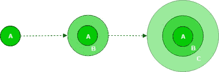

# 理解软件开发的阶段和用于执行它们的不同模型

> 原文：<https://levelup.gitconnected.com/understand-the-stages-of-software-development-and-different-models-used-to-execute-them-32547b4fd471>

在 [Unsplash](https://unsplash.com?utm_source=medium&utm_medium=referral) 上由 [Austin Distel](https://unsplash.com/@austindistel?utm_source=medium&utm_medium=referral) 拍摄的照片

软件开发是一个复杂的过程。不仅仅是编码和部署。软件开发包括一系列致力于软件设计和交付的实践。在最终产品交付之前，开发过程要经历不同的阶段。这被称为软件开发生命周期(SDLC)。

SDLC 不会在产品发布后结束。该产品需要经过定期维护，以确保最佳的最终用户体验。为了开发软件，需要遵循几种模型，每种模型都是处理软件开发过程的不同方式。在这篇文章中，我将解释四种软件开发模型及其优缺点。

首先，让我们了解软件开发的各个阶段。

# SDLC 的阶段

照片由 [Ashim D'Silva](https://unsplash.com/@randomlies?utm_source=medium&utm_medium=referral) 在 [Unsplash](https://unsplash.com?utm_source=medium&utm_medium=referral) 拍摄

SDLC 旨在高效利用资源，生产和交付高质量的软件。为了实现这一目标，它经历了以下几个阶段:

## 1.规划和需求分析

在规划阶段，项目经理定义项目的范围、估计的成本和进度、相关的利益相关者、项目团队结构以及开发的每个阶段的目标。这有助于确保项目保持在正确的轨道上。

需求分析包括定义软件在当前生命周期中的需求。它还定义了开发过程需要哪些资源。在开始开发之前，清楚地记录需求和资源。

## 2.设计

这个阶段包括根据上述要求设计软件的各种组件。根据软件的不同，会创建几种类型的设计。[架构图](https://www.tutorialspoint.com/software_architecture_design/introduction.htm)、[用例图](https://www.javatpoint.com/uml-use-case-diagram)、 [E-R 图](https://www.guru99.com/er-diagram-tutorial-dbms.html)和[类图](https://www.tutorialspoint.com/uml/uml_class_diagram.htm)就是几个例子。

设计还包括定义编程语言、解决问题的方法以及软件运行的平台。还定义了其他因素，如可用性、可靠性、可伸缩性和安全性。

## 3.编码和实现

这是实际开发开始的地方。一组开发人员通过参考设计或原型并使用特定的技术来编写软件的逻辑部分。对于这个阶段，开发人员可能必须学习实现所需的技能和技术。

开发人员必须合作，并确保他们所做的一切都符合项目的要求。编码后，开发人员可以为他们的工作提供适当的文档。

## 4.测试

实现后，软件的几个部分会经过一个测试阶段，以确保所有功能在每种情况下都能正确运行。它还试图减少软件中的错误数量。[安全测试](https://www.geeksforgeeks.org/software-testing-security-testing/)也在源代码上执行，以确保安全性和符合公司的政策。

测试还包括由 QA 团队完成的[质量保证](https://www.guru99.com/all-about-quality-assurance.html) (QA)。QA 确保软件质量符合软件要求和公司标准。它的目标是向客户提供最优质的软件。

## 5.部署

在这个阶段，软件被推向生产并交付给用户。一个组织有几个可以部署软件的部署平台。

只有在整个软件经过多次尝试和测试后，才能进行部署。

## 6.维护

此时，软件已经交付给客户。但是 SDLC 并没有就此结束。即使经过严格的测试，用户也一定会发现软件中的一些错误或问题。

软件交付后，维护团队会处理软件的任何新问题。这确保了软件保持在最佳状态，用户继续使用它。

# 软件开发模型

既然您对 SDLC 的各个阶段有了基本的了解，那么是时候解释不同类型的软件开发模型了。每个模型都会经历这些阶段，但方式不同。

## 瀑布模型

照片由[克里斯蒂安·朱德雷](https://unsplash.com/@cjoudrey?utm_source=medium&utm_medium=referral)在 [Unsplash](https://unsplash.com?utm_source=medium&utm_medium=referral) 上拍摄

瀑布模型遵循“一前一后”的概念。这是一种顺序模式，前一阶段完成后，下一阶段才开始。两个阶段不能一起工作。一个阶段完成后，开始下一个阶段，不再访问前一个阶段。

例如，如果您完成了设计阶段，您就可以开始编码和实现。您不能回到设计阶段。通过这种方式，执行所有后续阶段并交付软件。

**优势**

*   这个模型非常简单易懂。
*   每个阶段必须在下一个阶段之前完成，因此在进入下一个阶段之前，每个步骤都要经过尝试和测试。
*   由于在规划阶段之外没有太多客户或利益相关者的参与，开发过程很简单。

**劣势**

连续阶段的概念本身是有缺陷的。它非常坚硬。瀑布模型的缺点如下:

*   因为您不能回到前一个阶段，所以您不能修复任何错误或对某个阶段进行改进。
*   偏离最初的计划是非常容易的。
*   客户可能得不到预期的产品。
*   直到生命周期中很晚才到达的部署阶段，才交付给客户机任何东西。
*   模型需要定义明确的需求，但这种情况很少发生。现在的需求往往都是粗略的想法，不是很清晰。
*   在生命周期中，变更需求是常见的情况。这种模式无法容纳他们。

## 迭代模型

照片由[Tine ivani](https://unsplash.com/@tine999?utm_source=medium&utm_medium=referral)在 [Unsplash](https://unsplash.com?utm_source=medium&utm_medium=referral) 拍摄

迭代模型从软件的一个小的工作实现开始。它遵循 SDLC 的各个阶段，交付软件的第一个**版本**。

软件的后续版本将根据需要交付，从一开始就遵循相同的阶段。经历生命周期来创建软件的新版本被称为迭代。

最初，在计划阶段，您可能不知道软件的完整需求。因此，在这个模型中，你从你所知道的开始，并交付软件的初始版本。这可能会受到利益相关者或客户的**反馈**。

在每次迭代之后，需求可能会发生变化，然后在下一次迭代的计划阶段进行讨论。这就像瀑布模型执行了几次，直到您交付所需的软件。

**优点**

*   与瀑布模型不同，迭代模型可以适应不断变化的需求。
*   如果迭代次数很少，测试软件会更容易。
*   **并行开发:**当一个团队在开发第一个版本的时候，你可以开始计划后续的版本。
*   这种模型最适合大型项目，因为工作软件是在每次迭代中交付的。这在迭代很小时尤其有用。当软件定期交付时，可以从客户或利益相关者那里获得有价值的反馈。

**劣势**

*   该模型不适合较小的项目，因为它会增加不必要的成本和复杂性。
*   由于不断变化的需求，最终产品可能与最初的计划相差甚远。
*   设计可能不得不一次又一次地进行，因为需求在开始时并不明确。
*   由于不断变化的需求，很难估计项目的完成日期。

## **增量模式**

照片由 [Jungwoo Hong](https://unsplash.com/@hjwinunsplsh?utm_source=medium&utm_medium=referral) 在 [Unsplash](https://unsplash.com?utm_source=medium&utm_medium=referral) 上拍摄

在这个模型中，软件被分解成几个**模块**。从规划到部署阶段，每个模块都有自己的生命周期。在下一个周期中，将开发另一个模块，添加到先前交付的软件中。每个可交付成果被称为一个**增量**。

第一个增量通常交付包含软件基本需求的核心产品。然后，利益相关者可以对该产品进行分析，并对后续步骤做出决策。随后的增量为核心产品增加了更多的功能。

优先级较高的功能首先交付。例如，如果您正在设计一个社交媒体应用程序，您的首要任务是实现上传和查看帖子。之后，您可以继续添加其他功能，如回复帖子、用户登录、创建个人资料等。

下面是增量模型的图示。

来源: [GeeksForGeeks](https://www.geeksforgeeks.org/)

这里，最初，交付了一个。之后，B 和 C 建立在之前的可交付成果之上。

**优点**

*   由于软件被分解成几个模块，每个增量的交付时间更短。因此，软件被快速交付。
*   这种模式对不断变化的需求非常灵活。每个增量的开发都要经历一个需求收集阶段。因此，下一个增量是根据新的需求交付的。
*   项目范围可以控制。你可以在一个已经存在的软件上增加更多的功能。
*   客户可以体验每一个新的增量，并提供有价值的反馈。
*   与其他模型相比，软件中的缺陷和错误很容易识别。

**缺点**

*   每个增量的开发都是严格的，一旦决定了，就很难改变任何与过程相关的东西。
*   假设你添加了一个新特性，它在你的软件中产生了问题。识别问题很容易，但解决问题非常困难。它可能经常涉及在早期模块中进行修正，这是一个非常乏味的过程。
*   由于不断变化的需求，新的模块可能与根据旧需求开发的现有模块不兼容。
*   创建软件架构时可能会出现问题，因为每个组件可能会根据不同的需求进行开发。
*   这种模式需要精心的计划和协调。

**增量和迭代模型的区别**

理解增量和迭代模型可能会令人困惑。这两种模型都要经历几次 SDLC，并且涉及多个可交付成果。但是软件交付的方式有所不同。

在迭代模型中，想法是根据迭代中的需求在每个迭代中交付完整的工作软件。在增量模型中，每次迭代都交付较小的部分，直到交付完整的软件。

我们举个简单的例子。假设您正在绘制以下图像。

穴居人在[壁纸洞穴](https://wallpapercave.com/)上的照片

让我们考虑迭代模型。你首先要画出树木、草地和道路的草图。然后你可以在草图上添加更多的细节。在那之后，你不断地添加颜色，并在后续的迭代中修改它们。

而在增量模型中，您将首先绘制道路并对其进行着色。然后你会移到树上和草地上，直到你完成最后一幅画。

你认为哪一个更好？

## 敏捷模型

帕特里克·帕金斯在 [Unsplash](https://unsplash.com?utm_source=medium&utm_medium=referral) 上拍摄的照片

敏捷模型不遵循固定的过程。它旨在不同地处理每个项目，并根据项目需求调整其方法。敏捷相信来自客户或利益相关者的持续反馈，根据这些反馈来规划开发。

敏捷可以被认为是增量和迭代模型的结合。软件是以小的增量交付的，每个增量都是通过几次迭代交付的。

迭代通常持续一到四周，被称为**冲刺**。每个 sprint 都要经历相同的 SDLC 阶段，在最后的 [sprint 审查会议](https://www.workfront.com/project-management/methodologies/scrum/sprint-reviews)中获得反馈。

敏捷模型涉及大量的客户交互，这确保了软件满足他们的需求。如果需求发生变化，可以相应地规划开发过程。

敏捷使用一个叫做**用户故事**的概念。它就像是从最终用户的角度对一个新特性的一般性解释。点击阅读更多关于它们的信息[。](https://www.atlassian.com/agile/project-management/user-stories)

软件的开发包括跨职能团队、涉众和客户之间的持续协作。所有这些都在同一页上是很重要的。Scrum 会议确保所有的任务都在规定的时间内顺利完成。点击了解更多关于 scrum 会议[的信息。](https://www.productplan.com/glossary/scrum-meeting/)

敏捷基于开发人员在开发软件时必须遵循的 12 条原则。其中一些是:

*   通过软件的早期和持续交付来满足客户。
*   欢迎不断变化的需求。
*   经常交付工作软件。
*   促进可持续发展。

在这里了解更多关于他们的[。](https://kanbanize.com/agile/project-management/principles)

**缺点**

*   要遵循这一模式，项目负责人和适当的计划是必要的。每个开发人员都需要培养敏捷的思维方式。缺少任何一个都可能意味着灾难。
*   迭代是短暂的，工作软件是必须的。这增加了满足项目期限的压力。交付的功能可能与最初计划的不同，因为它们可能会根据工作软件的优先级进行调整。
*   这种模式严重依赖于客户协作。有时，客户不清楚需求。这可能会导致混乱。
*   敏捷通常是一个长期的过程。团队成员离开并被替换。对于新的团队成员来说，从前任留下的地方开始工作是非常困难的。

**优点**

*   敏捷模型可以很容易地适应不断变化的需求，这在现实世界中是常有的事。
*   客户能够留在循环中并参与软件开发过程。
*   工作软件在每次迭代结束时交付。客户可以了解软件并提供有价值的反馈。
*   Scrum 会议确保所有相关方保持同步，并与项目目标保持一致。
*   开发人员有很大的灵活性。他们可以选择自己的工作地点和时间，只要他们满足必要的期限。
*   项目被划分成小的增量(或构建),每个增量都是通过几次迭代开发的。因此，只需要很少的前期规划。
*   它鼓励跨职能团队之间的团队合作和协作。开发人员可以与测试和 QA 团队、操作团队合作，有时也可以与利益相关者合作。
*   新功能可以快速交付，这有助于软件在游戏中保持领先地位。
*   它减少了软件的总开发时间。

# 其他型号

软件开发的前景并不局限于这四种模型。其他车型如[螺旋](https://www.geeksforgeeks.org/software-engineering-spiral-model/)、[拉德](https://www.tutorialspoint.com/sdlc/sdlc_rad_model.htm)、 [RUP](https://www.geeksforgeeks.org/rup-and-its-phases) 、 [V 型](https://www.geeksforgeeks.org/software-engineering-sdlc-v-model/)、[原型车型](https://www.geeksforgeeks.org/software-engineering-prototyping-model/)等。也是风景的一部分。

现代软件开发在不断发展。软件开发组织用最佳实践来教育自己，以便在市场中获得优势。像 [DevOps](https://about.gitlab.com/topics/devops/) 和 [DevSecOps](https://www.dynatrace.com/news/blog/what-is-devsecops) 这样的实践被组织广泛遵循。

# 结论

软件开发不是一个简单的过程。向客户交付质量最好的软件需要做大量的工作。在这篇文章中，我解释了软件开发生命周期的各个阶段。每个阶段都很重要，并且依赖于前一个阶段。

我已经详细解释了四种软件开发模型及其优缺点。我希望你已经对这些模型有了很好的了解。这篇文章一定会帮助你做出明智的决定，为你的下一个项目选择模型。

如果您无法理解内容或对解释不满意，请在下面评论您的想法。新想法总是受欢迎的！如果你喜欢这篇文章，请鼓掌。**订阅**、**关注**我获取每周内容。如果你想讨论什么，请随时在[推特](https://twitter.com/nkunal25)上给我发信息。到那时，再见！！

# 分级编码

感谢您成为我们社区的一员！更多内容请参见[升级编码出版物](https://levelup.gitconnected.com/)。
跟随: [Twitter](https://twitter.com/gitconnected) ， [LinkedIn](https://www.linkedin.com/company/gitconnected) ，[时事通讯](https://newsletter.levelup.dev/)
向上一级是转型科技招聘👉 [**加入我们的人才集体**](https://jobs.levelup.dev/talent/welcome?referral=true)