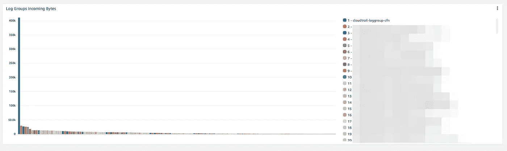
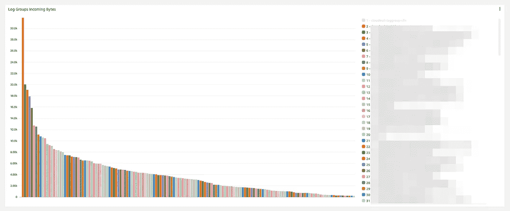
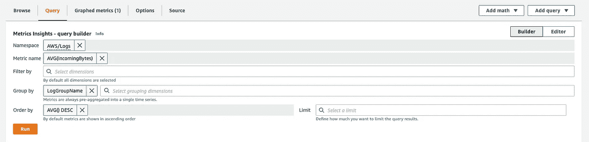
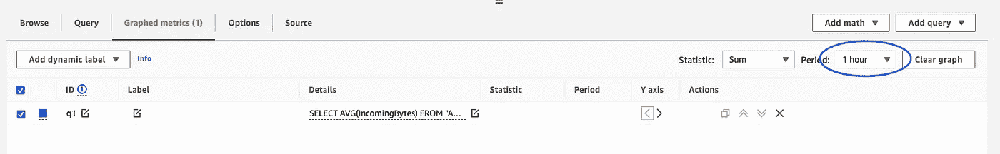
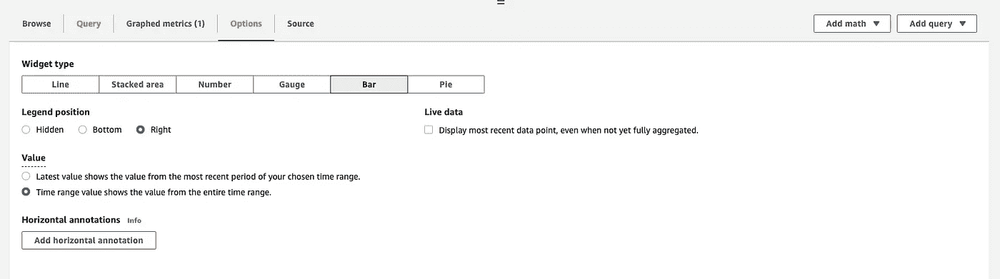

# 了解、可视化和降低云监控成本

> 原文：<https://levelup.gitconnected.com/understand-visualize-and-lower-cloudwatch-costs-440e0717078c>

## AWS CloudWatch 成本及其原因

*作者:格特·伦德斯，企业安全开发部负责人*

# 日志和指标

为了获得洞察力，在构建服务或应用程序时，日志和指标在设置中是至关重要的。如果遇到麻烦，首先要查看日志。指标使您能够预测事件，并在数字开始偏离时得到通知。

通常从小事做起，随着服务的增加，日志和指标的数量也会增加。在 AWS 中，指标和日志是 AWS CloudWatch 的一部分。

# 捉迷藏

这些年来，我注意到很好地理解你的 CloudWatch 成本是很棘手的。大多数时候，AWS CloudWatch 并不是 AWS 账单上最贵的服务。通常情况下，CloudWatch 的成本甚至都排不到前三。**那个地方*****——就在前三名之外——*****看起来是吃掉你一大部分预算的完美地点，而不会成为下一轮节约成本的通常嫌疑人**。😓

请务必检查您的默认设置。以日志组保留为例。我认为日志组永不过期的默认值可能是不必要的。**获得有用的成本信息也非常困难(几乎不可能)**。

# CloudWatch 日志组成本分布

首先，关于 CloudWatch 日志，**请注意，昂贵的不是数据存储。数据摄取会产生成本**。你关于日志的第一个问题:`which log groups generate the highest cost?`一个好的洞察力不是现成的，但是我想出了一个很好的方法。**我构建了一个图表，显示了日志组数据摄取分布。该图从左到右显示了吃钱最多的原木组**。

您会立即注意到图表最左侧有一个显著的异常值。不是什么大惊喜；在这种情况下，明显的赢家是 AWS CloudTrail。像这样的异常值很难放大其他元素。要进一步深入图表，请开始禁用图表图例右侧的异常值。

自己设置日志组数据摄取分布图很容易。在 CloudWatch 中，创建一个新的仪表板并添加一个新的小部件。**最重要的是填写下面的查询来构建图形**:

为了增强组大小之间的对比，您可以调整图表周期:

向右移动图例有助于选择某些组。

**图形可视化允许您对日志组的优化进行优先级排序。**最终，优化可能会降低您的日志数量:

*   您需要那么多日志语句吗？挑战自我！
*   质疑日志级别。拥有一个调试级别有时很好，但是总是在任何地方使用这个日志级别可能有些过头了。
*   CloudWatch 日志代理可以生成大量的日志/成本。

我知道，这是在踢开一扇门😄

# 云观察指标

如果说获取日志洞察很复杂，那么获取度量数据就更加棘手了。**更糟糕的是，目前没有办法深入了解 CloudWatch 指标**。我联系了支持人员询问方法，但他们告诉我这是不可能的。😟

所以我现在能做的就是让人们意识到 CloudWatch 的度量成本。**记住公制成本会很快变得昂贵**。例如，在某个时候，我在一些定制指标的帮助下，在一系列实例上创建了[深度健康检查](https://aws.amazon.com/builders-library/implementing-health-checks/)。我原以为费用可以忽略不计，结果却发现这些深度健康检查每月花费约 900 美元。我可以告诉你，现在健康早就没了。😉

# 总结

我的建议是至少每月检查一下你的 CloudWatch 费用。请注意，CloudWatch 成本往往不为人所知，并尝试找到一种方法来深入了解您的 CloudWatch 成本。

*原载于 2022 年 6 月 22 日*[*https://www . element 7 . io*](https://www.element7.io/2022/06/understand-visualize-and-lower-cloudwatch-costs/)*。*

# 分级编码

感谢您成为我们社区的一员！更多内容见[升级编码出版物](https://levelup.gitconnected.com/)。
跟随:[推特](https://twitter.com/gitconnected)，[领英](https://www.linkedin.com/company/gitconnected)，[通迅](https://newsletter.levelup.dev/)
**升一级正在转型理工大招聘➡️** [**加入我们的人才集体**](https://jobs.levelup.dev/talent/welcome?referral=true)