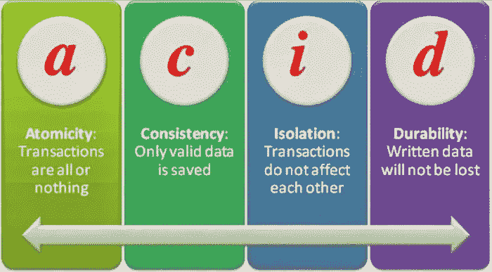

# 通过实例了解酸保证

> 原文：<https://levelup.gitconnected.com/understanding-acid-guarantees-through-practical-example-3fe806628580>



# 议程

这篇文章试图通过代码和实际例子来理解数据库 ACID 保证意味着什么。

ACID 是数据库提供的一组保证。大多数数据库使用一种叫做**事务**的机制来提供这些保证。

因此，数据库事务提供了以下保证:
-原子性
-一致性
-隔离性
-持久性

# 设置

让我们考虑我们正在建立一个食品订购平台。因此，可能涉及两个表，即*客户*和*订单*。
一个订单属于一个客户。因此从*客户*到*订单*是一对多的关系。

让我们创建两个表。

```
mysql> create database frodo;mysql> use frodo;mysql> create table customers (id int not null auto_increment, name char(20), address char(20), primary key (id));mysql> create table orders(id int not null auto_increment, total int, primary key (id), customer_id int, foreign key (customer_id) references customers(id));
```

我们将列的数量保持在尽可能少的水平，并特意保留了功能应用程序所需的许多其他列。

# 原子数

原子性确保一组语句或操作要么全部提交，要么根本不提交。

在我们的示例中，期望的行为是当任何人下订单时，必须在两个表中插入一行。

从第一个终端开始，让我们称它为终端 A，让我们开始一个 myql 连接。

```
$ mysql -u root -pmysql> use frodo;
```

让我们验证最初没有客户或订单出现。

```
mysql> select * from customers;
Empty set (0.00 sec)mysql> select * from orders;
Empty set (0.00 sec)
```

让我们开始一个事务，并发出两个对应于客户和订单的 insert 语句。

```
mysql> begin;mysql> insert into customers(name, address) values(‘Jon Snow’, ‘001, Winterfell’);mysql> select last_insert_id();
+ — — — — — — — — — +
| last_insert_id()  |
+ — — — — — — — — — +
| 1                 |
+ — — — — — — — — — +
1 row in set (0.00 sec)
```

因此，创建的客户的 id 是 1。让我们在插入订单时使用相同的 id。

```
mysql> insert into orders(total, customer_id) values(400, 1);
```

让我们提交事务。

```
mysql> commit;
```

让我们按 Ctrl+D 退出连接。

```
mysql> ^DBye
```

让我们再次连接 MySQL。

```
$ mysql -u root -p
```

让我们检查是否在 customers 和 orders 表中创建了一个条目。

```
mysql> use frodo;mysql> select * from customers;
+ — — + — — — — — + — — — — — — — — -+
| id  | name      | address          |
+ — — + — — — — — + — — — — — — — — -+
| 1   | Jon Snow  | 001, Winterfell  |
+ — — + — — — — — + — — — — — — — — -+
1 row in set (0.00 sec)mysql> select * from orders;
+ — — + — — — -+ — — — — — — -+
| id  | total  | customer_id  |
+ — — + — — — -+ — — — — — — -+
| 1   | 400    | 1            |
+ — — + — — — -+ — — — — — — -+
1 row in set (0.00 sec)
```

这将验证是否插入了客户和订单数据。

让我们开始另一个事务来创建另一组客户和订单。

```
mysql> begin;mysql> insert into customers(name, address) values(‘Ned Stark’, ‘002, Winterfell’);Query OK, 1 row affected (0.00 sec)mysql> select last_insert_id();
+ — — — — — — — — — +
| last_insert_id()  |
+ — — — — — — — — — +
| 3                 |
+ — — — — — — — — — +
1 row in set (0.01 sec)
```

让我们假设此时有一个数据库崩溃。让我们通过退出数据库来模拟一下。

```
mysql> ^DBye
```

让我们再次连接 MySQL。

```
$ mysql -u root -p
```

让我们检查 customers 表中的条目。

```
mysql> use frodo;mysql> select * from customers;
+ — — + — — — — — + — — — — — — — — -+
| id  | name      | address          |
+ — — + — — — — — + — — — — — — — — -+
| 1   | Jon Snow  | 001, Winterfell  |
+ — — + — — — — — + — — — — — — — — -+
1 row in set (0.00 sec)
```

因此，由于数据库崩溃，没有创建相应的订单，因此创建的客户信息也被回滚。

因此，原子性保证得到了加强。

# 一致性

一致性确保了两件事

*   不得违反数据库约束
*   连接到该数据库的其他客户机必须能够立即看到每个提交的事务

数据库约束的一个例子是外键约束。
数据库将确保引用表只能有一个存在于被引用表中的外键。这个约束确保了数据的正确性和完整性。

目前，数据库只包含一个客户，该客户的主键是 1。

让我们尝试插入一个 *customer_id* 为 2 的订单。

```
mysql> insert into orders(total, customer_id) values(500, 2);
```

您会注意到以下输出:

```
ERROR 1452 (23000): Cannot add or update a child row: a foreign key constraint fails (`frodo`.`orders`, CONSTRAINT `orders_ibfk_1` FOREIGN KEY (`customer_id`) REFERENCES `customers` (`id`))
```

因此，数据库正在实施外键约束，从而确保数据库的一致性。

数据库约束的另一个例子是，在删除引用表之前，不能删除被引用表。

让我们尝试删除 customers 表。

```
mysql> drop table customers;
```

输出如下所示:

```
ERROR 3730 (HY000): Cannot drop table ‘customers’ referenced by a foreign key constraint ‘orders_ibfk_1’ on table ‘orders’.
```

因此，上面的两个例子演示了数据库如何提供和实施一致性保证。

一致性还意味着一旦事务被提交，它应该立即对连接到数据库的每个其他客户机可见。因此，每个客户端都可以获得一致的数据视图。

让我们从另一个终端开始另一个 mysql 连接，我们称之为终端 b。

```
$ mysql -u root -p
```

让我们列出顾客。

```
mysql> select * from customers;
+ — — + — — — — — + — — — — — — — — -+
| id  | name      | address          |
+ — — + — — — — — + — — — — — — — — -+
| 1   | Jon Snow  | 001, Winterfell  |
+ — — + — — — — — + — — — — — — — — -+
1 row in set (0.00 sec)
```

切换回终端 a，并从终端 a 插入一个客户。

```
mysql> insert into customers(name, address) values(‘Ned Stark’, ‘002, Winterfell’);
Query OK, 1 row affected (0.00 sec)mysql> select last_insert_id();
+ — — — — — — — — — +
| last_insert_id()  |
+ — — — — — — — — — +
| 4                 |
+ — — — — — — — — — +
1 row in set (0.00 sec)mysql> insert into orders(total, customer_id) values(500, 4);
Query OK, 1 row affected (0.00 sec)
```

让我们切换到终端 B，即另一个客户端/连接。并列出客户。

```
mysql> select * from customers;
+ — — + — — — — — -+ — — — — — — — — -+
| id  | name       | address          |
+ — — + — — — — — -+ — — — — — — — — -+
| 1   | Jon Snow   | 001, Winterfell  |
| 4   | Ned Stark  | 002, Winterfell  |
+ — — + — — — — — -+ — — — — — — — — -+
2 rows in set (0.00 sec)
```

因此，无论插入或更新发生在哪里，每个 mysql 客户端都可以获得一致的数据视图。

# 隔离

每个事务必须与其他事务隔离处理。

隔离确保客户端不会因为其他并发运行的事务而看到不准确、不正确或不完整的数据。

事务 A 不会看到未提交的事务 b 当前正在进行的任何事情。因此，我们可以认为事务 A 是孤立发生的，不受事务 b 的影响。

让我们看一个例子。

让我们在客户机 a 上开始一个事务。

```
mysql> begin;
Query OK, 0 rows affected (0.00 sec)mysql> insert into customers(name, address) values(‘Catelyn Stark’, ‘002, Winterfell’);
Query OK, 1 row affected (0.01 sec)
```

切换到客户端 B 并列出客户。

```
mysql> select * from customers;
+ — — + — — — — — -+ — — — — — — — — -+
| id  | name       | address          |
+ — — + — — — — — -+ — — — — — — — — -+
| 1   | Jon Snow   | 001, Winterfell  |
| 4   | Ned Stark  | 002, Winterfell  |
+ — — + — — — — — -+ — — — — — — — — -+
2 rows in set (0.00 sec)
```

因此，客户端 B 看不到客户端 a 的未提交事务。因此，客户端 B 与客户端 a 隔离

因此，客户端 B 只能在其他客户端提交更改后才能看到这些更改。

值得一提的是，这种行为是可以改变的。数据库提供不同的事务隔离级别。如果我们将隔离级别设置为 **READ UNCOMMITTED** ，那么一个客户端也会看到其他客户端的未提交事务。

# 持久性

持久性确保提交的事务被永久写入磁盘，即使服务器崩溃也仍然可用。

当服务器在崩溃后重新启动时，直到崩溃点提交的所有事务都在数据库中可见。

因此，事务确保了持久性，并且数据是持久的和永久的，并且在崩溃和重启之后也是持久的。

# 其他员额

我们围绕 MySQL 写了以下帖子，您会发现这些帖子内容丰富:

*   MySQL 磁盘使用分析:[https://medium . com/@ raaj . AK shar/MySQL-disk-usage-analysis-CBF 7597 b 2836](https://medium.com/@raaj.akshar/mysql-disk-usage-analysis-cbf7597b2836)
*   建立对数据库死锁的理解:[https://level up . git connected . com/understanding-why-a-database-deadlock-occurs-8 bbd 32 be 8026](/understanding-why-a-database-deadlock-occurs-8bbd32be8026)

如果你觉得这篇文章信息丰富，请发送一些掌声来表达你的爱:)

# 分级编码

感谢您成为我们社区的一员！在你离开之前:

*   👏为故事鼓掌，跟着作者走👉
*   📰查看[级编码出版物](https://levelup.gitconnected.com/?utm_source=pub&utm_medium=post)中的更多内容
*   🔔关注我们:[推特](https://twitter.com/gitconnected) | [LinkedIn](https://www.linkedin.com/company/gitconnected) | [时事通讯](https://newsletter.levelup.dev)

🚀👉 [**加入升级人才集体，找到一份惊艳的工作**](https://jobs.levelup.dev/talent/welcome?referral=true)