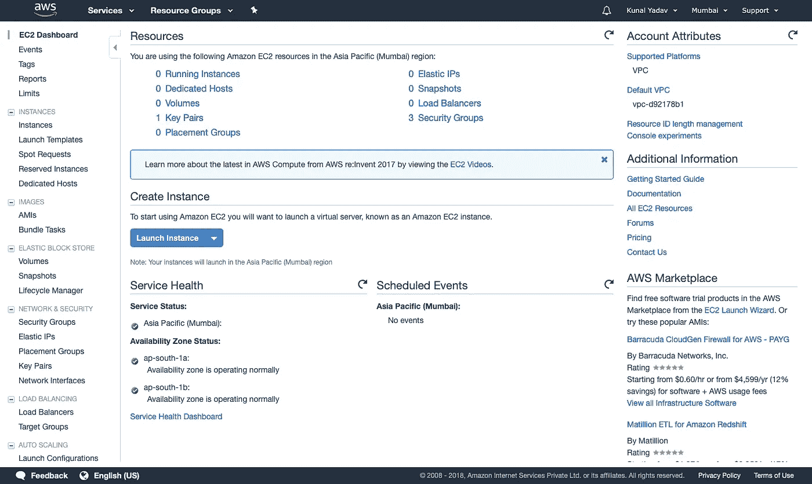
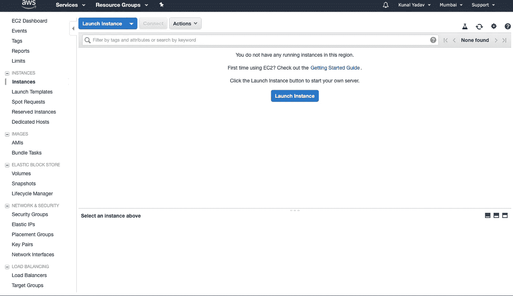
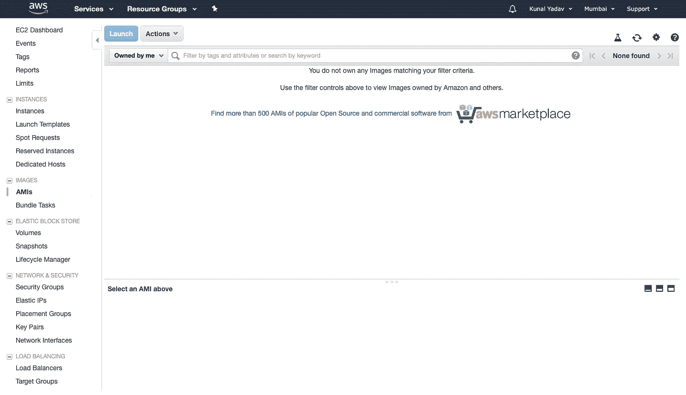
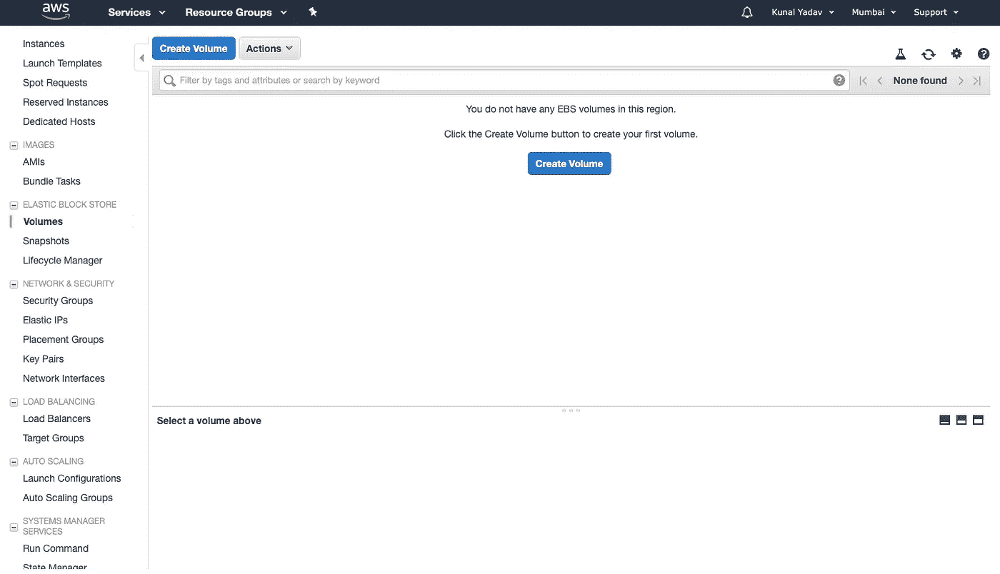
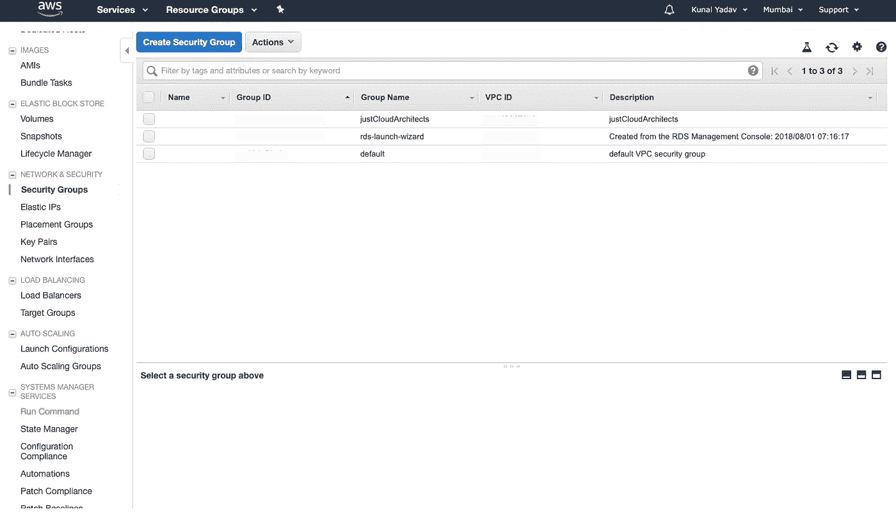
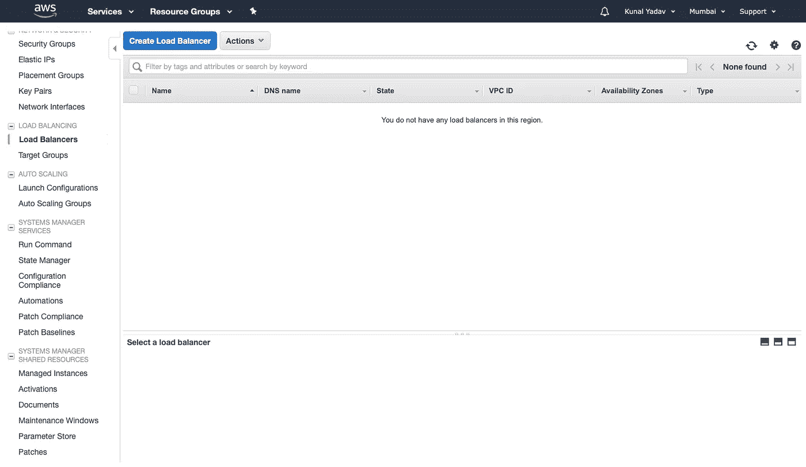
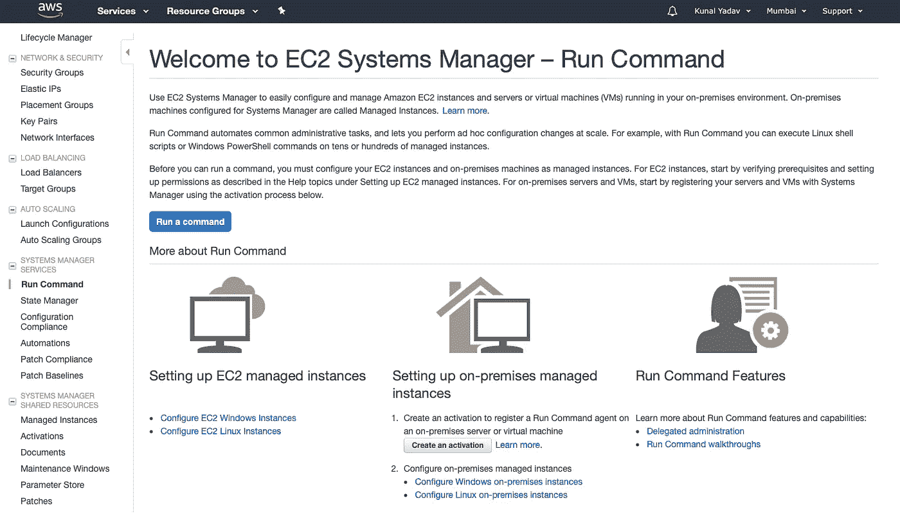
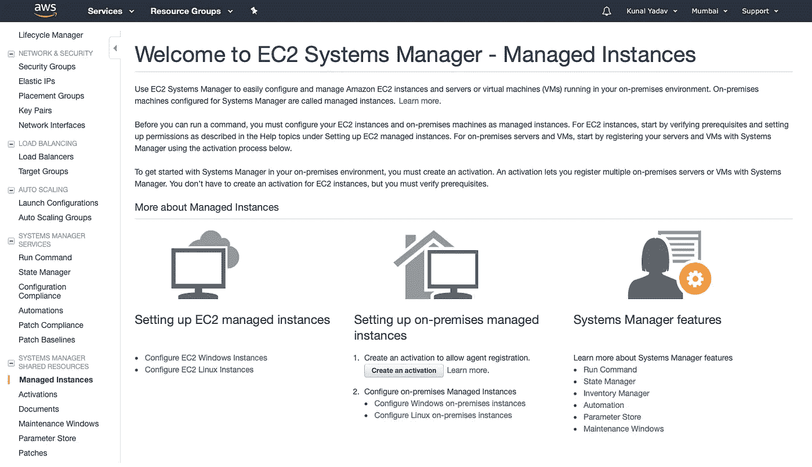

# 理解 Amazon EC2 术语

> 原文：<https://levelup.gitconnected.com/understanding-amazon-ec2-terminology-85be19d0af28>

大家好，在这篇文章中，我们将讨论亚马逊 EC2(弹性计算云)的完整术语。

EC2 是 AWS 的主干。它在云中提供可调整大小的计算能力。您可以在几分钟内启动一台针对您的工作而优化的新服务器，并根据您的计算需求的变化快速扩展和缩减它。

了解 EC2 中使用的术语将有助于您快速学习 EC2。

如果您有 AWS 帐户，请登录到您的控制台并单击 EC2。您应该会看到类似的页面，如下图所示-

亚马逊 EC2 仪表板

我们将涵盖左侧栏中显示的所有术语。我们开始吧

1.  **EC2 仪表板** —这给你一个当前地区(我的例子是孟买地区)EC2 使用情况的概述。
2.  **事件** —可能包括 AWS 在特定区域正在开展的计划活动。
3.  **标签** —您可以在 AWS 中为您的资源分配标签，以便轻松过滤和管理它们。在 EC2 中，您可以为实例、EBS 卷、弹性负载平衡器、快照、ami 等分配标签。你可以在这里看到所有的标签。
4.  **报告** —在这里，您可以看到 EC2 使用的成本和使用报告。您可以使用这些报告来分析和优化您的资源使用情况。
5.  **限制** —这显示了您的 EC2 资源限制，如实例限制(您可以启动的实例数量)、EBS 限制(您可以调配的 TiB 存储量)等。

EC2 实例仪表板

# 例子

1.  **实例**—这显示了正在运行和已停止的实例的所有细节。
2.  **启动模板** —创建一个指定实例配置、权限、最佳实践的模板，并使用该模板通过自动缩放和 EC2 fleet 自动启动实例。
3.  **Spot 请求** —在 EC2 中，您可以为非关键任务启动 Spot 实例。与按需实例相比，这些实例提供高达 90%的折扣。您可以在此处查看您的 spot 请求的状态。
4.  **保留实例** —您还可以选择保留实例来执行关键任务，同时节省成本。与按需实例相比，这些实例提供高达 70%的折扣，但您必须支付 1-3 年的费用才能使用它们。
5.  **专用主机** —您可以使用专用主机来满足您的合规性和许可要求。专用主机是一个物理服务器，是亚马逊的数据中心，专门供您使用。没有其他用户的实例在您的专用主机上运行过。

# 形象

1.  埃米斯——它代表亚马逊机器图像。AMI 提供启动实例所需的信息。除了 EC2，它就像一个 ISO。
2.  **Bundle Tasks** —用于创建 Amazon instance store 支持的实例的捆绑包。然后，您可以将这些包注册为 ami，以启动新的实例。

# 弹性块存储

1.  **卷** — EBS 卷就像云中的硬盘。它们可以附加到您的 EC2 实例中。你可以在上面安装操作系统和软件，或者像 WordPress 一样用它们来服务你的动态网站。此页面显示了您当前 EBS 卷的详细信息。
2.  **快照** —您可以创建 EBS 卷的备份作为快照。这些快照可用于创建包含相同数据的多个 EBS 卷。此页面显示您当前的快照。
3.  **生命周期管理器** —这允许您计划 EBS 快照的创建和删除，因此您不必担心常规备份，也不必为旧快照支付额外费用。

# 网络与安全

1.  **安全组** —它们就像是 EC2 实例的虚拟防火墙。到实例的所有流量总是通过其安全组。您可以指定打开哪些端口以及谁可以通过该端口发送和接收数据。
2.  **弹性 IP**—如果你听说过静态 IP，那正是静态 IP，附着在你运行或停止的实例上的 IP。您可以将弹性 IP 分配给 EC2 实例，以便于 SSH 访问。
3.  **放置组** —您可以在需要多个实例之间低延迟高速通信的地方创建放置组。最好在放置组中使用相似大小的实例。
4.  **密钥对** —要连接到您的 EC2 实例，您必须使用密钥对。您可以在此页面上看到您的所有密钥对。
5.  **网络接口** —您可以创建网络接口并将它们附加到您的 EC2 实例。您可以将多个网络接口连接到单个实例。

# 负载平衡

1.  **负载平衡器** —您可以使用它们来平衡多台小型服务器上的负载，而不是配置一台大型服务器。这种方法被称为水平缩放。此页面显示了负载平衡器的详细信息和状态。
2.  **目标组** —负载平衡器使用目标组来决定将传入流量路由到哪个端口和实例。

# 自动缩放

1.  **启动配置** —您可以创建启动模板，指定将使用自动缩放启动的实例的配置。这些模板包括实例类型、启动实例的 AMI、要附加的 EBS 卷等数据。
2.  **自动扩展组** —自动扩展自动管理您的 EC2 容量，因此您不必担心在流量高时手动配置新实例，以及在流量低时手动终止实例。此页面显示您当前活动的自动缩放组。

# 系统经理服务

1.  **运行命令** —您可以使用系统管理器来配置和管理您的所有实例。使用 run command，您可以在指定时间对所有实例运行命令。
2.  **状态管理器** —这可以用来自动将你的实例保持在期望的状态。它确保您的实例在启动时安装了必要的软件，并安装了特定的软件更新补丁。
3.  **配置符合性** —这允许您扫描您的托管实例群，查看补丁程序符合性和配置不一致性。
4.  **自动化** —它简化了常见的维护和部署任务，例如跨 Systems Manager 管理的实例更新 Amazon Linux 映像。
5.  **补丁合规性** —它向您显示补丁的合规性状态，如最新的实例数量、缺少的更新和错误状态。
6.  **修补程序基准** —这些基准定义哪些类型的修补程序被批准安装在您的实例上。您可以指定自动批准规则，以指定某些类型的更新(如系统关键更新)应被自动批准。

# 系统经理共享资源

1.  **托管实例** —这将向您显示由 Systems Manager 管理的实例。
2.  **激活** —要使用 Systems Manager 管理本地服务器，您必须创建激活。这允许您注册多个本地实例。
3.  **文档**—AWS Systems Manager 文档(SSM)定义了 Systems Manager 可以对托管实例执行的操作。您也可以使用预先配置的文档。
4.  **维护窗口** —维护窗口可用于定义一个重复的时间窗口，以便跨实例运行管理任务。它确保您的业务关键型系统不会中断。
5.  **参数存储** —您可以使用参数存储集中管理您的配置数据，如密码、许可证密钥或数据库连接字符串。然后，您可以在您的实例和开发团队之间安全地访问这些数据。
6.  **补丁**—这显示了为不同操作系统发布的最新补丁及其严重性列表。

伙计们，这是一大堆理论，如果你读完了，恭喜你！

我希望您现在已经了解了 EC2 的基础知识及其特性。在下一篇文章中，我们将实际启动一个 EC2 实例。

如果你喜欢它，请给它一些掌声，让更多的人喜欢它！