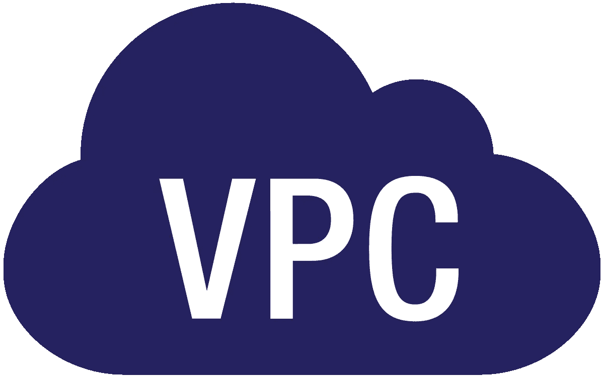
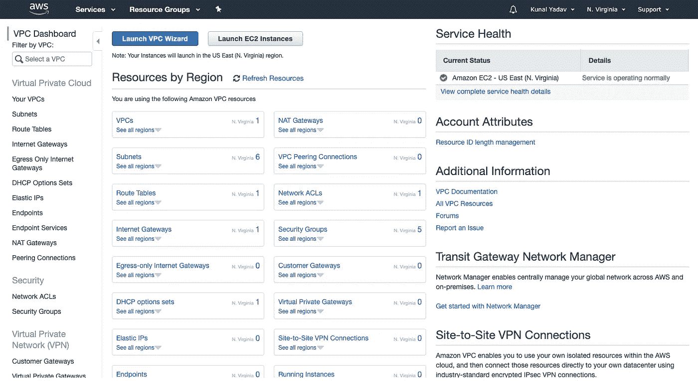
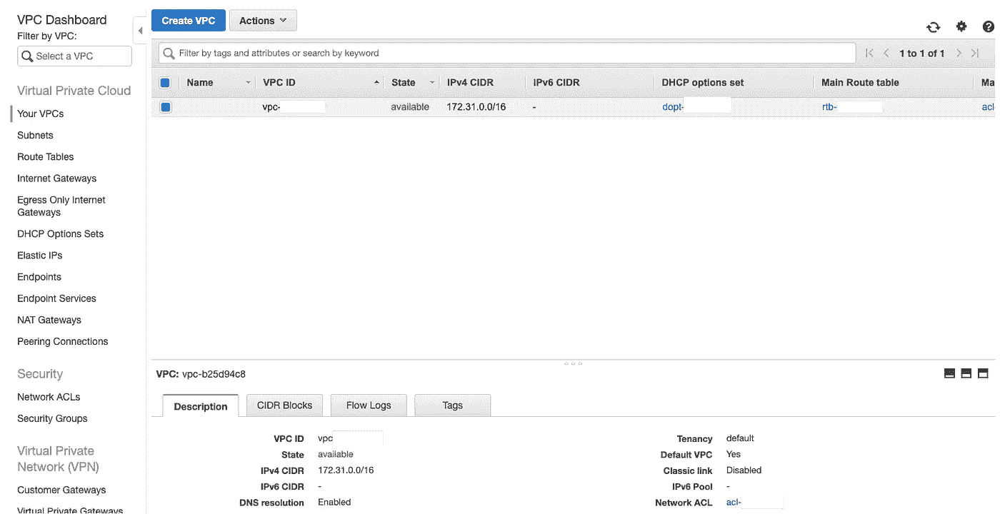
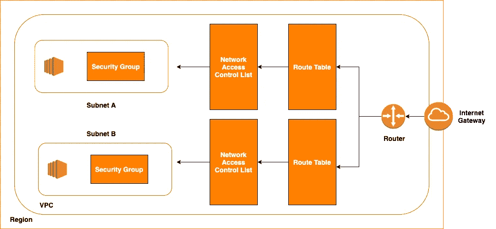
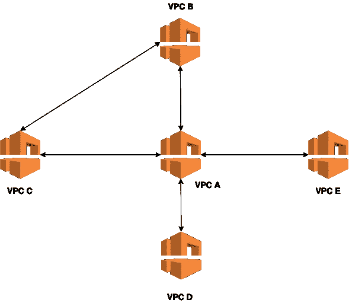
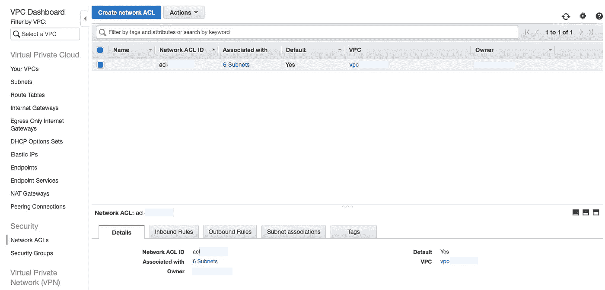
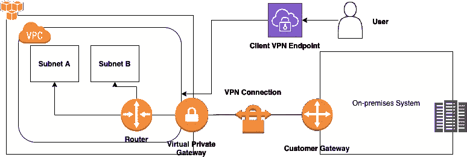
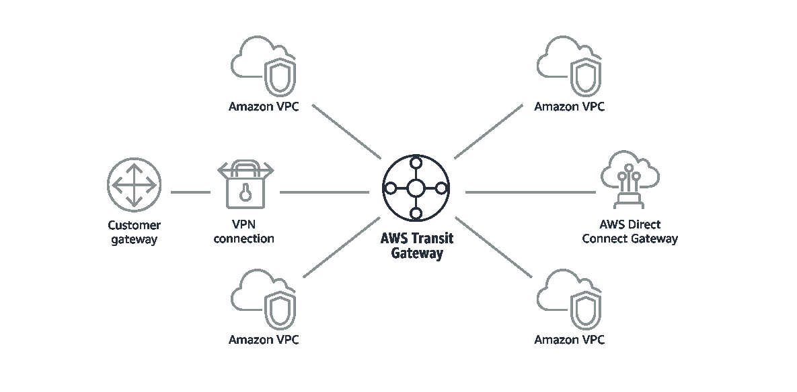

# 理解亚马逊 VPC 术语

> 原文：<https://levelup.gitconnected.com/understanding-amazon-vpc-terminology-b3150bb6cde0>

学分-wikimedia.org

VPC 或虚拟私有云是 AWS 提供的最重要的服务之一。从安全角度来看，这对于任何公司或初创公司来说也很重要。

您可以将 VPC 想象成您自己的云中虚拟数据中心。您可以完全控制虚拟网络环境，例如 IP 地址范围、子网、网络访问控制列表(NACLs)的配置、路由表、安全组和网络网关。

在本文中，我们将讨论处理 VPC 时使用的术语。

对不同的术语有一个概念将有助于你理解 VPC 的特点和作品。

要开始，登录您的 AWS 帐户，并在页面左上角的**服务**选项卡中选择 **VPC** 。

**VPC 仪表盘—** 该仪表盘可快速概述您的 VPC 以及当前区域内的 VPC。

# 虚拟私有云

**您的 VPC—**显示在给定区域内创建的所有 VPC。默认情况下，每个地区都有一个默认的 VPC，以快速允许您启动实例。对于生产系统，建议创建自定义 VPC 并在其中启动服务，以提供更好的安全性。

VPC 图

**子网** —子网代表 VPC 的一个可用性区域，并且只与**一个可用性区域**相关联。因此，如果一个区域有 3 个 az，那么可以为每个可用性区域创建三个子网。在区域中启动实例时，您可以选择要在其中启动实例的子网。

**路由表—** 路由表定义了一组称为**路由的规则，**用于确定网络流量在 VPC 的流向。每个子网始终与一个路由表相关联，路由表可以跨越多个可用性区域(子网)。

每个 VPC 都有主路由表。当您创建自定义 VPC 时，默认情况下会创建主路由表。

**互联网网关—** 要为您的 VPC 提供互联网接入，您需要在路由表中添加一个互联网网关。在默认 VPC 的主路由表中，默认情况下会连接一个互联网网关，因此您可以很容易地启动实例。默认情况下，所有子网都与主路由表相关联。

**仅出口互联网网关—** 这些互联网网关仅允许通过 IPv6 从您的 VPC 实例到互联网的出站通信，并阻止互联网启动与您的实例的 IPv6 连接。

如果您的某个应用服务器没有公共 IPv4 地址，但有 IPv6 地址，并且您希望允许此实例访问 internet 以保持系统更新和安装补丁程序，同时阻止来自 internet 的某人向此实例发送请求，则可以使用这些功能。

**DHCP 选项集—** 如果您想提供自己的 DHCP 配置参数，如域名和 DNS，您可以创建一个 DHCP 选项集，并将其与您的 VPC 相关联。这是一个高级设置，根据您的网络架构，您可能会也可能不会使用它。

**弹性 IP**—这些是您可以分配给 EC2 实例的静态公共 IPv4 地址。一旦附加，EC2 实例的 IP 地址在停止和再次启动时不会改变。默认情况下，每个区域只能创建 5 个弹性 IP。您可以通过联系 AWS 支持并告诉他们您的使用案例来提高这个限制。

**端点—** 它使您能够将您的 VPC 私下连接到受支持的 AWS 服务，而无需访问互联网。您的 VPC 和其他服务之间的流量不会离开亚马逊网络。

例如，假设您有一个专用子网(其路由表没有连接 internet 网关)，并且其中有一个实例(没有公共 IP 地址)。现在您希望该实例能够访问 S3，在这种情况下，您使用 VPC 端点与 S3 通信。

**端点服务—** 现在，假设您已经创建了一个进行视频转码的系统，并且您的 VPC 中有一些私有实例想要将视频发送到该系统进行转码。在这种情况下，您可以将该系统配置为 AWS PrivateLink powered service 或 endpoint service。

**NAT 网关—** 它们可用于允许私有子网中的实例连接到互联网或其他 AWS 服务，但阻止互联网启动与这些实例的连接。它们只支持 IPv4 流量。

VPC 对等

**对等连接—** 假设您在相同或不同的地区，甚至在不同的 AWS 帐户中有两个 VPC。您希望他们能够私下交流(无需通过互联网进行通信)。在这种情况下，您可以在这些 VPC 之间创建对等连接。

这里需要注意的一点是**不支持传递对等**。因此，需要在上图中的 VPC **B** 和 **C** 之间创建对等连接，以便它们相互通信，VPC B 不能通过 VPC A 与 VPC C 通信

网络 ACL 仪表板

# 安全性

**网络访问控制列表(NaCl)——**代表网络访问控制列表。它们与子网相关联，通过充当子网的防火墙来提供额外的安全层。您可以为子网创建入站和出站访问规则。它们可用于允许和拒绝访问。

它们是无状态的，也就是说，如果您为某个端口创建了入站规则，则不会自动为同一端口创建出站规则。您也可以使用它们来阻止单个 IP 地址。

**安全组—** 这些安全组与子网中的实例相关联，充当实例的防火墙。默认情况下，安全组拒绝所有入站访问，并且只能用于允许入站访问而不能拒绝。

与 NACLs 不同，它们是有状态的，即如果您为一个端口创建一个入站规则，则会自动为同一端口创建一个出站规则。

# 虚拟专用网络

与客户端 VPN 端点的站点到站点 VPN 连接

如果您有想要连接到 VPC 的本地系统，那么您可以创建一个站点到站点 VPN 连接。

**客户网关—**AWS 资源提供有关客户网关设备的 AWS 信息。客户网关设备是站点到站点 VPN 连接客户端的物理或软件应用程序。

**虚拟专用网关(VGW)——**与客户网关提供有关连接的客户端的信息一样，VGW 充当站点到站点 VPN 连接的 AWS 端的资源。

**站点到站点 VPN 连接—** 这些是 VPC 和您的内部系统之间的 VPN 连接。

**客户端 VPN 端点** —站点到站点 VPN 允许 AWS 连接到您的内部系统，反之亦然，但是如果您想从世界任何地方连接到该网络，您需要创建一个客户端 VPN 端点。使用此端点，客户端可以安全地连接到此 VPN 网络。

# 中转网关

这是一个高级概念，您应该查看 [AWS 文档](https://docs.aws.amazon.com/vpc/latest/tgw/what-is-transit-gateway.html)以了解更多相关信息。

AWS 中转网关。信用——aws.amazon.com/transit-gateway

使用 VPC 对等连接，您只能将两个 VPC 相互连接。如果要将新的 VPC 连接到这两个 VPC，则需要创建两个新的对等连接，因为不支持可传递对等。

同样，使用站点到站点 VPN，您需要创建一个新的连接来连接任意两个网络。

如果您有大量跨多个 AWS 帐户的内部系统和 VPC，那么创建和管理这些连接会变得很麻烦。

使用 Transit Gateway，您只需创建和管理从中央网关到每个亚马逊 VPC 和内部数据中心的单一连接。任何新的 VPC 或内部中心只需连接到转接网关，然后就可以自动用于连接到转接网关的所有其他网络。

**中转网关附件—** 这些是您为中转网关创建的不同附件。连接可以是 VPC、VPN 或对等连接。

**中转网关路由表** —这些路由表包括动态和静态路由，根据数据包的目的 IP 地址决定下一跳。这些路由的目标可能是 VPC 或 VPN 连接。

**中转网关多播域—** 多播是一种通信协议，用于将单个数据流同时传送到多台接收计算机。

在这种情况下，它可以用于在连接的 VPC 的子网之间路由多播流量。

多播域允许将多播网络分割成不同的域，并使转接网关充当多个多播路由器。

**网络管理器—** 通过在一个集中的仪表板中以逻辑图或地理图的形式可视化您的全球网络，您可以跨 AWS 和内部中心集中管理您的网络。

# 流量镜像

这是一个 VPC 特性，可用于从 EC2 实例的弹性网络接口(ENI)复制网络流量。然后，可以将该流量发送到安全和监控设备，进行内容检查、威胁监控和故障排除。

**镜像会话—** It 将流量从指定的源复制到目标。

**镜像目标—** It 是会话中复制流量的目的地。

**镜像过滤器—** 它帮助您控制从会话中复制的内容。

现在，我们知道了 VPC 的不同术语，我们可以继续下去，并获得在 VPC 工作的第一手经验。我们将在下一篇文章中讨论这个问题！

我希望你从这篇文章中学到了一些东西，如果你有疑问，请在下面评论！

## 参考

1.  [亚马逊 VPC](https://docs.aws.amazon.com/vpc/latest/userguide/what-is-amazon-vpc.html)
2.  [中转关口](https://docs.aws.amazon.com/vpc/latest/tgw/what-is-transit-gateway.html)
3.  [流量镜像](https://docs.aws.amazon.com/vpc/latest/mirroring/traffic-mirroring-filter.html)

非常感谢你阅读这篇文章。如果你喜欢它，请给它一些掌声，让更多的人从中受益！