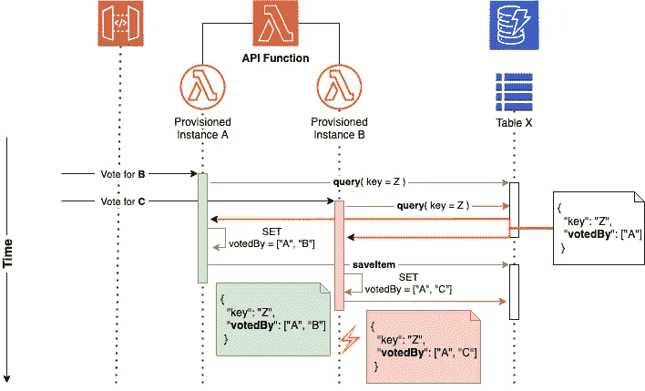
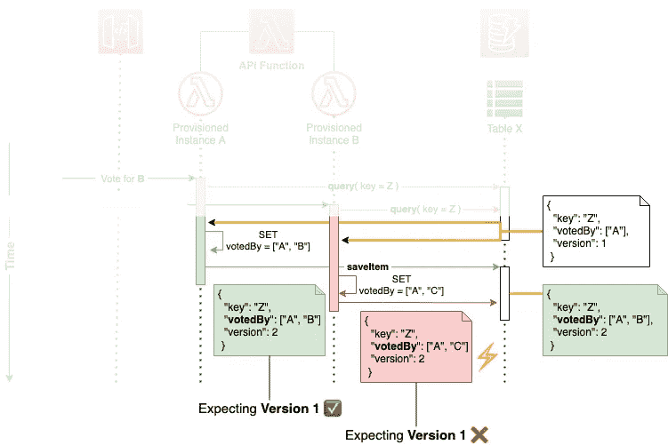

# 理解和处理 DynamoDB 中的竞争条件

> 原文：<https://levelup.gitconnected.com/understanding-and-handling-race-conditions-at-dynamodb-6b4850c4e524>

## 从竞争条件到数据不一致

## 即使您的服务没有经历很多写操作，也值得尽早考虑可能的并发问题。


照片由 [**Pixabay**](https://www.pexels.com/@pixabay?utm_content=attributionCopyText&utm_medium=referral&utm_source=pexels) 发自 [**Pexels**](https://www.pexels.com/photo/light-trails-on-highway-at-night-315938/?utm_content=attributionCopyText&utm_medium=referral&utm_source=pexels)

侧重于无服务器开发，DynamoDB 是数据库解决方案的一个顿悟。它是托管的、高度可用的，并且可以按需扩展。但不是所有的事情都可以由 AWS 接手:你仍然需要考虑你的使用模式。一个常见的错误是忘记脏读可能导致的竞争条件。

在本文中，我将向您介绍一些常见的方法，如何避免由于对单个文档的冲突写入而导致数据不一致。

配料:

*   *比赛条件* —简短介绍。
*   *事务* —为什么它们不是一切的解决方案。
*   *检测冲突* —并利用乐观锁定。
*   *更新表达式*—用于安全更新字段。
*   *关键要点*

# 什么是竞争条件？

从引用维基百科上的[比赛条件](https://en.wikipedia.org/wiki/Race_condition)开始:

> 竞争条件或竞争危险是电子、软件或其他系统的条件，其中系统的实质性行为取决于其他不可控事件的顺序或时间。

所以换句话说:时间和顺序正在影响我们系统的确定性。如果我们将它转移到 web 领域，如果操作顺序和时间发生变化，我们的 API 操作将会得到不同的结果，即使它们提交相同的有效负载。

让我们为此创建一个假想的(永远不会以这种方式实现，但有利于演示)示例:

*   我们在 DynamoDB 文档的列表中保存每个候选人的投票。
*   API 网关后面的 Lambda 函数提交这些投票。

如果我们收到不同投票人对同一候选人的并发投票操作，如果操作是按照一定的顺序进行的，我们就会遇到麻烦。



具有冲突写入操作的典型竞争情况

第二个投票请求在第一个提交其写操作之前到达。因此，将使用另一个 Lambda 实例(由于每个 Lambda 实例一次只能处理一个请求的事实)，它将接收候选人 Z 的相同查询结果，只包含 a 的投票。

两个实例都将尝试通过用表决器扩展列表来进行更新，因此我们将根据写操作的时间得到不同的结果。

**更糟糕的是**:两条路——要么 A 在 B 之前结束，要么 B 在 A 之前结束——都会导致数据损坏，因为无论哪条路我们都会失去一票。

# 数据库事务

DynamoDB 支持事务，以确保一组操作耦合在一起，并且只一起执行，从而保证我们的确定性。

*   [TransactWriteItems API](https://docs.aws.amazon.com/amazondynamodb/latest/developerguide/transaction-apis.html#transaction-apis-txwriteitems) —允许在单个(原子的)“全有或全无”操作中将多达 25 个写操作组合在一起。
*   [TransactGetItems API](https://docs.aws.amazon.com/amazondynamodb/latest/developerguide/transaction-apis.html#transaction-apis-txgetitems) —同步读取最多 25 个项目(总共不超过 4MB)。

如所见，这些操作限于一组读**或**写操作。所以在我们的例子中，这没有帮助，因为我们需要确保对单个文档的任意操作都保证以一致的状态结束。

# 检测冲突

让我们退一步，不要试图从一开始就解决问题，而只是检测可能导致不一致状态的冲突操作。

## 乐观锁定

DynamoDB Mapper 和它的[乐观锁定](https://docs.aws.amazon.com/amazondynamodb/latest/developerguide/DynamoDBMapper.OptimisticLocking.html)允许我们通过使用一个专用的版本字段来验证我们确实在更新我们所期望的项目。

如果我们回头看看我们的例子，我们会用一个新的字段`version`来增强我们的文档。

```
{
  "key": "Z",
  "votedBy": ["A"],
  "version": 1
}
```

当我们创建一个新的文档时，它会自动分配一个初始版本——给注释有`@DynamoDBVersionAttribute`的字段。每隔一次对该项目的写操作将通过在内部使用一个`ConditionExpression`来确保版本号匹配。如果是这样，它将自动增加，这保证我们在读取和写入操作之间没有中间写入操作。



用乐观锁定扩展我们的场景

如果有一个中间写，我们期望的版本将不匹配，我们将收到一个`ConditionalCheckFailedException`。实例 b 写操作时的介绍示例就是这种情况。

现在，我们可以通过重新加载文档的当前状态并合并我们的更改来手动解决我们的问题。在我们的例子中，这很容易，因为我们只有一个属性，但是对于一个有多个字段的复杂文档，这可能非常复杂，因为我们还需要知道我们在当前流程中所做的更改。

我们可以坚持使用乐观锁定来确保一致性，但是依赖 DynamoDB 内部来实现原子更新。

# 更新表达式

使用[更新表达式](https://docs.aws.amazon.com/amazondynamodb/latest/developerguide/Expressions.UpdateExpressions.html#Expressions.UpdateExpressions.ADD)我们可以修改复杂文档的某些字段。例如，它允许我们在列表中添加或删除元素，这正是我们在用例中所需要的。

通常，有四种不同的操作:

*   `SET` —用于向项目添加一个或多个属性。
*   `REMOVE` —用于删除一个或多个属性。
*   `ADD` —添加一个新的属性及其值。
*   `DELETE` —从集合中删除一个或多个元素。

对于我们的用例，我们可以使用`ADD`或者`SET`，但是亚马逊推荐使用`SET`。让我们快速定义实例 B 的更新操作，而不使用特定的框架，只使用 AWS-SDK:

```
aws dynamodb update-item \
    --table-name votes \
    --key '{"key":{"S":"Z"}}' \
    --update-expression "**SET** #field = **list_append**(#ri, :value)" \
    --expression-attribute-names '{"#field": "votedBy"}' \
    --expression-attribute-values '{"value": {"L": ["B"]}}'
```

使用节点的 [DynamoDB 数据映射器，如下所示:](https://github.com/awslabs/dynamodb-data-mapper-js/tree/master/packages/dynamodb-expressions)

如前所述，更新表达式还可以用于检查文档的某些状态——比如乐观锁定的实现使用版本字段来确保读操作和写操作之间没有冲突。

# 关键要点

确保分布式系统(或任何多节点服务)中的一致性是一项非常重要的任务。有了 DynamoDB，我们得到了一个助手工具箱，它允许我们通过使用乐观锁定来检测冲突，并在更新表达式的帮助下进行细粒度的、一致的更新操作。

# 还有更多…

我正在写一本关于 AWS 基础知识的书，以帮助其他人了解核心构建模块。重点是为现实世界学习，而不仅仅是为了证书！📚
你可以在[awsfundamentals.com](https://awsfundamentals.com)订阅时事通讯，每两周将一点点预览内容&免费发送到你的收件箱。