# 对 Google App Engine 自动缩放的理解和优化

> 原文：<https://levelup.gitconnected.com/understanding-and-optimization-of-google-app-engines-automatic-scaling-95674910da3b>

本文将研究 Google App Engine 的自动缩放，并通过其`app.yaml`文件更改自动缩放的配置来优化其缩放行为。

照片由[西格蒙德](https://unsplash.com/@sigmund)在 [Unsplash](https://www.unsplash.com/) 上拍摄

采用云的一个重要原因是易于扩展。但是，即使有内置的扩展，许多也可能出错，如果处理不当，会累积大量成本。此外，如何“正确扩展”并不明显，因为简单地增加“更多”并不总是正确的选择。

# 自动缩放

尽管 Google App Engine 有三种不同的缩放类型(自动、基本、手动)，我们将只看自动的一种，因为它提供了最细粒度的选项。

在进一步了解如何优化几个服务之前，我们先来看看您可以设置的不同选项，以定义 App Engine 的自动缩放行为。

请记住，自动缩放仅适用于类型为`F`的 App Engine 实例类。此外，标准环境和灵活环境之间也存在一些差异。在本文中，我们将使用标准环境。

**缩放元素**

在应用引擎配置文件的顶部——我将在后面的实践部分提供一个完整的代码示例——元素`automatic_scaling`可以作为根对象来定义自动缩放行为。

下面的子元素是可选的，不需要设置，尽管我强烈建议您这样做。

`max_instances`—Google 应该启动的最大实例数。该值可以介于 0 和 2147483647 之间，其中 0 表示禁用该设置。在繁忙的一天，您应该将这个值设置得比预期值高几倍，以便为用户和流量的突然增加做好准备。我们通常会去 6 次左右。因此，如果我们从监控中知道，在一个典型的日子里，我们有大约 20 个实例在运行，那么我们将使用 120 个 max_instances。

`min_instances`—Google 在任何时候应该运行的最小实例数。有效值介于 0 和 1000 之间，其中 0 表示允许“缩放到零”。但请记住，调整到零总是会导致冷启动。此外，无论实例是否收到任何流量，您都将为实例的运行数量付费。所以如果你要设置的话，不要设置的太高。我们喜欢将这个值设置为几个实例，最多 20 个实例，特别是对于我们的业务关键型实时系统，我们知道在这些系统中，请求量可能会突然激增。然而，对于大多数非关键系统，0 或 1 的 min_instances 应该是合适的。

`max_idle_instances` —空闲实例的最大数量。有效值从 1 到 1000，或自动，后者是默认值。

`min_idle_instances` —空闲实例的最小数量。Google 将运行此处指定的实例数，以及 Google 根据自动缩放算法加速运行的活动实例数。有效值从 1 到 1000，或自动，后者是默认值。

`target_cpu_utilization` —指定 AppEngine 启动新实例时的 CPU 利用率。有效值范围为 0.5 到 0.95，默认值为 0.6。如果您将 0.6 作为默认值，那么当当前实例的 CPU 利用率达到 60%时，Google 会增加新的实例。

`target_throughput_utilization` —该设置只能与`max_concurrent_requests`配合使用。有效值范围为 0.5 到 0.95，默认值为 0.6。当 AppEngine 上的并发请求数量达到由`target_throughput_utilization * max_concurrent_requests`定义的值时，调度程序会尝试启动一个新实例。

`max_concurrent_requests` —定义在调度程序产生新实例之前，一个实例可以接受的最大并发请求数。默认值为 10，最大值为 80。如上所述，该参数需要与`target_throughput_utilization`一起使用。将该值设置得太高可能会导致额外的延迟和性能下降，因为每个实例要处理更多的请求。另一方面，如果您希望每个请求产生一个实例，将它设置为 1 会有所帮助。此外，值得一提的是，高于 10 的值仅适用于 F2 或更高的实例类。F1 不支持十个以上的并发请求。

`max_pending_latency` —允许请求停留在挂起队列中的最长时间。如果请求停留的时间更长，调度程序将启动一个新的实例。因此，较高的值意味着，如果当前没有可用于处理请求的实例，应用程序引擎可能需要更长的时间来开始处理用户的请求。另一方面，较低的值会更快地触发应用程序引擎的扩展，并减少延迟，但会由于更多实例的增加而增加成本。有效值的范围是从 0.01 到 15.0 秒，而根据您在提供无效值时将收到的错误消息，提供的值必须与下面的 RegEx `^(?:^(\d+((\.\d{1,3}?s|ms)|automatic)$)$`匹配。值得一提的是，不要把这个值误认为请求从服务器返回的实际时间，而是负载平衡找到服务器来分配请求的时间。

`min_pending_latency` —在调度程序创建新的实例来处理请求之前，允许请求停留在挂起队列中的最短时间。与`max_pending_latency`完全一样，有效值范围从 0.01 到 15.0 秒，而提供的值必须与下面的正则表达式`^(?:^(\d+((\.\d{1,3}?s|ms)|automatic)$)$`匹配。

`min_pending_latency`与`max_pending_latency`协同工作，它们一起创建了以下自动缩放行为:

1.  一个请求到达应用程序，但是没有实例可以为它服务，所以 Google 将它放在挂起的请求队列中。
2.  直到请求到达`min_pending_latency` : App Engine 试图找到一个可用的实例来服务请求，并且不创建新的实例。
3.  在队列中的时间超过`min_pending_latency`之后，到达`max_pending_latency`之前:App Engine 试图找到一个可用的实例来服务请求。
4.  超过请求等待时间后`max_pending_latency` : App Engine 停止搜索一个可用的实例来服务请求，并产生一个新的实例。

您可以看到一个`app.yaml`文件的例子，我在下面的代码片段中定义了所有上述参数。

# 亲自动手

现在我们已经快速检查了 Google App Engine 提供的所有可能的自动缩放参数，让我们检查几个典型的真实场景，看看我们如何使用上述参数优化缩放行为。

作为我们比较的“起点”，我们将始终使用上面提到的`app.yaml`文件，然后稍微调整一下参数，以改善我们应用程序的缩放行为。

此外，我们将在所有后续测试中使用“斜坡到达率”来创建流量。这意味着我们可以定义一个时间范围(例如，2 分钟)和虚拟用户的目标数量(VU)，负载测试脚本将自动调整其 vu，直到它在时间范围结束时达到目标。通过链接这些定义，我们可以快速创建自定义场景来模拟流量变化。此外，我们定义 VUs 每秒发出一个请求。

您会注意到，在后面的图片中有两行显示了我们的 App Engines 实例数。绿色的代表当前活动的实例，粉色的代表空闲的实例。

你可以在这个 [GitHub 库](https://github.com/Abszissex/uc-8-appengine-scaling)中找到以下例子的代码。

我们要看的场景:

*   许多长期运行的请求
*   计算密集型请求
*   内存密集型请求

**许多长期运行的请求**

我们想看的第一个场景是“许多长时间运行的请求”不管它们是短期的还是长期的。它们只需要 CPU 价格低廉。这里的一个典型用例是一个服务器向许多客户端提供简单的数据，它从一些数据库中获取数据，不需要做很多修改，对 CPU 和内存的要求也很低。

出于演示目的，我们用每个 vu 触发的端点是一个简单的`/longRunning` 端点，它在返回之前等待五秒钟，除此之外什么也不做。

在下面，你可以看到端点的定义。

我们的场景:

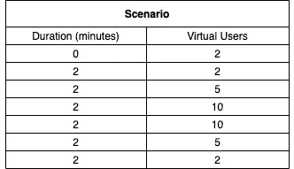

在上面的场景中，您可以看到我们从两个用户开始，停留两分钟，然后在两分钟内扩展到五个和十个用户。之后，我们在两分钟内保持十个用户，然后再逐渐减少。

使用我们的初始`app.yaml` 配置运行上述场景(总共 12 分钟)，我们在 Google 云监控中获得了以下指标:

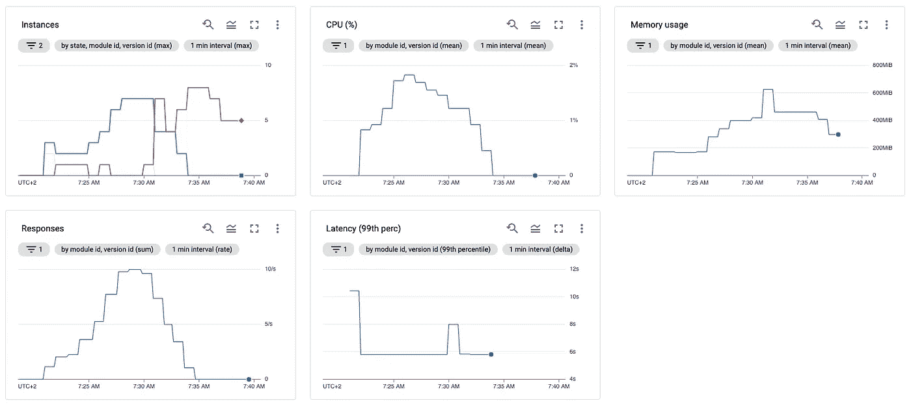

响应和 CPU 指标非常简单，随着请求数量的增加而增加/减少。在响应指标中，我们可以看到我们精确地达到了之前定义的每秒十个请求，因为在我们的场景中我们定义了每秒一个请求的 10 个 vu。

在延迟图中，您可以很好地看到，除了一些最初的高和小问题之外，服务需要五秒多一点的时间来响应，考虑到五秒的等待时间加上一些处理/网络开销，这绝对有意义。实例的冷启动，如果你熟悉无服务器，你应该已经经常经历过，是最初高的原因。因为当第一个请求到达 URL 时，根本没有服务器在运行，因为我们的`app.yaml`定义了一个缩小到零的比例，所以在实例可以处理任何请求之前，Google 必须加速第一个请求，这需要一点时间。

内存使用与我们的总实例(活动+空闲)相一致，每个实例都有一些运行服务器代码和操作系统的开销。

但是这里最有趣/最重要的部分是实例图。这里我们可以看到，Google 在收到第一个请求后会立即旋转多达三个实例，过了一小段时间后，这三个实例中只有两个会主动为请求提供服务。这是因为，在开始时，根本没有实例可以处理任何请求，所以 Google 会不断增加实例，直到有实例可以处理请求。

在我们达到发送请求的峰值之前，我们可以观察到伸缩工作得非常好，并且只有一个额外的情况，其中一个实例是空闲的，但是除此之外，所有的实例都是活动的并且响应请求。就在我们再次开始减少请求时，我们可以看到我们在相当长的时间里一直有空闲的实例。在这个例子中，Google 在上午 7:45 左右关闭了空闲实例，大约在最后一个请求发送后 12 分钟。但是这没关系，因为 App Engine 不是“处理一个请求然后立即关闭”情况的解决方案。此外，您不希望这里有太多的冷启动，所以让实例多存活几分钟也没问题。

作为一种解决方法，如果您想提前关闭实例，可以重新部署应用程序并覆盖以前的版本。这样，谷歌关闭旧实例的速度会更快。

仔细看一下图表，您会注意到，您必须运行 7 个 App Engine 实例，这样才能每秒处理 10 个请求，这听起来有些过分，主要是因为您根本没有利用 CPU 和内存，因为只有长时间运行的请求。但是，您仍然要为为实例保留的资源付费。

使用`app.yaml`文件提供的配置可能性，我们可以很容易地在这里进行优化。我们的默认配置使用 0.6 的`target_throughput_utilization`和 10 的`max_concurrent_requests`，这意味着如果请求的数量大于 6 个并发请求的阈值，App Engine 将向上扩展。由于我们的服务器只处理请求，不会对 CPU 或内存造成任何影响，因此我们可以放心地将`max_concurrent_requests`增加到 80(可用的最大值),从而在 App Engine 基于并发请求进行扩展之前创建 48 (80 * 0.6)个并发请求的阈值。当然，您不应该盲目地增加自动伸缩参数，而是应该持续监视您的服务在新配置下的行为，并检查日志中出现的任何错误。

因此，让我们看看在更改了`max_concurrent_requests`之后，我们的实例缩放表现如何:

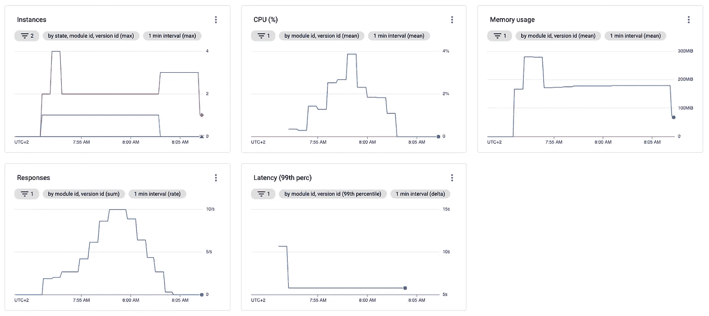

与上一次观察相比，您应该会立即注意到一些差异:

*   最大 CPU 利用率约为 4%，而不是 2%
*   使用的内存非常稳定，而且比以前少了很多
*   实例数量非常一致，并且比以前低了很多

现在让我们快速检查一下为什么我们会看到上述差异。

我们期望 CPU 有所增加，因为我们现在每个实例有更多的请求，并且每个请求消耗一点点 CPU。

内存消耗减少且更加稳定也是合理的，因为消耗内存的实例减少了。此外，我们没有太多的向上/向下缩放，因此，不断消耗内存。

查看我们的实例计数，我们注意到我们从单个活动实例开始，并坚持到测试结束。即使我们总是有至少一个额外的实例空闲运行。总有一个实例是空闲的，这一开始听起来可能有点混乱，但是如果你计算一下，这是有意义的。

我们告诉 App Engine，根据上面的配置更改，当超过 48 (80 * 0.6)个并发请求的阈值时，我们希望进行扩展。然而，我们也知道一个请求至少需要 5 秒钟外加一些开销。此外，我们知道我们每秒发送多达 10 个请求，这意味着 App Engine 将需要处理至少 50 个(5 秒* 10 个请求/秒= 50 个请求)并发请求，而阈值约为每个实例 48 个。因此，有两个可用的实例是绝对有意义的，即使其中一个是空闲的。

下图显示了两种配置的比较及其对彼此下方缩放行为的影响。

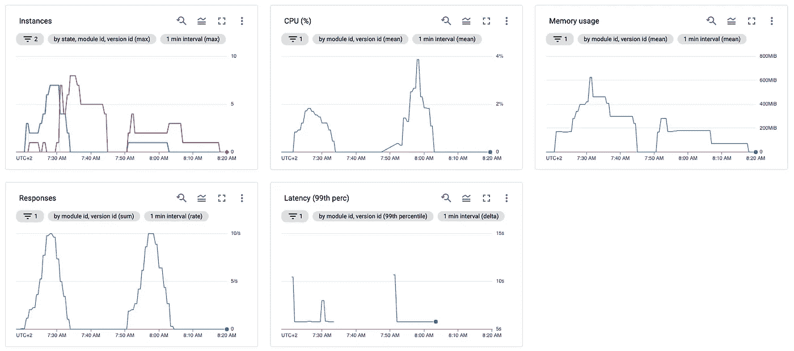

正如您所看到的，如果您知道您的服务器需要处理什么样的负载，那么通过适当的配置来削减成本是相对容易的——也就是说，运行七个实例的成本是运行两个实例的成本的数倍。

**计算密集型请求**

除了通过调整并发请求来改变伸缩行为之外，还可以通过 CPU 阈值来定义伸缩行为。在本文的开始，我们了解了可以在我们的`app.yaml`文件中修改的`target_cpu_utilization`属性。默认情况下，该属性的值为 0.6。因为我们现在想看看如何调整这个属性来减少实例/成本，让我们将我们的应用程序与我们的默认 YAML 配置和相同的配置(增加了 0.9 的`target_cpu_utilization`)进行比较。

在下图中，您可以看到该测试的场景。正如您将注意到的，我们比并发请求方法的步骤少得多，并且在稍微加速之后，我们更加关注稳定数量的请求。

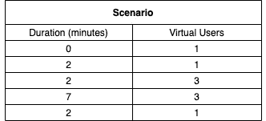

您可以在下面的代码片段中看到我们为此场景调用的端点定义。代码运行一个小但 CPU 密集型的方法，并在我们调用端点时返回。

首先，让我们看看如何使用默认的 YAML 配置来扩展我们的应用程序。

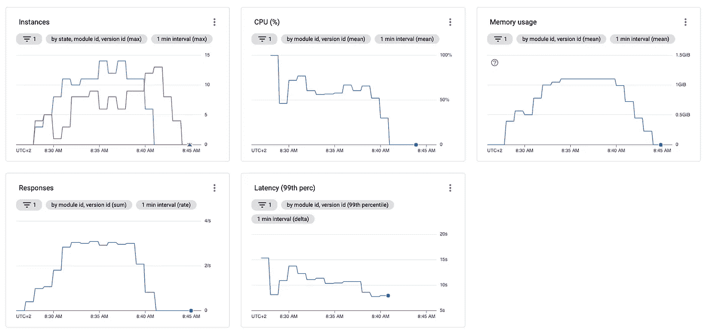

考虑到上面的监控，我们可以看到 CPU 利用率在 60–70%左右波动，这绝对有意义，因为我们的 CPU 阈值是 0.6 (60%)。此外，我们最初看到短暂的 100%峰值，但这是由于冷启动。在最初的峰值之后，应用程序引擎“稳定下来”。

同样需要注意的是，99%的请求延迟大约是 10 秒。

接下来，我们来看看增加了`target_cpu_utilization` *的相同场景。*

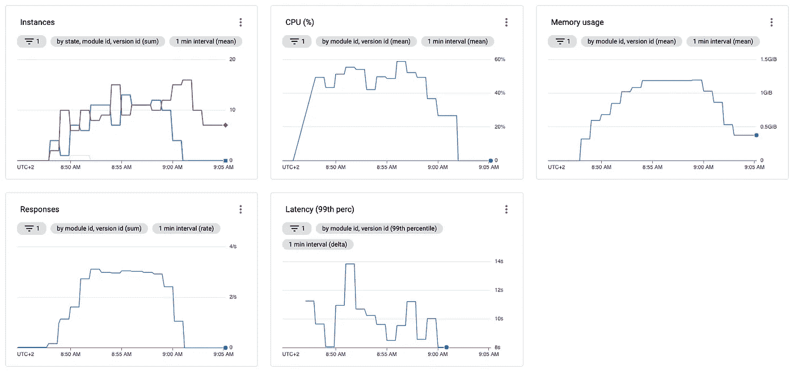

并直接比较这两种方法。在下图中，你可以首先看到我们的“默认”配置，然后第二次使用增加的`target_cpu_utilization` *运行我们的设置。*

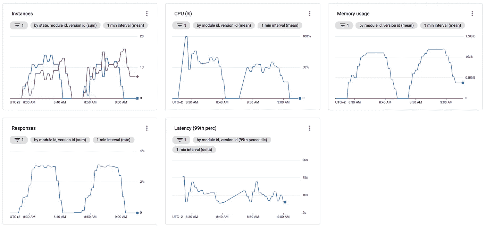

比较这两种方法，您会注意到三件事。

首先，第二次设置在 CPU 方面更加“冷静”，但实际上，这并不意味着太多，因为第一次运行中 CPU 的大多数波动都是在冷启动发生的最开始。正如我们所知，App Engine 在冷启动后需要一点时间来“稳定”。

第二，也是更重要的一点，两次运行之间的实例总数变化不大。但是，同样，在将阈值从 60%提高到 90%之后，这并不是人们所期望的。

第三，即使我们将阈值提高到 90%，CPU 利用率也只有 50%左右，远远低于预期。当实例达到阈值时，将阈值调整为 90%的 App Engine 应该会向上扩展，因此我们预计 CPU 利用率在 80–90%左右。

加上我们从“许多长时间运行的请求”一节学到的知识，并考虑到我们的请求需要很长时间才能返回，我们可以得出第二次和第三次意外观察的一个可能原因。

基于 CPU 的 App Engine 似乎没有适当扩展的假定原因可能是并发请求配置。正如我们所知，我们已经使用了我们的“默认”配置作为上述测试的基础。在这个配置中，`max_concurrent_requests`属性仍然是 10。因此，显而易见的假设是，App Engine 是由于这个属性而不是 CPU 阈值而缩放的，这可以解释上面的观察结果。

为了验证我们的假设，让我们重新运行上面的场景。但是这一次，`max_concurrent_requests`属性设置为 80。

`max_concurrent_requests`设置为 80 的默认配置:

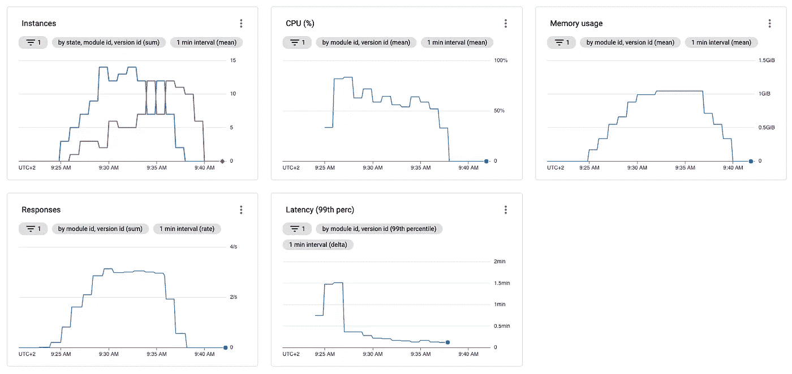

使用`max_concurrent_requests` = 80 且`target_cpu_utilization`设置为 0.9 的配置:

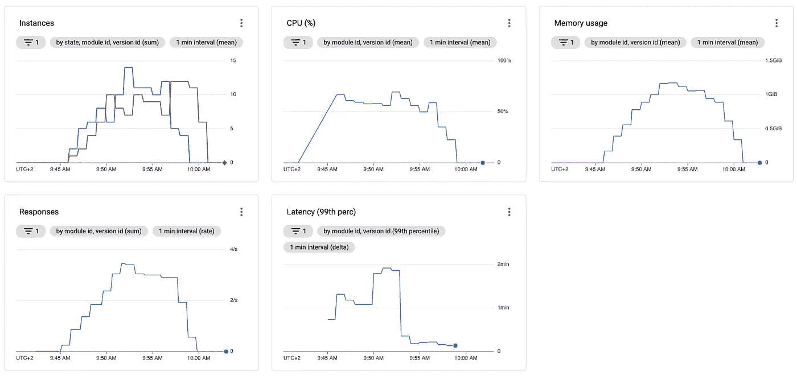

两种配置进行了比较:

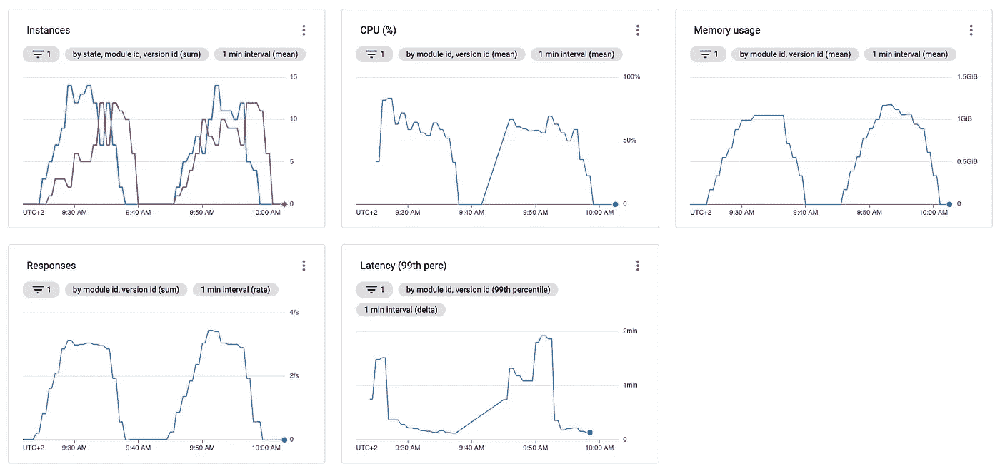

正如您在上面的图片中所看到的，尽管我们的假设可能是正确的，但是增加并发请求不仅没有帮助，反而极大地损害了我们的服务，尤其是在目标 CPU 利用率增加的情况下。

由于高负载，现在允许每个实例接收 8 倍数量的请求，这大大降低了实例的速度，当您比较图形的延迟时可以看到这一点。

为了便于比较，您可以看到下图，显示了我们在上面测试的四种不同的配置。在这里，您可以特别看到`max_concurrent_requests` *=10* 情况下的延迟非常一致并且在合理的范围内，而`max_concurrent_requests` *=80* 使服务器过载，延迟增加了 1 分钟以上，而不是大约 10 秒。

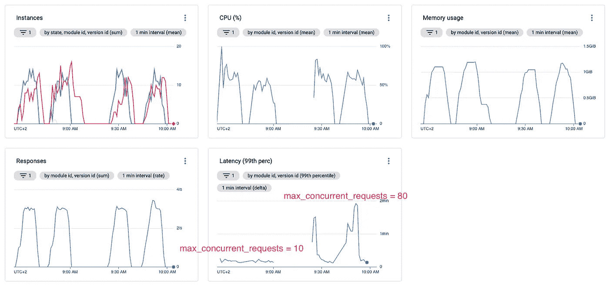

除了上述延迟增加之外，我还观察到在高并发(80)高 CPU 阈值(0.9)的情况下，相当多的失败请求(3.44%的失败请求超过了*上下文截止时间*错误)，我假设这是由于 HTTP 超时。查看官方的[应用引擎文档](https://cloud.google.com/appengine/docs/standard/nodejs/how-instances-are-managed#timeout)，Google 声明“自动缩放”的默认 HTTP 超时是 1 分钟，这与我刚才提供的假设一致，因为我们有几个请求超过了 1 分钟。

所以我们现在知道，仅仅增加并发请求并没有帮助，反而会大大降低性能。因此，除了增加并发请求，降低并发请求也是可能的。

在下面的例子中，我将 CPU 阈值保持在 0.9，并将最大并发请求数减少到 5。

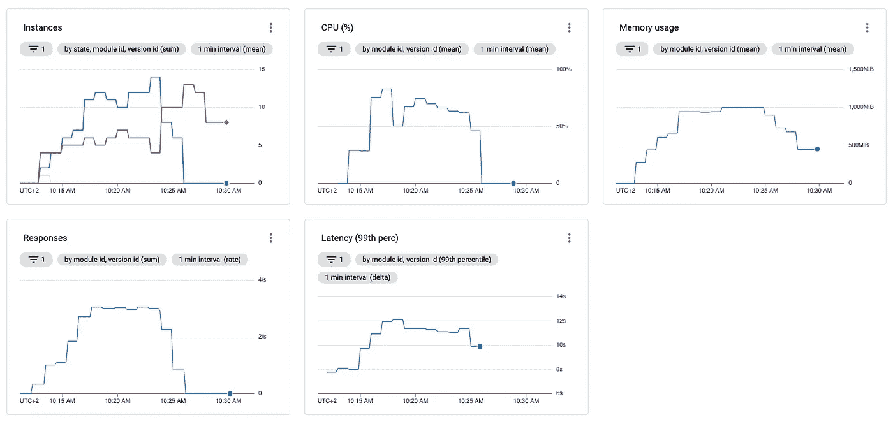

将这一次与前几次相比，几乎没有明显的区别。这意味着默认配置对于 CPU 密集型负载来说已经足够好，可以在大部分时间使用。当然，如果性能发生变化，尝试不同的配置和测试总是值得的。还值得一提的是，我在所有示例中都使用了 F2 实例类，这对于计算密集型任务来说绝不是最好的。当执行无法并行化的单线程 CPU 密集型任务时，我总是建议先垂直扩展，再水平扩展。

**内存密集型请求**

不幸的是，没有基于内存消耗来扩展应用引擎的配置。然而，您也可以使用适当的监控来优化内存密集型应用程序引擎。因此，我想简单介绍一下如何扩展这些高内存服务。

您可以做的第一件事是检查 F4_1G 实例类。这个实例类的内存是常规 F4 的两倍，因此是目前您可以选择的最高内存实例类。F4 1g 可能是用于高内存应用的一个很好的候选。但是当然，这可能还不能解决缩放问题。

选择适当的实例类后，您应该确保不要在同一个应用程序引擎上混合使用高内存端点和低内存端点。例如，高内存端点可以包括返回几千个元素的列表，而低内存端点可能只返回计算结果或一个元素。当然，世界上大多数服务都混合了这两者，但是如果您想为内存密集型服务优化伸缩，您应该考虑将它们分开。

当您的服务中只剩下高内存端点时，您可以通过 GCP 监控来监控一段时间内的内存使用情况，并检查内存使用情况是否接近最大值。当然，您也可以使用“混合”端点来实现这一点，但是这会使内存消耗更加不稳定，这取决于负载平衡器如何在实例之间分配请求。例如，一个实例可能获得所有高内存请求，而其他实例主要对低内存请求感到厌烦。

通过将当前实例数乘以实例类的内存限制，可以很容易地计算出最大内存。例如，F2 实例类的内存限制是 512 MB，所以如果运行 10 个活动实例，当超过 5 GB (~ 10 * 512MB)时，我们就会遇到问题。当然，您应该更早地进行测量，因为您永远也不想耗尽内存。

如果您发现您达到了特定的内存使用阈值，我建议使用 70%左右，并且定期地，是时候做点什么了。除了通常的代码优化(在任何一种情况下都应该这样做)，最好的解决方案是减少并发请求的最大数量，因为更少的请求当然意味着更少的总内存消耗。

因此，如果您的服务配置了 40 个最大并发请求，并且您经常达到 70%的内存使用率，那么您应该考虑在第一步将最大并发请求减少到 35 个甚至 30 个。但是，我不会建议直接到 20 甚至更低。因为在您的服务基于最大并发请求扩展的情况下，这是很常见的，降低到 20 将导致实例数量翻倍，从而增加 100%的成本。当然，你的内存使用量也会减少不少。但是请记住，每个实例至少需要一点内存来运行服务器和底层操作系统，因此即使您将实例增加一倍，内存使用也不会减少 50%。

# 摘要

您已经看到，有相当多的属性可以配置您的应用程序引擎的扩展行为，尽管并不是每个指标(如内存使用量)都可以用作扩展的阈值。

使用`target_throughput_utilization`和`max_concurrent_requests`属性可以最好地扩展 CPU 廉价请求。只要不消耗可用的 CPU，请求是短时间的还是长时间的都没关系。

使用`target_cpu_utilization`属性进行缩放是可行的，但这取决于代码必须完成的实际底层工作。根据一般经验，保持默认值 0.6 或 0.7 是避免服务过载和降低性能的最佳选择。

在 CPU 密集型应用程序上允许大量并发请求通常不是一个好主意，在许多情况下可能会导致请求失败和很长的响应时间。如果性能下降，减少最大并发请求数是减少负载和提高性能的一种方法。

除了“用硬件杀死它”和内部代码优化，减少内存密集型应用程序的最大并发请求是防止内存不足错误的最佳方法。

## 你想联系吗？

如果你想联系我，请通过 LinkedIn 联系我。

另外，请随意查看我的书籍推荐[📚。](https://medium.com/@mr-pascal/my-book-recommendations-4b9f73bf961b)

 [## 我的书籍推荐

### 在接下来的章节中，你可以找到我对所有日常生活话题的书籍推荐，它们对我帮助很大。

mr-pascal.medium.com](https://mr-pascal.medium.com/my-book-recommendations-4b9f73bf961b)  [## 通过我的推荐链接加入 Medium—Pascal Zwikirsch

### 作为一个媒体会员，你的会员费的一部分会给你阅读的作家，你可以完全接触到每一个故事…

mr-pascal.medium.com](https://mr-pascal.medium.com/membership)