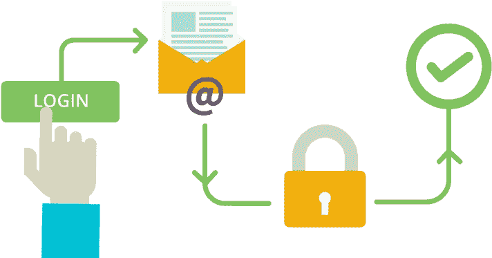
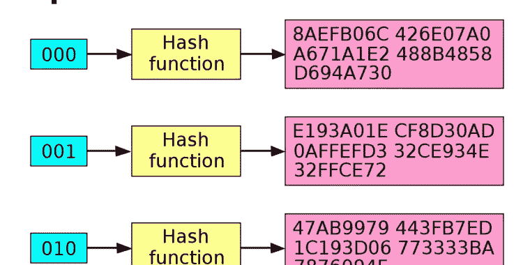
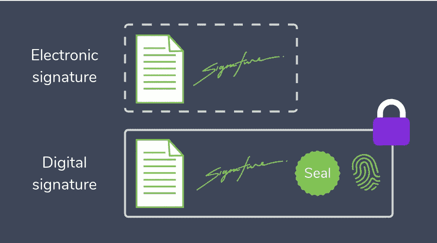

# 了解身份验证

> 原文：<https://levelup.gitconnected.com/understanding-authentication-fa0f0893c302>

使用 Python 的散列函数简介

## 问题是

当你登录到任何网站，你发送你的用户名和密码。然后网站接收它们，寻找用户名，检查密码是否一致，然后让你进入。

简单？哈！



资料来源:kindpng.com

如果数据库存储了你所有的密码，那么它有多安全？如果有人可以访问它，比如说数据库管理员，那么他或她就可以访问任何用户的所有数据。

比如说，你在谷歌工作，你和安全部门有关系。你能得到任何一个谷歌用户的密码吗？当然不是。

但是，如果密码没有存储在数据库中，那么当用户登录时，如何检查密码呢？

我们需要以某种方式加密密码。

> 我们在数据库中存储了一个加密的密码。当用户输入密码时，系统也会对其进行加密，然后检查加密后的密码是否与数据库中存储的密码一致。

但是如果加密的密码在数据库里，为什么我们不能简单地解密它？因为我们用单向函数加密。

所以，给定一个加密函数`f`，计算`f(x)=y`很快也很容易，但是现在，给定`y`，计算这样一个`x`，那个`f(x)=y`，就变得极其困难。通常(这并不总是正确的)使用强力算法。也就是说，我们遍历所有密码组合，计算`f(x)`，并检查结果是否与我们想要解码的给定加密密码一致。

这意味着，即使你有加密的单词，也很难恢复原始文本。这是如何实现的。

## 哈希函数

哈希函数是单向函数的特例。不同之处在于它的输出是固定长度的。



那么它是如何工作的呢？有数百万种不同的散列函数，但我们使用 Python 制作了自己的散列函数。这个很简单。

```
def hash(text):
  a = ["abc","ghg","qwe","fks","slp"]
  return a[len(text) % 5]print("Hash", hash("Password"))
print("Hash", hash("Milk"))
print("Hash", hash("a long password"))
print("Hash", hash("anything"))
```

输出是这样的:

```
Hash fks
Hash slp
Hash abc
Hash fks
```

是的，“任何东西”和“密码”的散列是相同的。但现实中，这种情况也有可能发生。如果你有一个很长的字母、数字和符号的组合，可能会出现一些由 5 个字母组成的非常简单的密码有相同的散列码。为什么？因为如果你有一个返回 128 位的散列函数，那么“只有”2 的 128 次方个散列组合。因此，一些密码必须共享相同的哈希代码。

在我们的例子中，由于散列是“fks ”,所以您永远无法恢复原始文本。首先，因为“原文”有几百万条。当然，你可以启动你的强力算法，在不到 1 秒钟的时间里，它会给你 1000 个符合这个散列的密码。

所以，我们的杂凑没那么好，但还是杂凑。让我们来看一个更好的散列函数。

```
import mathdef hash(text):
  a = "abcdefghijklmnopqrstuvwxyz"
  sum = 0
  the_hash = ""
  for s in text:
    sum += int(math.sin(ord(s))*500)
  for i in range(5):
    the_hash += a[(sum*ord(text[i%len(text)]))%len(a)]
  return the_hashprint("Hash", hash("Password"))
print("Hash", hash("Passwork"))
print("Hash", hash("Milk"))
print("Hash", hash("a long password"))
print("Hash", hash("anything"))
```

现在的输出是:

```
Hash gfhht
Hash uiggu
Hash dxord
Hash cckyc
Hash uuwoa
```

你现在可以看到，即使单词“Password”和“Passwork”中的一个字母不同，它们的哈希值也是绝对不同的！

因此，我们的散列函数根据给定的输入返回 5 个符号。是的，给定一个哈希值，现在很难恢复原始文本。但是用 5 个符号会非常快。这就是为什么通常使用 128 和 256 位散列函数(对应于 16 和 32 字节)。

当然，有些函数很受欢迎，几乎在任何系统中都可以使用。

最受欢迎的功能有:

*   具有 160、256 和 512 位输出的 SHA1、SHA256 和 SHA512(安全哈希算法)。
*   具有 128 位输出的 MD5(消息摘要)。

## 数字签名

那么什么是数字签名呢？



资料来源:oneflow.com

比方说，你在一份文件上签名，然后在上面签名。为什么别人不能用？别人怎么能确定是你签的字呢？

对于数字签名，应该有一个验证器，它拥有每个用户的密钥。这些密钥有时被称为证书。

因此，有了这个密钥和一个文档，就可以对附加了密钥的文档运行散列函数。这已经是签名了。当需要验证时，验证者会将您的密钥再次添加到已签名的文档中，计算散列值，并检查它是否匹配。

是的，就是这么简单。

如果文档发生变化，哈希也会完全改变。而且只有你可以在哈希之前附加密钥，所以只有你可以在文档上签名。

让我们看一个简单的例子:

```
key = "Key1"
wrong_key = "Key2"
document = "I will play football"
wrong_document = "I will not play football"
print("Correct: ", hash(document+key))
print("Incorrect document: ", hash(wrong_document+key))
print("Incorrect key: ", hash(document+wrong_key))
```

如果你是安全专家，是这方面的专业人士，你可能会说这都不是真的，我们需要一个共享密钥和一个私有密钥，但是拜托，保持简单:)

## 蜂窝网络认证

现在，当你知道如何签署文件时，你就可以很容易地理解你的 SIM 卡如何保护你的手机。

首先，它让一些人感到惊讶，但 SIM 卡是一台计算机。它有自己的处理器(故意非常慢)和内存(RAM 用于你的联系人，ROM 用于 256 位密钥和一些软件)。

密钥是随机的，只有您的提供商和您的 SIM 卡知道。甚至你的手机也没有。

当你打开手机时，最近的手机发射塔会发送一个随机数字，并要求签名。你的手机不能做到这一点，所以它把这个号码传输到 SIM 卡。SIM 用它的密钥对它进行签名，并返回到电话(只有签名，没有密钥)。最后，您的手机会将签名发送给提供商。

可以黑吗？当然可以:)

黑客建造假的移动电话站，询问你的手机进行认证。他们发送一些数字并要求签名，每次都拒绝签名。所以如果你用走路的速度路过，可以签 100 个左右的号。并存储。如果你每天在上班的路上经过它，他们会在一个月内收集很多签名。

因此，黑客没有密钥，但他们有一个带有正确签名的数字表！然后，他们充当一部手机，如果他们幸运的话，提供商要求在他们的名单上签一个号码，他们就能做到。

为什么 SIM 卡处理器故意变慢？如果它足够快，它可以被暴力破解。因此，手里有一张 SIM 卡，人们可以在短时间内查询一百万个不同的签名。这也使得 SIM 卡无法复制。