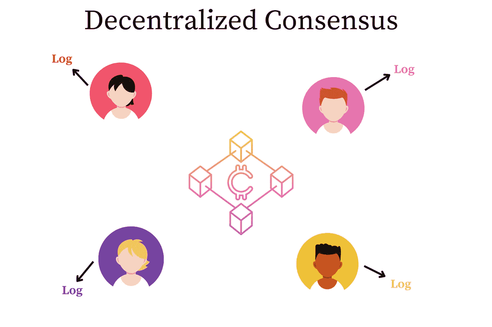
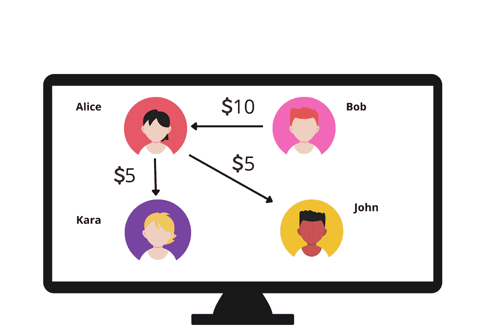
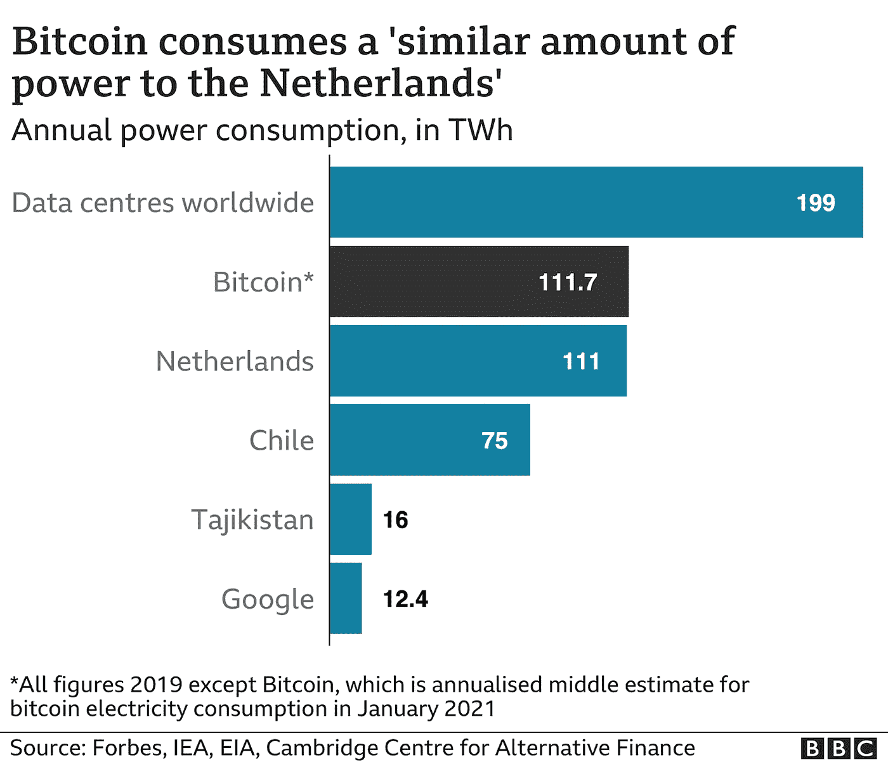
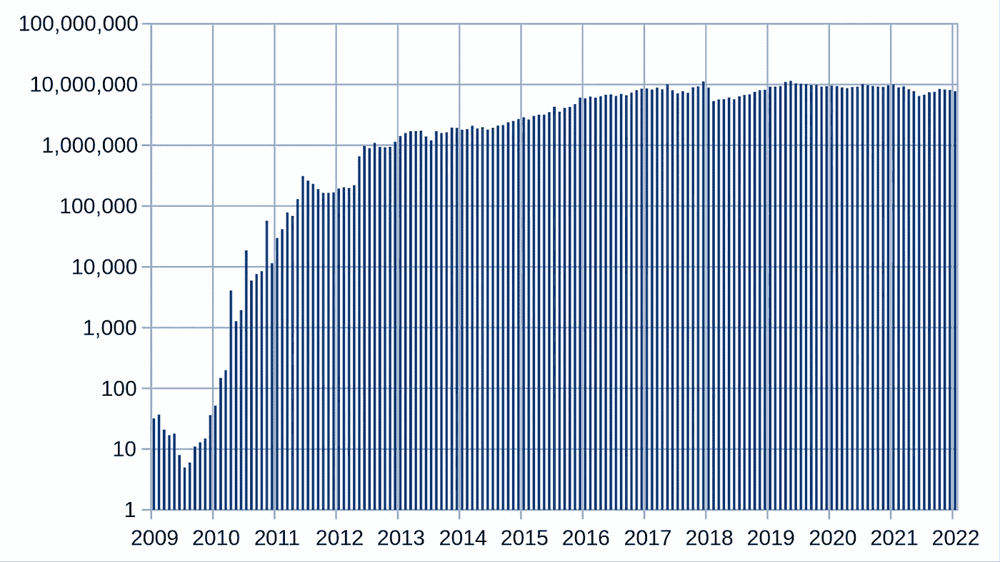

# 了解区块链基础知识:工作证明

> 原文：<https://levelup.gitconnected.com/understanding-bitcoin-fundamentals-proof-of-work-dad1db12ad0a>

## 比特币区块链如何验证交易？

# 预读

在我开始之前，我喜欢[这个 **YouTube 视频**](https://www.youtube.com/watch?v=XLcWy1uV8YM) 来理解区块链网络使用的共识机制。[在我之前的博文中，我讨论过**比特币基本面**](https://medium.com/p/9f039078aade) 的基础知识。

# 什么是共识？

一般来说，共识是网络中一组独立实体之间的一种协议形式。例如，在一个民主国家里，我们可以说选举实行多数票制，我们就谁应该成为国家领导人达成共识。由网络上成千上万个独立节点组成的分布式系统通常采用某种算法来达成共识。分布式一致性算法旨在允许一组计算机对系统中的一个节点提出的单个值达成一致(而不是编造随机值)。分布式系统面临的挑战是消息可能会丢失，或者机器可能会出现故障。Paxos 保证，只要参与算法的大多数系统可用，一组机器将选择单个建议值。([来源:罗格斯大学](https://people.cs.rutgers.edu/~pxk/417/notes/content/consensus.html)

# 为什么需要共识模型？

在一般的数据库应用程序中，比如说一份医疗报告。通常，单个用户(管理员)或程序拥有访问数据库的权限。这意味着单个用户可以读取、写入或修改任何数据库记录。在医疗数据库的情况下，它将是关于不同患者的信息。通常，其他任何人都无权访问该帐户。因此，伪装成程序(比如病毒——特洛伊木马或间谍软件)的恶意用户或程序可以删除您的帐户或添加一个条目，说明您欠该机构 10，000 美元。工作证明是使用的第一个共识模型。在这篇博文中，我们将深入探讨工作证明共识模型。

# 区块链共识模型

如前一篇博文所述，区块链是一个分布式账本和自治系统。这意味着没有一个中央系统来维护系统的真值。贡献来自成千上万的用户(分布式网络的一部分)，使其正常运行。因此，以医疗记录应用程序上的恶意用户为例，他说您欠该机构 10，000 美元，其他成千上万的用户会将该索赔标记为欺诈。这是在分布式账本上使用一致算法的第一个显著优势。

# 一致性算法的基本特征

在现实世界的分布式分类帐中，我们需要以下属性来支持网络:

*   可靠性
*   公平
*   实时保证
*   效率
*   透明度

在我们了解比特币网络所使用的共识算法之前，让我们先来讨论和了解一下比特币上的共识算法旨在解决的问题——双重花费。

# 什么是双重消费？

我们有一个由 Blob、Alice、John 和 Kara 组成的区块链网络。假设鲍勃只有 10 美元。他可以继续给爱丽丝寄 10 美元。如果 Bob 是恶意的，并且网络处理交易很慢，他可以在短时间内给 John 发送 10 美元。这可能会导致网络出现问题，因为网络丢失了 Bob 从未丢失的 10 美元。传统上，这被称为双重支出，并使用集中式网络来解决。像 Visa、Mastercard 和 UPI 这样的货币网络使用运行数据库来验证交易的中央服务器来解决这个问题。

# 工作证明

工作证明是比特币网络上的一种共识机制。这是一种使用大量计算工作来阻止、检测和消除恶意用户欺诈性操纵比特币区块链的算法。工作证明于 2009 年在比特币网络上推出，旨在解决重复消费的问题(如上所述)。

修订一下，区块链是一个区块列表。在比特币区块链上，每个区块都保存着不同用户所做交易的相关信息。因此，区块链持有的交易列表如下所示:

*   2022 年 1 月 1 日，鲍勃付给爱丽丝 10 美元。
*   2022 年 1 月 10 日，爱丽丝付给约翰 5 美元。
*   2022 年 2 月 1 日，爱丽丝付给卡拉 5 美元。

实际上，一个区块链可以包含 100 个事务。

# 工作证明的一点历史

[根据中本聪关于比特币的原始论文](https://bitcoin.org/bitcoin.pdf)，比特币区块链上使用的工作证明算法源自亚当·贝克的 Hashcash ( [论文](http://www.hashcash.org/papers/hashcash.pdf)，[维基](https://en.wikipedia.org/wiki/Hashcash))。根据 Satoshi 的论文，“工作证明包括扫描一个值，当散列时，如 SHA-256，散列从几个零开始。所需的平均工作量与所需的零位数成指数关系，并且可以通过执行单个散列来验证。”系统设置了一个约束，即要生成的块的散列应该以预定数量的零开始。零的数量越多，对计算能力的要求就越高。这个想法“…要求用户计算一个中等难度，但不复杂的函数…”是由辛西娅·德沃克和莫尼·诺尔在他们 1992 年的论文“通过处理或打击垃圾邮件来定价”中提出的。

# 电子邮件中的用法

Hashcash 是一种加密的基于哈希的工作证明算法，它需要计算可选择的工作量，但可以有效地验证证明。它最初用于识别电子邮件中的垃圾邮件。对于电子邮件的使用，hashcash 戳记的文本编码被添加到电子邮件的头部，以证明发送者在发送电子邮件之前已经花费了适量的 CPU 时间来计算戳记。换句话说，由于发件人花了一定的时间来生成戳记并发送电子邮件，因此他们不太可能是垃圾邮件发送者。接收者可以以可忽略的计算成本来验证该戳记是有效的。然而，找到具有必要属性的头的唯一已知方法是强力，尝试随机值直到找到答案；虽然测试单个字符串很容易，但满意的答案很少，需要大量的尝试才能找到答案。假设是，垃圾邮件发送者的商业模式依赖于他们以最小的每条消息成本发送大量电子邮件的能力，如果他们发送的每条垃圾邮件甚至有很小的成本，他们将不再盈利。收件人可以验证发件人是否进行了这样的投资，并使用结果来帮助过滤电子邮件。

# 新块是如何生成的？

参与区块链并提供计算能力来创建新区块的用户称为矿工。矿工们大约需要 10 分钟才能找到一个新的区块，用于扩展区块链和进行新的交易。人们可能会问，为什么创建一个新的块几乎需要 10 分钟？矿工最终会做什么？要回答这些问题，让我们回头来看看积木的设计。区块链中的每个块都有一个加密哈希(数字签名或密码)，使块有效。还值得注意的是，区块链中的每个块都与前面的块链接在一起。区块链的矿工们最终为该区块创建了一个新密码。但是，根据设计，加密哈希只能猜测。猜测过程之后是验证，以便哈希与块保存的数据一致。这个猜测过程大约需要 10 分钟(平均)。一旦区块的哈希得到验证，参与猜测的矿工就可以从他们最终完成的工作中获得报酬。

# 工作证明的特征

# 安全的

工作证明共识算法是安全的。以下两个理由将有助于论证这一情况。

**原因#1** :矿工在工作证明机制上的不当行为导致矿工被踢出局。

**原因#2** :为了控制共识机制，一个恶意用户需要控制网络上 51%的用户。这相当于比特币网络上的数千亿美元。考虑到进行虚假交易所涉及的计算能力和金钱的数量，我们可以假设共识协议是安全的。

# 共识；一致

当一个新的区块加入网络时，矿工广播交易的细节；所有其他矿工然后验证新区块的新细节。如果大多数矿工同意，他们离开他们的计算，并使用广播块作为真理。为了理解这一点，一组矿工试图解决一个谜题(给新区块的密码)，最快找到答案的矿工将获得比特币奖励，其他矿工必须同意该解决方案。这确保了系统中的每个矿工在网络中具有准确的块细节。这导致了共识(或广泛的一致)。

# 工作证明的问题

虽然工作证明共识算法非常强大，并且很好地服务于区块链，但是它也存在一些问题。本节讨论困扰使用工作证明的网络的一些问题。

# 环境影响

[根据 BBC 2021 年](https://www.bbc.com/news/science-environment-56215787)的报道，由于其重型防工作共识机制，比特币在 2021 年 1 月消耗的能量与荷兰的电力相当。

另据报道，大约三分之二的能源使用来自化石燃料。

# 无法扩展

在我们开始之前，让我们试着回答这个问题——为什么可扩展性对区块链来说是个问题？以比特币为例，寻找理想的答案。它每秒处理近 7 笔交易，而 Visa 每天处理近 1700 笔交易。([参考](https://101blockchains.com/blockchain-scalability-challenges))。这使得比特币区块链严重逊于维萨区块链。比特币网络的链上交易处理能力受限于 10 分钟的平均块创建时间和 1 兆字节的原始块大小限制。这些共同限制了网络的吞吐量。([维基百科](https://en.wikipedia.org/wiki/Bitcoin_scalability_problem))。下图显示了比特币区块链每月的交易数量。注:这是对数标度。2012 年的交易量是 10 万笔，2022 年已经增长了 1000 倍，达到 1 亿笔。

随着区块链中交易数量的增加，交易成本增加，从而对进入的交易施加反压力。这可能意味着，如果用户想要进行小额交易(比如 10 美元的转账)，总的燃气费(支付给区块链的转账金额)可能会大得多(比如 20 美元)。这使得区块链在峰值领先期间不可行。

已经提出了几种解决方案来克服这些限制，例如不同的散列计算方案(例如， [Schnorr 签名](https://en.wikipedia.org/wiki/Schnorr_signature))、将交易验证卸载到第二层系统(例如， [Lightning 系统](https://en.wikipedia.org/wiki/Lightning_Network))以及增加块大小。

比特币网络的可扩展性是一个不断变化的目标，并将随着 Web3 技术的新进展而改善。

# 关键要点

总结一下，这篇博文的要点如下:

1.  诸如工作证明之类的共识机制非常有用。
2.  工作证明是安全的，并保证在恶意用户攻击下的一致性
3.  工作证明共识算法有一些缺点，它对环境有不利影响，并且它不能扩展。