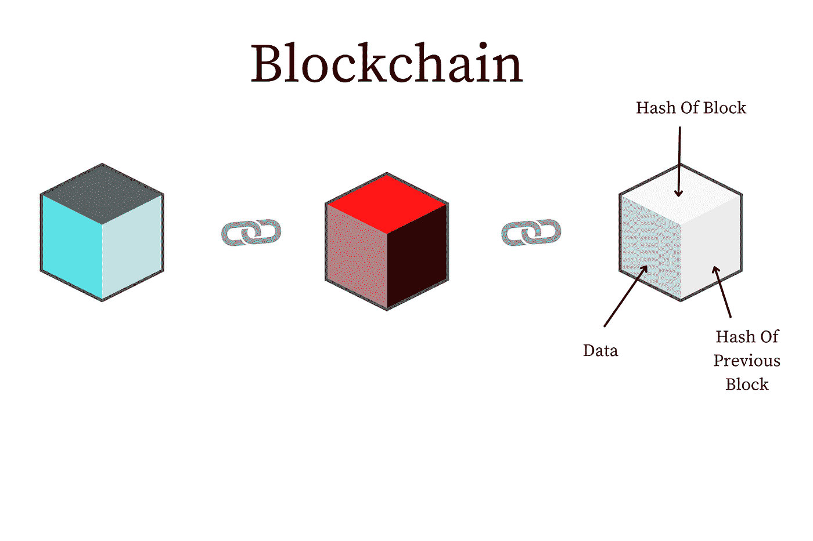
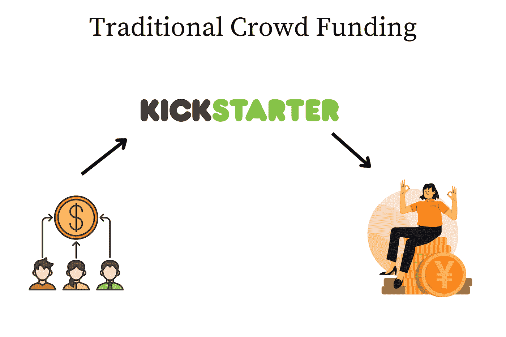
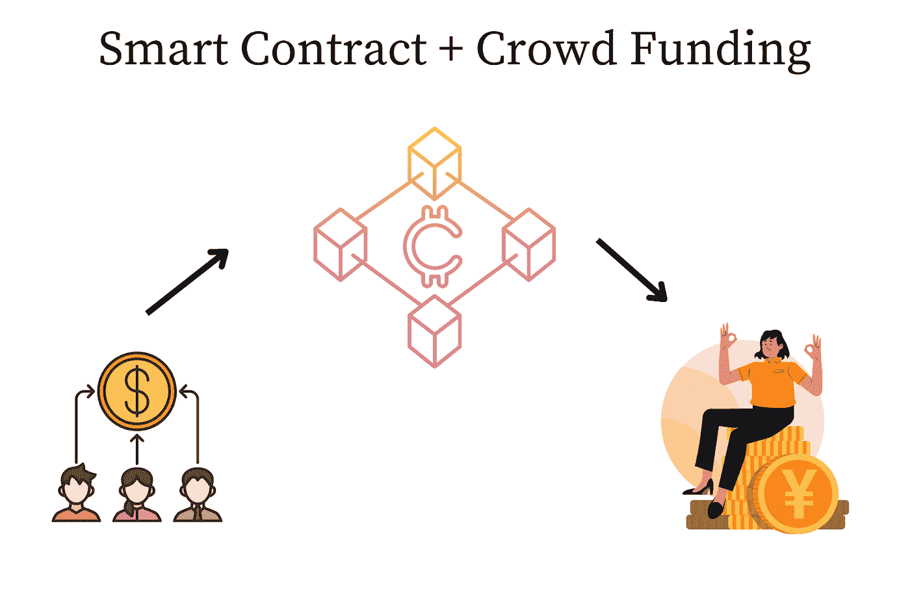
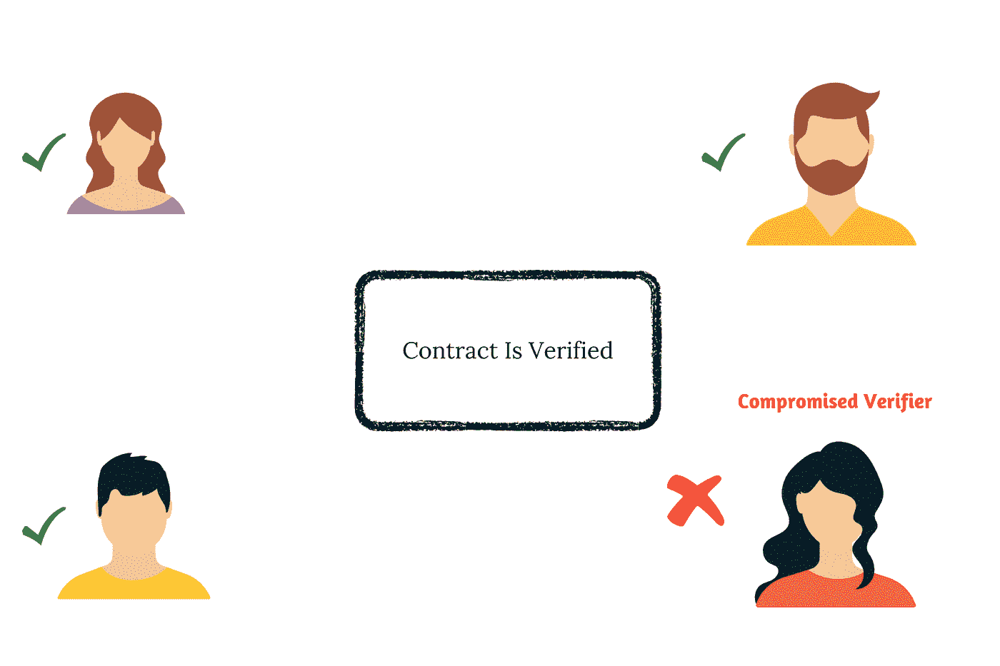

# 了解区块链和智能合约

> 原文：<https://levelup.gitconnected.com/understanding-blockchain-and-smart-contracts-9f039078aade>

这篇博文讨论了两个话题: [**区块链**](https://en.wikipedia.org/wiki/Blockchain) 和 [**智能合约**](https://en.wikipedia.org/wiki/Smart_contract) 。这将是有趣的细节。

# 术语

在我们了解区块链和智能合约的基础知识之前，让我们了解一些常用的术语。可以理解的是，诸如 Merkle Trees、Proof-Of-Stake 和 Proof-Of-Work systems 等术语需要单独的博客文章。我打算将来报道它们，以便自己了解它们。

*   [加密哈希](https://en.wikipedia.org/wiki/Cryptographic_hash_function):加密哈希函数(CHF)是一种数学算法，将任意大小的数据(通常称为“消息”)映射到固定大小的位数组(“哈希值”、“哈希”或“消息摘要”)。它是一个[单向函数](https://en.wikipedia.org/wiki/One-way_function)，也就是说，一个实际上不可行反转或逆转计算的函数。理想情况下，找到产生给定散列的消息的唯一方法是尝试对可能的输入进行[强力搜索](https://en.wikipedia.org/wiki/Brute-force_search)，看它们是否产生匹配。我们经常使用 SHA-256 散列函数为 SSH 生成私有和公共密钥。它是一种获得专利的加密哈希函数，输出 256 位长的值。
*   [Merkle 树](https://en.wikipedia.org/wiki/Merkle_tree):散列树或 Merkle 树是这样一种树，其中每个“叶子”(节点)都用数据块的[加密散列](https://en.wikipedia.org/wiki/Cryptographic_hash_function)来标记，并且每个不是叶子的节点(称为分支、内部节点或索引节点)都用其子节点的标签的加密散列来标记。散列树允许对大型[数据结构](https://en.wikipedia.org/wiki/Data_structure)的内容进行有效和安全的验证。哈希树是一个[哈希列表](https://en.wikipedia.org/wiki/Hash_list)和一个[哈希链](https://en.wikipedia.org/wiki/Hash_chain)的一般化。
*   [对等网络](https://en.wikipedia.org/wiki/Peer-to-peer):对等网络是一种分布式系统架构，它在网络内的不同节点(工作站)之间划分工作。节点代表服务器或工作站，边代表通信通道。
*   [分布式分类账](https://en.wikipedia.org/wiki/Distributed_ledger):分布式分类账是一个分散的数据库，其中数据在地理上分布的节点之间进行数字复制。节点使用一致算法参与确保数据的有效性。通常使用计算算法来复制、同步和共享数据。
*   [工作证明系统](https://en.wikipedia.org/wiki/Proof_of_work):工作证明(PoW)是[密码](https://en.wikipedia.org/wiki/Cryptography) [证明](https://en.wikipedia.org/wiki/Proof_(truth))的一种形式，其中一方(证明者)向其他方(验证者)证明已经花费了一定量的特定计算工作。核查人员随后可以毫不费力地确认这笔支出。理解工作证明系统的简单方法如下:
    a)要求证明者在不知道公式的情况下计算从 1 到 1 万亿的所有自然数的和(即，和是 **[n(n+1)]/2** ，其中 n 是自然数的个数)
*   b)验证者可以使用该公式容易地验证输出。
    在证明者和验证者端所需的努力是不对称的，并且仍然是可验证的。
*   [阻塞时间](https://www.investopedia.com/terms/b/block-time-cryptocurrency.asp#:~:text=Block%20time%20is%20the%20measure,it%20was%20introduced%20in%202009.):阻塞时间是网络在区块链中创建一个额外的块所花费的时间。该过程要求网络确保新块中的数据是可验证的并且符合网络的约束(例如，新块上的数字签名不应该是畸形的)。以太坊区块链的封锁时间在 14 到 15 秒之间，而比特币的平均封锁时间为 10 分钟。

# 什么是区块链？

顾名思义，区块链是分散的，包含信息的分布式分类账。这是一个不断增长的记录列表，称为块，通过加密技术连接在一起。每个块包含一个前一个块的[加密散列](https://en.wikipedia.org/wiki/Cryptographic_hash_function)，一个时间戳，和交易数据(通常由一个 [Merkle 树](https://en.wikipedia.org/wiki/Merkle_tree)表示)。时间戳证明事务数据在块被发布以进入它的散列时存在。由于每个块都包含关于它前面的块的信息，所以它们形成一个链，每个附加的块加强它前面的块。对等网络通常将区块链作为一个公开的[分布式账本](https://en.wikipedia.org/wiki/Distributed_ledger)来管理。

为了理解分布式系统是如何工作的，我鼓励你们阅读我过去写的关于分布式系统的系列文章，从[分布式系统的基础](https://ravisystemdesign.substack.com/p/system-design-fundamentals?s=w)开始。

# 区块链历史

在他 1982 年的论文“由相互怀疑的团体建立、维护和信任的计算机系统”中，密码学家大卫·乔姆首先提出了一个类似区块链的协议。[1]然而直到[中本聪](https://en.wikipedia.org/wiki/Satoshi_Nakamoto)写了一篇关于区块链技术的设计和实现的[白皮书](https://bitcoin.org/bitcoin.pdf)—[比特币](https://bitcoin.org/bitcoin.pdf)才得以普及。我强烈建议任何有兴趣深入了解区块链技术的人阅读白皮书。这需要尝试几次，但肯定值得一读。

# 区块链的结构

区块链可以被想象成在对等网络上运行的分布式块的集合。分类帐是分散的、分布式的和公共的，由通过一系列散列(或签名)连接的块组成，这些散列(或签名)是通过加密函数计算的。从逻辑上讲，区块链可以被视为由几层组成:

*   基础设施(硬件)
*   [联网](https://en.wikipedia.org/wiki/Network_layer)(节点发现、信息传播和验证)
*   [共识](https://en.wikipedia.org/wiki/Consensus_(computer_science)) ( [工作证明](https://en.wikipedia.org/wiki/Proof_of_work)，[利益证明](https://en.wikipedia.org/wiki/Proof_of_stake))
*   数据(块、事务)
*   [应用](https://en.wikipedia.org/wiki/Application_layer) ( [智能合约](https://en.wikipedia.org/wiki/Smart_contract) / [分散应用](https://en.wikipedia.org/wiki/Decentralized_application)，如果适用)

在本新闻系列中，我将主要讨论应用层以及在区块链上开发激动人心的用例所必需的元素。

# 块的结构

块保存经过哈希处理并编码到 Merkle 树中的一批有效事务。每个块保存链接两者的前一个块的加密散列。连接的块形成一条链。迭代过程确保前一个块的完整性，一直到初始块，称为 **genesis 块。**为了保证每个块的完整性，通常会进行数字签名。

通常，块由以下信息组成(在比特币区块链中):

*   发送方信息；
*   接收方信息；
*   交易金额信息；
*   此特定块的加密哈希；
*   前一个块的加密哈希。

# 区块链如何确保安全？

本节讨论区块链用来确保维护区块链中块的有效性的一些技术。

## 工作证明

为了确保新生成的块是安全的，并且是由可信任的实体构建的，区块链采用了一种称为工作证明的机制。工作证明(PoW)是一种[密码](https://en.wikipedia.org/wiki/Cryptography) [证明](https://en.wikipedia.org/wiki/Proof_(truth))的形式，其中一方(证明者)向其他方(验证者)证明已经花费了一定量的特定计算工作。核查人员随后可以毫不费力地确认这笔支出。工作证明算法的一个关键特征是在证明者和验证者方面应该有不对称的工作要求，即证明者所需的工作在计算上应该很高。相比之下，验证者所需的工作应该是计算量很小的。工作证明算法的目的不是证明某项工作已经完成或者某个计算难题已经“解决”,而是通过建立相当大的能量和硬件控制要求来阻止对数据的操纵。环保主义者批评工作证明系统的能源消耗。在下一节中，让我们讨论区块链的一个应用——智能合同。

# 智能合同

1997 年，计算机科学家、法律学者和密码学家 Nick Szabo 第一次使用了智能合同这个术语。人们可以将智能合同理解为现实世界中交易之上的简单合同——唯一的区别是它们是数字化的。智能合同被抽象为存储在区块链中的计算机程序。

# Kickstarter:智能合约的一个例子

[Kickstarter](https://kickstarter.com/) 是一个可以使用智能合约构建应用程序的极好例子。Kickstarter 活动的典型应用如下:假设你有一个项目，也许你想为软件工程师开发一个生产力工具，并需要筹集一些资金来建立它。你可以在 Kickstarter 上分享这个想法，申请你需要的特定金额的资金，互联网上的人们可以为这个项目投票并支付费用。该系统的限制之一如下:

任何没有得到充分资助的项目都是无效的，用户贡献的钱必须归还。”

因此，假设你想为你的项目筹集 100，000 美元，为软件工程师开发一个工具。如果你只能筹集到 90，000 美元，那么这个项目就是无效的，这笔钱必须归还给贡献者。然而，假设你可以筹集 10 万美元、20 万美元或 100 万美元，这些钱将进入你的银行账户，你用这些钱来建立这个系统。

今天，Kickstarter 充当项目开发者和贡献者之间的中介(第三方)，以确保满足系统的约束。然而，人们可以争辩说，将来可能会发生第三方叛变的情况。这肯定会发生。在这种情况下，我们如何确保系统万无一失？这就是智能合约发挥作用的地方。

## Kickstarter —智能合约

在区块链的帮助下，项目开发人员可以编写智能合同，其中可以满足以下约束(以完全分布式的数字方式):

"*仅当资金超过目标金额时，才允许将资金转移到项目开发人员的钱包中。*

以下是使用智能合同为项目提供资金时发生的步骤:

1.  项目所有者创建位于贡献者和项目所有者中间的智能合同。
2.  投资者将资金投入智能合同，该合同位于投资者和项目所有者之间的分布式账本上。
3.  智能合同将把所有收到的资金保存在一个[托管账户](https://www.rocketmortgage.com/learn/what-is-escrow#:~:text=Escrow%20is%20a%20legal%20arrangement,fulfillment%20of%20a%20purchase%20agreement).)中，直到目标达成。托管账户可以是加密钱包。
4.  如果贡献的资金量超过了目标，则合同成功，并且资金被转移到项目所有者的账户。
5.  如果筹款超过了规定的时间限制，资金将被退回到个人捐款人的账户，并使合同无效。

## 为什么我们可以信任智能合约？

智能合约表现出以下值得信任的属性:

*   **不可变**:不可变确保了一旦智能契约被创建，它就不能被再次更改。请记住，这源于设计约束，即区块链中的块是不可变的。一旦在区块链上构造了一个块，在不改变其散列函数的情况下，它就不能被篡改。以防给定块的散列函数被篡改。这导致了整个区块链的无效，因为区块链是安全的。
*   **分布式**:契约的输出被网络中的每个人验证。让我们说，即使网络中的几个实体受到损害，并且说即使没有转移足够的钱，也满足合同(欺诈的情况)。在这种情况下，多数人的投票是重要的，除非大多数用户妥协，否则智能合同仍然有效。

总之，我们可以说区块链仍然是安全的，因此，智能合约是非常安全的，篡改智能合约几乎是不可能的。如果你想浏览 YouTube 上的概念，我发现这个讲座非常有用。

如果你❤️读这篇文章，你可以找到我👇👇

[子栈上的简讯](https://ravisystemdesign.substack.com/)

[LinkedIn 上的个人资料页面](https://www.linkedin.com/in/ravi-tandon-b6534049/)

> “教育是我们可以用来改变世界的最强大的武器。”——纳尔逊·曼德拉。