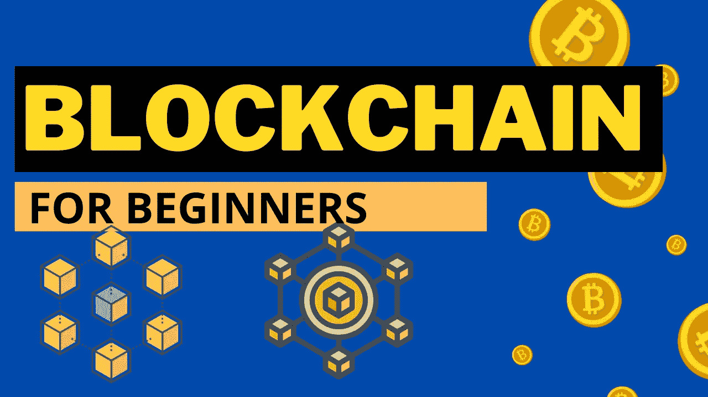
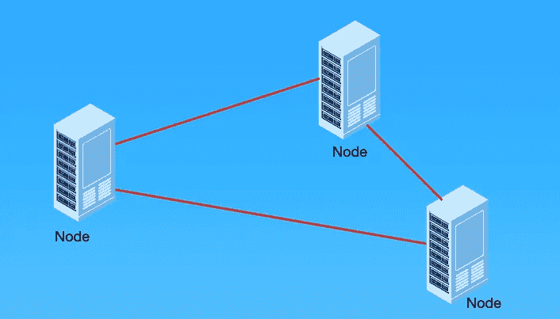
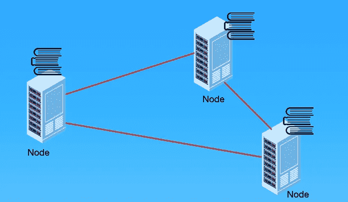
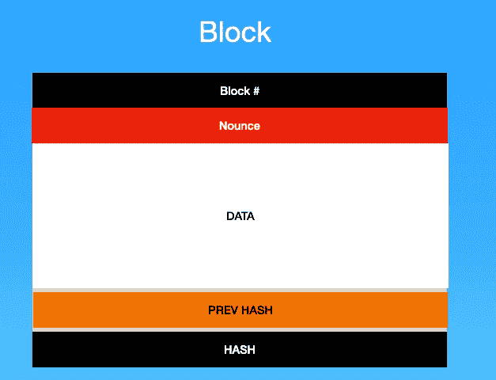
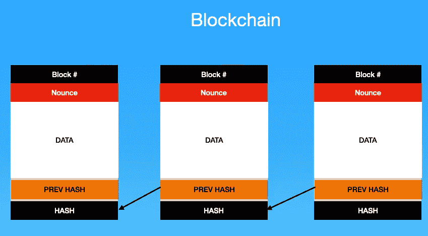
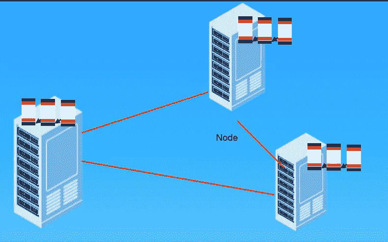

# 初学者了解区块链

> 原文：<https://levelup.gitconnected.com/understanding-blockchain-for-beginners-f0aaab7ffcf7>

区块链是当前最热门的词汇之一。它被用于多种应用程序和加密货币，如意大利比特币等。

如果你更喜欢视频而不是文字，你可以看看 YouTube 上的视频，我在那里报道过同样的话题:【https://www.youtube.com/watch?v=tecLog3ctIo 

所以如果我们看看区块链的定义:

***区块链是一种分散的分散式账本。***

如果我们从技术角度来看，区块链的定义会变成这样:

***区块链是一种点对点的分布式账本，加密安全，仅附加，不可变(极难更改)，只能通过对等体之间的共识或协议进行更新。***

因此，为了理解区块链，我们必须首先理解三个词的含义:

**分布式**:分布式系统是一种计算范例，其中数据分布在多台机器上。对数据的任何操作都需要得到参与分发系统的各种机器的批准。不同机器之间达成一致的过程被称为节点之间的**共识**。参与分布式系统的单个单元被称为**节点**。

**分类账**:分类账可以假设为一组记录。因此，如果我们以比特币区块链为例，它将是在比特币区块链上执行的一组交易。

分散的:我们到目前为止讨论的分类账并不局限于某个特定的实体。相反，该分类帐分布在分布式系统中。因此，简而言之，我们可以说，记录组分布在多台机器上，没有一个实体能够控制这些数据。

所以如果我们再次考虑区块链的一个定义:

*“****区块链是一个分布式的系统，或者说区块链是一个分布式的分散账本，其中在区块链上执行的数据或一组交易不是由单个实体批准或拥有的，而是分布在一组机器和这些机器集之间，称为节点。”***

现在，如果我们谈论区块链，我们必须了解区块链的基本构建块，即所谓的**块**。

区块是区块链中的一个独立单位。它包含以下信息:

**块 ID** :块 ID 是区块链中特定块的 ID。

**Nounce**:Nounce 是为了使特定数据的哈希对特定区块链有效而通过蛮力计算出的数字。计算诺尼斯数的过程被称为挖掘。

**数据**:区块链中的数据由一组记录组成。所以我们谈论比特币的区块链，它将由一组在比特币区块链上执行的交易组成。

**前一个散列**:该字段包含区块链中前一个音符的信息。

**Hash** :通过对数据和 Nounce 编号进行哈希运算。

因此，当我们讨论区块时，我们可以理解区块链的定义。所以区块链是这些类型的博客结合在一起的列表。区块链的每个区块都有区块链前一个区块的地址。因此，用更简单的话来说，*我们可以将区块链视为一种链表类型的数据结构，其中每个节点都是一个区块。*

现在，这一系列的块不限于特定的机器或实体。这些数据块系列分布在称为节点的多台机器上，每个节点都必须保留数据块的副本。为了在区块链中做出任何改变，我们必须获得所有参与区块链的区块的同意。

因此区块链的第一个区块被称为**创世纪区块**。这个块的散列 ID 被称为全零。

以及添加到区块链的所有后续区块，将存储前一区块的哈希 ID。为了在区块链中做出任何改变，我们必须获得至少 51%参与区块链的系统的同意。不同块之间的一致过程被称为节点间的**一致。**

如果你想看区块链的基本例子，你可以访问以下链接:[https://andersbrownworth.com/blockchain/block](https://andersbrownworth.com/blockchain/block)

区块链的视频描述可以在以下视频中找到: