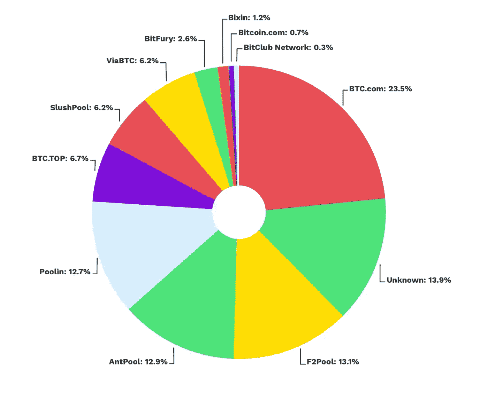

# 理解区块链基础知识:利益证明

> 原文：<https://levelup.gitconnected.com/understanding-blockchain-fundamentals-proof-of-stake-66250e3be61>

什么是利害关系证明？

# 介绍

在之前的博文中，我们讨论了区块链 的 [**基本面和**](https://medium.com/p/9f039078aade) **[**工作证明**](https://medium.com/p/dad1db12ad0a/) 最早由中本聪使用，在比特币区块链上广泛使用。在这篇博文的范围内，我想把重点放在另一个共识算法上——利害关系证明。工作证明和利害关系证明之间的根本区别在于，利害关系证明是通过根据验证者在相关加密货币中的持有量来选择验证者来工作的。这种差异背后的基本论点是，对相关加密货币拥有更大控制权的验证器比其他验证器更值得信任。这样做是为了避免[工作证明](https://en.wikipedia.org/wiki/Proof_of_work)方案的计算成本。PoS 首次用于加密货币是在 2012 年的 [Peercoin](https://en.wikipedia.org/wiki/Peercoin) 。**

# 快速回顾共识

区块链是一个分布式账本和自治系统。没有一个中央系统来维护系统的真值。成千上万的用户做出了贡献，使它正常运行。对于要添加到区块链的块，必须添加有效的加密哈希。验证程序的法定人数必须验证加密哈希。

# 工作证明共识方案的缺点

让我们首先回顾一下工作证明方案的缺点，并理解为什么为它提出了替代方案。

## 问题#1:高能耗

最初的比特币论文提出了一个方案，其中每个验证器都具有相等的权重，这导致了高计算成本。[根据 2018 年 1 月发表的一项研究](https://digiconomist.net/bitcoin-energy-consumption)，比特币区块链使用约 54TWh 的电力，足以为美国 500 万家庭供电，或足以为整个新西兰或匈牙利供电。如今，能源消耗约为 200 千瓦时。

## 问题#2:矿工团体导致的集中化

比特币区块链的采矿计划的另一个问题是，矿工可以联合起来形成资金池。这样做是为了避免解决加密哈希难题的高计算成本。然后，挖掘者按照贡献的计算能量的比例在组中的不同挖掘者之间重新分配奖金。然而，这导致了比特币区块链的集中化，容易受到攻击。在某些方面，集中化是加密货币努力的对立面。

鉴于前面提到的一系列问题，必须找到一种新的技术。

# 输入 QuantumMechanic

[2011 年，一个叫 QuantumMechanic 的用户提出了一个不同的共识算法](https://bitcointalk.org/index.php?topic=27787.0)。他对工作证明的看法如下:

**观察#1** :系统中的每个矿工都做着同样的工作，因为他们相互竞争。

**观察#2** :工作中有很多浪费。

他提出，可以通过设计一个系统来优化系统，在这个系统中，你对被接受的交易历史的“投票”不是由你带到网络的计算资源的份额来加权，而是由你可以使用你的私钥证明你拥有的比特币数量来加权。那听起来确实很有趣！

# 算法设计

为了证明利害关系，没有矿工。相反，挖掘器被验证器所取代。验证器不挖掘。相反，他们铸造了一个新的积木。这是表面上的术语差异。所以，我们不要担心。一个节点必须向网络中存入一定数量的硬币，才能作为赌注成为验证者。你可以把这个理解为保证金。保证金的大小决定了验证者被选中伪造下一个区块的机会。这是一种线性关系。因此，让我们假设 Bob 向网络中存入 10 美元，Alice 向网络中存入 100 美元作为赌注。爱丽丝成为验证者的几率会高十倍。人们可以争辩说这个计划有利于富人。然而，事实并非如此。富人可以购买更高的计算能力集，并使用工作证明共识算法更快地解决加密哈希问题。由于规模经济，电力成本呈非线性递减。采矿设备的价格保持不变，因此，每千瓦时的电力随着所需产量的增加而减少。现在回到验证器最终完成的工作。验证器将验证一个新生成的块及其所有相关的事务。他们因计算成本而获得相关的天然气费用。

# 安全性如何保证？

如果验证者批准了欺诈交易，验证者就会损失一小部分股份。只要赌注高于交易费，我们就可以相信他们会正确地完成他们的工作，因为遭受的损失最终会使欺诈验证者破产。简而言之，它是一个财务激励因素(这么说的一个约束)，并确保验证者保持诚实。

如果一个节点不再是一个验证器，那么在一段时间后，这个 stake 将被释放回这个节点。

# 关键要点

在这一部分，让我们讨论一下这篇博文的要点。首先，让我们看看工作证明和利害关系证明算法。

1.  因为每个节点都参与到挖掘过程中，所以工作验证消耗了大量浪费的能量。工作证明只选择一个节点作为验证器。这确保了能量不会被不必要的浪费。
2.  工作证明还允许挖掘池，这将导致集中化，并且可能会危及网络安全。下图是比特币区块链上的矿池份额([参考](https://www.bitpanda.com/academy/en/lessons/what-is-the-purpose-of-mining-pools-and-how-do-they-work/))。如果三大矿池联合起来，他们可以接管整个区块链。

# 51%的攻击

如果一个节点购买了网络中 51%的股份(即多数股份)，则该节点可以有效地控制区块链。这是工作证明一致性算法的一个显著缺点。另一方面，Stak 证明使得这种攻击变得困难，因为加密货币的价值可能很高。例如，比特币网络的市值是 7900 亿美元。51%的股份几乎相当于 4030 亿美元。这是因为股权证明不允许团体一起开采。

# 有利害关系证明的风险

利害关系证明算法有它自己的一系列问题。本节讨论算法的问题以及可能的解决方案。

**问题 1:偏爱富人**

赌注证明算法可能最终有利于富人，因为选择验证者的概率与赌注的大小成正比。然后，它变成了一个自我实现的预言，富人开始变得更富，因为他们有机会验证更多并获得更多报酬。用来对抗这种效应的技术之一叫做硬币老化。

**硬币老化**

为了区分刚刚获得硬币的用户和已经持有硬币一段时间的用户，利害关系证明算法使用了硬币的概念。

硬币的年龄用于计算赌注重量和赌注奖励。硬币的 APR 设置赌注奖励。其结果是，无论投入多少或停机时间有多长，投资者都有稳定、一致的兴趣。用户持有硬币的时间越长，就有机会赢得网络区块链的创建权并获得奖励。

硬币老化机制确保具有较少股份量但老化足够长的节点有较高的概率被选为验证者。

**问题#2:单点故障**

利害关系证明算法的一个问题是选择单个验证器来验证新块。然而，这也产生了单点故障，因为如果验证器没有出现，系统可能会失败。解决这个问题的一个方法是为验证器创建备份。系统可以选择几个反向验证器。如果主验证器没有响应，辅助验证器可以响应并验证新块。

关键要点:

*   利害关系证明是工作证明的替代方法，可以降低能源需求的总体成本。
*   关键思想是允许单个节点进行验证，并让它们在网络链中占有一席之地。
*   大多数主要的区块链(比特币、以太坊)都还没有采用股权证明。
*   该算法的一些缺点包括缺乏较差的验证器和单点故障。