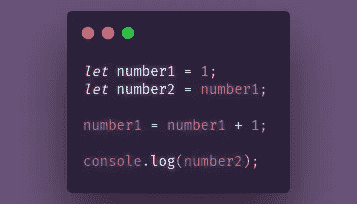
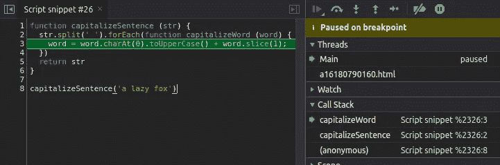

# 理解 JS 中的调用堆栈和堆内存

> 原文：<https://levelup.gitconnected.com/understanding-call-stack-and-heap-memory-in-js-e34bf8d3c3a4>

大家好，我在之前的帖子中承诺过:[***JavaScript***](https://medium.com/swlh/hoisting-in-javascript-4041978c023e)我会谈谈为什么我们不能将值转换成**常量变量——以及为什么将值推入数组或向对象添加新键是非常可能的。**


照片由 [Fredy Jacob](https://unsplash.com/@thefredyjacob?utm_source=medium&utm_medium=referral) 在 [Unsplash](https://unsplash.com?utm_source=medium&utm_medium=referral) 上拍摄

> JavaScript 为我们抽象了很多东西——例如，它像魔术一样读取并执行代码，对吗？—但是在幕后， *JS* 拥有**来存储和写入信息**并且**需要逐行跟踪将要发生的事情**。为了能够做这些事情， *JS* 引擎有这些小武器:**调用栈和内存堆**。

# JavaScript 的内存模型

首先，你必须明白当我们声明并初始化一个变量时会发生什么。在下面的例子中，我声明了一个值为 1 的 number1 变量。紧接着，我声明数字 2 等于数字 1，并且我也改变了数字 1 的值。
**你认为会印到数字 2 上的是什么？**



JS 的记忆模型示例

如果你的答案是 2，那你就错了！:(我们来看看幕后发生了什么:

1.当 number1 被创建时， *JS* 创建**一个唯一的标识符**给它，并且**在内存(例如 A001)** 中分配一个地址，它也**在分配的地址**存储该值。

2.因为我决定 number2 等于 number1，这意味着 **number2 等于那个地址内存:A001** ，而不等于 number1 的值，这个定义非常重要！

3.当我更改 number1 的值时， ***JS* 在其内存**、中分配了一个新地址，并将值 2 存储在 A002 地址上，这是因为**原始数据类型(** *string、number、bigint、boolean、undefined 和符号* **)在 *JS* 中是不可变的**！

调用堆栈顾名思义:堆栈调用(在我们的例子中是函数的调用)。我**原始数据存储在这里**。我们可以在 DevTools 中看到这种情况，当我们运行一个简单的脚本并设置断点时，我们可以在右边栏看到这段代码的调用堆栈，它堆栈所有函数的调用，有趣的是**调用堆栈是*先进后出*** *，*所以它将函数的调用添加到顶部，执行它并在所有代码运行后删除它。



带有断点的 DevTool 检查调用堆栈。

W 内存堆怎么样？哦，**内存堆是存储非原语的地方**！调用栈和内存堆的最大区别是**堆可以存储动态增长的无序数据**——比如数组和对象。

# 关于常量和非原始数据的注释

在这一点上，你可能注意到我们不能给一个 const 变量重新赋值，因为 **const 关键字不允许我们改变**——不是值——**变量的内存地址**！但是，为什么我们可以在常量数组上推送元素或者在对象上添加新的属性呢？

正如我在上面写的，**内存堆负责分配非原语数据类型的值**，所以当我们创建一个数组形式的变量时， *JS* 创建一个惟一的标识符，在调用堆栈上分配一个地址内存，并且(神奇的是)在堆上存储一个内存地址的值:

```
**Identifiers ---------------- Call Stack ---------------- Heap
                         Address -- Value          Address -- Value** number1       **---------  ** A003   --   2
number2       ---------   A001   --   1
names         ---------   A004   --  B001  --------- B001  --  []
```

当我们将值推入 names 数组时，它不会改变地址内存(！)，相反，它将改变堆上的值——对象也是如此，它的行为与我们上面看到的一样。

*朋友们，谢谢你们的阅读，我希望这篇文章能帮助你们更深入地了解 JS 的魔力:)*